The effect of donation activity dwarfs the effect of lifestyle, diet and iron supplementation on blood donor iron stores - Analysis code
================
Muriel Lobier

Executive summary
=================

This document includes all code necessary to run the analysis and produce the figures of : The effect of donation activity dwarfs the effect of lifestyle, diet and iron supplementation on donor iron status. Lobier, Nittymäki, Castren, Palokongas, Partanen and Arvas.

The analysis has three parts. In a first part we describe the study population and compute the prevalence of iron deficiency and anemia. In a second part, we use multivariate linear regression to identify the factors that co-vary with iron levels (using ferritin and sTfR) in the blood donor population. In a third part, we test whether ferritin levels affect donor self-reported health using ordinal logistic regression.

Descriptive results
-------------------

No particular comments.

Self-reported health analysis
-----------------------------

We analyze the data with multiple linear regression. Despite a seemingly large N, the models with all 20 predictors do not appear to have sufficient stability as the significance of regressors can be modified by removing as few as one influential participant. we could remove these participants but it would be difficult to fully justify, as they are mostly no proper outliers on any dimension.

Descriptive results
-------------------

Data loading and preparation
============================

Load Data
---------

There are 2584 donors enrolled in the study.

There are 2580 left once we remove donors that have no Ferritin or no Hb measurement for any donation event.

Demographic group specification and assignment
----------------------------------------------

There are 17 women with no answer to the question regarding their menstrual status. Of these, 2 are older than 65. We impute these to no period so they can be included in the post-menopausal women. Other women are all under 55, thus their menstrual status cannot be ascertained.

Female donors with no menstruation response after imputation are removed: 14 donors.

We now define the following groups:

-   pre-menopausal: regular or irregular menstruation reported
-   post-menopausal: no menstruation reported and age equal to superior to 45
-   donors younger than 45 and no reported menstruation are excluded (81 donors)

Remove donors with missing data
-------------------------------

### Blood measures and donor demographics

We remove donors for which we do not have:

-   CRP or sTfR: 3 donors

### Donation history

WE remove 41 donors who have not donated previously (They are missing the Nb of days since last FB donation variable)

### BMI

We remove 21 donors for whom we do not have the BMI data:

### Smoking

We remove 1 donors who did not answer the smoking question:

### Pregnancy

We remove 3 female donors who did not answer the pregnancy question:

### Iron supplementation

We remove 77 donors that did not answer properly to both questions if applicable.

For the modelling, we impute a 0 (no supplementation) to iron\_comp\_c when the donor reports not being offered iron supplementation.

### Food and drink intake

-   QR40 how often do you eat meat
-   QR44: how often do you eat fruit and berries
-   QR46: how often do you drink fruit juice
-   QR45: how often do you eat vegetables
-   QR48: how often do you drink milk
-   QR49: how often do you drink coffee
-   QR50: how often do you drink tea
-   QR51: how often do you drink beer
-   QR52: how often do you drink wine
-   QR53: how often do you drink strong alcohol

We remove 105 donors that did not answer these questions.

### Health self assessment

-   QR17 (X5) how does your health feel in general ?

We remove 3 donors who did not answer the health self-assessment question:

### Physical activity

We remove 21 donors who did not answer the physical activity questions:

### Total number of donors removed for missing questionnaire answers

The total number of donors removed because of missing answers in the questionnaire is 245

Remove donors with extreme physiological measures
-------------------------------------------------

As decided previously, we remove data according the following criteria:

-   BMI &gt; 50
-   CRP &gt; 30
-   Ferritin &gt; 400

This amounts to 10 donors that are removed.

Final group N
-------------

<table>
<thead>
<tr>
<th style="text-align:left;">
group
</th>
<th style="text-align:right;">
N
</th>
</tr>
</thead>
<tbody>
<tr>
<td style="text-align:left;">
Pre-menopausal women
</td>
<td style="text-align:right;">
846
</td>
</tr>
<tr>
<td style="text-align:left;">
Post-menopausal women
</td>
<td style="text-align:right;">
452
</td>
</tr>
<tr>
<td style="text-align:left;">
Men
</td>
<td style="text-align:right;">
902
</td>
</tr>
</tbody>
</table>
Recoding of variables
---------------------

We recode the following variables:

-   Food and non-alcoholic beverages
-   Alcoholoc beverages
-   Smoking
-   Pregnancy

We use a linear scale from 1 to 4 for both food/non-alcoholic drinks and for alcoholic drinks. However, since the proposed answers were different, the mappings between numerical value and answers are different between these variable groups. FOr alcoholic beverages, we used the same scale as used in Rigas 2014. For Non alcoholic beverages and food, we mapped the 6 pssible response the 4 codes.

-   both food/non-alcoholic drinks:
    -   "never" ~ 1,
    -   "less\_than\_once\_weekly" ~ 2,
    -   "1.3\_week" or "4.6\_week"~ 3,
    -   "daily" or "several\_daily" ~ 4,
-   Alcoholic drinks:
    -   "never" or "very\_rarely" ~ 1,
    -   "a\_few\_per\_month" ~ 2,
    -   "a\_few\_per\_week" ~ 3,
    -   "daily\_or\_almost" ~ 4,
-   Smoking:
    -   "no" ~"no"
    -   "sometimes" or "daily" ~ "yes"
-   QR83: have you given birth ?

Results - Population description
================================

Population description - Table 1
--------------------------------

We recode the values for eating and drinking to make them interpretable.

We code iron supplementation as a linear variable with a 4 grade scale:

-   0: no supplementation
-   1: less than half offered supplementation taken
-   2: half or more offered supplementation taken
-   4: All or nearly all offered supplementation taken

<table>
<thead>
<tr>
<th style="text-align:left;">
</th>
<th style="text-align:left;">
Pre-menopausal women
</th>
<th style="text-align:left;">
Post-menopausal women
</th>
<th style="text-align:left;">
Men
</th>
</tr>
</thead>
<tbody>
<tr>
<td style="text-align:left;">
n
</td>
<td style="text-align:left;">
846
</td>
<td style="text-align:left;">
452
</td>
<td style="text-align:left;">
902
</td>
</tr>
<tr>
<td style="text-align:left;">
age (mean (sd))
</td>
<td style="text-align:left;">
33.82 (10.05)
</td>
<td style="text-align:left;">
57.47 (5.54)
</td>
<td style="text-align:left;">
45.23 (13.63)
</td>
</tr>
<tr>
<td style="text-align:left;">
BMI (median \[IQR\])
</td>
<td style="text-align:left;">
24.22 \[22.06, 28.08\]
</td>
<td style="text-align:left;">
25.15 \[23.02, 28.32\]
</td>
<td style="text-align:left;">
25.71 \[23.89, 28.09\]
</td>
</tr>
<tr>
<td style="text-align:left;">
smoking = yes (%)
</td>
<td style="text-align:left;">
115 (13.6)
</td>
<td style="text-align:left;">
42 (9.3)
</td>
<td style="text-align:left;">
95 (10.5)
</td>
</tr>
<tr>
<td style="text-align:left;">
pregnancy = yes (%)
</td>
<td style="text-align:left;">
254 (30.0)
</td>
<td style="text-align:left;">
348 (77.0)
</td>
<td style="text-align:left;">
0 (NaN)
</td>
</tr>
<tr>
<td style="text-align:left;">
Hb\_v (mean (sd))
</td>
<td style="text-align:left;">
135.49 (8.35)
</td>
<td style="text-align:left;">
138.16 (8.56)
</td>
<td style="text-align:left;">
150.63 (9.35)
</td>
</tr>
<tr>
<td style="text-align:left;">
Ferritin (median \[IQR\])
</td>
<td style="text-align:left;">
26.00 \[16.00, 41.00\]
</td>
<td style="text-align:left;">
33.50 \[21.75, 52.00\]
</td>
<td style="text-align:left;">
42.00 \[25.00, 68.75\]
</td>
</tr>
<tr>
<td style="text-align:left;">
TransferrinR (median \[IQR\])
</td>
<td style="text-align:left;">
3.30 \[2.70, 4.18\]
</td>
<td style="text-align:left;">
3.10 \[2.50, 3.82\]
</td>
<td style="text-align:left;">
3.40 \[2.73, 4.10\]
</td>
</tr>
<tr>
<td style="text-align:left;">
CRP (median \[IQR\])
</td>
<td style="text-align:left;">
2.90 \[2.90, 2.90\]
</td>
<td style="text-align:left;">
2.90 \[2.90, 2.90\]
</td>
<td style="text-align:left;">
2.90 \[2.90, 2.90\]
</td>
</tr>
<tr>
<td style="text-align:left;">
TwoYearsFromStartCount\_FB (mean (sd))
</td>
<td style="text-align:left;">
2.63 (1.69)
</td>
<td style="text-align:left;">
3.55 (1.86)
</td>
<td style="text-align:left;">
4.55 (2.70)
</td>
</tr>
<tr>
<td style="text-align:left;">
DaysToPreviousFB (median \[IQR\])
</td>
<td style="text-align:left;">
176.50 \[112.00, 325.25\]
</td>
<td style="text-align:left;">
140.00 \[104.00, 241.00\]
</td>
<td style="text-align:left;">
111.00 \[78.25, 202.75\]
</td>
</tr>
<tr>
<td style="text-align:left;">
iron\_supplementation (%)
</td>
<td style="text-align:left;">
</td>
<td style="text-align:left;">
</td>
<td style="text-align:left;">
</td>
</tr>
<tr>
<td style="text-align:left;">
None
</td>
<td style="text-align:left;">
354 (41.8)
</td>
<td style="text-align:left;">
280 (61.9)
</td>
<td style="text-align:left;">
607 (67.3)
</td>
</tr>
<tr>
<td style="text-align:left;">
Less than half
</td>
<td style="text-align:left;">
102 (12.1)
</td>
<td style="text-align:left;">
24 (5.3)
</td>
<td style="text-align:left;">
56 (6.2)
</td>
</tr>
<tr>
<td style="text-align:left;">
About half
</td>
<td style="text-align:left;">
71 (8.4)
</td>
<td style="text-align:left;">
21 (4.6)
</td>
<td style="text-align:left;">
37 (4.1)
</td>
</tr>
<tr>
<td style="text-align:left;">
All or almost all
</td>
<td style="text-align:left;">
319 (37.7)
</td>
<td style="text-align:left;">
127 (28.1)
</td>
<td style="text-align:left;">
202 (22.4)
</td>
</tr>
<tr>
<td style="text-align:left;">
red\_meat (%)
</td>
<td style="text-align:left;">
</td>
<td style="text-align:left;">
</td>
<td style="text-align:left;">
</td>
</tr>
<tr>
<td style="text-align:left;">
never
</td>
<td style="text-align:left;">
131 (15.5)
</td>
<td style="text-align:left;">
36 (8.0)
</td>
<td style="text-align:left;">
42 (4.7)
</td>
</tr>
<tr>
<td style="text-align:left;">
less\_than\_once\_weekly
</td>
<td style="text-align:left;">
124 (14.7)
</td>
<td style="text-align:left;">
113 (25.0)
</td>
<td style="text-align:left;">
89 (9.9)
</td>
</tr>
<tr>
<td style="text-align:left;">
1\_to\_6\_week
</td>
<td style="text-align:left;">
488 (57.7)
</td>
<td style="text-align:left;">
284 (62.8)
</td>
<td style="text-align:left;">
639 (70.8)
</td>
</tr>
<tr>
<td style="text-align:left;">
daily\_or\_more
</td>
<td style="text-align:left;">
103 (12.2)
</td>
<td style="text-align:left;">
19 (4.2)
</td>
<td style="text-align:left;">
132 (14.6)
</td>
</tr>
<tr>
<td style="text-align:left;">
vegetables (%)
</td>
<td style="text-align:left;">
</td>
<td style="text-align:left;">
</td>
<td style="text-align:left;">
</td>
</tr>
<tr>
<td style="text-align:left;">
never
</td>
<td style="text-align:left;">
0 (0.0)
</td>
<td style="text-align:left;">
0 (0.0)
</td>
<td style="text-align:left;">
1 (0.1)
</td>
</tr>
<tr>
<td style="text-align:left;">
less\_than\_once\_weekly
</td>
<td style="text-align:left;">
8 (0.9)
</td>
<td style="text-align:left;">
5 (1.1)
</td>
<td style="text-align:left;">
16 (1.8)
</td>
</tr>
<tr>
<td style="text-align:left;">
1\_to\_6\_week
</td>
<td style="text-align:left;">
221 (26.1)
</td>
<td style="text-align:left;">
86 (19.0)
</td>
<td style="text-align:left;">
389 (43.1)
</td>
</tr>
<tr>
<td style="text-align:left;">
daily\_or\_more
</td>
<td style="text-align:left;">
617 (72.9)
</td>
<td style="text-align:left;">
361 (79.9)
</td>
<td style="text-align:left;">
496 (55.0)
</td>
</tr>
<tr>
<td style="text-align:left;">
fruit\_berries (%)
</td>
<td style="text-align:left;">
</td>
<td style="text-align:left;">
</td>
<td style="text-align:left;">
</td>
</tr>
<tr>
<td style="text-align:left;">
never
</td>
<td style="text-align:left;">
0 (0.0)
</td>
<td style="text-align:left;">
1 (0.2)
</td>
<td style="text-align:left;">
3 (0.3)
</td>
</tr>
<tr>
<td style="text-align:left;">
less\_than\_once\_weekly
</td>
<td style="text-align:left;">
31 (3.7)
</td>
<td style="text-align:left;">
10 (2.2)
</td>
<td style="text-align:left;">
69 (7.6)
</td>
</tr>
<tr>
<td style="text-align:left;">
1\_to\_6\_week
</td>
<td style="text-align:left;">
313 (37.0)
</td>
<td style="text-align:left;">
107 (23.7)
</td>
<td style="text-align:left;">
436 (48.3)
</td>
</tr>
<tr>
<td style="text-align:left;">
daily\_or\_more
</td>
<td style="text-align:left;">
502 (59.3)
</td>
<td style="text-align:left;">
334 (73.9)
</td>
<td style="text-align:left;">
394 (43.7)
</td>
</tr>
<tr>
<td style="text-align:left;">
milk (%)
</td>
<td style="text-align:left;">
</td>
<td style="text-align:left;">
</td>
<td style="text-align:left;">
</td>
</tr>
<tr>
<td style="text-align:left;">
never
</td>
<td style="text-align:left;">
43 (5.1)
</td>
<td style="text-align:left;">
21 (4.6)
</td>
<td style="text-align:left;">
43 (4.8)
</td>
</tr>
<tr>
<td style="text-align:left;">
less\_than\_once\_weekly
</td>
<td style="text-align:left;">
52 (6.1)
</td>
<td style="text-align:left;">
25 (5.5)
</td>
<td style="text-align:left;">
61 (6.8)
</td>
</tr>
<tr>
<td style="text-align:left;">
1\_to\_6\_week
</td>
<td style="text-align:left;">
177 (20.9)
</td>
<td style="text-align:left;">
83 (18.4)
</td>
<td style="text-align:left;">
207 (22.9)
</td>
</tr>
<tr>
<td style="text-align:left;">
daily\_or\_more
</td>
<td style="text-align:left;">
574 (67.8)
</td>
<td style="text-align:left;">
323 (71.5)
</td>
<td style="text-align:left;">
591 (65.5)
</td>
</tr>
<tr>
<td style="text-align:left;">
fruit\_juices (%)
</td>
<td style="text-align:left;">
</td>
<td style="text-align:left;">
</td>
<td style="text-align:left;">
</td>
</tr>
<tr>
<td style="text-align:left;">
never
</td>
<td style="text-align:left;">
116 (13.7)
</td>
<td style="text-align:left;">
99 (21.9)
</td>
<td style="text-align:left;">
83 (9.2)
</td>
</tr>
<tr>
<td style="text-align:left;">
less\_than\_once\_weekly
</td>
<td style="text-align:left;">
404 (47.8)
</td>
<td style="text-align:left;">
182 (40.3)
</td>
<td style="text-align:left;">
308 (34.1)
</td>
</tr>
<tr>
<td style="text-align:left;">
1\_to\_6\_week
</td>
<td style="text-align:left;">
238 (28.1)
</td>
<td style="text-align:left;">
97 (21.5)
</td>
<td style="text-align:left;">
324 (35.9)
</td>
</tr>
<tr>
<td style="text-align:left;">
daily\_or\_more
</td>
<td style="text-align:left;">
88 (10.4)
</td>
<td style="text-align:left;">
74 (16.4)
</td>
<td style="text-align:left;">
187 (20.7)
</td>
</tr>
<tr>
<td style="text-align:left;">
coffee (%)
</td>
<td style="text-align:left;">
</td>
<td style="text-align:left;">
</td>
<td style="text-align:left;">
</td>
</tr>
<tr>
<td style="text-align:left;">
never
</td>
<td style="text-align:left;">
147 (17.4)
</td>
<td style="text-align:left;">
39 (8.6)
</td>
<td style="text-align:left;">
117 (13.0)
</td>
</tr>
<tr>
<td style="text-align:left;">
less\_than\_once\_weekly
</td>
<td style="text-align:left;">
38 (4.5)
</td>
<td style="text-align:left;">
7 (1.5)
</td>
<td style="text-align:left;">
35 (3.9)
</td>
</tr>
<tr>
<td style="text-align:left;">
1\_to\_6\_week
</td>
<td style="text-align:left;">
67 (7.9)
</td>
<td style="text-align:left;">
21 (4.6)
</td>
<td style="text-align:left;">
63 (7.0)
</td>
</tr>
<tr>
<td style="text-align:left;">
daily\_or\_more
</td>
<td style="text-align:left;">
594 (70.2)
</td>
<td style="text-align:left;">
385 (85.2)
</td>
<td style="text-align:left;">
687 (76.2)
</td>
</tr>
<tr>
<td style="text-align:left;">
tea (%)
</td>
<td style="text-align:left;">
</td>
<td style="text-align:left;">
</td>
<td style="text-align:left;">
</td>
</tr>
<tr>
<td style="text-align:left;">
never
</td>
<td style="text-align:left;">
106 (12.5)
</td>
<td style="text-align:left;">
61 (13.5)
</td>
<td style="text-align:left;">
173 (19.2)
</td>
</tr>
<tr>
<td style="text-align:left;">
less\_than\_once\_weekly
</td>
<td style="text-align:left;">
247 (29.2)
</td>
<td style="text-align:left;">
121 (26.8)
</td>
<td style="text-align:left;">
297 (32.9)
</td>
</tr>
<tr>
<td style="text-align:left;">
1\_to\_6\_week
</td>
<td style="text-align:left;">
254 (30.0)
</td>
<td style="text-align:left;">
103 (22.8)
</td>
<td style="text-align:left;">
218 (24.2)
</td>
</tr>
<tr>
<td style="text-align:left;">
daily\_or\_more
</td>
<td style="text-align:left;">
239 (28.3)
</td>
<td style="text-align:left;">
167 (36.9)
</td>
<td style="text-align:left;">
214 (23.7)
</td>
</tr>
<tr>
<td style="text-align:left;">
beer (%)
</td>
<td style="text-align:left;">
</td>
<td style="text-align:left;">
</td>
<td style="text-align:left;">
</td>
</tr>
<tr>
<td style="text-align:left;">
rarely\_or\_never
</td>
<td style="text-align:left;">
514 (60.8)
</td>
<td style="text-align:left;">
287 (63.5)
</td>
<td style="text-align:left;">
253 (28.0)
</td>
</tr>
<tr>
<td style="text-align:left;">
a\_few\_per\_month
</td>
<td style="text-align:left;">
270 (31.9)
</td>
<td style="text-align:left;">
121 (26.8)
</td>
<td style="text-align:left;">
334 (37.0)
</td>
</tr>
<tr>
<td style="text-align:left;">
a\_few\_per\_week
</td>
<td style="text-align:left;">
60 (7.1)
</td>
<td style="text-align:left;">
42 (9.3)
</td>
<td style="text-align:left;">
279 (30.9)
</td>
</tr>
<tr>
<td style="text-align:left;">
daily\_or\_almost
</td>
<td style="text-align:left;">
2 (0.2)
</td>
<td style="text-align:left;">
2 (0.4)
</td>
<td style="text-align:left;">
36 (4.0)
</td>
</tr>
<tr>
<td style="text-align:left;">
wine (%)
</td>
<td style="text-align:left;">
</td>
<td style="text-align:left;">
</td>
<td style="text-align:left;">
</td>
</tr>
<tr>
<td style="text-align:left;">
rarely\_or\_never
</td>
<td style="text-align:left;">
269 (31.8)
</td>
<td style="text-align:left;">
137 (30.3)
</td>
<td style="text-align:left;">
344 (38.1)
</td>
</tr>
<tr>
<td style="text-align:left;">
a\_few\_per\_month
</td>
<td style="text-align:left;">
465 (55.0)
</td>
<td style="text-align:left;">
203 (44.9)
</td>
<td style="text-align:left;">
416 (46.1)
</td>
</tr>
<tr>
<td style="text-align:left;">
a\_few\_per\_week
</td>
<td style="text-align:left;">
109 (12.9)
</td>
<td style="text-align:left;">
105 (23.2)
</td>
<td style="text-align:left;">
129 (14.3)
</td>
</tr>
<tr>
<td style="text-align:left;">
daily\_or\_almost
</td>
<td style="text-align:left;">
3 (0.4)
</td>
<td style="text-align:left;">
7 (1.5)
</td>
<td style="text-align:left;">
13 (1.4)
</td>
</tr>
<tr>
<td style="text-align:left;">
liquor (%)
</td>
<td style="text-align:left;">
</td>
<td style="text-align:left;">
</td>
<td style="text-align:left;">
</td>
</tr>
<tr>
<td style="text-align:left;">
rarely\_or\_never
</td>
<td style="text-align:left;">
703 (83.1)
</td>
<td style="text-align:left;">
415 (91.8)
</td>
<td style="text-align:left;">
582 (64.5)
</td>
</tr>
<tr>
<td style="text-align:left;">
a\_few\_per\_month
</td>
<td style="text-align:left;">
139 (16.4)
</td>
<td style="text-align:left;">
32 (7.1)
</td>
<td style="text-align:left;">
278 (30.8)
</td>
</tr>
<tr>
<td style="text-align:left;">
a\_few\_per\_week
</td>
<td style="text-align:left;">
3 (0.4)
</td>
<td style="text-align:left;">
5 (1.1)
</td>
<td style="text-align:left;">
41 (4.5)
</td>
</tr>
<tr>
<td style="text-align:left;">
daily\_or\_almost
</td>
<td style="text-align:left;">
1 (0.1)
</td>
<td style="text-align:left;">
0 (0.0)
</td>
<td style="text-align:left;">
1 (0.1)
</td>
</tr>
<tr>
<td style="text-align:left;">
physical\_act\_daily (%)
</td>
<td style="text-align:left;">
</td>
<td style="text-align:left;">
</td>
<td style="text-align:left;">
</td>
</tr>
<tr>
<td style="text-align:left;">
under\_15mn
</td>
<td style="text-align:left;">
27 (3.2)
</td>
<td style="text-align:left;">
17 (3.8)
</td>
<td style="text-align:left;">
53 (5.9)
</td>
</tr>
<tr>
<td style="text-align:left;">
15\_30mn
</td>
<td style="text-align:left;">
163 (19.3)
</td>
<td style="text-align:left;">
58 (12.8)
</td>
<td style="text-align:left;">
190 (21.1)
</td>
</tr>
<tr>
<td style="text-align:left;">
30\_60mn
</td>
<td style="text-align:left;">
405 (47.9)
</td>
<td style="text-align:left;">
185 (40.9)
</td>
<td style="text-align:left;">
380 (42.1)
</td>
</tr>
<tr>
<td style="text-align:left;">
over\_1hour
</td>
<td style="text-align:left;">
251 (29.7)
</td>
<td style="text-align:left;">
192 (42.5)
</td>
<td style="text-align:left;">
279 (30.9)
</td>
</tr>
<tr>
<td style="text-align:left;">
physical\_act\_freq (%)
</td>
<td style="text-align:left;">
</td>
<td style="text-align:left;">
</td>
<td style="text-align:left;">
</td>
</tr>
<tr>
<td style="text-align:left;">
less\_than\_monthly
</td>
<td style="text-align:left;">
59 (7.0)
</td>
<td style="text-align:left;">
21 (4.6)
</td>
<td style="text-align:left;">
69 (7.6)
</td>
</tr>
<tr>
<td style="text-align:left;">
1\_2\_monthly
</td>
<td style="text-align:left;">
64 (7.6)
</td>
<td style="text-align:left;">
27 (6.0)
</td>
<td style="text-align:left;">
78 (8.6)
</td>
</tr>
<tr>
<td style="text-align:left;">
1\_weekly
</td>
<td style="text-align:left;">
156 (18.4)
</td>
<td style="text-align:left;">
77 (17.0)
</td>
<td style="text-align:left;">
202 (22.4)
</td>
</tr>
<tr>
<td style="text-align:left;">
twice\_weekly\_or\_more
</td>
<td style="text-align:left;">
567 (67.0)
</td>
<td style="text-align:left;">
327 (72.3)
</td>
<td style="text-align:left;">
553 (61.3)
</td>
</tr>
</tbody>
</table>
Paired group differences
------------------------

We test for significant differences between group pairs with the relevant tests:

-   Independent t-tests for normally distributed variables
-   Mann-Whitney U test for non-normally distributed variables
-   *χ*2 test for categorical variables

<table>
<thead>
<tr>
<th style="text-align:left;">
variable
</th>
<th style="text-align:left;">
post-menop vs men
</th>
<th style="text-align:left;">
pre-menop vs men
</th>
<th style="text-align:left;">
pre-menop vs post-menop
</th>
<th style="text-align:left;">
method
</th>
</tr>
</thead>
<tbody>
<tr>
<td style="text-align:left;">
age
</td>
<td style="text-align:left;">
p &lt; .0001
</td>
<td style="text-align:left;">
p &lt; .0001
</td>
<td style="text-align:left;">
p &lt; .0001
</td>
<td style="text-align:left;">
Two Sample t-test
</td>
</tr>
<tr>
<td style="text-align:left;">
BMI
</td>
<td style="text-align:left;">
n.s.
</td>
<td style="text-align:left;">
p &lt; .0001
</td>
<td style="text-align:left;">
p &lt; .05
</td>
<td style="text-align:left;">
Wilcoxon rank sum test with continuity correction
</td>
</tr>
<tr>
<td style="text-align:left;">
smoking
</td>
<td style="text-align:left;">
n.s.
</td>
<td style="text-align:left;">
n.s.
</td>
<td style="text-align:left;">
n.s.
</td>
<td style="text-align:left;">
Pearson's Chi-squared test with Yates' continuity correction
</td>
</tr>
<tr>
<td style="text-align:left;">
pregnancy
</td>
<td style="text-align:left;">
NA
</td>
<td style="text-align:left;">
NA
</td>
<td style="text-align:left;">
p &lt; .0001
</td>
<td style="text-align:left;">
Pearson's Chi-squared test with Yates' continuity correction
</td>
</tr>
<tr>
<td style="text-align:left;">
Hemoglobin
</td>
<td style="text-align:left;">
p &lt; .0001
</td>
<td style="text-align:left;">
p &lt; .0001
</td>
<td style="text-align:left;">
p &lt; .0001
</td>
<td style="text-align:left;">
Two Sample t-test
</td>
</tr>
<tr>
<td style="text-align:left;">
Ferritin
</td>
<td style="text-align:left;">
p &lt; .0001
</td>
<td style="text-align:left;">
p &lt; .0001
</td>
<td style="text-align:left;">
p &lt; .0001
</td>
<td style="text-align:left;">
Wilcoxon rank sum test with continuity correction
</td>
</tr>
<tr>
<td style="text-align:left;">
CRP
</td>
<td style="text-align:left;">
p &lt; .01
</td>
<td style="text-align:left;">
p &lt; .0001
</td>
<td style="text-align:left;">
n.s.
</td>
<td style="text-align:left;">
Wilcoxon rank sum test with continuity correction
</td>
</tr>
<tr>
<td style="text-align:left;">
sTfR
</td>
<td style="text-align:left;">
p &lt; .001
</td>
<td style="text-align:left;">
n.s.
</td>
<td style="text-align:left;">
p &lt; .01
</td>
<td style="text-align:left;">
Wilcoxon rank sum test with continuity correction
</td>
</tr>
<tr>
<td style="text-align:left;">
Nb donations in last 2 years
</td>
<td style="text-align:left;">
p &lt; .0001
</td>
<td style="text-align:left;">
p &lt; .0001
</td>
<td style="text-align:left;">
p &lt; .0001
</td>
<td style="text-align:left;">
Two Sample t-test
</td>
</tr>
<tr>
<td style="text-align:left;">
Nb of days since last donation
</td>
<td style="text-align:left;">
p &lt; .0001
</td>
<td style="text-align:left;">
p &lt; .0001
</td>
<td style="text-align:left;">
p &lt; .001
</td>
<td style="text-align:left;">
Wilcoxon rank sum test with continuity correction
</td>
</tr>
<tr>
<td style="text-align:left;">
Iron supplementation
</td>
<td style="text-align:left;">
n.s.
</td>
<td style="text-align:left;">
p &lt; .0001
</td>
<td style="text-align:left;">
p &lt; .0001
</td>
<td style="text-align:left;">
Pearson's Chi-squared test
</td>
</tr>
<tr>
<td style="text-align:left;">
Red meat
</td>
<td style="text-align:left;">
p &lt; .0001
</td>
<td style="text-align:left;">
p &lt; .0001
</td>
<td style="text-align:left;">
p &lt; .0001
</td>
<td style="text-align:left;">
Pearson's Chi-squared test
</td>
</tr>
<tr>
<td style="text-align:left;">
vegetables
</td>
<td style="text-align:left;">
p &lt; .0001
</td>
<td style="text-align:left;">
p &lt; .0001
</td>
<td style="text-align:left;">
n.s.
</td>
<td style="text-align:left;">
Pearson's Chi-squared test
</td>
</tr>
<tr>
<td style="text-align:left;">
Fruit and berries
</td>
<td style="text-align:left;">
p &lt; .0001
</td>
<td style="text-align:left;">
p &lt; .0001
</td>
<td style="text-align:left;">
p &lt; .0001
</td>
<td style="text-align:left;">
Pearson's Chi-squared test
</td>
</tr>
<tr>
<td style="text-align:left;">
milk
</td>
<td style="text-align:left;">
n.s.
</td>
<td style="text-align:left;">
n.s.
</td>
<td style="text-align:left;">
n.s.
</td>
<td style="text-align:left;">
Pearson's Chi-squared test
</td>
</tr>
<tr>
<td style="text-align:left;">
Fruit juices
</td>
<td style="text-align:left;">
p &lt; .0001
</td>
<td style="text-align:left;">
p &lt; .0001
</td>
<td style="text-align:left;">
p &lt; .0001
</td>
<td style="text-align:left;">
Pearson's Chi-squared test
</td>
</tr>
<tr>
<td style="text-align:left;">
coffee
</td>
<td style="text-align:left;">
p &lt; .05
</td>
<td style="text-align:left;">
n.s.
</td>
<td style="text-align:left;">
p &lt; .0001
</td>
<td style="text-align:left;">
Pearson's Chi-squared test
</td>
</tr>
<tr>
<td style="text-align:left;">
tea
</td>
<td style="text-align:left;">
p &lt; .0001
</td>
<td style="text-align:left;">
p &lt; .001
</td>
<td style="text-align:left;">
n.s.
</td>
<td style="text-align:left;">
Pearson's Chi-squared test
</td>
</tr>
<tr>
<td style="text-align:left;">
beer
</td>
<td style="text-align:left;">
p &lt; .0001
</td>
<td style="text-align:left;">
p &lt; .0001
</td>
<td style="text-align:left;">
n.s.
</td>
<td style="text-align:left;">
Pearson's Chi-squared test
</td>
</tr>
<tr>
<td style="text-align:left;">
wine
</td>
<td style="text-align:left;">
p &lt; .01
</td>
<td style="text-align:left;">
p &lt; .01
</td>
<td style="text-align:left;">
p &lt; .0001
</td>
<td style="text-align:left;">
Pearson's Chi-squared test
</td>
</tr>
<tr>
<td style="text-align:left;">
liquor
</td>
<td style="text-align:left;">
p &lt; .0001
</td>
<td style="text-align:left;">
p &lt; .0001
</td>
<td style="text-align:left;">
p &lt; .001
</td>
<td style="text-align:left;">
Pearson's Chi-squared test
</td>
</tr>
<tr>
<td style="text-align:left;">
Exercise frequency
</td>
<td style="text-align:left;">
p &lt; .05
</td>
<td style="text-align:left;">
n.s.
</td>
<td style="text-align:left;">
n.s.
</td>
<td style="text-align:left;">
Pearson's Chi-squared test
</td>
</tr>
<tr>
<td style="text-align:left;">
Daily physical activity
</td>
<td style="text-align:left;">
p &lt; .001
</td>
<td style="text-align:left;">
n.s.
</td>
<td style="text-align:left;">
p &lt; .001
</td>
<td style="text-align:left;">
Pearson's Chi-squared test
</td>
</tr>
</tbody>
</table>
Results - Distributions of hemoglobin, ferritin and sTfR
========================================================

Incidence of anemia and iron deficiency
---------------------------------------

Unless otherwise specified, the thresholds used are the following:

-   Hb: 117 g/L for women, 134 g/L for men [Reference](https://www.terveyskirjasto.fi/terveyskirjasto/tk.koti?p_artikkeli=snk03031)
-   Ferritin: 15 for all groups
-   sTfR: 4.4 mg/L for women and 5 mg/L for men [Reference](https://huslab.fi/cgi-bin/ohjekirja/tt_show.exe?assay=4720&terms=trans)

### Overall incidence of low hemoglobin, low ferritin and high sTfR

The following table presents the proportion and 95%CI of donors with low hemoglobin, low ferritin or high sTfR for each demographic group.

<table>
<thead>
<tr>
<th style="text-align:left;">
key
</th>
<th style="text-align:left;">
Pre-menopausal women
</th>
<th style="text-align:left;">
Post-menopausal women
</th>
<th style="text-align:left;">
Men
</th>
</tr>
</thead>
<tbody>
<tr>
<td style="text-align:left;">
anemia
</td>
<td style="text-align:left;">
1.4 (0.8-2.5)
</td>
<td style="text-align:left;">
0.2 (0-1.2)
</td>
<td style="text-align:left;">
2.9 (2-4.2)
</td>
</tr>
<tr>
<td style="text-align:left;">
high.TfR
</td>
<td style="text-align:left;">
18.9 (16.4-21.7)
</td>
<td style="text-align:left;">
9.7 (7.3-12.8)
</td>
<td style="text-align:left;">
8.2 (6.6-10.2)
</td>
</tr>
<tr>
<td style="text-align:left;">
low.fer
</td>
<td style="text-align:left;">
20.6 (18-23.4)
</td>
<td style="text-align:left;">
10 (7.5-13.1)
</td>
<td style="text-align:left;">
6 (4.6-7.7)
</td>
</tr>
</tbody>
</table>
### Overlap of low ferritin and high sTfR

We compute the proportion (and the 95%CI) of donors who have low ferritin only, high sTfR only and both low ferritin and high sTfR.

<table>
<thead>
<tr>
<th style="text-align:left;">
key
</th>
<th style="text-align:left;">
Pre-menopausal women
</th>
<th style="text-align:left;">
Post-menopausal women
</th>
<th style="text-align:left;">
Men
</th>
</tr>
</thead>
<tbody>
<tr>
<td style="text-align:left;">
Both
</td>
<td style="text-align:left;">
10.8 (8.8-13)
</td>
<td style="text-align:left;">
3.8 (2.4-5.9)
</td>
<td style="text-align:left;">
3 (2.1-4.3)
</td>
</tr>
<tr>
<td style="text-align:left;">
High sTfR only
</td>
<td style="text-align:left;">
8.2 (6.5-10.2)
</td>
<td style="text-align:left;">
6 (4.1-8.6)
</td>
<td style="text-align:left;">
5.2 (3.9-6.9)
</td>
</tr>
<tr>
<td style="text-align:left;">
Low ferritin only
</td>
<td style="text-align:left;">
9.8 (8-12)
</td>
<td style="text-align:left;">
6.2 (4.3-8.8)
</td>
<td style="text-align:left;">
3 (2.1-4.3)
</td>
</tr>
</tbody>
</table>
### Overlap between anemia (low hemoglobin) and iron deficiency

Here we look at the proportion of donors with low hemoglobin that also exhibit iron deficiency ( coded as ID: low ferritin and/or high sTfR).

<table>
<thead>
<tr>
<th style="text-align:left;">
</th>
<th style="text-align:left;">
Pre-menopausal women
</th>
<th style="text-align:left;">
Post-menopausal women
</th>
<th style="text-align:left;">
Men
</th>
<th style="text-align:left;">
p
</th>
<th style="text-align:left;">
test
</th>
</tr>
</thead>
<tbody>
<tr>
<td style="text-align:left;">
n
</td>
<td style="text-align:left;">
12
</td>
<td style="text-align:left;">
1
</td>
<td style="text-align:left;">
26
</td>
<td style="text-align:left;">
</td>
<td style="text-align:left;">
</td>
</tr>
<tr>
<td style="text-align:left;">
Overall.iron.deficiency = TRUE (%)
</td>
<td style="text-align:left;">
11 (91.7)
</td>
<td style="text-align:left;">
0 (0.0)
</td>
<td style="text-align:left;">
10 (38.5)
</td>
<td style="text-align:left;">
0.005
</td>
<td style="text-align:left;">
</td>
</tr>
<tr>
<td style="text-align:left;">
Low.ferritin.only = TRUE (%)
</td>
<td style="text-align:left;">
1 (8.3)
</td>
<td style="text-align:left;">
0 (0.0)
</td>
<td style="text-align:left;">
5 (19.2)
</td>
<td style="text-align:left;">
0.626
</td>
<td style="text-align:left;">
</td>
</tr>
<tr>
<td style="text-align:left;">
High.sTfR.only = TRUE (%)
</td>
<td style="text-align:left;">
0 (0.0)
</td>
<td style="text-align:left;">
0 (0.0)
</td>
<td style="text-align:left;">
1 (3.8)
</td>
<td style="text-align:left;">
0.774
</td>
<td style="text-align:left;">
</td>
</tr>
<tr>
<td style="text-align:left;">
Both = TRUE (%)
</td>
<td style="text-align:left;">
10 (83.3)
</td>
<td style="text-align:left;">
0 (0.0)
</td>
<td style="text-align:left;">
4 (15.4)
</td>
<td style="text-align:left;">
&lt;0.001
</td>
<td style="text-align:left;">
</td>
</tr>
</tbody>
</table>
### Further computations for discussion

First we compute, the proportion of donors identified as iron deficient (either low ferritin or high sTfR) that have high sTfR but normal ferritin for a ferritin threshold of 15 *μ**g*/*L*.

<table>
<thead>
<tr>
<th style="text-align:left;">
</th>
<th style="text-align:left;">
Pre-menopausal women
</th>
<th style="text-align:left;">
Post-menopausal women
</th>
<th style="text-align:left;">
Men
</th>
<th style="text-align:left;">
p
</th>
<th style="text-align:left;">
test
</th>
</tr>
</thead>
<tbody>
<tr>
<td style="text-align:left;">
n
</td>
<td style="text-align:left;">
243
</td>
<td style="text-align:left;">
72
</td>
<td style="text-align:left;">
101
</td>
<td style="text-align:left;">
</td>
<td style="text-align:left;">
</td>
</tr>
<tr>
<td style="text-align:left;">
Low.ferritin.only = TRUE (%)
</td>
<td style="text-align:left;">
83 (34.2)
</td>
<td style="text-align:left;">
28 (38.9)
</td>
<td style="text-align:left;">
27 (26.7)
</td>
<td style="text-align:left;">
0.217
</td>
<td style="text-align:left;">
</td>
</tr>
<tr>
<td style="text-align:left;">
High.sTfR.only = TRUE (%)
</td>
<td style="text-align:left;">
69 (28.4)
</td>
<td style="text-align:left;">
27 (37.5)
</td>
<td style="text-align:left;">
47 (46.5)
</td>
<td style="text-align:left;">
0.005
</td>
<td style="text-align:left;">
</td>
</tr>
<tr>
<td style="text-align:left;">
Both = TRUE (%)
</td>
<td style="text-align:left;">
91 (37.4)
</td>
<td style="text-align:left;">
17 (23.6)
</td>
<td style="text-align:left;">
27 (26.7)
</td>
<td style="text-align:left;">
0.033
</td>
<td style="text-align:left;">
</td>
</tr>
</tbody>
</table>
Then we compute, the same proportion of donors identified as iron deficient (either low ferritin or high sTfR) that have high sTfR but normal ferritin for a ferritin threshold of 30 *μ**g*/*L*.

<table>
<thead>
<tr>
<th style="text-align:left;">
</th>
<th style="text-align:left;">
Pre-menopausal women
</th>
<th style="text-align:left;">
Post-menopausal women
</th>
<th style="text-align:left;">
Men
</th>
<th style="text-align:left;">
p
</th>
<th style="text-align:left;">
test
</th>
</tr>
</thead>
<tbody>
<tr>
<td style="text-align:left;">
n
</td>
<td style="text-align:left;">
502
</td>
<td style="text-align:left;">
184
</td>
<td style="text-align:left;">
292
</td>
<td style="text-align:left;">
</td>
<td style="text-align:left;">
</td>
</tr>
<tr>
<td style="text-align:left;">
Low.ferritin.only = TRUE (%)
</td>
<td style="text-align:left;">
342 (68.1)
</td>
<td style="text-align:left;">
140 (76.1)
</td>
<td style="text-align:left;">
218 (74.7)
</td>
<td style="text-align:left;">
0.046
</td>
<td style="text-align:left;">
</td>
</tr>
<tr>
<td style="text-align:left;">
High.sTfR.only = TRUE (%)
</td>
<td style="text-align:left;">
13 (2.6)
</td>
<td style="text-align:left;">
8 (4.3)
</td>
<td style="text-align:left;">
15 (5.1)
</td>
<td style="text-align:left;">
0.160
</td>
<td style="text-align:left;">
</td>
</tr>
<tr>
<td style="text-align:left;">
Both = TRUE (%)
</td>
<td style="text-align:left;">
147 (29.3)
</td>
<td style="text-align:left;">
36 (19.6)
</td>
<td style="text-align:left;">
59 (20.2)
</td>
<td style="text-align:left;">
0.003
</td>
<td style="text-align:left;">
</td>
</tr>
</tbody>
</table>
Finally, for the same 30 *μ**g*/*L* ferritin threshold, we compute the proportion of donors with high sTfR who also have low ferritin.

<table>
<thead>
<tr>
<th style="text-align:left;">
group
</th>
<th style="text-align:right;">
Proportion.low.ferritin
</th>
</tr>
</thead>
<tbody>
<tr>
<td style="text-align:left;">
Pre-menopausal women
</td>
<td style="text-align:right;">
0.9187500
</td>
</tr>
<tr>
<td style="text-align:left;">
Post-menopausal women
</td>
<td style="text-align:right;">
0.8181818
</td>
</tr>
<tr>
<td style="text-align:left;">
Men
</td>
<td style="text-align:right;">
0.7972973
</td>
</tr>
</tbody>
</table>
Proportion of low ferritin donors who also have high sTfR:

<table>
<thead>
<tr>
<th style="text-align:left;">
group
</th>
<th style="text-align:right;">
Proportion.High.sTfR
</th>
</tr>
</thead>
<tbody>
<tr>
<td style="text-align:left;">
Pre-menopausal women
</td>
<td style="text-align:right;">
0.2899408
</td>
</tr>
<tr>
<td style="text-align:left;">
Post-menopausal women
</td>
<td style="text-align:right;">
0.1925134
</td>
</tr>
<tr>
<td style="text-align:left;">
Men
</td>
<td style="text-align:right;">
0.2047782
</td>
</tr>
</tbody>
</table>
### CRP levels for anemic donors with and without ID

Here we check that high ferritin values for anemic donors was not a consequence of inflammation (high CRP). Results show that only one anemic donor has elevated CRP which could indicate inflammation.

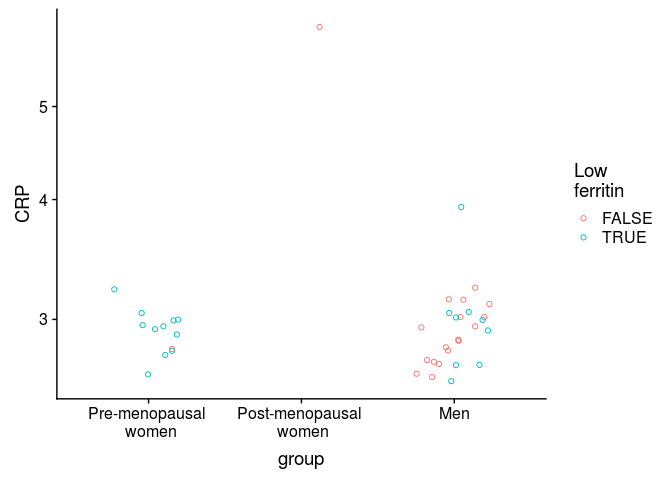

Figure 1
--------

We plot sTfR as a function of ferritin, with color representing hemoglobin. Red lines represent threshold values for iron deficiency. Red circles indicate anemic donors whilst yellow crosses represent first-time donors who were not included in the analyses.

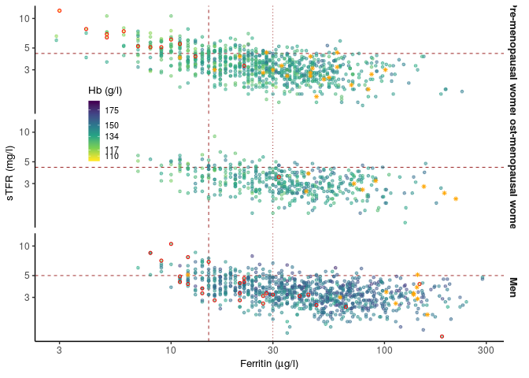

Population description - Iron supplementation
---------------------------------------------

### Proportion of donors reporting being offered iron supplementation

First we investigate the proportion of donors who report being offered iron.

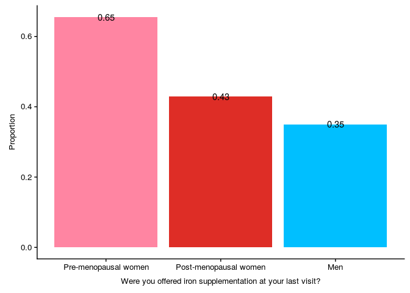

### Compliance when iron supplementation was provided

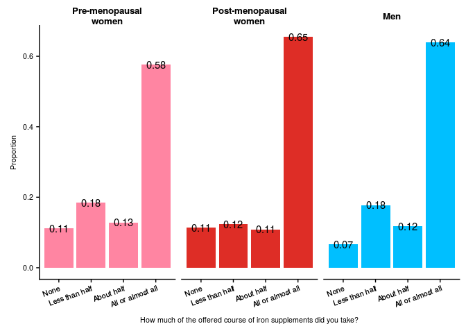

Results - Regression analyses
=============================

Regressions on sTfR and ferritin
--------------------------------

We analyzed the data with multiple linear regression. We first ran Ordinary Least Square (OLS) regressions and their diagnostics. If the diagnostics identified problematic observations (e.g., outliers, influential observations), we also ran robust regression regressions (Yu and Yao 2017). Robust regression is less sensitive to infulential observations and gives more accurate estimates of regression coefficients in the presence of problematic observations. Using robust regression leads to a more principled approach to regression analysis and avoids potential confounds introduced by selective removal of influential observations. Robust regression is based on less assumptions and is less sensitive to outliers. As the rlm command from the MASS package does not compute directly the *t* and *p* values, we used the f.robftest function from the sfsmisc package. Practical examples of using robust regression can be found in the literature (Davison et al. 2017).

In addition, we used relative importance analysis to estimate tthe average proportion of variance in the outcome variable explained by each co-variate (Groemping 2006). Relative iportance was computed using the pmvd method which assigns 0 to the relative importance of a regressor if it is non significant in the complete model. .

The regressors were entered as follows in the regression models for sTfR and ferritin:

-   Continuous variables were entered as continuous predictors
-   age, number of donations in last two years, nb of days since last donation, CRP, BMI
-   Binary variables were entered as categorical (but coded as numerical for relative importance):
-   Smoking, pregnancy
-   Ordinal variables were coded on a linear scale and entered as continuous [REF](https://www3.nd.edu/~rwilliam/stats3/OrdinalIndependent.pdf)
-   Iron supplementation
-   All dietary intake

We compute both coefficients and standardized coefficients (with all dependent and independent variables standardized) for robust regression and only coefficients for OLS regression. We present robust coefficients and their bootstrapped BCa 95% confidence intervals in Table 1 (ferritin) and Table 2 (sTfR), robust standardized coefficients, their bootstrapped distribution and BCa 95% confidence intervals in figure 2.A and non-standardized OLS regression coefficients in Supplementary Table 1 (Ferritin) and 2 (sTfR).

Pre-processing
--------------

### Rename and transform

Data transformations:

-   Log transformed variables:
-   Ferritin
-   sTfR
-   CRP
-   Age is divided by 5 to simplify coeff interpretation
-   Number of days before donation is transformed as *l**o**g*\_*l**a**s**t*\_*d**o**n* = *l**o**g*(*l**a**s**t*\_*d**o**n*)/*l**o**g*(2) to help with the interpretation of coefficients.
    -   An increase in one of the transformed variable is equivalent to a doubling of the number of days since last donation.
-   Standardization:
-   Standardized coefficients:
    -   All dependent and independent variables were standardized
-   Coefficients:
    -   All dependent variables entered as continuous varaibles are centered but not scaled.

Pre\_menopausal women
---------------------

### Data pre-processing

We center all variables entered as continuous.

### Regressions Ferritin

#### Correlograms

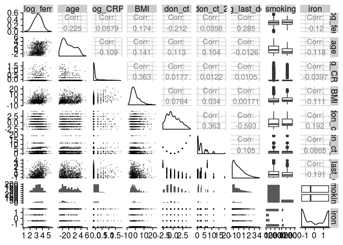

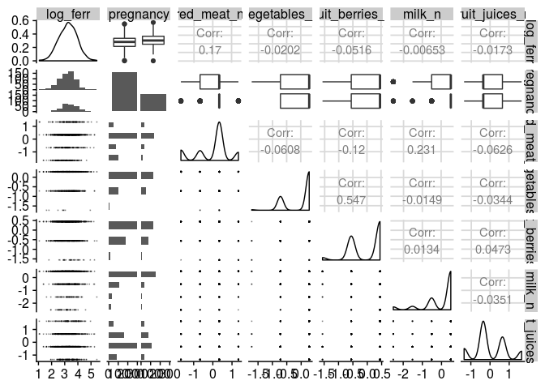

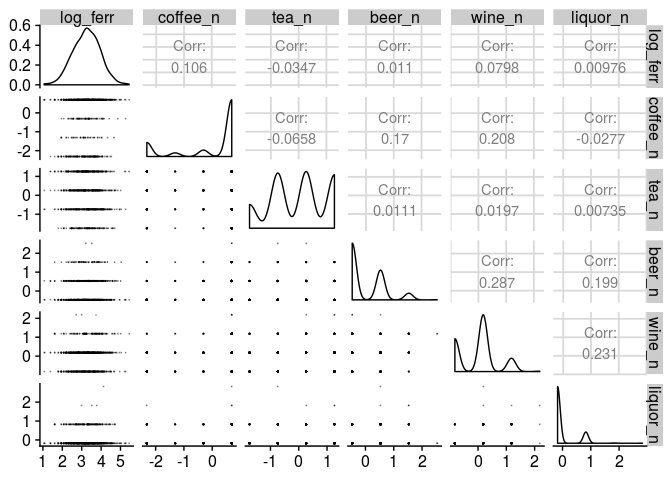

#### OLS

##### Model diagnostics

We create regression diagnostic plots in order to identify putative influential observations (see [Understanding Diagnostic Plots for Linear Regression Analysis](http://data.library.virginia.edu/diagnostic-plots/)).

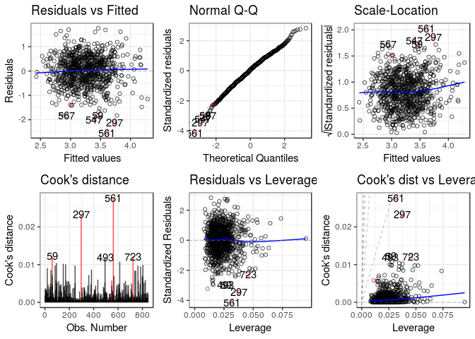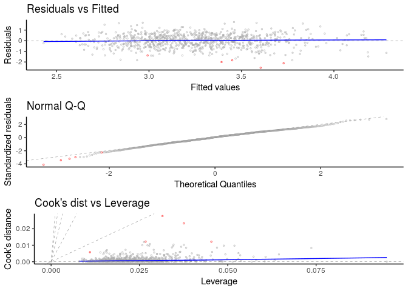

These plots identify several potentially problematic observations, therefore we also compute robust regression.

#### Robust regression model amd p-values

#### Model outputs and interpretation

<table style="text-align:center">
<caption>
<strong>Pre-menopausal women</strong>
</caption>
<tr>
<td colspan="3" style="border-bottom: 1px solid black">
</td>
</tr>
<tr>
<td style="text-align:left">
</td>
<td colspan="2">
Ferritin (log)
</td>
</tr>
<tr>
<td>
</td>
<td colspan="2" style="border-bottom: 1px solid black">
</td>
</tr>
<tr>
<td style="text-align:left">
</td>
<td>
Robust
</td>
<td>
OLS
</td>
</tr>
<tr>
<td colspan="3" style="border-bottom: 1px solid black">
</td>
</tr>
<tr>
<td style="text-align:left">
Age
</td>
<td>
0.073
</td>
<td>
0.072
</td>
</tr>
<tr>
<td style="text-align:left">
</td>
<td>
p = 0.00000
</td>
<td>
p = 0.00001
</td>
</tr>
<tr>
<td style="text-align:left">
BMI
</td>
<td>
0.017
</td>
<td>
0.016
</td>
</tr>
<tr>
<td style="text-align:left">
</td>
<td>
p = 0.0004
</td>
<td>
p = 0.002
</td>
</tr>
<tr>
<td style="text-align:left">
CRP
</td>
<td>
0.063
</td>
<td>
0.062
</td>
</tr>
<tr>
<td style="text-align:left">
</td>
<td>
p = 0.367
</td>
<td>
p = 0.378
</td>
</tr>
<tr>
<td style="text-align:left">
Smoking(yes)
</td>
<td>
0.091
</td>
<td>
0.101
</td>
</tr>
<tr>
<td style="text-align:left">
</td>
<td>
p = 0.048
</td>
<td>
p = 0.030
</td>
</tr>
<tr>
<td style="text-align:left">
Pregnancy(Yes)
</td>
<td>
0.020
</td>
<td>
0.024
</td>
</tr>
<tr>
<td style="text-align:left">
</td>
<td>
p = 0.648
</td>
<td>
p = 0.595
</td>
</tr>
<tr>
<td style="text-align:left">
Nb donations (2 years)
</td>
<td>
-0.060
</td>
<td>
-0.058
</td>
</tr>
<tr>
<td style="text-align:left">
</td>
<td>
p = 0.002
</td>
<td>
p = 0.003
</td>
</tr>
<tr>
<td style="text-align:left">
(Nb donations (2 years))²
</td>
<td>
0.010
</td>
<td>
0.010
</td>
</tr>
<tr>
<td style="text-align:left">
</td>
<td>
p = 0.166
</td>
<td>
p = 0.184
</td>
</tr>
<tr>
<td style="text-align:left">
Days since last donation
</td>
<td>
0.134
</td>
<td>
0.125
</td>
</tr>
<tr>
<td style="text-align:left">
</td>
<td>
p = 0.00000
</td>
<td>
p = 0.00001
</td>
</tr>
<tr>
<td style="text-align:left">
Iron supplementation
</td>
<td>
-0.002
</td>
<td>
-0.003
</td>
</tr>
<tr>
<td style="text-align:left">
</td>
<td>
p = 0.895
</td>
<td>
p = 0.866
</td>
</tr>
<tr>
<td style="text-align:left">
Red meat
</td>
<td>
0.134
</td>
<td>
0.116
</td>
</tr>
<tr>
<td style="text-align:left">
</td>
<td>
p = 0.00000
</td>
<td>
p = 0.00001
</td>
</tr>
<tr>
<td style="text-align:left">
Vegetables
</td>
<td>
-0.013
</td>
<td>
-0.001
</td>
</tr>
<tr>
<td style="text-align:left">
</td>
<td>
p = 0.820
</td>
<td>
p = 0.993
</td>
</tr>
<tr>
<td style="text-align:left">
Fruit and Berries
</td>
<td>
0.031
</td>
<td>
0.025
</td>
</tr>
<tr>
<td style="text-align:left">
</td>
<td>
p = 0.505
</td>
<td>
p = 0.598
</td>
</tr>
<tr>
<td style="text-align:left">
Milk
</td>
<td>
-0.057
</td>
<td>
-0.054
</td>
</tr>
<tr>
<td style="text-align:left">
</td>
<td>
p = 0.037
</td>
<td>
p = 0.050
</td>
</tr>
<tr>
<td style="text-align:left">
Fruit Juices
</td>
<td>
-0.004
</td>
<td>
-0.014
</td>
</tr>
<tr>
<td style="text-align:left">
</td>
<td>
p = 0.889
</td>
<td>
p = 0.602
</td>
</tr>
<tr>
<td style="text-align:left">
Coffee
</td>
<td>
0.019
</td>
<td>
0.024
</td>
</tr>
<tr>
<td style="text-align:left">
</td>
<td>
p = 0.347
</td>
<td>
p = 0.237
</td>
</tr>
<tr>
<td style="text-align:left">
Tea
</td>
<td>
-0.029
</td>
<td>
-0.022
</td>
</tr>
<tr>
<td style="text-align:left">
</td>
<td>
p = 0.185
</td>
<td>
p = 0.320
</td>
</tr>
<tr>
<td style="text-align:left">
Beer
</td>
<td>
0.012
</td>
<td>
0.002
</td>
</tr>
<tr>
<td style="text-align:left">
</td>
<td>
p = 0.740
</td>
<td>
p = 0.963
</td>
</tr>
<tr>
<td style="text-align:left">
Wine
</td>
<td>
0.060
</td>
<td>
0.052
</td>
</tr>
<tr>
<td style="text-align:left">
</td>
<td>
p = 0.096
</td>
<td>
p = 0.150
</td>
</tr>
<tr>
<td style="text-align:left">
Liquor
</td>
<td>
0.001
</td>
<td>
0.014
</td>
</tr>
<tr>
<td style="text-align:left">
</td>
<td>
p = 0.983
</td>
<td>
p = 0.811
</td>
</tr>
<tr>
<td colspan="3" style="border-bottom: 1px solid black">
</td>
</tr>
<tr>
<td style="text-align:left">
Observations
</td>
<td>
846
</td>
<td>
846
</td>
</tr>
<tr>
<td style="text-align:left">
R2
</td>
<td>
</td>
<td>
0.200
</td>
</tr>
<tr>
<td style="text-align:left">
Adjusted R2
</td>
<td>
</td>
<td>
0.182
</td>
</tr>
<tr>
<td style="text-align:left">
Residual Std. Error (df = 826)
</td>
<td>
0.612
</td>
<td>
0.625
</td>
</tr>
<tr>
<td style="text-align:left">
F Statistic
</td>
<td>
</td>
<td>
10.897\*\*\* (df = 19; 826)
</td>
</tr>
<tr>
<td colspan="3" style="border-bottom: 1px solid black">
</td>
</tr>
<tr>
<td style="text-align:left">
<em>Note:</em>
</td>
<td colspan="2" style="text-align:right">
*p&lt;0.05; **p&lt;0.01; ***p&lt;0.001
</td>
</tr>
</table>
Results from robust and OLS rergessions are similar. Ferritin levels are positively correlated with age, BMI, Days since last donation and negatively correlated with nb of donations in teh last two years.

-   An increase in 5 years of age is associated with a 7.6 % increase in Ferritin levels.

-   A doubling of the number of days since the last donation is associated with a 14.4 % increase in Ferritin levels.

-   An additional donation in the previous 2 years is associated with a -5.8 % decrease in Ferritin levels.

#### Relative importance

The relative importance analyses are run only on regressors that are consistently significant in at least one demographic group.

    ## Warning in rev(variances[[p]]) - variances[[p + 1]]: Recycling array of length 1 in vector-array arithmetic is deprecated.
    ##   Use c() or as.vector() instead.

    ## Warning in rev(variances[[p]]) - variances[[p + 1]]: Recycling array of length 1 in vector-array arithmetic is deprecated.
    ##   Use c() or as.vector() instead.

    ## Warning in rev(variances[[p]]) - variances[[p + 1]]: Recycling array of length 1 in vector-array arithmetic is deprecated.
    ##   Use c() or as.vector() instead.

    ## Warning in rev(variances[[p]]) - variances[[p + 1]]: Recycling array of length 1 in vector-array arithmetic is deprecated.
    ##   Use c() or as.vector() instead.

    ## Warning in rev(variances[[p]]) - variances[[p + 1]]: Recycling array of length 1 in vector-array arithmetic is deprecated.
    ##   Use c() or as.vector() instead.

    ## Warning in rev(variances[[p]]) - variances[[p + 1]]: Recycling array of length 1 in vector-array arithmetic is deprecated.
    ##   Use c() or as.vector() instead.

    ## Warning in rev(variances[[p]]) - variances[[p + 1]]: Recycling array of length 1 in vector-array arithmetic is deprecated.
    ##   Use c() or as.vector() instead.

    ## Warning in rev(variances[[p]]) - variances[[p + 1]]: Recycling array of length 1 in vector-array arithmetic is deprecated.
    ##   Use c() or as.vector() instead.

    ## Warning in rev(variances[[p]]) - variances[[p + 1]]: Recycling array of length 1 in vector-array arithmetic is deprecated.
    ##   Use c() or as.vector() instead.

    ## Warning in rev(variances[[p]]) - variances[[p + 1]]: Recycling array of length 1 in vector-array arithmetic is deprecated.
    ##   Use c() or as.vector() instead.

    ## Warning in rev(variances[[p]]) - variances[[p + 1]]: Recycling array of length 1 in vector-array arithmetic is deprecated.
    ##   Use c() or as.vector() instead.

    ## Warning in rev(variances[[p]]) - variances[[p + 1]]: Recycling array of length 1 in vector-array arithmetic is deprecated.
    ##   Use c() or as.vector() instead.

    ## Warning in rev(variances[[p]]) - variances[[p + 1]]: Recycling array of length 1 in vector-array arithmetic is deprecated.
    ##   Use c() or as.vector() instead.

    ## Warning in rev(variances[[p]]) - variances[[p + 1]]: Recycling array of length 1 in vector-array arithmetic is deprecated.
    ##   Use c() or as.vector() instead.

    ## Warning in rev(variances[[p]]) - variances[[p + 1]]: Recycling array of length 1 in vector-array arithmetic is deprecated.
    ##   Use c() or as.vector() instead.

    ## Warning in rev(variances[[p]]) - variances[[p + 1]]: Recycling array of length 1 in vector-array arithmetic is deprecated.
    ##   Use c() or as.vector() instead.

    ## Warning in rev(variances[[p]]) - variances[[p + 1]]: Recycling array of length 1 in vector-array arithmetic is deprecated.
    ##   Use c() or as.vector() instead.

    ## Warning in rev(variances[[p]]) - variances[[p + 1]]: Recycling array of length 1 in vector-array arithmetic is deprecated.
    ##   Use c() or as.vector() instead.

    ## Warning in rev(variances[[p]]) - variances[[p + 1]]: Recycling array of length 1 in vector-array arithmetic is deprecated.
    ##   Use c() or as.vector() instead.

    ## Warning in rev(variances[[p]]) - variances[[p + 1]]: Recycling array of length 1 in vector-array arithmetic is deprecated.
    ##   Use c() or as.vector() instead.

    ## Warning in rev(variances[[p]]) - variances[[p + 1]]: Recycling array of length 1 in vector-array arithmetic is deprecated.
    ##   Use c() or as.vector() instead.

    ## Warning in rev(variances[[p]]) - variances[[p + 1]]: Recycling array of length 1 in vector-array arithmetic is deprecated.
    ##   Use c() or as.vector() instead.

    ## Warning in rev(variances[[p]]) - variances[[p + 1]]: Recycling array of length 1 in vector-array arithmetic is deprecated.
    ##   Use c() or as.vector() instead.

    ## Warning in rev(variances[[p]]) - variances[[p + 1]]: Recycling array of length 1 in vector-array arithmetic is deprecated.
    ##   Use c() or as.vector() instead.

    ## Warning in rev(variances[[p]]) - variances[[p + 1]]: Recycling array of length 1 in vector-array arithmetic is deprecated.
    ##   Use c() or as.vector() instead.

    ## Warning in rev(variances[[p]]) - variances[[p + 1]]: Recycling array of length 1 in vector-array arithmetic is deprecated.
    ##   Use c() or as.vector() instead.

    ## Warning in rev(variances[[p]]) - variances[[p + 1]]: Recycling array of length 1 in vector-array arithmetic is deprecated.
    ##   Use c() or as.vector() instead.

    ## Warning in rev(variances[[p]]) - variances[[p + 1]]: Recycling array of length 1 in vector-array arithmetic is deprecated.
    ##   Use c() or as.vector() instead.

    ## Warning in rev(variances[[p]]) - variances[[p + 1]]: Recycling array of length 1 in vector-array arithmetic is deprecated.
    ##   Use c() or as.vector() instead.

    ## Warning in rev(variances[[p]]) - variances[[p + 1]]: Recycling array of length 1 in vector-array arithmetic is deprecated.
    ##   Use c() or as.vector() instead.

    ## Warning in rev(variances[[p]]) - variances[[p + 1]]: Recycling array of length 1 in vector-array arithmetic is deprecated.
    ##   Use c() or as.vector() instead.

    ## Warning in rev(variances[[p]]) - variances[[p + 1]]: Recycling array of length 1 in vector-array arithmetic is deprecated.
    ##   Use c() or as.vector() instead.

    ## Warning in rev(variances[[p]]) - variances[[p + 1]]: Recycling array of length 1 in vector-array arithmetic is deprecated.
    ##   Use c() or as.vector() instead.

    ## Warning in rev(variances[[p]]) - variances[[p + 1]]: Recycling array of length 1 in vector-array arithmetic is deprecated.
    ##   Use c() or as.vector() instead.

    ## Warning in rev(variances[[p]]) - variances[[p + 1]]: Recycling array of length 1 in vector-array arithmetic is deprecated.
    ##   Use c() or as.vector() instead.

    ## Warning in rev(variances[[p]]) - variances[[p + 1]]: Recycling array of length 1 in vector-array arithmetic is deprecated.
    ##   Use c() or as.vector() instead.

    ## Warning in rev(variances[[p]]) - variances[[p + 1]]: Recycling array of length 1 in vector-array arithmetic is deprecated.
    ##   Use c() or as.vector() instead.

    ## Warning in rev(variances[[p]]) - variances[[p + 1]]: Recycling array of length 1 in vector-array arithmetic is deprecated.
    ##   Use c() or as.vector() instead.

    ## Warning in rev(variances[[p]]) - variances[[p + 1]]: Recycling array of length 1 in vector-array arithmetic is deprecated.
    ##   Use c() or as.vector() instead.

    ## Warning in rev(variances[[p]]) - variances[[p + 1]]: Recycling array of length 1 in vector-array arithmetic is deprecated.
    ##   Use c() or as.vector() instead.

    ## Warning in rev(variances[[p]]) - variances[[p + 1]]: Recycling array of length 1 in vector-array arithmetic is deprecated.
    ##   Use c() or as.vector() instead.

    ## Warning in rev(variances[[p]]) - variances[[p + 1]]: Recycling array of length 1 in vector-array arithmetic is deprecated.
    ##   Use c() or as.vector() instead.

    ## Warning in rev(variances[[p]]) - variances[[p + 1]]: Recycling array of length 1 in vector-array arithmetic is deprecated.
    ##   Use c() or as.vector() instead.

    ## Warning in rev(variances[[p]]) - variances[[p + 1]]: Recycling array of length 1 in vector-array arithmetic is deprecated.
    ##   Use c() or as.vector() instead.

    ## Warning in rev(variances[[p]]) - variances[[p + 1]]: Recycling array of length 1 in vector-array arithmetic is deprecated.
    ##   Use c() or as.vector() instead.

    ## Warning in rev(variances[[p]]) - variances[[p + 1]]: Recycling array of length 1 in vector-array arithmetic is deprecated.
    ##   Use c() or as.vector() instead.

    ## Warning in rev(variances[[p]]) - variances[[p + 1]]: Recycling array of length 1 in vector-array arithmetic is deprecated.
    ##   Use c() or as.vector() instead.

    ## Warning in rev(variances[[p]]) - variances[[p + 1]]: Recycling array of length 1 in vector-array arithmetic is deprecated.
    ##   Use c() or as.vector() instead.

    ## Warning in rev(variances[[p]]) - variances[[p + 1]]: Recycling array of length 1 in vector-array arithmetic is deprecated.
    ##   Use c() or as.vector() instead.

    ## Warning in rev(variances[[p]]) - variances[[p + 1]]: Recycling array of length 1 in vector-array arithmetic is deprecated.
    ##   Use c() or as.vector() instead.

    ## Warning in rev(variances[[p]]) - variances[[p + 1]]: Recycling array of length 1 in vector-array arithmetic is deprecated.
    ##   Use c() or as.vector() instead.

    ## Warning in rev(variances[[p]]) - variances[[p + 1]]: Recycling array of length 1 in vector-array arithmetic is deprecated.
    ##   Use c() or as.vector() instead.

    ## Warning in rev(variances[[p]]) - variances[[p + 1]]: Recycling array of length 1 in vector-array arithmetic is deprecated.
    ##   Use c() or as.vector() instead.

    ## Warning in rev(variances[[p]]) - variances[[p + 1]]: Recycling array of length 1 in vector-array arithmetic is deprecated.
    ##   Use c() or as.vector() instead.

    ## Warning in rev(variances[[p]]) - variances[[p + 1]]: Recycling array of length 1 in vector-array arithmetic is deprecated.
    ##   Use c() or as.vector() instead.

    ## Warning in rev(variances[[p]]) - variances[[p + 1]]: Recycling array of length 1 in vector-array arithmetic is deprecated.
    ##   Use c() or as.vector() instead.

    ## Warning in rev(variances[[p]]) - variances[[p + 1]]: Recycling array of length 1 in vector-array arithmetic is deprecated.
    ##   Use c() or as.vector() instead.

    ## Warning in rev(variances[[p]]) - variances[[p + 1]]: Recycling array of length 1 in vector-array arithmetic is deprecated.
    ##   Use c() or as.vector() instead.

    ## Warning in rev(variances[[p]]) - variances[[p + 1]]: Recycling array of length 1 in vector-array arithmetic is deprecated.
    ##   Use c() or as.vector() instead.

    ## Warning in rev(variances[[p]]) - variances[[p + 1]]: Recycling array of length 1 in vector-array arithmetic is deprecated.
    ##   Use c() or as.vector() instead.

    ## Warning in rev(variances[[p]]) - variances[[p + 1]]: Recycling array of length 1 in vector-array arithmetic is deprecated.
    ##   Use c() or as.vector() instead.

    ## Warning in rev(variances[[p]]) - variances[[p + 1]]: Recycling array of length 1 in vector-array arithmetic is deprecated.
    ##   Use c() or as.vector() instead.

    ## Warning in rev(variances[[p]]) - variances[[p + 1]]: Recycling array of length 1 in vector-array arithmetic is deprecated.
    ##   Use c() or as.vector() instead.

    ## Warning in rev(variances[[p]]) - variances[[p + 1]]: Recycling array of length 1 in vector-array arithmetic is deprecated.
    ##   Use c() or as.vector() instead.

    ## Warning in rev(variances[[p]]) - variances[[p + 1]]: Recycling array of length 1 in vector-array arithmetic is deprecated.
    ##   Use c() or as.vector() instead.

    ## Warning in rev(variances[[p]]) - variances[[p + 1]]: Recycling array of length 1 in vector-array arithmetic is deprecated.
    ##   Use c() or as.vector() instead.

    ## Warning in rev(variances[[p]]) - variances[[p + 1]]: Recycling array of length 1 in vector-array arithmetic is deprecated.
    ##   Use c() or as.vector() instead.

    ## Warning in rev(variances[[p]]) - variances[[p + 1]]: Recycling array of length 1 in vector-array arithmetic is deprecated.
    ##   Use c() or as.vector() instead.

    ## Warning in rev(variances[[p]]) - variances[[p + 1]]: Recycling array of length 1 in vector-array arithmetic is deprecated.
    ##   Use c() or as.vector() instead.

    ## Warning in rev(variances[[p]]) - variances[[p + 1]]: Recycling array of length 1 in vector-array arithmetic is deprecated.
    ##   Use c() or as.vector() instead.

    ## Warning in rev(variances[[p]]) - variances[[p + 1]]: Recycling array of length 1 in vector-array arithmetic is deprecated.
    ##   Use c() or as.vector() instead.

    ## Warning in rev(variances[[p]]) - variances[[p + 1]]: Recycling array of length 1 in vector-array arithmetic is deprecated.
    ##   Use c() or as.vector() instead.

    ## Warning in rev(variances[[p]]) - variances[[p + 1]]: Recycling array of length 1 in vector-array arithmetic is deprecated.
    ##   Use c() or as.vector() instead.

    ## Warning in rev(variances[[p]]) - variances[[p + 1]]: Recycling array of length 1 in vector-array arithmetic is deprecated.
    ##   Use c() or as.vector() instead.

    ## Warning in rev(variances[[p]]) - variances[[p + 1]]: Recycling array of length 1 in vector-array arithmetic is deprecated.
    ##   Use c() or as.vector() instead.

    ## Warning in rev(variances[[p]]) - variances[[p + 1]]: Recycling array of length 1 in vector-array arithmetic is deprecated.
    ##   Use c() or as.vector() instead.

    ## Warning in rev(variances[[p]]) - variances[[p + 1]]: Recycling array of length 1 in vector-array arithmetic is deprecated.
    ##   Use c() or as.vector() instead.

    ## Warning in rev(variances[[p]]) - variances[[p + 1]]: Recycling array of length 1 in vector-array arithmetic is deprecated.
    ##   Use c() or as.vector() instead.

    ## Warning in rev(variances[[p]]) - variances[[p + 1]]: Recycling array of length 1 in vector-array arithmetic is deprecated.
    ##   Use c() or as.vector() instead.

    ## Warning in rev(variances[[p]]) - variances[[p + 1]]: Recycling array of length 1 in vector-array arithmetic is deprecated.
    ##   Use c() or as.vector() instead.

    ## Warning in rev(variances[[p]]) - variances[[p + 1]]: Recycling array of length 1 in vector-array arithmetic is deprecated.
    ##   Use c() or as.vector() instead.

    ## Warning in rev(variances[[p]]) - variances[[p + 1]]: Recycling array of length 1 in vector-array arithmetic is deprecated.
    ##   Use c() or as.vector() instead.

    ## Warning in rev(variances[[p]]) - variances[[p + 1]]: Recycling array of length 1 in vector-array arithmetic is deprecated.
    ##   Use c() or as.vector() instead.

    ## Warning in rev(variances[[p]]) - variances[[p + 1]]: Recycling array of length 1 in vector-array arithmetic is deprecated.
    ##   Use c() or as.vector() instead.

    ## Warning in rev(variances[[p]]) - variances[[p + 1]]: Recycling array of length 1 in vector-array arithmetic is deprecated.
    ##   Use c() or as.vector() instead.

    ## Warning in rev(variances[[p]]) - variances[[p + 1]]: Recycling array of length 1 in vector-array arithmetic is deprecated.
    ##   Use c() or as.vector() instead.

    ## Warning in rev(variances[[p]]) - variances[[p + 1]]: Recycling array of length 1 in vector-array arithmetic is deprecated.
    ##   Use c() or as.vector() instead.

    ## Warning in rev(variances[[p]]) - variances[[p + 1]]: Recycling array of length 1 in vector-array arithmetic is deprecated.
    ##   Use c() or as.vector() instead.

    ## Warning in rev(variances[[p]]) - variances[[p + 1]]: Recycling array of length 1 in vector-array arithmetic is deprecated.
    ##   Use c() or as.vector() instead.

    ## Warning in rev(variances[[p]]) - variances[[p + 1]]: Recycling array of length 1 in vector-array arithmetic is deprecated.
    ##   Use c() or as.vector() instead.

    ## Warning in rev(variances[[p]]) - variances[[p + 1]]: Recycling array of length 1 in vector-array arithmetic is deprecated.
    ##   Use c() or as.vector() instead.

    ## Warning in rev(variances[[p]]) - variances[[p + 1]]: Recycling array of length 1 in vector-array arithmetic is deprecated.
    ##   Use c() or as.vector() instead.

    ## Warning in rev(variances[[p]]) - variances[[p + 1]]: Recycling array of length 1 in vector-array arithmetic is deprecated.
    ##   Use c() or as.vector() instead.

    ## Warning in rev(variances[[p]]) - variances[[p + 1]]: Recycling array of length 1 in vector-array arithmetic is deprecated.
    ##   Use c() or as.vector() instead.

    ## Warning in rev(variances[[p]]) - variances[[p + 1]]: Recycling array of length 1 in vector-array arithmetic is deprecated.
    ##   Use c() or as.vector() instead.

    ## Warning in rev(variances[[p]]) - variances[[p + 1]]: Recycling array of length 1 in vector-array arithmetic is deprecated.
    ##   Use c() or as.vector() instead.

    ## Warning in rev(variances[[p]]) - variances[[p + 1]]: Recycling array of length 1 in vector-array arithmetic is deprecated.
    ##   Use c() or as.vector() instead.

    ## Warning in rev(variances[[p]]) - variances[[p + 1]]: Recycling array of length 1 in vector-array arithmetic is deprecated.
    ##   Use c() or as.vector() instead.

    ## Warning in rev(variances[[p]]) - variances[[p + 1]]: Recycling array of length 1 in vector-array arithmetic is deprecated.
    ##   Use c() or as.vector() instead.

    ## Warning in rev(variances[[p]]) - variances[[p + 1]]: Recycling array of length 1 in vector-array arithmetic is deprecated.
    ##   Use c() or as.vector() instead.

    ## Warning in rev(variances[[p]]) - variances[[p + 1]]: Recycling array of length 1 in vector-array arithmetic is deprecated.
    ##   Use c() or as.vector() instead.

    ## Warning in rev(variances[[p]]) - variances[[p + 1]]: Recycling array of length 1 in vector-array arithmetic is deprecated.
    ##   Use c() or as.vector() instead.

    ## Warning in rev(variances[[p]]) - variances[[p + 1]]: Recycling array of length 1 in vector-array arithmetic is deprecated.
    ##   Use c() or as.vector() instead.

    ## Warning in rev(variances[[p]]) - variances[[p + 1]]: Recycling array of length 1 in vector-array arithmetic is deprecated.
    ##   Use c() or as.vector() instead.

    ## Warning in rev(variances[[p]]) - variances[[p + 1]]: Recycling array of length 1 in vector-array arithmetic is deprecated.
    ##   Use c() or as.vector() instead.

    ## Warning in rev(variances[[p]]) - variances[[p + 1]]: Recycling array of length 1 in vector-array arithmetic is deprecated.
    ##   Use c() or as.vector() instead.

    ## Warning in rev(variances[[p]]) - variances[[p + 1]]: Recycling array of length 1 in vector-array arithmetic is deprecated.
    ##   Use c() or as.vector() instead.

    ## Warning in rev(variances[[p]]) - variances[[p + 1]]: Recycling array of length 1 in vector-array arithmetic is deprecated.
    ##   Use c() or as.vector() instead.

    ## Warning in rev(variances[[p]]) - variances[[p + 1]]: Recycling array of length 1 in vector-array arithmetic is deprecated.
    ##   Use c() or as.vector() instead.

    ## Warning in rev(variances[[p]]) - variances[[p + 1]]: Recycling array of length 1 in vector-array arithmetic is deprecated.
    ##   Use c() or as.vector() instead.

    ## Warning in rev(variances[[p]]) - variances[[p + 1]]: Recycling array of length 1 in vector-array arithmetic is deprecated.
    ##   Use c() or as.vector() instead.

    ## Warning in rev(variances[[p]]) - variances[[p + 1]]: Recycling array of length 1 in vector-array arithmetic is deprecated.
    ##   Use c() or as.vector() instead.

    ## Warning in rev(variances[[p]]) - variances[[p + 1]]: Recycling array of length 1 in vector-array arithmetic is deprecated.
    ##   Use c() or as.vector() instead.

    ## Warning in rev(variances[[p]]) - variances[[p + 1]]: Recycling array of length 1 in vector-array arithmetic is deprecated.
    ##   Use c() or as.vector() instead.

    ## Warning in rev(variances[[p]]) - variances[[p + 1]]: Recycling array of length 1 in vector-array arithmetic is deprecated.
    ##   Use c() or as.vector() instead.

    ## Warning in rev(variances[[p]]) - variances[[p + 1]]: Recycling array of length 1 in vector-array arithmetic is deprecated.
    ##   Use c() or as.vector() instead.

    ## Warning in rev(variances[[p]]) - variances[[p + 1]]: Recycling array of length 1 in vector-array arithmetic is deprecated.
    ##   Use c() or as.vector() instead.

    ## Warning in rev(variances[[p]]) - variances[[p + 1]]: Recycling array of length 1 in vector-array arithmetic is deprecated.
    ##   Use c() or as.vector() instead.

    ## Warning in rev(variances[[p]]) - variances[[p + 1]]: Recycling array of length 1 in vector-array arithmetic is deprecated.
    ##   Use c() or as.vector() instead.

    ## Warning in rev(variances[[p]]) - variances[[p + 1]]: Recycling array of length 1 in vector-array arithmetic is deprecated.
    ##   Use c() or as.vector() instead.

    ## Warning in rev(variances[[p]]) - variances[[p + 1]]: Recycling array of length 1 in vector-array arithmetic is deprecated.
    ##   Use c() or as.vector() instead.

    ## Warning in rev(variances[[p]]) - variances[[p + 1]]: Recycling array of length 1 in vector-array arithmetic is deprecated.
    ##   Use c() or as.vector() instead.

    ## Warning in rev(variances[[p]]) - variances[[p + 1]]: Recycling array of length 1 in vector-array arithmetic is deprecated.
    ##   Use c() or as.vector() instead.

    ## Warning in rev(variances[[p]]) - variances[[p + 1]]: Recycling array of length 1 in vector-array arithmetic is deprecated.
    ##   Use c() or as.vector() instead.

    ## Warning in rev(variances[[p]]) - variances[[p + 1]]: Recycling array of length 1 in vector-array arithmetic is deprecated.
    ##   Use c() or as.vector() instead.

    ## Warning in rev(variances[[p]]) - variances[[p + 1]]: Recycling array of length 1 in vector-array arithmetic is deprecated.
    ##   Use c() or as.vector() instead.

    ## Warning in rev(variances[[p]]) - variances[[p + 1]]: Recycling array of length 1 in vector-array arithmetic is deprecated.
    ##   Use c() or as.vector() instead.

    ## Warning in rev(variances[[p]]) - variances[[p + 1]]: Recycling array of length 1 in vector-array arithmetic is deprecated.
    ##   Use c() or as.vector() instead.

    ## Warning in rev(variances[[p]]) - variances[[p + 1]]: Recycling array of length 1 in vector-array arithmetic is deprecated.
    ##   Use c() or as.vector() instead.

    ## Warning in rev(variances[[p]]) - variances[[p + 1]]: Recycling array of length 1 in vector-array arithmetic is deprecated.
    ##   Use c() or as.vector() instead.

    ## Warning in rev(variances[[p]]) - variances[[p + 1]]: Recycling array of length 1 in vector-array arithmetic is deprecated.
    ##   Use c() or as.vector() instead.

    ## Warning in rev(variances[[p]]) - variances[[p + 1]]: Recycling array of length 1 in vector-array arithmetic is deprecated.
    ##   Use c() or as.vector() instead.

    ## Warning in rev(variances[[p]]) - variances[[p + 1]]: Recycling array of length 1 in vector-array arithmetic is deprecated.
    ##   Use c() or as.vector() instead.

    ## Warning in rev(variances[[p]]) - variances[[p + 1]]: Recycling array of length 1 in vector-array arithmetic is deprecated.
    ##   Use c() or as.vector() instead.

    ## Warning in rev(variances[[p]]) - variances[[p + 1]]: Recycling array of length 1 in vector-array arithmetic is deprecated.
    ##   Use c() or as.vector() instead.

    ## Warning in rev(variances[[p]]) - variances[[p + 1]]: Recycling array of length 1 in vector-array arithmetic is deprecated.
    ##   Use c() or as.vector() instead.

    ## Warning in rev(variances[[p]]) - variances[[p + 1]]: Recycling array of length 1 in vector-array arithmetic is deprecated.
    ##   Use c() or as.vector() instead.

    ## Warning in rev(variances[[p]]) - variances[[p + 1]]: Recycling array of length 1 in vector-array arithmetic is deprecated.
    ##   Use c() or as.vector() instead.

    ## Warning in rev(variances[[p]]) - variances[[p + 1]]: Recycling array of length 1 in vector-array arithmetic is deprecated.
    ##   Use c() or as.vector() instead.

    ## Warning in rev(variances[[p]]) - variances[[p + 1]]: Recycling array of length 1 in vector-array arithmetic is deprecated.
    ##   Use c() or as.vector() instead.

    ## Warning in rev(variances[[p]]) - variances[[p + 1]]: Recycling array of length 1 in vector-array arithmetic is deprecated.
    ##   Use c() or as.vector() instead.

    ## Warning in rev(variances[[p]]) - variances[[p + 1]]: Recycling array of length 1 in vector-array arithmetic is deprecated.
    ##   Use c() or as.vector() instead.

    ## Warning in rev(variances[[p]]) - variances[[p + 1]]: Recycling array of length 1 in vector-array arithmetic is deprecated.
    ##   Use c() or as.vector() instead.

    ## Warning in rev(variances[[p]]) - variances[[p + 1]]: Recycling array of length 1 in vector-array arithmetic is deprecated.
    ##   Use c() or as.vector() instead.

    ## Warning in rev(variances[[p]]) - variances[[p + 1]]: Recycling array of length 1 in vector-array arithmetic is deprecated.
    ##   Use c() or as.vector() instead.

    ## Warning in rev(variances[[p]]) - variances[[p + 1]]: Recycling array of length 1 in vector-array arithmetic is deprecated.
    ##   Use c() or as.vector() instead.

    ## Warning in rev(variances[[p]]) - variances[[p + 1]]: Recycling array of length 1 in vector-array arithmetic is deprecated.
    ##   Use c() or as.vector() instead.

    ## Warning in rev(variances[[p]]) - variances[[p + 1]]: Recycling array of length 1 in vector-array arithmetic is deprecated.
    ##   Use c() or as.vector() instead.

    ## Warning in rev(variances[[p]]) - variances[[p + 1]]: Recycling array of length 1 in vector-array arithmetic is deprecated.
    ##   Use c() or as.vector() instead.

    ## Warning in rev(variances[[p]]) - variances[[p + 1]]: Recycling array of length 1 in vector-array arithmetic is deprecated.
    ##   Use c() or as.vector() instead.

    ## Warning in rev(variances[[p]]) - variances[[p + 1]]: Recycling array of length 1 in vector-array arithmetic is deprecated.
    ##   Use c() or as.vector() instead.

    ## Warning in rev(variances[[p]]) - variances[[p + 1]]: Recycling array of length 1 in vector-array arithmetic is deprecated.
    ##   Use c() or as.vector() instead.

    ## Warning in rev(variances[[p]]) - variances[[p + 1]]: Recycling array of length 1 in vector-array arithmetic is deprecated.
    ##   Use c() or as.vector() instead.

    ## Warning in rev(variances[[p]]) - variances[[p + 1]]: Recycling array of length 1 in vector-array arithmetic is deprecated.
    ##   Use c() or as.vector() instead.

    ## Warning in rev(variances[[p]]) - variances[[p + 1]]: Recycling array of length 1 in vector-array arithmetic is deprecated.
    ##   Use c() or as.vector() instead.

    ## Warning in rev(variances[[p]]) - variances[[p + 1]]: Recycling array of length 1 in vector-array arithmetic is deprecated.
    ##   Use c() or as.vector() instead.

    ## Warning in rev(variances[[p]]) - variances[[p + 1]]: Recycling array of length 1 in vector-array arithmetic is deprecated.
    ##   Use c() or as.vector() instead.

    ## Warning in rev(variances[[p]]) - variances[[p + 1]]: Recycling array of length 1 in vector-array arithmetic is deprecated.
    ##   Use c() or as.vector() instead.

    ## Warning in rev(variances[[p]]) - variances[[p + 1]]: Recycling array of length 1 in vector-array arithmetic is deprecated.
    ##   Use c() or as.vector() instead.

    ## Warning in rev(variances[[p]]) - variances[[p + 1]]: Recycling array of length 1 in vector-array arithmetic is deprecated.
    ##   Use c() or as.vector() instead.

    ## Warning in rev(variances[[p]]) - variances[[p + 1]]: Recycling array of length 1 in vector-array arithmetic is deprecated.
    ##   Use c() or as.vector() instead.

    ## Warning in rev(variances[[p]]) - variances[[p + 1]]: Recycling array of length 1 in vector-array arithmetic is deprecated.
    ##   Use c() or as.vector() instead.

    ## Warning in rev(variances[[p]]) - variances[[p + 1]]: Recycling array of length 1 in vector-array arithmetic is deprecated.
    ##   Use c() or as.vector() instead.

    ## Warning in rev(variances[[p]]) - variances[[p + 1]]: Recycling array of length 1 in vector-array arithmetic is deprecated.
    ##   Use c() or as.vector() instead.

    ## Warning in rev(variances[[p]]) - variances[[p + 1]]: Recycling array of length 1 in vector-array arithmetic is deprecated.
    ##   Use c() or as.vector() instead.

    ## Warning in rev(variances[[p]]) - variances[[p + 1]]: Recycling array of length 1 in vector-array arithmetic is deprecated.
    ##   Use c() or as.vector() instead.

    ## Warning in rev(variances[[p]]) - variances[[p + 1]]: Recycling array of length 1 in vector-array arithmetic is deprecated.
    ##   Use c() or as.vector() instead.

    ## Warning in rev(variances[[p]]) - variances[[p + 1]]: Recycling array of length 1 in vector-array arithmetic is deprecated.
    ##   Use c() or as.vector() instead.

    ## Warning in rev(variances[[p]]) - variances[[p + 1]]: Recycling array of length 1 in vector-array arithmetic is deprecated.
    ##   Use c() or as.vector() instead.

    ## Warning in rev(variances[[p]]) - variances[[p + 1]]: Recycling array of length 1 in vector-array arithmetic is deprecated.
    ##   Use c() or as.vector() instead.

    ## Warning in rev(variances[[p]]) - variances[[p + 1]]: Recycling array of length 1 in vector-array arithmetic is deprecated.
    ##   Use c() or as.vector() instead.

    ## Warning in rev(variances[[p]]) - variances[[p + 1]]: Recycling array of length 1 in vector-array arithmetic is deprecated.
    ##   Use c() or as.vector() instead.

    ## Warning in rev(variances[[p]]) - variances[[p + 1]]: Recycling array of length 1 in vector-array arithmetic is deprecated.
    ##   Use c() or as.vector() instead.

    ## Warning in rev(variances[[p]]) - variances[[p + 1]]: Recycling array of length 1 in vector-array arithmetic is deprecated.
    ##   Use c() or as.vector() instead.

    ## Warning in rev(variances[[p]]) - variances[[p + 1]]: Recycling array of length 1 in vector-array arithmetic is deprecated.
    ##   Use c() or as.vector() instead.

    ## Warning in rev(variances[[p]]) - variances[[p + 1]]: Recycling array of length 1 in vector-array arithmetic is deprecated.
    ##   Use c() or as.vector() instead.

    ## Warning in rev(variances[[p]]) - variances[[p + 1]]: Recycling array of length 1 in vector-array arithmetic is deprecated.
    ##   Use c() or as.vector() instead.

    ## Warning in rev(variances[[p]]) - variances[[p + 1]]: Recycling array of length 1 in vector-array arithmetic is deprecated.
    ##   Use c() or as.vector() instead.

    ## Warning in rev(variances[[p]]) - variances[[p + 1]]: Recycling array of length 1 in vector-array arithmetic is deprecated.
    ##   Use c() or as.vector() instead.

    ## Warning in rev(variances[[p]]) - variances[[p + 1]]: Recycling array of length 1 in vector-array arithmetic is deprecated.
    ##   Use c() or as.vector() instead.

    ## Warning in rev(variances[[p]]) - variances[[p + 1]]: Recycling array of length 1 in vector-array arithmetic is deprecated.
    ##   Use c() or as.vector() instead.

    ## Warning in rev(variances[[p]]) - variances[[p + 1]]: Recycling array of length 1 in vector-array arithmetic is deprecated.
    ##   Use c() or as.vector() instead.

    ## Warning in rev(variances[[p]]) - variances[[p + 1]]: Recycling array of length 1 in vector-array arithmetic is deprecated.
    ##   Use c() or as.vector() instead.

    ## Warning in rev(variances[[p]]) - variances[[p + 1]]: Recycling array of length 1 in vector-array arithmetic is deprecated.
    ##   Use c() or as.vector() instead.

    ## Warning in rev(variances[[p]]) - variances[[p + 1]]: Recycling array of length 1 in vector-array arithmetic is deprecated.
    ##   Use c() or as.vector() instead.

    ## Warning in rev(variances[[p]]) - variances[[p + 1]]: Recycling array of length 1 in vector-array arithmetic is deprecated.
    ##   Use c() or as.vector() instead.

    ## Warning in rev(variances[[p]]) - variances[[p + 1]]: Recycling array of length 1 in vector-array arithmetic is deprecated.
    ##   Use c() or as.vector() instead.

    ## Warning in rev(variances[[p]]) - variances[[p + 1]]: Recycling array of length 1 in vector-array arithmetic is deprecated.
    ##   Use c() or as.vector() instead.

    ## Warning in rev(variances[[p]]) - variances[[p + 1]]: Recycling array of length 1 in vector-array arithmetic is deprecated.
    ##   Use c() or as.vector() instead.

    ## Warning in rev(variances[[p]]) - variances[[p + 1]]: Recycling array of length 1 in vector-array arithmetic is deprecated.
    ##   Use c() or as.vector() instead.

    ## Warning in rev(variances[[p]]) - variances[[p + 1]]: Recycling array of length 1 in vector-array arithmetic is deprecated.
    ##   Use c() or as.vector() instead.

    ## Warning in rev(variances[[p]]) - variances[[p + 1]]: Recycling array of length 1 in vector-array arithmetic is deprecated.
    ##   Use c() or as.vector() instead.

    ## Warning in rev(variances[[p]]) - variances[[p + 1]]: Recycling array of length 1 in vector-array arithmetic is deprecated.
    ##   Use c() or as.vector() instead.

    ## Warning in rev(variances[[p]]) - variances[[p + 1]]: Recycling array of length 1 in vector-array arithmetic is deprecated.
    ##   Use c() or as.vector() instead.

    ## Warning in rev(variances[[p]]) - variances[[p + 1]]: Recycling array of length 1 in vector-array arithmetic is deprecated.
    ##   Use c() or as.vector() instead.

    ## Warning in rev(variances[[p]]) - variances[[p + 1]]: Recycling array of length 1 in vector-array arithmetic is deprecated.
    ##   Use c() or as.vector() instead.

    ## Warning in rev(variances[[p]]) - variances[[p + 1]]: Recycling array of length 1 in vector-array arithmetic is deprecated.
    ##   Use c() or as.vector() instead.

    ## Warning in rev(variances[[p]]) - variances[[p + 1]]: Recycling array of length 1 in vector-array arithmetic is deprecated.
    ##   Use c() or as.vector() instead.

    ## Warning in rev(variances[[p]]) - variances[[p + 1]]: Recycling array of length 1 in vector-array arithmetic is deprecated.
    ##   Use c() or as.vector() instead.

    ## Warning in rev(variances[[p]]) - variances[[p + 1]]: Recycling array of length 1 in vector-array arithmetic is deprecated.
    ##   Use c() or as.vector() instead.

    ## Warning in rev(variances[[p]]) - variances[[p + 1]]: Recycling array of length 1 in vector-array arithmetic is deprecated.
    ##   Use c() or as.vector() instead.

    ## Warning in rev(variances[[p]]) - variances[[p + 1]]: Recycling array of length 1 in vector-array arithmetic is deprecated.
    ##   Use c() or as.vector() instead.

    ## Warning in rev(variances[[p]]) - variances[[p + 1]]: Recycling array of length 1 in vector-array arithmetic is deprecated.
    ##   Use c() or as.vector() instead.

    ## Warning in rev(variances[[p]]) - variances[[p + 1]]: Recycling array of length 1 in vector-array arithmetic is deprecated.
    ##   Use c() or as.vector() instead.

    ## Warning in rev(variances[[p]]) - variances[[p + 1]]: Recycling array of length 1 in vector-array arithmetic is deprecated.
    ##   Use c() or as.vector() instead.

    ## Warning in rev(variances[[p]]) - variances[[p + 1]]: Recycling array of length 1 in vector-array arithmetic is deprecated.
    ##   Use c() or as.vector() instead.

    ## Warning in rev(variances[[p]]) - variances[[p + 1]]: Recycling array of length 1 in vector-array arithmetic is deprecated.
    ##   Use c() or as.vector() instead.

    ## Warning in rev(variances[[p]]) - variances[[p + 1]]: Recycling array of length 1 in vector-array arithmetic is deprecated.
    ##   Use c() or as.vector() instead.

    ## Warning in rev(variances[[p]]) - variances[[p + 1]]: Recycling array of length 1 in vector-array arithmetic is deprecated.
    ##   Use c() or as.vector() instead.

    ## Warning in rev(variances[[p]]) - variances[[p + 1]]: Recycling array of length 1 in vector-array arithmetic is deprecated.
    ##   Use c() or as.vector() instead.

    ## Warning in rev(variances[[p]]) - variances[[p + 1]]: Recycling array of length 1 in vector-array arithmetic is deprecated.
    ##   Use c() or as.vector() instead.

    ## Warning in rev(variances[[p]]) - variances[[p + 1]]: Recycling array of length 1 in vector-array arithmetic is deprecated.
    ##   Use c() or as.vector() instead.

    ## Warning in rev(variances[[p]]) - variances[[p + 1]]: Recycling array of length 1 in vector-array arithmetic is deprecated.
    ##   Use c() or as.vector() instead.

    ## Warning in rev(variances[[p]]) - variances[[p + 1]]: Recycling array of length 1 in vector-array arithmetic is deprecated.
    ##   Use c() or as.vector() instead.

    ## Warning in rev(variances[[p]]) - variances[[p + 1]]: Recycling array of length 1 in vector-array arithmetic is deprecated.
    ##   Use c() or as.vector() instead.

    ## Warning in rev(variances[[p]]) - variances[[p + 1]]: Recycling array of length 1 in vector-array arithmetic is deprecated.
    ##   Use c() or as.vector() instead.

    ## Warning in rev(variances[[p]]) - variances[[p + 1]]: Recycling array of length 1 in vector-array arithmetic is deprecated.
    ##   Use c() or as.vector() instead.

    ## Warning in rev(variances[[p]]) - variances[[p + 1]]: Recycling array of length 1 in vector-array arithmetic is deprecated.
    ##   Use c() or as.vector() instead.

    ## Warning in rev(variances[[p]]) - variances[[p + 1]]: Recycling array of length 1 in vector-array arithmetic is deprecated.
    ##   Use c() or as.vector() instead.

    ## Warning in rev(variances[[p]]) - variances[[p + 1]]: Recycling array of length 1 in vector-array arithmetic is deprecated.
    ##   Use c() or as.vector() instead.

    ## Warning in rev(variances[[p]]) - variances[[p + 1]]: Recycling array of length 1 in vector-array arithmetic is deprecated.
    ##   Use c() or as.vector() instead.

    ## Warning in rev(variances[[p]]) - variances[[p + 1]]: Recycling array of length 1 in vector-array arithmetic is deprecated.
    ##   Use c() or as.vector() instead.

    ## Warning in rev(variances[[p]]) - variances[[p + 1]]: Recycling array of length 1 in vector-array arithmetic is deprecated.
    ##   Use c() or as.vector() instead.

    ## Warning in rev(variances[[p]]) - variances[[p + 1]]: Recycling array of length 1 in vector-array arithmetic is deprecated.
    ##   Use c() or as.vector() instead.

    ## Warning in rev(variances[[p]]) - variances[[p + 1]]: Recycling array of length 1 in vector-array arithmetic is deprecated.
    ##   Use c() or as.vector() instead.

    ## Warning in rev(variances[[p]]) - variances[[p + 1]]: Recycling array of length 1 in vector-array arithmetic is deprecated.
    ##   Use c() or as.vector() instead.

    ## Warning in rev(variances[[p]]) - variances[[p + 1]]: Recycling array of length 1 in vector-array arithmetic is deprecated.
    ##   Use c() or as.vector() instead.

    ## Warning in rev(variances[[p]]) - variances[[p + 1]]: Recycling array of length 1 in vector-array arithmetic is deprecated.
    ##   Use c() or as.vector() instead.

    ## Warning in rev(variances[[p]]) - variances[[p + 1]]: Recycling array of length 1 in vector-array arithmetic is deprecated.
    ##   Use c() or as.vector() instead.

    ## Warning in rev(variances[[p]]) - variances[[p + 1]]: Recycling array of length 1 in vector-array arithmetic is deprecated.
    ##   Use c() or as.vector() instead.

    ## Warning in rev(variances[[p]]) - variances[[p + 1]]: Recycling array of length 1 in vector-array arithmetic is deprecated.
    ##   Use c() or as.vector() instead.

    ## Warning in rev(variances[[p]]) - variances[[p + 1]]: Recycling array of length 1 in vector-array arithmetic is deprecated.
    ##   Use c() or as.vector() instead.

    ## Warning in rev(variances[[p]]) - variances[[p + 1]]: Recycling array of length 1 in vector-array arithmetic is deprecated.
    ##   Use c() or as.vector() instead.

    ## Warning in rev(variances[[p]]) - variances[[p + 1]]: Recycling array of length 1 in vector-array arithmetic is deprecated.
    ##   Use c() or as.vector() instead.

    ## Warning in rev(variances[[p]]) - variances[[p + 1]]: Recycling array of length 1 in vector-array arithmetic is deprecated.
    ##   Use c() or as.vector() instead.

    ## Warning in rev(variances[[p]]) - variances[[p + 1]]: Recycling array of length 1 in vector-array arithmetic is deprecated.
    ##   Use c() or as.vector() instead.

    ## Warning in rev(variances[[p]]) - variances[[p + 1]]: Recycling array of length 1 in vector-array arithmetic is deprecated.
    ##   Use c() or as.vector() instead.

    ## Warning in rev(variances[[p]]) - variances[[p + 1]]: Recycling array of length 1 in vector-array arithmetic is deprecated.
    ##   Use c() or as.vector() instead.

    ## Warning in rev(variances[[p]]) - variances[[p + 1]]: Recycling array of length 1 in vector-array arithmetic is deprecated.
    ##   Use c() or as.vector() instead.

    ## Warning in rev(variances[[p]]) - variances[[p + 1]]: Recycling array of length 1 in vector-array arithmetic is deprecated.
    ##   Use c() or as.vector() instead.

    ## Warning in rev(variances[[p]]) - variances[[p + 1]]: Recycling array of length 1 in vector-array arithmetic is deprecated.
    ##   Use c() or as.vector() instead.

    ## Warning in rev(variances[[p]]) - variances[[p + 1]]: Recycling array of length 1 in vector-array arithmetic is deprecated.
    ##   Use c() or as.vector() instead.

    ## Warning in rev(variances[[p]]) - variances[[p + 1]]: Recycling array of length 1 in vector-array arithmetic is deprecated.
    ##   Use c() or as.vector() instead.

    ## Warning in rev(variances[[p]]) - variances[[p + 1]]: Recycling array of length 1 in vector-array arithmetic is deprecated.
    ##   Use c() or as.vector() instead.

    ## Warning in rev(variances[[p]]) - variances[[p + 1]]: Recycling array of length 1 in vector-array arithmetic is deprecated.
    ##   Use c() or as.vector() instead.

    ## Warning in rev(variances[[p]]) - variances[[p + 1]]: Recycling array of length 1 in vector-array arithmetic is deprecated.
    ##   Use c() or as.vector() instead.

    ## Warning in rev(variances[[p]]) - variances[[p + 1]]: Recycling array of length 1 in vector-array arithmetic is deprecated.
    ##   Use c() or as.vector() instead.

    ## Warning in rev(variances[[p]]) - variances[[p + 1]]: Recycling array of length 1 in vector-array arithmetic is deprecated.
    ##   Use c() or as.vector() instead.

    ## Warning in rev(variances[[p]]) - variances[[p + 1]]: Recycling array of length 1 in vector-array arithmetic is deprecated.
    ##   Use c() or as.vector() instead.

    ## Warning in rev(variances[[p]]) - variances[[p + 1]]: Recycling array of length 1 in vector-array arithmetic is deprecated.
    ##   Use c() or as.vector() instead.

    ## Warning in rev(variances[[p]]) - variances[[p + 1]]: Recycling array of length 1 in vector-array arithmetic is deprecated.
    ##   Use c() or as.vector() instead.

    ## Warning in rev(variances[[p]]) - variances[[p + 1]]: Recycling array of length 1 in vector-array arithmetic is deprecated.
    ##   Use c() or as.vector() instead.

    ## Warning in rev(variances[[p]]) - variances[[p + 1]]: Recycling array of length 1 in vector-array arithmetic is deprecated.
    ##   Use c() or as.vector() instead.

    ## Warning in rev(variances[[p]]) - variances[[p + 1]]: Recycling array of length 1 in vector-array arithmetic is deprecated.
    ##   Use c() or as.vector() instead.

    ## Warning in rev(variances[[p]]) - variances[[p + 1]]: Recycling array of length 1 in vector-array arithmetic is deprecated.
    ##   Use c() or as.vector() instead.

    ## Warning in rev(variances[[p]]) - variances[[p + 1]]: Recycling array of length 1 in vector-array arithmetic is deprecated.
    ##   Use c() or as.vector() instead.

    ## Warning in rev(variances[[p]]) - variances[[p + 1]]: Recycling array of length 1 in vector-array arithmetic is deprecated.
    ##   Use c() or as.vector() instead.

    ## Warning in rev(variances[[p]]) - variances[[p + 1]]: Recycling array of length 1 in vector-array arithmetic is deprecated.
    ##   Use c() or as.vector() instead.

    ## Warning in rev(variances[[p]]) - variances[[p + 1]]: Recycling array of length 1 in vector-array arithmetic is deprecated.
    ##   Use c() or as.vector() instead.

    ## Warning in rev(variances[[p]]) - variances[[p + 1]]: Recycling array of length 1 in vector-array arithmetic is deprecated.
    ##   Use c() or as.vector() instead.

    ## Warning in rev(variances[[p]]) - variances[[p + 1]]: Recycling array of length 1 in vector-array arithmetic is deprecated.
    ##   Use c() or as.vector() instead.

    ## Warning in rev(variances[[p]]) - variances[[p + 1]]: Recycling array of length 1 in vector-array arithmetic is deprecated.
    ##   Use c() or as.vector() instead.

    ## Warning in rev(variances[[p]]) - variances[[p + 1]]: Recycling array of length 1 in vector-array arithmetic is deprecated.
    ##   Use c() or as.vector() instead.

    ## Warning in rev(variances[[p]]) - variances[[p + 1]]: Recycling array of length 1 in vector-array arithmetic is deprecated.
    ##   Use c() or as.vector() instead.

    ## Warning in rev(variances[[p]]) - variances[[p + 1]]: Recycling array of length 1 in vector-array arithmetic is deprecated.
    ##   Use c() or as.vector() instead.

    ## Warning in rev(variances[[p]]) - variances[[p + 1]]: Recycling array of length 1 in vector-array arithmetic is deprecated.
    ##   Use c() or as.vector() instead.

    ## Warning in rev(variances[[p]]) - variances[[p + 1]]: Recycling array of length 1 in vector-array arithmetic is deprecated.
    ##   Use c() or as.vector() instead.

    ## Warning in rev(variances[[p]]) - variances[[p + 1]]: Recycling array of length 1 in vector-array arithmetic is deprecated.
    ##   Use c() or as.vector() instead.

    ## Warning in rev(variances[[p]]) - variances[[p + 1]]: Recycling array of length 1 in vector-array arithmetic is deprecated.
    ##   Use c() or as.vector() instead.

    ## Warning in rev(variances[[p]]) - variances[[p + 1]]: Recycling array of length 1 in vector-array arithmetic is deprecated.
    ##   Use c() or as.vector() instead.

    ## Warning in rev(variances[[p]]) - variances[[p + 1]]: Recycling array of length 1 in vector-array arithmetic is deprecated.
    ##   Use c() or as.vector() instead.

    ## Warning in rev(variances[[p]]) - variances[[p + 1]]: Recycling array of length 1 in vector-array arithmetic is deprecated.
    ##   Use c() or as.vector() instead.

    ## Warning in rev(variances[[p]]) - variances[[p + 1]]: Recycling array of length 1 in vector-array arithmetic is deprecated.
    ##   Use c() or as.vector() instead.

    ## Warning in rev(variances[[p]]) - variances[[p + 1]]: Recycling array of length 1 in vector-array arithmetic is deprecated.
    ##   Use c() or as.vector() instead.

    ## Warning in rev(variances[[p]]) - variances[[p + 1]]: Recycling array of length 1 in vector-array arithmetic is deprecated.
    ##   Use c() or as.vector() instead.

    ## Warning in rev(variances[[p]]) - variances[[p + 1]]: Recycling array of length 1 in vector-array arithmetic is deprecated.
    ##   Use c() or as.vector() instead.

    ## Warning in rev(variances[[p]]) - variances[[p + 1]]: Recycling array of length 1 in vector-array arithmetic is deprecated.
    ##   Use c() or as.vector() instead.

    ## Warning in rev(variances[[p]]) - variances[[p + 1]]: Recycling array of length 1 in vector-array arithmetic is deprecated.
    ##   Use c() or as.vector() instead.

    ## Warning in rev(variances[[p]]) - variances[[p + 1]]: Recycling array of length 1 in vector-array arithmetic is deprecated.
    ##   Use c() or as.vector() instead.

    ## Warning in rev(variances[[p]]) - variances[[p + 1]]: Recycling array of length 1 in vector-array arithmetic is deprecated.
    ##   Use c() or as.vector() instead.

    ## Warning in rev(variances[[p]]) - variances[[p + 1]]: Recycling array of length 1 in vector-array arithmetic is deprecated.
    ##   Use c() or as.vector() instead.

    ## Warning in rev(variances[[p]]) - variances[[p + 1]]: Recycling array of length 1 in vector-array arithmetic is deprecated.
    ##   Use c() or as.vector() instead.

    ## Warning in rev(variances[[p]]) - variances[[p + 1]]: Recycling array of length 1 in vector-array arithmetic is deprecated.
    ##   Use c() or as.vector() instead.

    ## Warning in rev(variances[[p]]) - variances[[p + 1]]: Recycling array of length 1 in vector-array arithmetic is deprecated.
    ##   Use c() or as.vector() instead.

    ## Warning in rev(variances[[p]]) - variances[[p + 1]]: Recycling array of length 1 in vector-array arithmetic is deprecated.
    ##   Use c() or as.vector() instead.

    ## Warning in rev(variances[[p]]) - variances[[p + 1]]: Recycling array of length 1 in vector-array arithmetic is deprecated.
    ##   Use c() or as.vector() instead.

    ## Warning in rev(variances[[p]]) - variances[[p + 1]]: Recycling array of length 1 in vector-array arithmetic is deprecated.
    ##   Use c() or as.vector() instead.

    ## Warning in rev(variances[[p]]) - variances[[p + 1]]: Recycling array of length 1 in vector-array arithmetic is deprecated.
    ##   Use c() or as.vector() instead.

    ## Warning in rev(variances[[p]]) - variances[[p + 1]]: Recycling array of length 1 in vector-array arithmetic is deprecated.
    ##   Use c() or as.vector() instead.

    ## Warning in rev(variances[[p]]) - variances[[p + 1]]: Recycling array of length 1 in vector-array arithmetic is deprecated.
    ##   Use c() or as.vector() instead.

    ## Warning in rev(variances[[p]]) - variances[[p + 1]]: Recycling array of length 1 in vector-array arithmetic is deprecated.
    ##   Use c() or as.vector() instead.

    ## Warning in rev(variances[[p]]) - variances[[p + 1]]: Recycling array of length 1 in vector-array arithmetic is deprecated.
    ##   Use c() or as.vector() instead.

    ## Warning in rev(variances[[p]]) - variances[[p + 1]]: Recycling array of length 1 in vector-array arithmetic is deprecated.
    ##   Use c() or as.vector() instead.

    ## Warning in rev(variances[[p]]) - variances[[p + 1]]: Recycling array of length 1 in vector-array arithmetic is deprecated.
    ##   Use c() or as.vector() instead.

    ## Warning in rev(variances[[p]]) - variances[[p + 1]]: Recycling array of length 1 in vector-array arithmetic is deprecated.
    ##   Use c() or as.vector() instead.

    ## Warning in rev(variances[[p]]) - variances[[p + 1]]: Recycling array of length 1 in vector-array arithmetic is deprecated.
    ##   Use c() or as.vector() instead.

    ## Warning in rev(variances[[p]]) - variances[[p + 1]]: Recycling array of length 1 in vector-array arithmetic is deprecated.
    ##   Use c() or as.vector() instead.

    ## Warning in rev(variances[[p]]) - variances[[p + 1]]: Recycling array of length 1 in vector-array arithmetic is deprecated.
    ##   Use c() or as.vector() instead.

    ## Warning in rev(variances[[p]]) - variances[[p + 1]]: Recycling array of length 1 in vector-array arithmetic is deprecated.
    ##   Use c() or as.vector() instead.

    ## Warning in rev(variances[[p]]) - variances[[p + 1]]: Recycling array of length 1 in vector-array arithmetic is deprecated.
    ##   Use c() or as.vector() instead.

    ## Warning in rev(variances[[p]]) - variances[[p + 1]]: Recycling array of length 1 in vector-array arithmetic is deprecated.
    ##   Use c() or as.vector() instead.

    ## Warning in rev(variances[[p]]) - variances[[p + 1]]: Recycling array of length 1 in vector-array arithmetic is deprecated.
    ##   Use c() or as.vector() instead.

    ## Warning in rev(variances[[p]]) - variances[[p + 1]]: Recycling array of length 1 in vector-array arithmetic is deprecated.
    ##   Use c() or as.vector() instead.

    ## Warning in rev(variances[[p]]) - variances[[p + 1]]: Recycling array of length 1 in vector-array arithmetic is deprecated.
    ##   Use c() or as.vector() instead.

    ## Warning in rev(variances[[p]]) - variances[[p + 1]]: Recycling array of length 1 in vector-array arithmetic is deprecated.
    ##   Use c() or as.vector() instead.

    ## Warning in rev(variances[[p]]) - variances[[p + 1]]: Recycling array of length 1 in vector-array arithmetic is deprecated.
    ##   Use c() or as.vector() instead.

    ## Warning in rev(variances[[p]]) - variances[[p + 1]]: Recycling array of length 1 in vector-array arithmetic is deprecated.
    ##   Use c() or as.vector() instead.

    ## Warning in rev(variances[[p]]) - variances[[p + 1]]: Recycling array of length 1 in vector-array arithmetic is deprecated.
    ##   Use c() or as.vector() instead.

    ## Warning in rev(variances[[p]]) - variances[[p + 1]]: Recycling array of length 1 in vector-array arithmetic is deprecated.
    ##   Use c() or as.vector() instead.

    ## Warning in rev(variances[[p]]) - variances[[p + 1]]: Recycling array of length 1 in vector-array arithmetic is deprecated.
    ##   Use c() or as.vector() instead.

    ## Warning in rev(variances[[p]]) - variances[[p + 1]]: Recycling array of length 1 in vector-array arithmetic is deprecated.
    ##   Use c() or as.vector() instead.

    ## Warning in rev(variances[[p]]) - variances[[p + 1]]: Recycling array of length 1 in vector-array arithmetic is deprecated.
    ##   Use c() or as.vector() instead.

    ## Warning in rev(variances[[p]]) - variances[[p + 1]]: Recycling array of length 1 in vector-array arithmetic is deprecated.
    ##   Use c() or as.vector() instead.

    ## Warning in rev(variances[[p]]) - variances[[p + 1]]: Recycling array of length 1 in vector-array arithmetic is deprecated.
    ##   Use c() or as.vector() instead.

    ## Warning in rev(variances[[p]]) - variances[[p + 1]]: Recycling array of length 1 in vector-array arithmetic is deprecated.
    ##   Use c() or as.vector() instead.

    ## Warning in rev(variances[[p]]) - variances[[p + 1]]: Recycling array of length 1 in vector-array arithmetic is deprecated.
    ##   Use c() or as.vector() instead.

    ## Warning in rev(variances[[p]]) - variances[[p + 1]]: Recycling array of length 1 in vector-array arithmetic is deprecated.
    ##   Use c() or as.vector() instead.

    ## Warning in rev(variances[[p]]) - variances[[p + 1]]: Recycling array of length 1 in vector-array arithmetic is deprecated.
    ##   Use c() or as.vector() instead.

    ## Warning in rev(variances[[p]]) - variances[[p + 1]]: Recycling array of length 1 in vector-array arithmetic is deprecated.
    ##   Use c() or as.vector() instead.

    ## Warning in rev(variances[[p]]) - variances[[p + 1]]: Recycling array of length 1 in vector-array arithmetic is deprecated.
    ##   Use c() or as.vector() instead.

    ## Warning in rev(variances[[p]]) - variances[[p + 1]]: Recycling array of length 1 in vector-array arithmetic is deprecated.
    ##   Use c() or as.vector() instead.

    ## Warning in rev(variances[[p]]) - variances[[p + 1]]: Recycling array of length 1 in vector-array arithmetic is deprecated.
    ##   Use c() or as.vector() instead.

    ## Warning in rev(variances[[p]]) - variances[[p + 1]]: Recycling array of length 1 in vector-array arithmetic is deprecated.
    ##   Use c() or as.vector() instead.

    ## Warning in rev(variances[[p]]) - variances[[p + 1]]: Recycling array of length 1 in vector-array arithmetic is deprecated.
    ##   Use c() or as.vector() instead.

    ## Warning in rev(variances[[p]]) - variances[[p + 1]]: Recycling array of length 1 in vector-array arithmetic is deprecated.
    ##   Use c() or as.vector() instead.

    ## Warning in rev(variances[[p]]) - variances[[p + 1]]: Recycling array of length 1 in vector-array arithmetic is deprecated.
    ##   Use c() or as.vector() instead.

    ## Warning in rev(variances[[p]]) - variances[[p + 1]]: Recycling array of length 1 in vector-array arithmetic is deprecated.
    ##   Use c() or as.vector() instead.

    ## Warning in rev(variances[[p]]) - variances[[p + 1]]: Recycling array of length 1 in vector-array arithmetic is deprecated.
    ##   Use c() or as.vector() instead.

    ## Warning in rev(variances[[p]]) - variances[[p + 1]]: Recycling array of length 1 in vector-array arithmetic is deprecated.
    ##   Use c() or as.vector() instead.

    ## Warning in rev(variances[[p]]) - variances[[p + 1]]: Recycling array of length 1 in vector-array arithmetic is deprecated.
    ##   Use c() or as.vector() instead.

    ## Warning in rev(variances[[p]]) - variances[[p + 1]]: Recycling array of length 1 in vector-array arithmetic is deprecated.
    ##   Use c() or as.vector() instead.

    ## Warning in rev(variances[[p]]) - variances[[p + 1]]: Recycling array of length 1 in vector-array arithmetic is deprecated.
    ##   Use c() or as.vector() instead.

    ## Warning in rev(variances[[p]]) - variances[[p + 1]]: Recycling array of length 1 in vector-array arithmetic is deprecated.
    ##   Use c() or as.vector() instead.

    ## Warning in rev(variances[[p]]) - variances[[p + 1]]: Recycling array of length 1 in vector-array arithmetic is deprecated.
    ##   Use c() or as.vector() instead.

    ## Warning in rev(variances[[p]]) - variances[[p + 1]]: Recycling array of length 1 in vector-array arithmetic is deprecated.
    ##   Use c() or as.vector() instead.

    ## Warning in rev(variances[[p]]) - variances[[p + 1]]: Recycling array of length 1 in vector-array arithmetic is deprecated.
    ##   Use c() or as.vector() instead.

    ## Warning in rev(variances[[p]]) - variances[[p + 1]]: Recycling array of length 1 in vector-array arithmetic is deprecated.
    ##   Use c() or as.vector() instead.

    ## Warning in rev(variances[[p]]) - variances[[p + 1]]: Recycling array of length 1 in vector-array arithmetic is deprecated.
    ##   Use c() or as.vector() instead.

    ## Warning in rev(variances[[p]]) - variances[[p + 1]]: Recycling array of length 1 in vector-array arithmetic is deprecated.
    ##   Use c() or as.vector() instead.

    ## Warning in rev(variances[[p]]) - variances[[p + 1]]: Recycling array of length 1 in vector-array arithmetic is deprecated.
    ##   Use c() or as.vector() instead.

    ## Warning in rev(variances[[p]]) - variances[[p + 1]]: Recycling array of length 1 in vector-array arithmetic is deprecated.
    ##   Use c() or as.vector() instead.

    ## Warning in rev(variances[[p]]) - variances[[p + 1]]: Recycling array of length 1 in vector-array arithmetic is deprecated.
    ##   Use c() or as.vector() instead.

    ## Warning in rev(variances[[p]]) - variances[[p + 1]]: Recycling array of length 1 in vector-array arithmetic is deprecated.
    ##   Use c() or as.vector() instead.

    ## Warning in rev(variances[[p]]) - variances[[p + 1]]: Recycling array of length 1 in vector-array arithmetic is deprecated.
    ##   Use c() or as.vector() instead.

    ## Warning in rev(variances[[p]]) - variances[[p + 1]]: Recycling array of length 1 in vector-array arithmetic is deprecated.
    ##   Use c() or as.vector() instead.

    ## Warning in rev(variances[[p]]) - variances[[p + 1]]: Recycling array of length 1 in vector-array arithmetic is deprecated.
    ##   Use c() or as.vector() instead.

    ## Warning in rev(variances[[p]]) - variances[[p + 1]]: Recycling array of length 1 in vector-array arithmetic is deprecated.
    ##   Use c() or as.vector() instead.

    ## Warning in rev(variances[[p]]) - variances[[p + 1]]: Recycling array of length 1 in vector-array arithmetic is deprecated.
    ##   Use c() or as.vector() instead.

    ## Warning in rev(variances[[p]]) - variances[[p + 1]]: Recycling array of length 1 in vector-array arithmetic is deprecated.
    ##   Use c() or as.vector() instead.

    ## Warning in rev(variances[[p]]) - variances[[p + 1]]: Recycling array of length 1 in vector-array arithmetic is deprecated.
    ##   Use c() or as.vector() instead.

    ## Warning in rev(variances[[p]]) - variances[[p + 1]]: Recycling array of length 1 in vector-array arithmetic is deprecated.
    ##   Use c() or as.vector() instead.

    ## Warning in rev(variances[[p]]) - variances[[p + 1]]: Recycling array of length 1 in vector-array arithmetic is deprecated.
    ##   Use c() or as.vector() instead.

    ## Warning in rev(variances[[p]]) - variances[[p + 1]]: Recycling array of length 1 in vector-array arithmetic is deprecated.
    ##   Use c() or as.vector() instead.

    ## Warning in rev(variances[[p]]) - variances[[p + 1]]: Recycling array of length 1 in vector-array arithmetic is deprecated.
    ##   Use c() or as.vector() instead.

    ## Warning in rev(variances[[p]]) - variances[[p + 1]]: Recycling array of length 1 in vector-array arithmetic is deprecated.
    ##   Use c() or as.vector() instead.

    ## Warning in rev(variances[[p]]) - variances[[p + 1]]: Recycling array of length 1 in vector-array arithmetic is deprecated.
    ##   Use c() or as.vector() instead.

    ## Warning in rev(variances[[p]]) - variances[[p + 1]]: Recycling array of length 1 in vector-array arithmetic is deprecated.
    ##   Use c() or as.vector() instead.

    ## Warning in rev(variances[[p]]) - variances[[p + 1]]: Recycling array of length 1 in vector-array arithmetic is deprecated.
    ##   Use c() or as.vector() instead.

    ## Warning in rev(variances[[p]]) - variances[[p + 1]]: Recycling array of length 1 in vector-array arithmetic is deprecated.
    ##   Use c() or as.vector() instead.

    ## Warning in rev(variances[[p]]) - variances[[p + 1]]: Recycling array of length 1 in vector-array arithmetic is deprecated.
    ##   Use c() or as.vector() instead.

    ## Warning in rev(variances[[p]]) - variances[[p + 1]]: Recycling array of length 1 in vector-array arithmetic is deprecated.
    ##   Use c() or as.vector() instead.

    ## Warning in rev(variances[[p]]) - variances[[p + 1]]: Recycling array of length 1 in vector-array arithmetic is deprecated.
    ##   Use c() or as.vector() instead.

    ## Warning in rev(variances[[p]]) - variances[[p + 1]]: Recycling array of length 1 in vector-array arithmetic is deprecated.
    ##   Use c() or as.vector() instead.

    ## Warning in rev(variances[[p]]) - variances[[p + 1]]: Recycling array of length 1 in vector-array arithmetic is deprecated.
    ##   Use c() or as.vector() instead.

    ## Warning in rev(variances[[p]]) - variances[[p + 1]]: Recycling array of length 1 in vector-array arithmetic is deprecated.
    ##   Use c() or as.vector() instead.

    ## Warning in rev(variances[[p]]) - variances[[p + 1]]: Recycling array of length 1 in vector-array arithmetic is deprecated.
    ##   Use c() or as.vector() instead.

    ## Warning in rev(variances[[p]]) - variances[[p + 1]]: Recycling array of length 1 in vector-array arithmetic is deprecated.
    ##   Use c() or as.vector() instead.

    ## Warning in rev(variances[[p]]) - variances[[p + 1]]: Recycling array of length 1 in vector-array arithmetic is deprecated.
    ##   Use c() or as.vector() instead.

    ## Warning in rev(variances[[p]]) - variances[[p + 1]]: Recycling array of length 1 in vector-array arithmetic is deprecated.
    ##   Use c() or as.vector() instead.

    ## Warning in rev(variances[[p]]) - variances[[p + 1]]: Recycling array of length 1 in vector-array arithmetic is deprecated.
    ##   Use c() or as.vector() instead.

    ## Warning in rev(variances[[p]]) - variances[[p + 1]]: Recycling array of length 1 in vector-array arithmetic is deprecated.
    ##   Use c() or as.vector() instead.

    ## Warning in rev(variances[[p]]) - variances[[p + 1]]: Recycling array of length 1 in vector-array arithmetic is deprecated.
    ##   Use c() or as.vector() instead.

    ## Warning in rev(variances[[p]]) - variances[[p + 1]]: Recycling array of length 1 in vector-array arithmetic is deprecated.
    ##   Use c() or as.vector() instead.

    ## Warning in rev(variances[[p]]) - variances[[p + 1]]: Recycling array of length 1 in vector-array arithmetic is deprecated.
    ##   Use c() or as.vector() instead.

    ## Warning in rev(variances[[p]]) - variances[[p + 1]]: Recycling array of length 1 in vector-array arithmetic is deprecated.
    ##   Use c() or as.vector() instead.

    ## Warning in rev(variances[[p]]) - variances[[p + 1]]: Recycling array of length 1 in vector-array arithmetic is deprecated.
    ##   Use c() or as.vector() instead.

    ## Warning in rev(variances[[p]]) - variances[[p + 1]]: Recycling array of length 1 in vector-array arithmetic is deprecated.
    ##   Use c() or as.vector() instead.

    ## Warning in rev(variances[[p]]) - variances[[p + 1]]: Recycling array of length 1 in vector-array arithmetic is deprecated.
    ##   Use c() or as.vector() instead.

    ## Warning in rev(variances[[p]]) - variances[[p + 1]]: Recycling array of length 1 in vector-array arithmetic is deprecated.
    ##   Use c() or as.vector() instead.

    ## Warning in rev(variances[[p]]) - variances[[p + 1]]: Recycling array of length 1 in vector-array arithmetic is deprecated.
    ##   Use c() or as.vector() instead.

    ## Warning in rev(variances[[p]]) - variances[[p + 1]]: Recycling array of length 1 in vector-array arithmetic is deprecated.
    ##   Use c() or as.vector() instead.

    ## Warning in rev(variances[[p]]) - variances[[p + 1]]: Recycling array of length 1 in vector-array arithmetic is deprecated.
    ##   Use c() or as.vector() instead.

    ## Warning in rev(variances[[p]]) - variances[[p + 1]]: Recycling array of length 1 in vector-array arithmetic is deprecated.
    ##   Use c() or as.vector() instead.

    ## Warning in rev(variances[[p]]) - variances[[p + 1]]: Recycling array of length 1 in vector-array arithmetic is deprecated.
    ##   Use c() or as.vector() instead.

    ## Warning in rev(variances[[p]]) - variances[[p + 1]]: Recycling array of length 1 in vector-array arithmetic is deprecated.
    ##   Use c() or as.vector() instead.

    ## Warning in rev(variances[[p]]) - variances[[p + 1]]: Recycling array of length 1 in vector-array arithmetic is deprecated.
    ##   Use c() or as.vector() instead.

    ## Warning in rev(variances[[p]]) - variances[[p + 1]]: Recycling array of length 1 in vector-array arithmetic is deprecated.
    ##   Use c() or as.vector() instead.

    ## Warning in rev(variances[[p]]) - variances[[p + 1]]: Recycling array of length 1 in vector-array arithmetic is deprecated.
    ##   Use c() or as.vector() instead.

    ## Warning in rev(variances[[p]]) - variances[[p + 1]]: Recycling array of length 1 in vector-array arithmetic is deprecated.
    ##   Use c() or as.vector() instead.

    ## Warning in rev(variances[[p]]) - variances[[p + 1]]: Recycling array of length 1 in vector-array arithmetic is deprecated.
    ##   Use c() or as.vector() instead.

    ## Warning in rev(variances[[p]]) - variances[[p + 1]]: Recycling array of length 1 in vector-array arithmetic is deprecated.
    ##   Use c() or as.vector() instead.

    ## Warning in rev(variances[[p]]) - variances[[p + 1]]: Recycling array of length 1 in vector-array arithmetic is deprecated.
    ##   Use c() or as.vector() instead.

    ## Warning in rev(variances[[p]]) - variances[[p + 1]]: Recycling array of length 1 in vector-array arithmetic is deprecated.
    ##   Use c() or as.vector() instead.

    ## Warning in rev(variances[[p]]) - variances[[p + 1]]: Recycling array of length 1 in vector-array arithmetic is deprecated.
    ##   Use c() or as.vector() instead.

    ## Warning in rev(variances[[p]]) - variances[[p + 1]]: Recycling array of length 1 in vector-array arithmetic is deprecated.
    ##   Use c() or as.vector() instead.

    ## Warning in rev(variances[[p]]) - variances[[p + 1]]: Recycling array of length 1 in vector-array arithmetic is deprecated.
    ##   Use c() or as.vector() instead.

    ## Warning in rev(variances[[p]]) - variances[[p + 1]]: Recycling array of length 1 in vector-array arithmetic is deprecated.
    ##   Use c() or as.vector() instead.

    ## Warning in rev(variances[[p]]) - variances[[p + 1]]: Recycling array of length 1 in vector-array arithmetic is deprecated.
    ##   Use c() or as.vector() instead.

    ## Warning in rev(variances[[p]]) - variances[[p + 1]]: Recycling array of length 1 in vector-array arithmetic is deprecated.
    ##   Use c() or as.vector() instead.

    ## Warning in rev(variances[[p]]) - variances[[p + 1]]: Recycling array of length 1 in vector-array arithmetic is deprecated.
    ##   Use c() or as.vector() instead.

    ## Warning in rev(variances[[p]]) - variances[[p + 1]]: Recycling array of length 1 in vector-array arithmetic is deprecated.
    ##   Use c() or as.vector() instead.

    ## Warning in rev(variances[[p]]) - variances[[p + 1]]: Recycling array of length 1 in vector-array arithmetic is deprecated.
    ##   Use c() or as.vector() instead.

    ## Warning in rev(variances[[p]]) - variances[[p + 1]]: Recycling array of length 1 in vector-array arithmetic is deprecated.
    ##   Use c() or as.vector() instead.

    ## Warning in rev(variances[[p]]) - variances[[p + 1]]: Recycling array of length 1 in vector-array arithmetic is deprecated.
    ##   Use c() or as.vector() instead.

    ## Warning in rev(variances[[p]]) - variances[[p + 1]]: Recycling array of length 1 in vector-array arithmetic is deprecated.
    ##   Use c() or as.vector() instead.

    ## Warning in rev(variances[[p]]) - variances[[p + 1]]: Recycling array of length 1 in vector-array arithmetic is deprecated.
    ##   Use c() or as.vector() instead.

    ## Warning in rev(variances[[p]]) - variances[[p + 1]]: Recycling array of length 1 in vector-array arithmetic is deprecated.
    ##   Use c() or as.vector() instead.

    ## Warning in rev(variances[[p]]) - variances[[p + 1]]: Recycling array of length 1 in vector-array arithmetic is deprecated.
    ##   Use c() or as.vector() instead.

    ## Warning in rev(variances[[p]]) - variances[[p + 1]]: Recycling array of length 1 in vector-array arithmetic is deprecated.
    ##   Use c() or as.vector() instead.

    ## Warning in rev(variances[[p]]) - variances[[p + 1]]: Recycling array of length 1 in vector-array arithmetic is deprecated.
    ##   Use c() or as.vector() instead.

    ## Warning in rev(variances[[p]]) - variances[[p + 1]]: Recycling array of length 1 in vector-array arithmetic is deprecated.
    ##   Use c() or as.vector() instead.

    ## Warning in rev(variances[[p]]) - variances[[p + 1]]: Recycling array of length 1 in vector-array arithmetic is deprecated.
    ##   Use c() or as.vector() instead.

    ## Warning in rev(variances[[p]]) - variances[[p + 1]]: Recycling array of length 1 in vector-array arithmetic is deprecated.
    ##   Use c() or as.vector() instead.

    ## Warning in rev(variances[[p]]) - variances[[p + 1]]: Recycling array of length 1 in vector-array arithmetic is deprecated.
    ##   Use c() or as.vector() instead.

    ## Warning in rev(variances[[p]]) - variances[[p + 1]]: Recycling array of length 1 in vector-array arithmetic is deprecated.
    ##   Use c() or as.vector() instead.

    ## Warning in rev(variances[[p]]) - variances[[p + 1]]: Recycling array of length 1 in vector-array arithmetic is deprecated.
    ##   Use c() or as.vector() instead.

    ## Warning in rev(variances[[p]]) - variances[[p + 1]]: Recycling array of length 1 in vector-array arithmetic is deprecated.
    ##   Use c() or as.vector() instead.

    ## Warning in rev(variances[[p]]) - variances[[p + 1]]: Recycling array of length 1 in vector-array arithmetic is deprecated.
    ##   Use c() or as.vector() instead.

    ## Warning in rev(variances[[p]]) - variances[[p + 1]]: Recycling array of length 1 in vector-array arithmetic is deprecated.
    ##   Use c() or as.vector() instead.

    ## Warning in rev(variances[[p]]) - variances[[p + 1]]: Recycling array of length 1 in vector-array arithmetic is deprecated.
    ##   Use c() or as.vector() instead.

    ## Warning in rev(variances[[p]]) - variances[[p + 1]]: Recycling array of length 1 in vector-array arithmetic is deprecated.
    ##   Use c() or as.vector() instead.

    ## Warning in rev(variances[[p]]) - variances[[p + 1]]: Recycling array of length 1 in vector-array arithmetic is deprecated.
    ##   Use c() or as.vector() instead.

    ## Warning in rev(variances[[p]]) - variances[[p + 1]]: Recycling array of length 1 in vector-array arithmetic is deprecated.
    ##   Use c() or as.vector() instead.

    ## Warning in rev(variances[[p]]) - variances[[p + 1]]: Recycling array of length 1 in vector-array arithmetic is deprecated.
    ##   Use c() or as.vector() instead.

    ## Warning in rev(variances[[p]]) - variances[[p + 1]]: Recycling array of length 1 in vector-array arithmetic is deprecated.
    ##   Use c() or as.vector() instead.

    ## Warning in rev(variances[[p]]) - variances[[p + 1]]: Recycling array of length 1 in vector-array arithmetic is deprecated.
    ##   Use c() or as.vector() instead.

    ## Warning in rev(variances[[p]]) - variances[[p + 1]]: Recycling array of length 1 in vector-array arithmetic is deprecated.
    ##   Use c() or as.vector() instead.

    ## Warning in rev(variances[[p]]) - variances[[p + 1]]: Recycling array of length 1 in vector-array arithmetic is deprecated.
    ##   Use c() or as.vector() instead.

    ## Warning in rev(variances[[p]]) - variances[[p + 1]]: Recycling array of length 1 in vector-array arithmetic is deprecated.
    ##   Use c() or as.vector() instead.

    ## Warning in rev(variances[[p]]) - variances[[p + 1]]: Recycling array of length 1 in vector-array arithmetic is deprecated.
    ##   Use c() or as.vector() instead.

    ## Warning in rev(variances[[p]]) - variances[[p + 1]]: Recycling array of length 1 in vector-array arithmetic is deprecated.
    ##   Use c() or as.vector() instead.

    ## Warning in rev(variances[[p]]) - variances[[p + 1]]: Recycling array of length 1 in vector-array arithmetic is deprecated.
    ##   Use c() or as.vector() instead.

    ## Warning in rev(variances[[p]]) - variances[[p + 1]]: Recycling array of length 1 in vector-array arithmetic is deprecated.
    ##   Use c() or as.vector() instead.

    ## Warning in rev(variances[[p]]) - variances[[p + 1]]: Recycling array of length 1 in vector-array arithmetic is deprecated.
    ##   Use c() or as.vector() instead.

    ## Warning in rev(variances[[p]]) - variances[[p + 1]]: Recycling array of length 1 in vector-array arithmetic is deprecated.
    ##   Use c() or as.vector() instead.

    ## Warning in rev(variances[[p]]) - variances[[p + 1]]: Recycling array of length 1 in vector-array arithmetic is deprecated.
    ##   Use c() or as.vector() instead.

    ## Warning in rev(variances[[p]]) - variances[[p + 1]]: Recycling array of length 1 in vector-array arithmetic is deprecated.
    ##   Use c() or as.vector() instead.

    ## Warning in rev(variances[[p]]) - variances[[p + 1]]: Recycling array of length 1 in vector-array arithmetic is deprecated.
    ##   Use c() or as.vector() instead.

    ## Warning in rev(variances[[p]]) - variances[[p + 1]]: Recycling array of length 1 in vector-array arithmetic is deprecated.
    ##   Use c() or as.vector() instead.

    ## Warning in rev(variances[[p]]) - variances[[p + 1]]: Recycling array of length 1 in vector-array arithmetic is deprecated.
    ##   Use c() or as.vector() instead.

    ## Warning in rev(variances[[p]]) - variances[[p + 1]]: Recycling array of length 1 in vector-array arithmetic is deprecated.
    ##   Use c() or as.vector() instead.

    ## Warning in rev(variances[[p]]) - variances[[p + 1]]: Recycling array of length 1 in vector-array arithmetic is deprecated.
    ##   Use c() or as.vector() instead.

    ## Warning in rev(variances[[p]]) - variances[[p + 1]]: Recycling array of length 1 in vector-array arithmetic is deprecated.
    ##   Use c() or as.vector() instead.

    ## Warning in rev(variances[[p]]) - variances[[p + 1]]: Recycling array of length 1 in vector-array arithmetic is deprecated.
    ##   Use c() or as.vector() instead.

    ## Warning in rev(variances[[p]]) - variances[[p + 1]]: Recycling array of length 1 in vector-array arithmetic is deprecated.
    ##   Use c() or as.vector() instead.

    ## Warning in rev(variances[[p]]) - variances[[p + 1]]: Recycling array of length 1 in vector-array arithmetic is deprecated.
    ##   Use c() or as.vector() instead.

    ## Warning in rev(variances[[p]]) - variances[[p + 1]]: Recycling array of length 1 in vector-array arithmetic is deprecated.
    ##   Use c() or as.vector() instead.

    ## Warning in rev(variances[[p]]) - variances[[p + 1]]: Recycling array of length 1 in vector-array arithmetic is deprecated.
    ##   Use c() or as.vector() instead.

    ## Warning in rev(variances[[p]]) - variances[[p + 1]]: Recycling array of length 1 in vector-array arithmetic is deprecated.
    ##   Use c() or as.vector() instead.

    ## Warning in rev(variances[[p]]) - variances[[p + 1]]: Recycling array of length 1 in vector-array arithmetic is deprecated.
    ##   Use c() or as.vector() instead.

    ## Warning in rev(variances[[p]]) - variances[[p + 1]]: Recycling array of length 1 in vector-array arithmetic is deprecated.
    ##   Use c() or as.vector() instead.

    ## Warning in rev(variances[[p]]) - variances[[p + 1]]: Recycling array of length 1 in vector-array arithmetic is deprecated.
    ##   Use c() or as.vector() instead.

    ## Warning in rev(variances[[p]]) - variances[[p + 1]]: Recycling array of length 1 in vector-array arithmetic is deprecated.
    ##   Use c() or as.vector() instead.

    ## Warning in rev(variances[[p]]) - variances[[p + 1]]: Recycling array of length 1 in vector-array arithmetic is deprecated.
    ##   Use c() or as.vector() instead.

    ## Warning in rev(variances[[p]]) - variances[[p + 1]]: Recycling array of length 1 in vector-array arithmetic is deprecated.
    ##   Use c() or as.vector() instead.

    ## Warning in rev(variances[[p]]) - variances[[p + 1]]: Recycling array of length 1 in vector-array arithmetic is deprecated.
    ##   Use c() or as.vector() instead.

    ## Warning in rev(variances[[p]]) - variances[[p + 1]]: Recycling array of length 1 in vector-array arithmetic is deprecated.
    ##   Use c() or as.vector() instead.

    ## Warning in rev(variances[[p]]) - variances[[p + 1]]: Recycling array of length 1 in vector-array arithmetic is deprecated.
    ##   Use c() or as.vector() instead.

    ## Warning in rev(variances[[p]]) - variances[[p + 1]]: Recycling array of length 1 in vector-array arithmetic is deprecated.
    ##   Use c() or as.vector() instead.

    ## Warning in rev(variances[[p]]) - variances[[p + 1]]: Recycling array of length 1 in vector-array arithmetic is deprecated.
    ##   Use c() or as.vector() instead.

    ## Warning in rev(variances[[p]]) - variances[[p + 1]]: Recycling array of length 1 in vector-array arithmetic is deprecated.
    ##   Use c() or as.vector() instead.

    ## Warning in rev(variances[[p]]) - variances[[p + 1]]: Recycling array of length 1 in vector-array arithmetic is deprecated.
    ##   Use c() or as.vector() instead.

    ## Warning in rev(variances[[p]]) - variances[[p + 1]]: Recycling array of length 1 in vector-array arithmetic is deprecated.
    ##   Use c() or as.vector() instead.

    ## Warning in rev(variances[[p]]) - variances[[p + 1]]: Recycling array of length 1 in vector-array arithmetic is deprecated.
    ##   Use c() or as.vector() instead.

    ## Warning in rev(variances[[p]]) - variances[[p + 1]]: Recycling array of length 1 in vector-array arithmetic is deprecated.
    ##   Use c() or as.vector() instead.

    ## Warning in rev(variances[[p]]) - variances[[p + 1]]: Recycling array of length 1 in vector-array arithmetic is deprecated.
    ##   Use c() or as.vector() instead.

    ## Warning in rev(variances[[p]]) - variances[[p + 1]]: Recycling array of length 1 in vector-array arithmetic is deprecated.
    ##   Use c() or as.vector() instead.

    ## Warning in rev(variances[[p]]) - variances[[p + 1]]: Recycling array of length 1 in vector-array arithmetic is deprecated.
    ##   Use c() or as.vector() instead.

    ## Warning in rev(variances[[p]]) - variances[[p + 1]]: Recycling array of length 1 in vector-array arithmetic is deprecated.
    ##   Use c() or as.vector() instead.

    ## Warning in rev(variances[[p]]) - variances[[p + 1]]: Recycling array of length 1 in vector-array arithmetic is deprecated.
    ##   Use c() or as.vector() instead.

    ## Warning in rev(variances[[p]]) - variances[[p + 1]]: Recycling array of length 1 in vector-array arithmetic is deprecated.
    ##   Use c() or as.vector() instead.

    ## Warning in rev(variances[[p]]) - variances[[p + 1]]: Recycling array of length 1 in vector-array arithmetic is deprecated.
    ##   Use c() or as.vector() instead.

    ## Warning in rev(variances[[p]]) - variances[[p + 1]]: Recycling array of length 1 in vector-array arithmetic is deprecated.
    ##   Use c() or as.vector() instead.

    ## Warning in rev(variances[[p]]) - variances[[p + 1]]: Recycling array of length 1 in vector-array arithmetic is deprecated.
    ##   Use c() or as.vector() instead.

    ## Warning in rev(variances[[p]]) - variances[[p + 1]]: Recycling array of length 1 in vector-array arithmetic is deprecated.
    ##   Use c() or as.vector() instead.

    ## Warning in rev(variances[[p]]) - variances[[p + 1]]: Recycling array of length 1 in vector-array arithmetic is deprecated.
    ##   Use c() or as.vector() instead.

    ## Warning in rev(variances[[p]]) - variances[[p + 1]]: Recycling array of length 1 in vector-array arithmetic is deprecated.
    ##   Use c() or as.vector() instead.

    ## Warning in rev(variances[[p]]) - variances[[p + 1]]: Recycling array of length 1 in vector-array arithmetic is deprecated.
    ##   Use c() or as.vector() instead.

    ## Warning in rev(variances[[p]]) - variances[[p + 1]]: Recycling array of length 1 in vector-array arithmetic is deprecated.
    ##   Use c() or as.vector() instead.

    ## Warning in rev(variances[[p]]) - variances[[p + 1]]: Recycling array of length 1 in vector-array arithmetic is deprecated.
    ##   Use c() or as.vector() instead.

    ## Warning in rev(variances[[p]]) - variances[[p + 1]]: Recycling array of length 1 in vector-array arithmetic is deprecated.
    ##   Use c() or as.vector() instead.

    ## Warning in rev(variances[[p]]) - variances[[p + 1]]: Recycling array of length 1 in vector-array arithmetic is deprecated.
    ##   Use c() or as.vector() instead.

    ## Warning in rev(variances[[p]]) - variances[[p + 1]]: Recycling array of length 1 in vector-array arithmetic is deprecated.
    ##   Use c() or as.vector() instead.

    ## Warning in rev(variances[[p]]) - variances[[p + 1]]: Recycling array of length 1 in vector-array arithmetic is deprecated.
    ##   Use c() or as.vector() instead.

    ## Warning in rev(variances[[p]]) - variances[[p + 1]]: Recycling array of length 1 in vector-array arithmetic is deprecated.
    ##   Use c() or as.vector() instead.

    ## Warning in rev(variances[[p]]) - variances[[p + 1]]: Recycling array of length 1 in vector-array arithmetic is deprecated.
    ##   Use c() or as.vector() instead.

    ## Warning in rev(variances[[p]]) - variances[[p + 1]]: Recycling array of length 1 in vector-array arithmetic is deprecated.
    ##   Use c() or as.vector() instead.

    ## Warning in rev(variances[[p]]) - variances[[p + 1]]: Recycling array of length 1 in vector-array arithmetic is deprecated.
    ##   Use c() or as.vector() instead.

    ## Warning in rev(variances[[p]]) - variances[[p + 1]]: Recycling array of length 1 in vector-array arithmetic is deprecated.
    ##   Use c() or as.vector() instead.

    ## Warning in rev(variances[[p]]) - variances[[p + 1]]: Recycling array of length 1 in vector-array arithmetic is deprecated.
    ##   Use c() or as.vector() instead.

    ## Warning in rev(variances[[p]]) - variances[[p + 1]]: Recycling array of length 1 in vector-array arithmetic is deprecated.
    ##   Use c() or as.vector() instead.

    ## Warning in rev(variances[[p]]) - variances[[p + 1]]: Recycling array of length 1 in vector-array arithmetic is deprecated.
    ##   Use c() or as.vector() instead.

    ## Warning in rev(variances[[p]]) - variances[[p + 1]]: Recycling array of length 1 in vector-array arithmetic is deprecated.
    ##   Use c() or as.vector() instead.

    ## Warning in rev(variances[[p]]) - variances[[p + 1]]: Recycling array of length 1 in vector-array arithmetic is deprecated.
    ##   Use c() or as.vector() instead.

    ## Warning in rev(variances[[p]]) - variances[[p + 1]]: Recycling array of length 1 in vector-array arithmetic is deprecated.
    ##   Use c() or as.vector() instead.

    ## Warning in rev(variances[[p]]) - variances[[p + 1]]: Recycling array of length 1 in vector-array arithmetic is deprecated.
    ##   Use c() or as.vector() instead.

    ## Warning in rev(variances[[p]]) - variances[[p + 1]]: Recycling array of length 1 in vector-array arithmetic is deprecated.
    ##   Use c() or as.vector() instead.

    ## Warning in rev(variances[[p]]) - variances[[p + 1]]: Recycling array of length 1 in vector-array arithmetic is deprecated.
    ##   Use c() or as.vector() instead.

    ## Warning in rev(variances[[p]]) - variances[[p + 1]]: Recycling array of length 1 in vector-array arithmetic is deprecated.
    ##   Use c() or as.vector() instead.

    ## Warning in rev(variances[[p]]) - variances[[p + 1]]: Recycling array of length 1 in vector-array arithmetic is deprecated.
    ##   Use c() or as.vector() instead.

    ## Warning in rev(variances[[p]]) - variances[[p + 1]]: Recycling array of length 1 in vector-array arithmetic is deprecated.
    ##   Use c() or as.vector() instead.

    ## Warning in rev(variances[[p]]) - variances[[p + 1]]: Recycling array of length 1 in vector-array arithmetic is deprecated.
    ##   Use c() or as.vector() instead.

    ## Warning in rev(variances[[p]]) - variances[[p + 1]]: Recycling array of length 1 in vector-array arithmetic is deprecated.
    ##   Use c() or as.vector() instead.

    ## Warning in rev(variances[[p]]) - variances[[p + 1]]: Recycling array of length 1 in vector-array arithmetic is deprecated.
    ##   Use c() or as.vector() instead.

    ## Warning in rev(variances[[p]]) - variances[[p + 1]]: Recycling array of length 1 in vector-array arithmetic is deprecated.
    ##   Use c() or as.vector() instead.

    ## Warning in rev(variances[[p]]) - variances[[p + 1]]: Recycling array of length 1 in vector-array arithmetic is deprecated.
    ##   Use c() or as.vector() instead.

    ## Warning in rev(variances[[p]]) - variances[[p + 1]]: Recycling array of length 1 in vector-array arithmetic is deprecated.
    ##   Use c() or as.vector() instead.

    ## Warning in rev(variances[[p]]) - variances[[p + 1]]: Recycling array of length 1 in vector-array arithmetic is deprecated.
    ##   Use c() or as.vector() instead.

    ## Warning in rev(variances[[p]]) - variances[[p + 1]]: Recycling array of length 1 in vector-array arithmetic is deprecated.
    ##   Use c() or as.vector() instead.

    ## Warning in rev(variances[[p]]) - variances[[p + 1]]: Recycling array of length 1 in vector-array arithmetic is deprecated.
    ##   Use c() or as.vector() instead.

    ## Warning in rev(variances[[p]]) - variances[[p + 1]]: Recycling array of length 1 in vector-array arithmetic is deprecated.
    ##   Use c() or as.vector() instead.

    ## Warning in rev(variances[[p]]) - variances[[p + 1]]: Recycling array of length 1 in vector-array arithmetic is deprecated.
    ##   Use c() or as.vector() instead.

    ## Warning in rev(variances[[p]]) - variances[[p + 1]]: Recycling array of length 1 in vector-array arithmetic is deprecated.
    ##   Use c() or as.vector() instead.

    ## Warning in rev(variances[[p]]) - variances[[p + 1]]: Recycling array of length 1 in vector-array arithmetic is deprecated.
    ##   Use c() or as.vector() instead.

    ## Warning in rev(variances[[p]]) - variances[[p + 1]]: Recycling array of length 1 in vector-array arithmetic is deprecated.
    ##   Use c() or as.vector() instead.

    ## Warning in rev(variances[[p]]) - variances[[p + 1]]: Recycling array of length 1 in vector-array arithmetic is deprecated.
    ##   Use c() or as.vector() instead.

    ## Warning in rev(variances[[p]]) - variances[[p + 1]]: Recycling array of length 1 in vector-array arithmetic is deprecated.
    ##   Use c() or as.vector() instead.

    ## Warning in rev(variances[[p]]) - variances[[p + 1]]: Recycling array of length 1 in vector-array arithmetic is deprecated.
    ##   Use c() or as.vector() instead.

    ## Warning in rev(variances[[p]]) - variances[[p + 1]]: Recycling array of length 1 in vector-array arithmetic is deprecated.
    ##   Use c() or as.vector() instead.

    ## Warning in rev(variances[[p]]) - variances[[p + 1]]: Recycling array of length 1 in vector-array arithmetic is deprecated.
    ##   Use c() or as.vector() instead.

    ## Warning in rev(variances[[p]]) - variances[[p + 1]]: Recycling array of length 1 in vector-array arithmetic is deprecated.
    ##   Use c() or as.vector() instead.

    ## Warning in rev(variances[[p]]) - variances[[p + 1]]: Recycling array of length 1 in vector-array arithmetic is deprecated.
    ##   Use c() or as.vector() instead.

    ## Warning in rev(variances[[p]]) - variances[[p + 1]]: Recycling array of length 1 in vector-array arithmetic is deprecated.
    ##   Use c() or as.vector() instead.

    ## Warning in rev(variances[[p]]) - variances[[p + 1]]: Recycling array of length 1 in vector-array arithmetic is deprecated.
    ##   Use c() or as.vector() instead.

    ## Warning in rev(variances[[p]]) - variances[[p + 1]]: Recycling array of length 1 in vector-array arithmetic is deprecated.
    ##   Use c() or as.vector() instead.

    ## Warning in rev(variances[[p]]) - variances[[p + 1]]: Recycling array of length 1 in vector-array arithmetic is deprecated.
    ##   Use c() or as.vector() instead.

    ## Warning in rev(variances[[p]]) - variances[[p + 1]]: Recycling array of length 1 in vector-array arithmetic is deprecated.
    ##   Use c() or as.vector() instead.

    ## Warning in rev(variances[[p]]) - variances[[p + 1]]: Recycling array of length 1 in vector-array arithmetic is deprecated.
    ##   Use c() or as.vector() instead.

    ## Warning in rev(variances[[p]]) - variances[[p + 1]]: Recycling array of length 1 in vector-array arithmetic is deprecated.
    ##   Use c() or as.vector() instead.

    ## Warning in rev(variances[[p]]) - variances[[p + 1]]: Recycling array of length 1 in vector-array arithmetic is deprecated.
    ##   Use c() or as.vector() instead.

    ## Warning in rev(variances[[p]]) - variances[[p + 1]]: Recycling array of length 1 in vector-array arithmetic is deprecated.
    ##   Use c() or as.vector() instead.

    ## Warning in rev(variances[[p]]) - variances[[p + 1]]: Recycling array of length 1 in vector-array arithmetic is deprecated.
    ##   Use c() or as.vector() instead.

    ## Warning in rev(variances[[p]]) - variances[[p + 1]]: Recycling array of length 1 in vector-array arithmetic is deprecated.
    ##   Use c() or as.vector() instead.

    ## Warning in rev(variances[[p]]) - variances[[p + 1]]: Recycling array of length 1 in vector-array arithmetic is deprecated.
    ##   Use c() or as.vector() instead.

    ## Warning in rev(variances[[p]]) - variances[[p + 1]]: Recycling array of length 1 in vector-array arithmetic is deprecated.
    ##   Use c() or as.vector() instead.

    ## Warning in rev(variances[[p]]) - variances[[p + 1]]: Recycling array of length 1 in vector-array arithmetic is deprecated.
    ##   Use c() or as.vector() instead.

    ## Warning in rev(variances[[p]]) - variances[[p + 1]]: Recycling array of length 1 in vector-array arithmetic is deprecated.
    ##   Use c() or as.vector() instead.

    ## Warning in rev(variances[[p]]) - variances[[p + 1]]: Recycling array of length 1 in vector-array arithmetic is deprecated.
    ##   Use c() or as.vector() instead.

    ## Warning in rev(variances[[p]]) - variances[[p + 1]]: Recycling array of length 1 in vector-array arithmetic is deprecated.
    ##   Use c() or as.vector() instead.

    ## Warning in rev(variances[[p]]) - variances[[p + 1]]: Recycling array of length 1 in vector-array arithmetic is deprecated.
    ##   Use c() or as.vector() instead.

    ## Warning in rev(variances[[p]]) - variances[[p + 1]]: Recycling array of length 1 in vector-array arithmetic is deprecated.
    ##   Use c() or as.vector() instead.

    ## Warning in rev(variances[[p]]) - variances[[p + 1]]: Recycling array of length 1 in vector-array arithmetic is deprecated.
    ##   Use c() or as.vector() instead.

    ## Warning in rev(variances[[p]]) - variances[[p + 1]]: Recycling array of length 1 in vector-array arithmetic is deprecated.
    ##   Use c() or as.vector() instead.

    ## Warning in rev(variances[[p]]) - variances[[p + 1]]: Recycling array of length 1 in vector-array arithmetic is deprecated.
    ##   Use c() or as.vector() instead.

    ## Warning in rev(variances[[p]]) - variances[[p + 1]]: Recycling array of length 1 in vector-array arithmetic is deprecated.
    ##   Use c() or as.vector() instead.

    ## Warning in rev(variances[[p]]) - variances[[p + 1]]: Recycling array of length 1 in vector-array arithmetic is deprecated.
    ##   Use c() or as.vector() instead.

    ## Warning in rev(variances[[p]]) - variances[[p + 1]]: Recycling array of length 1 in vector-array arithmetic is deprecated.
    ##   Use c() or as.vector() instead.

    ## Warning in rev(variances[[p]]) - variances[[p + 1]]: Recycling array of length 1 in vector-array arithmetic is deprecated.
    ##   Use c() or as.vector() instead.

    ## Warning in rev(variances[[p]]) - variances[[p + 1]]: Recycling array of length 1 in vector-array arithmetic is deprecated.
    ##   Use c() or as.vector() instead.

    ## Warning in rev(variances[[p]]) - variances[[p + 1]]: Recycling array of length 1 in vector-array arithmetic is deprecated.
    ##   Use c() or as.vector() instead.

    ## Warning in rev(variances[[p]]) - variances[[p + 1]]: Recycling array of length 1 in vector-array arithmetic is deprecated.
    ##   Use c() or as.vector() instead.

    ## Warning in rev(variances[[p]]) - variances[[p + 1]]: Recycling array of length 1 in vector-array arithmetic is deprecated.
    ##   Use c() or as.vector() instead.

    ## Warning in rev(variances[[p]]) - variances[[p + 1]]: Recycling array of length 1 in vector-array arithmetic is deprecated.
    ##   Use c() or as.vector() instead.

    ## Warning in rev(variances[[p]]) - variances[[p + 1]]: Recycling array of length 1 in vector-array arithmetic is deprecated.
    ##   Use c() or as.vector() instead.

    ## Warning in rev(variances[[p]]) - variances[[p + 1]]: Recycling array of length 1 in vector-array arithmetic is deprecated.
    ##   Use c() or as.vector() instead.

    ## Warning in rev(variances[[p]]) - variances[[p + 1]]: Recycling array of length 1 in vector-array arithmetic is deprecated.
    ##   Use c() or as.vector() instead.

    ## Warning in rev(variances[[p]]) - variances[[p + 1]]: Recycling array of length 1 in vector-array arithmetic is deprecated.
    ##   Use c() or as.vector() instead.

    ## Warning in rev(variances[[p]]) - variances[[p + 1]]: Recycling array of length 1 in vector-array arithmetic is deprecated.
    ##   Use c() or as.vector() instead.

    ## Warning in rev(variances[[p]]) - variances[[p + 1]]: Recycling array of length 1 in vector-array arithmetic is deprecated.
    ##   Use c() or as.vector() instead.

    ## Warning in rev(variances[[p]]) - variances[[p + 1]]: Recycling array of length 1 in vector-array arithmetic is deprecated.
    ##   Use c() or as.vector() instead.

    ## Warning in rev(variances[[p]]) - variances[[p + 1]]: Recycling array of length 1 in vector-array arithmetic is deprecated.
    ##   Use c() or as.vector() instead.

    ## Warning in rev(variances[[p]]) - variances[[p + 1]]: Recycling array of length 1 in vector-array arithmetic is deprecated.
    ##   Use c() or as.vector() instead.

    ## Warning in rev(variances[[p]]) - variances[[p + 1]]: Recycling array of length 1 in vector-array arithmetic is deprecated.
    ##   Use c() or as.vector() instead.

    ## Warning in rev(variances[[p]]) - variances[[p + 1]]: Recycling array of length 1 in vector-array arithmetic is deprecated.
    ##   Use c() or as.vector() instead.

    ## Warning in rev(variances[[p]]) - variances[[p + 1]]: Recycling array of length 1 in vector-array arithmetic is deprecated.
    ##   Use c() or as.vector() instead.

    ## Warning in rev(variances[[p]]) - variances[[p + 1]]: Recycling array of length 1 in vector-array arithmetic is deprecated.
    ##   Use c() or as.vector() instead.

    ## Warning in rev(variances[[p]]) - variances[[p + 1]]: Recycling array of length 1 in vector-array arithmetic is deprecated.
    ##   Use c() or as.vector() instead.

    ## Warning in rev(variances[[p]]) - variances[[p + 1]]: Recycling array of length 1 in vector-array arithmetic is deprecated.
    ##   Use c() or as.vector() instead.

    ## Warning in rev(variances[[p]]) - variances[[p + 1]]: Recycling array of length 1 in vector-array arithmetic is deprecated.
    ##   Use c() or as.vector() instead.

    ## Warning in rev(variances[[p]]) - variances[[p + 1]]: Recycling array of length 1 in vector-array arithmetic is deprecated.
    ##   Use c() or as.vector() instead.

    ## Warning in rev(variances[[p]]) - variances[[p + 1]]: Recycling array of length 1 in vector-array arithmetic is deprecated.
    ##   Use c() or as.vector() instead.

    ## Warning in rev(variances[[p]]) - variances[[p + 1]]: Recycling array of length 1 in vector-array arithmetic is deprecated.
    ##   Use c() or as.vector() instead.

    ## Warning in rev(variances[[p]]) - variances[[p + 1]]: Recycling array of length 1 in vector-array arithmetic is deprecated.
    ##   Use c() or as.vector() instead.

    ## Warning in rev(variances[[p]]) - variances[[p + 1]]: Recycling array of length 1 in vector-array arithmetic is deprecated.
    ##   Use c() or as.vector() instead.

    ## Warning in rev(variances[[p]]) - variances[[p + 1]]: Recycling array of length 1 in vector-array arithmetic is deprecated.
    ##   Use c() or as.vector() instead.

    ## Warning in rev(variances[[p]]) - variances[[p + 1]]: Recycling array of length 1 in vector-array arithmetic is deprecated.
    ##   Use c() or as.vector() instead.

    ## Warning in rev(variances[[p]]) - variances[[p + 1]]: Recycling array of length 1 in vector-array arithmetic is deprecated.
    ##   Use c() or as.vector() instead.

    ## Warning in rev(variances[[p]]) - variances[[p + 1]]: Recycling array of length 1 in vector-array arithmetic is deprecated.
    ##   Use c() or as.vector() instead.

    ## Warning in rev(variances[[p]]) - variances[[p + 1]]: Recycling array of length 1 in vector-array arithmetic is deprecated.
    ##   Use c() or as.vector() instead.

    ## Warning in rev(variances[[p]]) - variances[[p + 1]]: Recycling array of length 1 in vector-array arithmetic is deprecated.
    ##   Use c() or as.vector() instead.

    ## Warning in rev(variances[[p]]) - variances[[p + 1]]: Recycling array of length 1 in vector-array arithmetic is deprecated.
    ##   Use c() or as.vector() instead.

    ## Warning in rev(variances[[p]]) - variances[[p + 1]]: Recycling array of length 1 in vector-array arithmetic is deprecated.
    ##   Use c() or as.vector() instead.

    ## Warning in rev(variances[[p]]) - variances[[p + 1]]: Recycling array of length 1 in vector-array arithmetic is deprecated.
    ##   Use c() or as.vector() instead.

    ## Warning in rev(variances[[p]]) - variances[[p + 1]]: Recycling array of length 1 in vector-array arithmetic is deprecated.
    ##   Use c() or as.vector() instead.

    ## Warning in rev(variances[[p]]) - variances[[p + 1]]: Recycling array of length 1 in vector-array arithmetic is deprecated.
    ##   Use c() or as.vector() instead.

    ## Warning in rev(variances[[p]]) - variances[[p + 1]]: Recycling array of length 1 in vector-array arithmetic is deprecated.
    ##   Use c() or as.vector() instead.

    ## Warning in rev(variances[[p]]) - variances[[p + 1]]: Recycling array of length 1 in vector-array arithmetic is deprecated.
    ##   Use c() or as.vector() instead.

    ## Warning in rev(variances[[p]]) - variances[[p + 1]]: Recycling array of length 1 in vector-array arithmetic is deprecated.
    ##   Use c() or as.vector() instead.

    ## Warning in rev(variances[[p]]) - variances[[p + 1]]: Recycling array of length 1 in vector-array arithmetic is deprecated.
    ##   Use c() or as.vector() instead.

    ## Warning in rev(variances[[p]]) - variances[[p + 1]]: Recycling array of length 1 in vector-array arithmetic is deprecated.
    ##   Use c() or as.vector() instead.

    ## Warning in rev(variances[[p]]) - variances[[p + 1]]: Recycling array of length 1 in vector-array arithmetic is deprecated.
    ##   Use c() or as.vector() instead.

    ## Warning in rev(variances[[p]]) - variances[[p + 1]]: Recycling array of length 1 in vector-array arithmetic is deprecated.
    ##   Use c() or as.vector() instead.

    ## Warning in rev(variances[[p]]) - variances[[p + 1]]: Recycling array of length 1 in vector-array arithmetic is deprecated.
    ##   Use c() or as.vector() instead.

    ## Warning in rev(variances[[p]]) - variances[[p + 1]]: Recycling array of length 1 in vector-array arithmetic is deprecated.
    ##   Use c() or as.vector() instead.

    ## Warning in rev(variances[[p]]) - variances[[p + 1]]: Recycling array of length 1 in vector-array arithmetic is deprecated.
    ##   Use c() or as.vector() instead.

    ## Warning in rev(variances[[p]]) - variances[[p + 1]]: Recycling array of length 1 in vector-array arithmetic is deprecated.
    ##   Use c() or as.vector() instead.

    ## Warning in rev(variances[[p]]) - variances[[p + 1]]: Recycling array of length 1 in vector-array arithmetic is deprecated.
    ##   Use c() or as.vector() instead.

    ## Warning in rev(variances[[p]]) - variances[[p + 1]]: Recycling array of length 1 in vector-array arithmetic is deprecated.
    ##   Use c() or as.vector() instead.

    ## Warning in rev(variances[[p]]) - variances[[p + 1]]: Recycling array of length 1 in vector-array arithmetic is deprecated.
    ##   Use c() or as.vector() instead.

    ## Warning in rev(variances[[p]]) - variances[[p + 1]]: Recycling array of length 1 in vector-array arithmetic is deprecated.
    ##   Use c() or as.vector() instead.

    ## Warning in rev(variances[[p]]) - variances[[p + 1]]: Recycling array of length 1 in vector-array arithmetic is deprecated.
    ##   Use c() or as.vector() instead.

    ## Warning in rev(variances[[p]]) - variances[[p + 1]]: Recycling array of length 1 in vector-array arithmetic is deprecated.
    ##   Use c() or as.vector() instead.

    ## Warning in rev(variances[[p]]) - variances[[p + 1]]: Recycling array of length 1 in vector-array arithmetic is deprecated.
    ##   Use c() or as.vector() instead.

    ## Warning in rev(variances[[p]]) - variances[[p + 1]]: Recycling array of length 1 in vector-array arithmetic is deprecated.
    ##   Use c() or as.vector() instead.

    ## Warning in rev(variances[[p]]) - variances[[p + 1]]: Recycling array of length 1 in vector-array arithmetic is deprecated.
    ##   Use c() or as.vector() instead.

    ## Warning in rev(variances[[p]]) - variances[[p + 1]]: Recycling array of length 1 in vector-array arithmetic is deprecated.
    ##   Use c() or as.vector() instead.

    ## Warning in rev(variances[[p]]) - variances[[p + 1]]: Recycling array of length 1 in vector-array arithmetic is deprecated.
    ##   Use c() or as.vector() instead.

    ## Warning in rev(variances[[p]]) - variances[[p + 1]]: Recycling array of length 1 in vector-array arithmetic is deprecated.
    ##   Use c() or as.vector() instead.

    ## Warning in rev(variances[[p]]) - variances[[p + 1]]: Recycling array of length 1 in vector-array arithmetic is deprecated.
    ##   Use c() or as.vector() instead.

    ## Warning in rev(variances[[p]]) - variances[[p + 1]]: Recycling array of length 1 in vector-array arithmetic is deprecated.
    ##   Use c() or as.vector() instead.

    ## Warning in rev(variances[[p]]) - variances[[p + 1]]: Recycling array of length 1 in vector-array arithmetic is deprecated.
    ##   Use c() or as.vector() instead.

    ## Warning in rev(variances[[p]]) - variances[[p + 1]]: Recycling array of length 1 in vector-array arithmetic is deprecated.
    ##   Use c() or as.vector() instead.

    ## Warning in rev(variances[[p]]) - variances[[p + 1]]: Recycling array of length 1 in vector-array arithmetic is deprecated.
    ##   Use c() or as.vector() instead.

    ## Warning in rev(variances[[p]]) - variances[[p + 1]]: Recycling array of length 1 in vector-array arithmetic is deprecated.
    ##   Use c() or as.vector() instead.

    ## Warning in rev(variances[[p]]) - variances[[p + 1]]: Recycling array of length 1 in vector-array arithmetic is deprecated.
    ##   Use c() or as.vector() instead.

    ## Warning in rev(variances[[p]]) - variances[[p + 1]]: Recycling array of length 1 in vector-array arithmetic is deprecated.
    ##   Use c() or as.vector() instead.

    ## Warning in rev(variances[[p]]) - variances[[p + 1]]: Recycling array of length 1 in vector-array arithmetic is deprecated.
    ##   Use c() or as.vector() instead.

    ## Warning in rev(variances[[p]]) - variances[[p + 1]]: Recycling array of length 1 in vector-array arithmetic is deprecated.
    ##   Use c() or as.vector() instead.

    ## Warning in rev(variances[[p]]) - variances[[p + 1]]: Recycling array of length 1 in vector-array arithmetic is deprecated.
    ##   Use c() or as.vector() instead.

    ## Warning in rev(variances[[p]]) - variances[[p + 1]]: Recycling array of length 1 in vector-array arithmetic is deprecated.
    ##   Use c() or as.vector() instead.

    ## Warning in rev(variances[[p]]) - variances[[p + 1]]: Recycling array of length 1 in vector-array arithmetic is deprecated.
    ##   Use c() or as.vector() instead.

    ## Warning in rev(variances[[p]]) - variances[[p + 1]]: Recycling array of length 1 in vector-array arithmetic is deprecated.
    ##   Use c() or as.vector() instead.

    ## Warning in rev(variances[[p]]) - variances[[p + 1]]: Recycling array of length 1 in vector-array arithmetic is deprecated.
    ##   Use c() or as.vector() instead.

    ## Warning in rev(variances[[p]]) - variances[[p + 1]]: Recycling array of length 1 in vector-array arithmetic is deprecated.
    ##   Use c() or as.vector() instead.

    ## Warning in rev(variances[[p]]) - variances[[p + 1]]: Recycling array of length 1 in vector-array arithmetic is deprecated.
    ##   Use c() or as.vector() instead.

    ## Warning in rev(variances[[p]]) - variances[[p + 1]]: Recycling array of length 1 in vector-array arithmetic is deprecated.
    ##   Use c() or as.vector() instead.

    ## Warning in rev(variances[[p]]) - variances[[p + 1]]: Recycling array of length 1 in vector-array arithmetic is deprecated.
    ##   Use c() or as.vector() instead.

    ## Warning in rev(variances[[p]]) - variances[[p + 1]]: Recycling array of length 1 in vector-array arithmetic is deprecated.
    ##   Use c() or as.vector() instead.

    ## Warning in rev(variances[[p]]) - variances[[p + 1]]: Recycling array of length 1 in vector-array arithmetic is deprecated.
    ##   Use c() or as.vector() instead.

    ## Warning in rev(variances[[p]]) - variances[[p + 1]]: Recycling array of length 1 in vector-array arithmetic is deprecated.
    ##   Use c() or as.vector() instead.

    ## Warning in rev(variances[[p]]) - variances[[p + 1]]: Recycling array of length 1 in vector-array arithmetic is deprecated.
    ##   Use c() or as.vector() instead.

    ## Warning in rev(variances[[p]]) - variances[[p + 1]]: Recycling array of length 1 in vector-array arithmetic is deprecated.
    ##   Use c() or as.vector() instead.

    ## Warning in rev(variances[[p]]) - variances[[p + 1]]: Recycling array of length 1 in vector-array arithmetic is deprecated.
    ##   Use c() or as.vector() instead.

    ## Warning in rev(variances[[p]]) - variances[[p + 1]]: Recycling array of length 1 in vector-array arithmetic is deprecated.
    ##   Use c() or as.vector() instead.

    ## Warning in rev(variances[[p]]) - variances[[p + 1]]: Recycling array of length 1 in vector-array arithmetic is deprecated.
    ##   Use c() or as.vector() instead.

    ## Warning in rev(variances[[p]]) - variances[[p + 1]]: Recycling array of length 1 in vector-array arithmetic is deprecated.
    ##   Use c() or as.vector() instead.

    ## Warning in rev(variances[[p]]) - variances[[p + 1]]: Recycling array of length 1 in vector-array arithmetic is deprecated.
    ##   Use c() or as.vector() instead.

    ## Warning in rev(variances[[p]]) - variances[[p + 1]]: Recycling array of length 1 in vector-array arithmetic is deprecated.
    ##   Use c() or as.vector() instead.

    ## Warning in rev(variances[[p]]) - variances[[p + 1]]: Recycling array of length 1 in vector-array arithmetic is deprecated.
    ##   Use c() or as.vector() instead.

    ## Warning in rev(variances[[p]]) - variances[[p + 1]]: Recycling array of length 1 in vector-array arithmetic is deprecated.
    ##   Use c() or as.vector() instead.

    ## Warning in rev(variances[[p]]) - variances[[p + 1]]: Recycling array of length 1 in vector-array arithmetic is deprecated.
    ##   Use c() or as.vector() instead.

    ## Warning in rev(variances[[p]]) - variances[[p + 1]]: Recycling array of length 1 in vector-array arithmetic is deprecated.
    ##   Use c() or as.vector() instead.

    ## Warning in rev(variances[[p]]) - variances[[p + 1]]: Recycling array of length 1 in vector-array arithmetic is deprecated.
    ##   Use c() or as.vector() instead.

    ## Warning in rev(variances[[p]]) - variances[[p + 1]]: Recycling array of length 1 in vector-array arithmetic is deprecated.
    ##   Use c() or as.vector() instead.

    ## Warning in rev(variances[[p]]) - variances[[p + 1]]: Recycling array of length 1 in vector-array arithmetic is deprecated.
    ##   Use c() or as.vector() instead.

    ## Warning in rev(variances[[p]]) - variances[[p + 1]]: Recycling array of length 1 in vector-array arithmetic is deprecated.
    ##   Use c() or as.vector() instead.

    ## Warning in rev(variances[[p]]) - variances[[p + 1]]: Recycling array of length 1 in vector-array arithmetic is deprecated.
    ##   Use c() or as.vector() instead.

    ## Warning in rev(variances[[p]]) - variances[[p + 1]]: Recycling array of length 1 in vector-array arithmetic is deprecated.
    ##   Use c() or as.vector() instead.

    ## Warning in rev(variances[[p]]) - variances[[p + 1]]: Recycling array of length 1 in vector-array arithmetic is deprecated.
    ##   Use c() or as.vector() instead.

    ## Warning in rev(variances[[p]]) - variances[[p + 1]]: Recycling array of length 1 in vector-array arithmetic is deprecated.
    ##   Use c() or as.vector() instead.

    ## Warning in rev(variances[[p]]) - variances[[p + 1]]: Recycling array of length 1 in vector-array arithmetic is deprecated.
    ##   Use c() or as.vector() instead.

    ## Warning in rev(variances[[p]]) - variances[[p + 1]]: Recycling array of length 1 in vector-array arithmetic is deprecated.
    ##   Use c() or as.vector() instead.

    ## Warning in rev(variances[[p]]) - variances[[p + 1]]: Recycling array of length 1 in vector-array arithmetic is deprecated.
    ##   Use c() or as.vector() instead.

    ## Warning in rev(variances[[p]]) - variances[[p + 1]]: Recycling array of length 1 in vector-array arithmetic is deprecated.
    ##   Use c() or as.vector() instead.

    ## Warning in rev(variances[[p]]) - variances[[p + 1]]: Recycling array of length 1 in vector-array arithmetic is deprecated.
    ##   Use c() or as.vector() instead.

    ## Warning in rev(variances[[p]]) - variances[[p + 1]]: Recycling array of length 1 in vector-array arithmetic is deprecated.
    ##   Use c() or as.vector() instead.

    ## Warning in rev(variances[[p]]) - variances[[p + 1]]: Recycling array of length 1 in vector-array arithmetic is deprecated.
    ##   Use c() or as.vector() instead.

    ## Warning in rev(variances[[p]]) - variances[[p + 1]]: Recycling array of length 1 in vector-array arithmetic is deprecated.
    ##   Use c() or as.vector() instead.

    ## Warning in rev(variances[[p]]) - variances[[p + 1]]: Recycling array of length 1 in vector-array arithmetic is deprecated.
    ##   Use c() or as.vector() instead.

    ## Warning in rev(variances[[p]]) - variances[[p + 1]]: Recycling array of length 1 in vector-array arithmetic is deprecated.
    ##   Use c() or as.vector() instead.

    ## Warning in rev(variances[[p]]) - variances[[p + 1]]: Recycling array of length 1 in vector-array arithmetic is deprecated.
    ##   Use c() or as.vector() instead.

    ## Warning in rev(variances[[p]]) - variances[[p + 1]]: Recycling array of length 1 in vector-array arithmetic is deprecated.
    ##   Use c() or as.vector() instead.

    ## Warning in rev(variances[[p]]) - variances[[p + 1]]: Recycling array of length 1 in vector-array arithmetic is deprecated.
    ##   Use c() or as.vector() instead.

    ## Warning in rev(variances[[p]]) - variances[[p + 1]]: Recycling array of length 1 in vector-array arithmetic is deprecated.
    ##   Use c() or as.vector() instead.

    ## Warning in rev(variances[[p]]) - variances[[p + 1]]: Recycling array of length 1 in vector-array arithmetic is deprecated.
    ##   Use c() or as.vector() instead.

    ## Warning in rev(variances[[p]]) - variances[[p + 1]]: Recycling array of length 1 in vector-array arithmetic is deprecated.
    ##   Use c() or as.vector() instead.

    ## Warning in rev(variances[[p]]) - variances[[p + 1]]: Recycling array of length 1 in vector-array arithmetic is deprecated.
    ##   Use c() or as.vector() instead.

    ## Warning in rev(variances[[p]]) - variances[[p + 1]]: Recycling array of length 1 in vector-array arithmetic is deprecated.
    ##   Use c() or as.vector() instead.

    ## Warning in rev(variances[[p]]) - variances[[p + 1]]: Recycling array of length 1 in vector-array arithmetic is deprecated.
    ##   Use c() or as.vector() instead.

    ## Warning in rev(variances[[p]]) - variances[[p + 1]]: Recycling array of length 1 in vector-array arithmetic is deprecated.
    ##   Use c() or as.vector() instead.

    ## Warning in rev(variances[[p]]) - variances[[p + 1]]: Recycling array of length 1 in vector-array arithmetic is deprecated.
    ##   Use c() or as.vector() instead.

    ## Warning in rev(variances[[p]]) - variances[[p + 1]]: Recycling array of length 1 in vector-array arithmetic is deprecated.
    ##   Use c() or as.vector() instead.

    ## Warning in rev(variances[[p]]) - variances[[p + 1]]: Recycling array of length 1 in vector-array arithmetic is deprecated.
    ##   Use c() or as.vector() instead.

    ## Warning in rev(variances[[p]]) - variances[[p + 1]]: Recycling array of length 1 in vector-array arithmetic is deprecated.
    ##   Use c() or as.vector() instead.

    ## Warning in rev(variances[[p]]) - variances[[p + 1]]: Recycling array of length 1 in vector-array arithmetic is deprecated.
    ##   Use c() or as.vector() instead.

    ## Warning in rev(variances[[p]]) - variances[[p + 1]]: Recycling array of length 1 in vector-array arithmetic is deprecated.
    ##   Use c() or as.vector() instead.

    ## Warning in rev(variances[[p]]) - variances[[p + 1]]: Recycling array of length 1 in vector-array arithmetic is deprecated.
    ##   Use c() or as.vector() instead.

    ## Warning in rev(variances[[p]]) - variances[[p + 1]]: Recycling array of length 1 in vector-array arithmetic is deprecated.
    ##   Use c() or as.vector() instead.

    ## Warning in rev(variances[[p]]) - variances[[p + 1]]: Recycling array of length 1 in vector-array arithmetic is deprecated.
    ##   Use c() or as.vector() instead.

    ## Warning in rev(variances[[p]]) - variances[[p + 1]]: Recycling array of length 1 in vector-array arithmetic is deprecated.
    ##   Use c() or as.vector() instead.

    ## Warning in rev(variances[[p]]) - variances[[p + 1]]: Recycling array of length 1 in vector-array arithmetic is deprecated.
    ##   Use c() or as.vector() instead.

    ## Warning in rev(variances[[p]]) - variances[[p + 1]]: Recycling array of length 1 in vector-array arithmetic is deprecated.
    ##   Use c() or as.vector() instead.

    ## Warning in rev(variances[[p]]) - variances[[p + 1]]: Recycling array of length 1 in vector-array arithmetic is deprecated.
    ##   Use c() or as.vector() instead.

    ## Warning in rev(variances[[p]]) - variances[[p + 1]]: Recycling array of length 1 in vector-array arithmetic is deprecated.
    ##   Use c() or as.vector() instead.

    ## Warning in rev(variances[[p]]) - variances[[p + 1]]: Recycling array of length 1 in vector-array arithmetic is deprecated.
    ##   Use c() or as.vector() instead.

    ## Warning in rev(variances[[p]]) - variances[[p + 1]]: Recycling array of length 1 in vector-array arithmetic is deprecated.
    ##   Use c() or as.vector() instead.

    ## Warning in rev(variances[[p]]) - variances[[p + 1]]: Recycling array of length 1 in vector-array arithmetic is deprecated.
    ##   Use c() or as.vector() instead.

    ## Warning in rev(variances[[p]]) - variances[[p + 1]]: Recycling array of length 1 in vector-array arithmetic is deprecated.
    ##   Use c() or as.vector() instead.

    ## Warning in rev(variances[[p]]) - variances[[p + 1]]: Recycling array of length 1 in vector-array arithmetic is deprecated.
    ##   Use c() or as.vector() instead.

    ## Warning in rev(variances[[p]]) - variances[[p + 1]]: Recycling array of length 1 in vector-array arithmetic is deprecated.
    ##   Use c() or as.vector() instead.

    ## Warning in rev(variances[[p]]) - variances[[p + 1]]: Recycling array of length 1 in vector-array arithmetic is deprecated.
    ##   Use c() or as.vector() instead.

    ## Warning in rev(variances[[p]]) - variances[[p + 1]]: Recycling array of length 1 in vector-array arithmetic is deprecated.
    ##   Use c() or as.vector() instead.

    ## Warning in rev(variances[[p]]) - variances[[p + 1]]: Recycling array of length 1 in vector-array arithmetic is deprecated.
    ##   Use c() or as.vector() instead.

    ## Warning in rev(variances[[p]]) - variances[[p + 1]]: Recycling array of length 1 in vector-array arithmetic is deprecated.
    ##   Use c() or as.vector() instead.

    ## Warning in rev(variances[[p]]) - variances[[p + 1]]: Recycling array of length 1 in vector-array arithmetic is deprecated.
    ##   Use c() or as.vector() instead.

    ## Warning in rev(variances[[p]]) - variances[[p + 1]]: Recycling array of length 1 in vector-array arithmetic is deprecated.
    ##   Use c() or as.vector() instead.

    ## Warning in rev(variances[[p]]) - variances[[p + 1]]: Recycling array of length 1 in vector-array arithmetic is deprecated.
    ##   Use c() or as.vector() instead.

    ## Warning in rev(variances[[p]]) - variances[[p + 1]]: Recycling array of length 1 in vector-array arithmetic is deprecated.
    ##   Use c() or as.vector() instead.

    ## Warning in rev(variances[[p]]) - variances[[p + 1]]: Recycling array of length 1 in vector-array arithmetic is deprecated.
    ##   Use c() or as.vector() instead.

    ## Warning in rev(variances[[p]]) - variances[[p + 1]]: Recycling array of length 1 in vector-array arithmetic is deprecated.
    ##   Use c() or as.vector() instead.

    ## Warning in rev(variances[[p]]) - variances[[p + 1]]: Recycling array of length 1 in vector-array arithmetic is deprecated.
    ##   Use c() or as.vector() instead.

    ## Warning in rev(variances[[p]]) - variances[[p + 1]]: Recycling array of length 1 in vector-array arithmetic is deprecated.
    ##   Use c() or as.vector() instead.

    ## Warning in rev(variances[[p]]) - variances[[p + 1]]: Recycling array of length 1 in vector-array arithmetic is deprecated.
    ##   Use c() or as.vector() instead.

    ## Warning in rev(variances[[p]]) - variances[[p + 1]]: Recycling array of length 1 in vector-array arithmetic is deprecated.
    ##   Use c() or as.vector() instead.

    ## Warning in rev(variances[[p]]) - variances[[p + 1]]: Recycling array of length 1 in vector-array arithmetic is deprecated.
    ##   Use c() or as.vector() instead.

    ## Warning in rev(variances[[p]]) - variances[[p + 1]]: Recycling array of length 1 in vector-array arithmetic is deprecated.
    ##   Use c() or as.vector() instead.

    ## Warning in rev(variances[[p]]) - variances[[p + 1]]: Recycling array of length 1 in vector-array arithmetic is deprecated.
    ##   Use c() or as.vector() instead.

    ## Warning in rev(variances[[p]]) - variances[[p + 1]]: Recycling array of length 1 in vector-array arithmetic is deprecated.
    ##   Use c() or as.vector() instead.

    ## Warning in rev(variances[[p]]) - variances[[p + 1]]: Recycling array of length 1 in vector-array arithmetic is deprecated.
    ##   Use c() or as.vector() instead.

    ## Warning in rev(variances[[p]]) - variances[[p + 1]]: Recycling array of length 1 in vector-array arithmetic is deprecated.
    ##   Use c() or as.vector() instead.

    ## Warning in rev(variances[[p]]) - variances[[p + 1]]: Recycling array of length 1 in vector-array arithmetic is deprecated.
    ##   Use c() or as.vector() instead.

    ## Warning in rev(variances[[p]]) - variances[[p + 1]]: Recycling array of length 1 in vector-array arithmetic is deprecated.
    ##   Use c() or as.vector() instead.

    ## Warning in rev(variances[[p]]) - variances[[p + 1]]: Recycling array of length 1 in vector-array arithmetic is deprecated.
    ##   Use c() or as.vector() instead.

    ## Warning in rev(variances[[p]]) - variances[[p + 1]]: Recycling array of length 1 in vector-array arithmetic is deprecated.
    ##   Use c() or as.vector() instead.

    ## Warning in rev(variances[[p]]) - variances[[p + 1]]: Recycling array of length 1 in vector-array arithmetic is deprecated.
    ##   Use c() or as.vector() instead.

    ## Warning in rev(variances[[p]]) - variances[[p + 1]]: Recycling array of length 1 in vector-array arithmetic is deprecated.
    ##   Use c() or as.vector() instead.

    ## Warning in rev(variances[[p]]) - variances[[p + 1]]: Recycling array of length 1 in vector-array arithmetic is deprecated.
    ##   Use c() or as.vector() instead.

    ## Warning in rev(variances[[p]]) - variances[[p + 1]]: Recycling array of length 1 in vector-array arithmetic is deprecated.
    ##   Use c() or as.vector() instead.

    ## Warning in rev(variances[[p]]) - variances[[p + 1]]: Recycling array of length 1 in vector-array arithmetic is deprecated.
    ##   Use c() or as.vector() instead.

    ## Warning in rev(variances[[p]]) - variances[[p + 1]]: Recycling array of length 1 in vector-array arithmetic is deprecated.
    ##   Use c() or as.vector() instead.

    ## Warning in rev(variances[[p]]) - variances[[p + 1]]: Recycling array of length 1 in vector-array arithmetic is deprecated.
    ##   Use c() or as.vector() instead.

    ## Warning in rev(variances[[p]]) - variances[[p + 1]]: Recycling array of length 1 in vector-array arithmetic is deprecated.
    ##   Use c() or as.vector() instead.

    ## Warning in rev(variances[[p]]) - variances[[p + 1]]: Recycling array of length 1 in vector-array arithmetic is deprecated.
    ##   Use c() or as.vector() instead.

    ## Warning in rev(variances[[p]]) - variances[[p + 1]]: Recycling array of length 1 in vector-array arithmetic is deprecated.
    ##   Use c() or as.vector() instead.

    ## Warning in rev(variances[[p]]) - variances[[p + 1]]: Recycling array of length 1 in vector-array arithmetic is deprecated.
    ##   Use c() or as.vector() instead.

    ## Warning in rev(variances[[p]]) - variances[[p + 1]]: Recycling array of length 1 in vector-array arithmetic is deprecated.
    ##   Use c() or as.vector() instead.

    ## Warning in rev(variances[[p]]) - variances[[p + 1]]: Recycling array of length 1 in vector-array arithmetic is deprecated.
    ##   Use c() or as.vector() instead.

    ## Warning in rev(variances[[p]]) - variances[[p + 1]]: Recycling array of length 1 in vector-array arithmetic is deprecated.
    ##   Use c() or as.vector() instead.

    ## Warning in rev(variances[[p]]) - variances[[p + 1]]: Recycling array of length 1 in vector-array arithmetic is deprecated.
    ##   Use c() or as.vector() instead.

    ## Warning in rev(variances[[p]]) - variances[[p + 1]]: Recycling array of length 1 in vector-array arithmetic is deprecated.
    ##   Use c() or as.vector() instead.

    ## Warning in rev(variances[[p]]) - variances[[p + 1]]: Recycling array of length 1 in vector-array arithmetic is deprecated.
    ##   Use c() or as.vector() instead.

    ## Warning in rev(variances[[p]]) - variances[[p + 1]]: Recycling array of length 1 in vector-array arithmetic is deprecated.
    ##   Use c() or as.vector() instead.

    ## Warning in rev(variances[[p]]) - variances[[p + 1]]: Recycling array of length 1 in vector-array arithmetic is deprecated.
    ##   Use c() or as.vector() instead.

    ## Warning in rev(variances[[p]]) - variances[[p + 1]]: Recycling array of length 1 in vector-array arithmetic is deprecated.
    ##   Use c() or as.vector() instead.

    ## Warning in rev(variances[[p]]) - variances[[p + 1]]: Recycling array of length 1 in vector-array arithmetic is deprecated.
    ##   Use c() or as.vector() instead.

    ## Warning in rev(variances[[p]]) - variances[[p + 1]]: Recycling array of length 1 in vector-array arithmetic is deprecated.
    ##   Use c() or as.vector() instead.

    ## Warning in rev(variances[[p]]) - variances[[p + 1]]: Recycling array of length 1 in vector-array arithmetic is deprecated.
    ##   Use c() or as.vector() instead.

    ## Warning in rev(variances[[p]]) - variances[[p + 1]]: Recycling array of length 1 in vector-array arithmetic is deprecated.
    ##   Use c() or as.vector() instead.

    ## Warning in rev(variances[[p]]) - variances[[p + 1]]: Recycling array of length 1 in vector-array arithmetic is deprecated.
    ##   Use c() or as.vector() instead.

    ## Warning in rev(variances[[p]]) - variances[[p + 1]]: Recycling array of length 1 in vector-array arithmetic is deprecated.
    ##   Use c() or as.vector() instead.

    ## Warning in rev(variances[[p]]) - variances[[p + 1]]: Recycling array of length 1 in vector-array arithmetic is deprecated.
    ##   Use c() or as.vector() instead.

    ## Warning in rev(variances[[p]]) - variances[[p + 1]]: Recycling array of length 1 in vector-array arithmetic is deprecated.
    ##   Use c() or as.vector() instead.

    ## Warning in rev(variances[[p]]) - variances[[p + 1]]: Recycling array of length 1 in vector-array arithmetic is deprecated.
    ##   Use c() or as.vector() instead.

    ## Warning in rev(variances[[p]]) - variances[[p + 1]]: Recycling array of length 1 in vector-array arithmetic is deprecated.
    ##   Use c() or as.vector() instead.

    ## Warning in rev(variances[[p]]) - variances[[p + 1]]: Recycling array of length 1 in vector-array arithmetic is deprecated.
    ##   Use c() or as.vector() instead.

    ## Warning in rev(variances[[p]]) - variances[[p + 1]]: Recycling array of length 1 in vector-array arithmetic is deprecated.
    ##   Use c() or as.vector() instead.

    ## Warning in rev(variances[[p]]) - variances[[p + 1]]: Recycling array of length 1 in vector-array arithmetic is deprecated.
    ##   Use c() or as.vector() instead.

    ## Warning in rev(variances[[p]]) - variances[[p + 1]]: Recycling array of length 1 in vector-array arithmetic is deprecated.
    ##   Use c() or as.vector() instead.

    ## Warning in rev(variances[[p]]) - variances[[p + 1]]: Recycling array of length 1 in vector-array arithmetic is deprecated.
    ##   Use c() or as.vector() instead.

    ## Warning in rev(variances[[p]]) - variances[[p + 1]]: Recycling array of length 1 in vector-array arithmetic is deprecated.
    ##   Use c() or as.vector() instead.

    ## Warning in rev(variances[[p]]) - variances[[p + 1]]: Recycling array of length 1 in vector-array arithmetic is deprecated.
    ##   Use c() or as.vector() instead.

    ## Warning in rev(variances[[p]]) - variances[[p + 1]]: Recycling array of length 1 in vector-array arithmetic is deprecated.
    ##   Use c() or as.vector() instead.

    ## Warning in rev(variances[[p]]) - variances[[p + 1]]: Recycling array of length 1 in vector-array arithmetic is deprecated.
    ##   Use c() or as.vector() instead.

    ## Warning in rev(variances[[p]]) - variances[[p + 1]]: Recycling array of length 1 in vector-array arithmetic is deprecated.
    ##   Use c() or as.vector() instead.

    ## Warning in rev(variances[[p]]) - variances[[p + 1]]: Recycling array of length 1 in vector-array arithmetic is deprecated.
    ##   Use c() or as.vector() instead.

    ## Warning in rev(variances[[p]]) - variances[[p + 1]]: Recycling array of length 1 in vector-array arithmetic is deprecated.
    ##   Use c() or as.vector() instead.

    ## Warning in rev(variances[[p]]) - variances[[p + 1]]: Recycling array of length 1 in vector-array arithmetic is deprecated.
    ##   Use c() or as.vector() instead.

    ## Warning in rev(variances[[p]]) - variances[[p + 1]]: Recycling array of length 1 in vector-array arithmetic is deprecated.
    ##   Use c() or as.vector() instead.

    ## Warning in rev(variances[[p]]) - variances[[p + 1]]: Recycling array of length 1 in vector-array arithmetic is deprecated.
    ##   Use c() or as.vector() instead.

    ## Warning in rev(variances[[p]]) - variances[[p + 1]]: Recycling array of length 1 in vector-array arithmetic is deprecated.
    ##   Use c() or as.vector() instead.

    ## Warning in rev(variances[[p]]) - variances[[p + 1]]: Recycling array of length 1 in vector-array arithmetic is deprecated.
    ##   Use c() or as.vector() instead.

    ## Warning in rev(variances[[p]]) - variances[[p + 1]]: Recycling array of length 1 in vector-array arithmetic is deprecated.
    ##   Use c() or as.vector() instead.

    ## Warning in rev(variances[[p]]) - variances[[p + 1]]: Recycling array of length 1 in vector-array arithmetic is deprecated.
    ##   Use c() or as.vector() instead.

    ## Warning in rev(variances[[p]]) - variances[[p + 1]]: Recycling array of length 1 in vector-array arithmetic is deprecated.
    ##   Use c() or as.vector() instead.

    ## Warning in rev(variances[[p]]) - variances[[p + 1]]: Recycling array of length 1 in vector-array arithmetic is deprecated.
    ##   Use c() or as.vector() instead.

    ## Warning in rev(variances[[p]]) - variances[[p + 1]]: Recycling array of length 1 in vector-array arithmetic is deprecated.
    ##   Use c() or as.vector() instead.

    ## Warning in rev(variances[[p]]) - variances[[p + 1]]: Recycling array of length 1 in vector-array arithmetic is deprecated.
    ##   Use c() or as.vector() instead.

    ## Warning in rev(variances[[p]]) - variances[[p + 1]]: Recycling array of length 1 in vector-array arithmetic is deprecated.
    ##   Use c() or as.vector() instead.

    ## Warning in rev(variances[[p]]) - variances[[p + 1]]: Recycling array of length 1 in vector-array arithmetic is deprecated.
    ##   Use c() or as.vector() instead.

    ## Warning in rev(variances[[p]]) - variances[[p + 1]]: Recycling array of length 1 in vector-array arithmetic is deprecated.
    ##   Use c() or as.vector() instead.

    ## Warning in rev(variances[[p]]) - variances[[p + 1]]: Recycling array of length 1 in vector-array arithmetic is deprecated.
    ##   Use c() or as.vector() instead.

    ## Warning in rev(variances[[p]]) - variances[[p + 1]]: Recycling array of length 1 in vector-array arithmetic is deprecated.
    ##   Use c() or as.vector() instead.

    ## Warning in rev(variances[[p]]) - variances[[p + 1]]: Recycling array of length 1 in vector-array arithmetic is deprecated.
    ##   Use c() or as.vector() instead.

    ## Warning in rev(variances[[p]]) - variances[[p + 1]]: Recycling array of length 1 in vector-array arithmetic is deprecated.
    ##   Use c() or as.vector() instead.

    ## Warning in rev(variances[[p]]) - variances[[p + 1]]: Recycling array of length 1 in vector-array arithmetic is deprecated.
    ##   Use c() or as.vector() instead.

    ## Warning in rev(variances[[p]]) - variances[[p + 1]]: Recycling array of length 1 in vector-array arithmetic is deprecated.
    ##   Use c() or as.vector() instead.

    ## Warning in rev(variances[[p]]) - variances[[p + 1]]: Recycling array of length 1 in vector-array arithmetic is deprecated.
    ##   Use c() or as.vector() instead.

    ## Warning in rev(variances[[p]]) - variances[[p + 1]]: Recycling array of length 1 in vector-array arithmetic is deprecated.
    ##   Use c() or as.vector() instead.

    ## Warning in rev(variances[[p]]) - variances[[p + 1]]: Recycling array of length 1 in vector-array arithmetic is deprecated.
    ##   Use c() or as.vector() instead.

    ## Warning in rev(variances[[p]]) - variances[[p + 1]]: Recycling array of length 1 in vector-array arithmetic is deprecated.
    ##   Use c() or as.vector() instead.

    ## Warning in rev(variances[[p]]) - variances[[p + 1]]: Recycling array of length 1 in vector-array arithmetic is deprecated.
    ##   Use c() or as.vector() instead.

    ## Warning in rev(variances[[p]]) - variances[[p + 1]]: Recycling array of length 1 in vector-array arithmetic is deprecated.
    ##   Use c() or as.vector() instead.

    ## Warning in rev(variances[[p]]) - variances[[p + 1]]: Recycling array of length 1 in vector-array arithmetic is deprecated.
    ##   Use c() or as.vector() instead.

    ## Warning in rev(variances[[p]]) - variances[[p + 1]]: Recycling array of length 1 in vector-array arithmetic is deprecated.
    ##   Use c() or as.vector() instead.

    ## Warning in rev(variances[[p]]) - variances[[p + 1]]: Recycling array of length 1 in vector-array arithmetic is deprecated.
    ##   Use c() or as.vector() instead.

    ## Warning in rev(variances[[p]]) - variances[[p + 1]]: Recycling array of length 1 in vector-array arithmetic is deprecated.
    ##   Use c() or as.vector() instead.

    ## Warning in rev(variances[[p]]) - variances[[p + 1]]: Recycling array of length 1 in vector-array arithmetic is deprecated.
    ##   Use c() or as.vector() instead.

    ## Warning in rev(variances[[p]]) - variances[[p + 1]]: Recycling array of length 1 in vector-array arithmetic is deprecated.
    ##   Use c() or as.vector() instead.

    ## Warning in rev(variances[[p]]) - variances[[p + 1]]: Recycling array of length 1 in vector-array arithmetic is deprecated.
    ##   Use c() or as.vector() instead.

    ## Warning in rev(variances[[p]]) - variances[[p + 1]]: Recycling array of length 1 in vector-array arithmetic is deprecated.
    ##   Use c() or as.vector() instead.

    ## Warning in rev(variances[[p]]) - variances[[p + 1]]: Recycling array of length 1 in vector-array arithmetic is deprecated.
    ##   Use c() or as.vector() instead.

    ## Warning in rev(variances[[p]]) - variances[[p + 1]]: Recycling array of length 1 in vector-array arithmetic is deprecated.
    ##   Use c() or as.vector() instead.

    ## Warning in rev(variances[[p]]) - variances[[p + 1]]: Recycling array of length 1 in vector-array arithmetic is deprecated.
    ##   Use c() or as.vector() instead.

    ## Warning in rev(variances[[p]]) - variances[[p + 1]]: Recycling array of length 1 in vector-array arithmetic is deprecated.
    ##   Use c() or as.vector() instead.

    ## Warning in rev(variances[[p]]) - variances[[p + 1]]: Recycling array of length 1 in vector-array arithmetic is deprecated.
    ##   Use c() or as.vector() instead.

    ## Warning in rev(variances[[p]]) - variances[[p + 1]]: Recycling array of length 1 in vector-array arithmetic is deprecated.
    ##   Use c() or as.vector() instead.

    ## Warning in rev(variances[[p]]) - variances[[p + 1]]: Recycling array of length 1 in vector-array arithmetic is deprecated.
    ##   Use c() or as.vector() instead.

    ## Warning in rev(variances[[p]]) - variances[[p + 1]]: Recycling array of length 1 in vector-array arithmetic is deprecated.
    ##   Use c() or as.vector() instead.

    ## Warning in rev(variances[[p]]) - variances[[p + 1]]: Recycling array of length 1 in vector-array arithmetic is deprecated.
    ##   Use c() or as.vector() instead.

    ## Warning in rev(variances[[p]]) - variances[[p + 1]]: Recycling array of length 1 in vector-array arithmetic is deprecated.
    ##   Use c() or as.vector() instead.

    ## Warning in rev(variances[[p]]) - variances[[p + 1]]: Recycling array of length 1 in vector-array arithmetic is deprecated.
    ##   Use c() or as.vector() instead.

    ## Warning in rev(variances[[p]]) - variances[[p + 1]]: Recycling array of length 1 in vector-array arithmetic is deprecated.
    ##   Use c() or as.vector() instead.

    ## Warning in rev(variances[[p]]) - variances[[p + 1]]: Recycling array of length 1 in vector-array arithmetic is deprecated.
    ##   Use c() or as.vector() instead.

    ## Warning in rev(variances[[p]]) - variances[[p + 1]]: Recycling array of length 1 in vector-array arithmetic is deprecated.
    ##   Use c() or as.vector() instead.

    ## Warning in rev(variances[[p]]) - variances[[p + 1]]: Recycling array of length 1 in vector-array arithmetic is deprecated.
    ##   Use c() or as.vector() instead.

    ## Warning in rev(variances[[p]]) - variances[[p + 1]]: Recycling array of length 1 in vector-array arithmetic is deprecated.
    ##   Use c() or as.vector() instead.

    ## Warning in rev(variances[[p]]) - variances[[p + 1]]: Recycling array of length 1 in vector-array arithmetic is deprecated.
    ##   Use c() or as.vector() instead.

    ## Warning in rev(variances[[p]]) - variances[[p + 1]]: Recycling array of length 1 in vector-array arithmetic is deprecated.
    ##   Use c() or as.vector() instead.

    ## Warning in rev(variances[[p]]) - variances[[p + 1]]: Recycling array of length 1 in vector-array arithmetic is deprecated.
    ##   Use c() or as.vector() instead.

    ## Warning in rev(variances[[p]]) - variances[[p + 1]]: Recycling array of length 1 in vector-array arithmetic is deprecated.
    ##   Use c() or as.vector() instead.

    ## Warning in rev(variances[[p]]) - variances[[p + 1]]: Recycling array of length 1 in vector-array arithmetic is deprecated.
    ##   Use c() or as.vector() instead.

    ## Warning in rev(variances[[p]]) - variances[[p + 1]]: Recycling array of length 1 in vector-array arithmetic is deprecated.
    ##   Use c() or as.vector() instead.

    ## Warning in rev(variances[[p]]) - variances[[p + 1]]: Recycling array of length 1 in vector-array arithmetic is deprecated.
    ##   Use c() or as.vector() instead.

    ## Warning in rev(variances[[p]]) - variances[[p + 1]]: Recycling array of length 1 in vector-array arithmetic is deprecated.
    ##   Use c() or as.vector() instead.

    ## Warning in rev(variances[[p]]) - variances[[p + 1]]: Recycling array of length 1 in vector-array arithmetic is deprecated.
    ##   Use c() or as.vector() instead.

    ## Warning in rev(variances[[p]]) - variances[[p + 1]]: Recycling array of length 1 in vector-array arithmetic is deprecated.
    ##   Use c() or as.vector() instead.

    ## Warning in rev(variances[[p]]) - variances[[p + 1]]: Recycling array of length 1 in vector-array arithmetic is deprecated.
    ##   Use c() or as.vector() instead.

    ## Warning in rev(variances[[p]]) - variances[[p + 1]]: Recycling array of length 1 in vector-array arithmetic is deprecated.
    ##   Use c() or as.vector() instead.

    ## Warning in rev(variances[[p]]) - variances[[p + 1]]: Recycling array of length 1 in vector-array arithmetic is deprecated.
    ##   Use c() or as.vector() instead.

    ## Warning in rev(variances[[p]]) - variances[[p + 1]]: Recycling array of length 1 in vector-array arithmetic is deprecated.
    ##   Use c() or as.vector() instead.

    ## Warning in rev(variances[[p]]) - variances[[p + 1]]: Recycling array of length 1 in vector-array arithmetic is deprecated.
    ##   Use c() or as.vector() instead.

    ## Warning in rev(variances[[p]]) - variances[[p + 1]]: Recycling array of length 1 in vector-array arithmetic is deprecated.
    ##   Use c() or as.vector() instead.

    ## Warning in rev(variances[[p]]) - variances[[p + 1]]: Recycling array of length 1 in vector-array arithmetic is deprecated.
    ##   Use c() or as.vector() instead.

    ## Warning in rev(variances[[p]]) - variances[[p + 1]]: Recycling array of length 1 in vector-array arithmetic is deprecated.
    ##   Use c() or as.vector() instead.

    ## Warning in rev(variances[[p]]) - variances[[p + 1]]: Recycling array of length 1 in vector-array arithmetic is deprecated.
    ##   Use c() or as.vector() instead.

    ## Warning in rev(variances[[p]]) - variances[[p + 1]]: Recycling array of length 1 in vector-array arithmetic is deprecated.
    ##   Use c() or as.vector() instead.

    ## Warning in rev(variances[[p]]) - variances[[p + 1]]: Recycling array of length 1 in vector-array arithmetic is deprecated.
    ##   Use c() or as.vector() instead.

    ## Warning in rev(variances[[p]]) - variances[[p + 1]]: Recycling array of length 1 in vector-array arithmetic is deprecated.
    ##   Use c() or as.vector() instead.

    ## Warning in rev(variances[[p]]) - variances[[p + 1]]: Recycling array of length 1 in vector-array arithmetic is deprecated.
    ##   Use c() or as.vector() instead.

    ## Warning in rev(variances[[p]]) - variances[[p + 1]]: Recycling array of length 1 in vector-array arithmetic is deprecated.
    ##   Use c() or as.vector() instead.

    ## Warning in rev(variances[[p]]) - variances[[p + 1]]: Recycling array of length 1 in vector-array arithmetic is deprecated.
    ##   Use c() or as.vector() instead.

    ## Warning in rev(variances[[p]]) - variances[[p + 1]]: Recycling array of length 1 in vector-array arithmetic is deprecated.
    ##   Use c() or as.vector() instead.

    ## Warning in rev(variances[[p]]) - variances[[p + 1]]: Recycling array of length 1 in vector-array arithmetic is deprecated.
    ##   Use c() or as.vector() instead.

    ## Warning in rev(variances[[p]]) - variances[[p + 1]]: Recycling array of length 1 in vector-array arithmetic is deprecated.
    ##   Use c() or as.vector() instead.

    ## Warning in rev(variances[[p]]) - variances[[p + 1]]: Recycling array of length 1 in vector-array arithmetic is deprecated.
    ##   Use c() or as.vector() instead.

    ## Warning in rev(variances[[p]]) - variances[[p + 1]]: Recycling array of length 1 in vector-array arithmetic is deprecated.
    ##   Use c() or as.vector() instead.

    ## Warning in rev(variances[[p]]) - variances[[p + 1]]: Recycling array of length 1 in vector-array arithmetic is deprecated.
    ##   Use c() or as.vector() instead.

    ## Warning in rev(variances[[p]]) - variances[[p + 1]]: Recycling array of length 1 in vector-array arithmetic is deprecated.
    ##   Use c() or as.vector() instead.

    ## Warning in rev(variances[[p]]) - variances[[p + 1]]: Recycling array of length 1 in vector-array arithmetic is deprecated.
    ##   Use c() or as.vector() instead.

    ## Warning in rev(variances[[p]]) - variances[[p + 1]]: Recycling array of length 1 in vector-array arithmetic is deprecated.
    ##   Use c() or as.vector() instead.

    ## Warning in rev(variances[[p]]) - variances[[p + 1]]: Recycling array of length 1 in vector-array arithmetic is deprecated.
    ##   Use c() or as.vector() instead.

    ## Warning in rev(variances[[p]]) - variances[[p + 1]]: Recycling array of length 1 in vector-array arithmetic is deprecated.
    ##   Use c() or as.vector() instead.

    ## Warning in rev(variances[[p]]) - variances[[p + 1]]: Recycling array of length 1 in vector-array arithmetic is deprecated.
    ##   Use c() or as.vector() instead.

    ## Warning in rev(variances[[p]]) - variances[[p + 1]]: Recycling array of length 1 in vector-array arithmetic is deprecated.
    ##   Use c() or as.vector() instead.

    ## Warning in rev(variances[[p]]) - variances[[p + 1]]: Recycling array of length 1 in vector-array arithmetic is deprecated.
    ##   Use c() or as.vector() instead.

    ## Warning in rev(variances[[p]]) - variances[[p + 1]]: Recycling array of length 1 in vector-array arithmetic is deprecated.
    ##   Use c() or as.vector() instead.

    ## Warning in rev(variances[[p]]) - variances[[p + 1]]: Recycling array of length 1 in vector-array arithmetic is deprecated.
    ##   Use c() or as.vector() instead.

    ## Warning in rev(variances[[p]]) - variances[[p + 1]]: Recycling array of length 1 in vector-array arithmetic is deprecated.
    ##   Use c() or as.vector() instead.

    ## Warning in rev(variances[[p]]) - variances[[p + 1]]: Recycling array of length 1 in vector-array arithmetic is deprecated.
    ##   Use c() or as.vector() instead.

    ## Warning in rev(variances[[p]]) - variances[[p + 1]]: Recycling array of length 1 in vector-array arithmetic is deprecated.
    ##   Use c() or as.vector() instead.

    ## Warning in rev(variances[[p]]) - variances[[p + 1]]: Recycling array of length 1 in vector-array arithmetic is deprecated.
    ##   Use c() or as.vector() instead.

    ## Warning in rev(variances[[p]]) - variances[[p + 1]]: Recycling array of length 1 in vector-array arithmetic is deprecated.
    ##   Use c() or as.vector() instead.

    ## Warning in rev(variances[[p]]) - variances[[p + 1]]: Recycling array of length 1 in vector-array arithmetic is deprecated.
    ##   Use c() or as.vector() instead.

    ## Warning in rev(variances[[p]]) - variances[[p + 1]]: Recycling array of length 1 in vector-array arithmetic is deprecated.
    ##   Use c() or as.vector() instead.

    ## Warning in rev(variances[[p]]) - variances[[p + 1]]: Recycling array of length 1 in vector-array arithmetic is deprecated.
    ##   Use c() or as.vector() instead.

    ## Warning in rev(variances[[p]]) - variances[[p + 1]]: Recycling array of length 1 in vector-array arithmetic is deprecated.
    ##   Use c() or as.vector() instead.

    ## Warning in rev(variances[[p]]) - variances[[p + 1]]: Recycling array of length 1 in vector-array arithmetic is deprecated.
    ##   Use c() or as.vector() instead.

    ## Warning in rev(variances[[p]]) - variances[[p + 1]]: Recycling array of length 1 in vector-array arithmetic is deprecated.
    ##   Use c() or as.vector() instead.

    ## Warning in rev(variances[[p]]) - variances[[p + 1]]: Recycling array of length 1 in vector-array arithmetic is deprecated.
    ##   Use c() or as.vector() instead.

    ## Warning in rev(variances[[p]]) - variances[[p + 1]]: Recycling array of length 1 in vector-array arithmetic is deprecated.
    ##   Use c() or as.vector() instead.

    ## Warning in rev(variances[[p]]) - variances[[p + 1]]: Recycling array of length 1 in vector-array arithmetic is deprecated.
    ##   Use c() or as.vector() instead.

    ## Warning in rev(variances[[p]]) - variances[[p + 1]]: Recycling array of length 1 in vector-array arithmetic is deprecated.
    ##   Use c() or as.vector() instead.

    ## Warning in rev(variances[[p]]) - variances[[p + 1]]: Recycling array of length 1 in vector-array arithmetic is deprecated.
    ##   Use c() or as.vector() instead.

    ## Warning in rev(variances[[p]]) - variances[[p + 1]]: Recycling array of length 1 in vector-array arithmetic is deprecated.
    ##   Use c() or as.vector() instead.

    ## Warning in rev(variances[[p]]) - variances[[p + 1]]: Recycling array of length 1 in vector-array arithmetic is deprecated.
    ##   Use c() or as.vector() instead.

    ## Warning in rev(variances[[p]]) - variances[[p + 1]]: Recycling array of length 1 in vector-array arithmetic is deprecated.
    ##   Use c() or as.vector() instead.

    ## Warning in rev(variances[[p]]) - variances[[p + 1]]: Recycling array of length 1 in vector-array arithmetic is deprecated.
    ##   Use c() or as.vector() instead.

    ## Warning in rev(variances[[p]]) - variances[[p + 1]]: Recycling array of length 1 in vector-array arithmetic is deprecated.
    ##   Use c() or as.vector() instead.

    ## Warning in rev(variances[[p]]) - variances[[p + 1]]: Recycling array of length 1 in vector-array arithmetic is deprecated.
    ##   Use c() or as.vector() instead.

    ## Warning in rev(variances[[p]]) - variances[[p + 1]]: Recycling array of length 1 in vector-array arithmetic is deprecated.
    ##   Use c() or as.vector() instead.

    ## Warning in rev(variances[[p]]) - variances[[p + 1]]: Recycling array of length 1 in vector-array arithmetic is deprecated.
    ##   Use c() or as.vector() instead.

    ## Warning in rev(variances[[p]]) - variances[[p + 1]]: Recycling array of length 1 in vector-array arithmetic is deprecated.
    ##   Use c() or as.vector() instead.

    ## Warning in rev(variances[[p]]) - variances[[p + 1]]: Recycling array of length 1 in vector-array arithmetic is deprecated.
    ##   Use c() or as.vector() instead.

    ## Warning in rev(variances[[p]]) - variances[[p + 1]]: Recycling array of length 1 in vector-array arithmetic is deprecated.
    ##   Use c() or as.vector() instead.

    ## Warning in rev(variances[[p]]) - variances[[p + 1]]: Recycling array of length 1 in vector-array arithmetic is deprecated.
    ##   Use c() or as.vector() instead.

    ## Warning in rev(variances[[p]]) - variances[[p + 1]]: Recycling array of length 1 in vector-array arithmetic is deprecated.
    ##   Use c() or as.vector() instead.

    ## Warning in rev(variances[[p]]) - variances[[p + 1]]: Recycling array of length 1 in vector-array arithmetic is deprecated.
    ##   Use c() or as.vector() instead.

    ## Warning in rev(variances[[p]]) - variances[[p + 1]]: Recycling array of length 1 in vector-array arithmetic is deprecated.
    ##   Use c() or as.vector() instead.

    ## Warning in rev(variances[[p]]) - variances[[p + 1]]: Recycling array of length 1 in vector-array arithmetic is deprecated.
    ##   Use c() or as.vector() instead.

    ## Warning in rev(variances[[p]]) - variances[[p + 1]]: Recycling array of length 1 in vector-array arithmetic is deprecated.
    ##   Use c() or as.vector() instead.

    ## Warning in rev(variances[[p]]) - variances[[p + 1]]: Recycling array of length 1 in vector-array arithmetic is deprecated.
    ##   Use c() or as.vector() instead.

    ## Warning in rev(variances[[p]]) - variances[[p + 1]]: Recycling array of length 1 in vector-array arithmetic is deprecated.
    ##   Use c() or as.vector() instead.

    ## Warning in rev(variances[[p]]) - variances[[p + 1]]: Recycling array of length 1 in vector-array arithmetic is deprecated.
    ##   Use c() or as.vector() instead.

    ## Warning in rev(variances[[p]]) - variances[[p + 1]]: Recycling array of length 1 in vector-array arithmetic is deprecated.
    ##   Use c() or as.vector() instead.

    ## Warning in rev(variances[[p]]) - variances[[p + 1]]: Recycling array of length 1 in vector-array arithmetic is deprecated.
    ##   Use c() or as.vector() instead.

    ## Warning in rev(variances[[p]]) - variances[[p + 1]]: Recycling array of length 1 in vector-array arithmetic is deprecated.
    ##   Use c() or as.vector() instead.

    ## Warning in rev(variances[[p]]) - variances[[p + 1]]: Recycling array of length 1 in vector-array arithmetic is deprecated.
    ##   Use c() or as.vector() instead.

    ## Warning in rev(variances[[p]]) - variances[[p + 1]]: Recycling array of length 1 in vector-array arithmetic is deprecated.
    ##   Use c() or as.vector() instead.

    ## Warning in rev(variances[[p]]) - variances[[p + 1]]: Recycling array of length 1 in vector-array arithmetic is deprecated.
    ##   Use c() or as.vector() instead.

    ## Warning in rev(variances[[p]]) - variances[[p + 1]]: Recycling array of length 1 in vector-array arithmetic is deprecated.
    ##   Use c() or as.vector() instead.

    ## Warning in rev(variances[[p]]) - variances[[p + 1]]: Recycling array of length 1 in vector-array arithmetic is deprecated.
    ##   Use c() or as.vector() instead.

    ## Warning in rev(variances[[p]]) - variances[[p + 1]]: Recycling array of length 1 in vector-array arithmetic is deprecated.
    ##   Use c() or as.vector() instead.

    ## Warning in rev(variances[[p]]) - variances[[p + 1]]: Recycling array of length 1 in vector-array arithmetic is deprecated.
    ##   Use c() or as.vector() instead.

    ## Warning in rev(variances[[p]]) - variances[[p + 1]]: Recycling array of length 1 in vector-array arithmetic is deprecated.
    ##   Use c() or as.vector() instead.

    ## Warning in rev(variances[[p]]) - variances[[p + 1]]: Recycling array of length 1 in vector-array arithmetic is deprecated.
    ##   Use c() or as.vector() instead.

    ## Warning in rev(variances[[p]]) - variances[[p + 1]]: Recycling array of length 1 in vector-array arithmetic is deprecated.
    ##   Use c() or as.vector() instead.

    ## Warning in rev(variances[[p]]) - variances[[p + 1]]: Recycling array of length 1 in vector-array arithmetic is deprecated.
    ##   Use c() or as.vector() instead.

    ## Warning in rev(variances[[p]]) - variances[[p + 1]]: Recycling array of length 1 in vector-array arithmetic is deprecated.
    ##   Use c() or as.vector() instead.

    ## Warning in rev(variances[[p]]) - variances[[p + 1]]: Recycling array of length 1 in vector-array arithmetic is deprecated.
    ##   Use c() or as.vector() instead.

    ## Warning in rev(variances[[p]]) - variances[[p + 1]]: Recycling array of length 1 in vector-array arithmetic is deprecated.
    ##   Use c() or as.vector() instead.

    ## Warning in rev(variances[[p]]) - variances[[p + 1]]: Recycling array of length 1 in vector-array arithmetic is deprecated.
    ##   Use c() or as.vector() instead.

    ## Warning in rev(variances[[p]]) - variances[[p + 1]]: Recycling array of length 1 in vector-array arithmetic is deprecated.
    ##   Use c() or as.vector() instead.

    ## Warning in rev(variances[[p]]) - variances[[p + 1]]: Recycling array of length 1 in vector-array arithmetic is deprecated.
    ##   Use c() or as.vector() instead.

    ## Warning in rev(variances[[p]]) - variances[[p + 1]]: Recycling array of length 1 in vector-array arithmetic is deprecated.
    ##   Use c() or as.vector() instead.

    ## Warning in rev(variances[[p]]) - variances[[p + 1]]: Recycling array of length 1 in vector-array arithmetic is deprecated.
    ##   Use c() or as.vector() instead.

    ## Warning in rev(variances[[p]]) - variances[[p + 1]]: Recycling array of length 1 in vector-array arithmetic is deprecated.
    ##   Use c() or as.vector() instead.

    ## Warning in rev(variances[[p]]) - variances[[p + 1]]: Recycling array of length 1 in vector-array arithmetic is deprecated.
    ##   Use c() or as.vector() instead.

    ## Warning in rev(variances[[p]]) - variances[[p + 1]]: Recycling array of length 1 in vector-array arithmetic is deprecated.
    ##   Use c() or as.vector() instead.

    ## Warning in rev(variances[[p]]) - variances[[p + 1]]: Recycling array of length 1 in vector-array arithmetic is deprecated.
    ##   Use c() or as.vector() instead.

    ## Warning in rev(variances[[p]]) - variances[[p + 1]]: Recycling array of length 1 in vector-array arithmetic is deprecated.
    ##   Use c() or as.vector() instead.

    ## Warning in rev(variances[[p]]) - variances[[p + 1]]: Recycling array of length 1 in vector-array arithmetic is deprecated.
    ##   Use c() or as.vector() instead.

    ## Warning in rev(variances[[p]]) - variances[[p + 1]]: Recycling array of length 1 in vector-array arithmetic is deprecated.
    ##   Use c() or as.vector() instead.

    ## Warning in rev(variances[[p]]) - variances[[p + 1]]: Recycling array of length 1 in vector-array arithmetic is deprecated.
    ##   Use c() or as.vector() instead.

    ## Warning in rev(variances[[p]]) - variances[[p + 1]]: Recycling array of length 1 in vector-array arithmetic is deprecated.
    ##   Use c() or as.vector() instead.

    ## Warning in rev(variances[[p]]) - variances[[p + 1]]: Recycling array of length 1 in vector-array arithmetic is deprecated.
    ##   Use c() or as.vector() instead.

    ## Warning in rev(variances[[p]]) - variances[[p + 1]]: Recycling array of length 1 in vector-array arithmetic is deprecated.
    ##   Use c() or as.vector() instead.

    ## Warning in rev(variances[[p]]) - variances[[p + 1]]: Recycling array of length 1 in vector-array arithmetic is deprecated.
    ##   Use c() or as.vector() instead.

    ## Warning in rev(variances[[p]]) - variances[[p + 1]]: Recycling array of length 1 in vector-array arithmetic is deprecated.
    ##   Use c() or as.vector() instead.

    ## Warning in rev(variances[[p]]) - variances[[p + 1]]: Recycling array of length 1 in vector-array arithmetic is deprecated.
    ##   Use c() or as.vector() instead.

    ## Warning in rev(variances[[p]]) - variances[[p + 1]]: Recycling array of length 1 in vector-array arithmetic is deprecated.
    ##   Use c() or as.vector() instead.

    ## Warning in rev(variances[[p]]) - variances[[p + 1]]: Recycling array of length 1 in vector-array arithmetic is deprecated.
    ##   Use c() or as.vector() instead.

    ## Warning in rev(variances[[p]]) - variances[[p + 1]]: Recycling array of length 1 in vector-array arithmetic is deprecated.
    ##   Use c() or as.vector() instead.

    ## Warning in rev(variances[[p]]) - variances[[p + 1]]: Recycling array of length 1 in vector-array arithmetic is deprecated.
    ##   Use c() or as.vector() instead.

    ## Warning in rev(variances[[p]]) - variances[[p + 1]]: Recycling array of length 1 in vector-array arithmetic is deprecated.
    ##   Use c() or as.vector() instead.

    ## Warning in rev(variances[[p]]) - variances[[p + 1]]: Recycling array of length 1 in vector-array arithmetic is deprecated.
    ##   Use c() or as.vector() instead.

    ## Warning in rev(variances[[p]]) - variances[[p + 1]]: Recycling array of length 1 in vector-array arithmetic is deprecated.
    ##   Use c() or as.vector() instead.

    ## Warning in rev(variances[[p]]) - variances[[p + 1]]: Recycling array of length 1 in vector-array arithmetic is deprecated.
    ##   Use c() or as.vector() instead.

    ## Warning in rev(variances[[p]]) - variances[[p + 1]]: Recycling array of length 1 in vector-array arithmetic is deprecated.
    ##   Use c() or as.vector() instead.

    ## Warning in rev(variances[[p]]) - variances[[p + 1]]: Recycling array of length 1 in vector-array arithmetic is deprecated.
    ##   Use c() or as.vector() instead.

    ## Warning in rev(variances[[p]]) - variances[[p + 1]]: Recycling array of length 1 in vector-array arithmetic is deprecated.
    ##   Use c() or as.vector() instead.

    ## Warning in rev(variances[[p]]) - variances[[p + 1]]: Recycling array of length 1 in vector-array arithmetic is deprecated.
    ##   Use c() or as.vector() instead.

    ## Warning in rev(variances[[p]]) - variances[[p + 1]]: Recycling array of length 1 in vector-array arithmetic is deprecated.
    ##   Use c() or as.vector() instead.

    ## Warning in rev(variances[[p]]) - variances[[p + 1]]: Recycling array of length 1 in vector-array arithmetic is deprecated.
    ##   Use c() or as.vector() instead.

    ## Warning in rev(variances[[p]]) - variances[[p + 1]]: Recycling array of length 1 in vector-array arithmetic is deprecated.
    ##   Use c() or as.vector() instead.

    ## Warning in rev(variances[[p]]) - variances[[p + 1]]: Recycling array of length 1 in vector-array arithmetic is deprecated.
    ##   Use c() or as.vector() instead.

    ## Warning in rev(variances[[p]]) - variances[[p + 1]]: Recycling array of length 1 in vector-array arithmetic is deprecated.
    ##   Use c() or as.vector() instead.

    ## Warning in rev(variances[[p]]) - variances[[p + 1]]: Recycling array of length 1 in vector-array arithmetic is deprecated.
    ##   Use c() or as.vector() instead.

    ## Warning in rev(variances[[p]]) - variances[[p + 1]]: Recycling array of length 1 in vector-array arithmetic is deprecated.
    ##   Use c() or as.vector() instead.

    ## Warning in rev(variances[[p]]) - variances[[p + 1]]: Recycling array of length 1 in vector-array arithmetic is deprecated.
    ##   Use c() or as.vector() instead.

    ## Warning in rev(variances[[p]]) - variances[[p + 1]]: Recycling array of length 1 in vector-array arithmetic is deprecated.
    ##   Use c() or as.vector() instead.

    ## Warning in rev(variances[[p]]) - variances[[p + 1]]: Recycling array of length 1 in vector-array arithmetic is deprecated.
    ##   Use c() or as.vector() instead.

    ## Warning in rev(variances[[p]]) - variances[[p + 1]]: Recycling array of length 1 in vector-array arithmetic is deprecated.
    ##   Use c() or as.vector() instead.

    ## Warning in rev(variances[[p]]) - variances[[p + 1]]: Recycling array of length 1 in vector-array arithmetic is deprecated.
    ##   Use c() or as.vector() instead.

    ## Warning in rev(variances[[p]]) - variances[[p + 1]]: Recycling array of length 1 in vector-array arithmetic is deprecated.
    ##   Use c() or as.vector() instead.

    ## Warning in rev(variances[[p]]) - variances[[p + 1]]: Recycling array of length 1 in vector-array arithmetic is deprecated.
    ##   Use c() or as.vector() instead.

    ## Warning in rev(variances[[p]]) - variances[[p + 1]]: Recycling array of length 1 in vector-array arithmetic is deprecated.
    ##   Use c() or as.vector() instead.

    ## Warning in rev(variances[[p]]) - variances[[p + 1]]: Recycling array of length 1 in vector-array arithmetic is deprecated.
    ##   Use c() or as.vector() instead.

    ## Warning in rev(variances[[p]]) - variances[[p + 1]]: Recycling array of length 1 in vector-array arithmetic is deprecated.
    ##   Use c() or as.vector() instead.

    ## Warning in rev(variances[[p]]) - variances[[p + 1]]: Recycling array of length 1 in vector-array arithmetic is deprecated.
    ##   Use c() or as.vector() instead.

    ## Warning in rev(variances[[p]]) - variances[[p + 1]]: Recycling array of length 1 in vector-array arithmetic is deprecated.
    ##   Use c() or as.vector() instead.

    ## Warning in rev(variances[[p]]) - variances[[p + 1]]: Recycling array of length 1 in vector-array arithmetic is deprecated.
    ##   Use c() or as.vector() instead.

    ## Warning in rev(variances[[p]]) - variances[[p + 1]]: Recycling array of length 1 in vector-array arithmetic is deprecated.
    ##   Use c() or as.vector() instead.

    ## Warning in rev(variances[[p]]) - variances[[p + 1]]: Recycling array of length 1 in vector-array arithmetic is deprecated.
    ##   Use c() or as.vector() instead.

    ## Warning in rev(variances[[p]]) - variances[[p + 1]]: Recycling array of length 1 in vector-array arithmetic is deprecated.
    ##   Use c() or as.vector() instead.

    ## Warning in rev(variances[[p]]) - variances[[p + 1]]: Recycling array of length 1 in vector-array arithmetic is deprecated.
    ##   Use c() or as.vector() instead.

    ## Warning in rev(variances[[p]]) - variances[[p + 1]]: Recycling array of length 1 in vector-array arithmetic is deprecated.
    ##   Use c() or as.vector() instead.

    ## Warning in rev(variances[[p]]) - variances[[p + 1]]: Recycling array of length 1 in vector-array arithmetic is deprecated.
    ##   Use c() or as.vector() instead.

    ## Warning in rev(variances[[p]]) - variances[[p + 1]]: Recycling array of length 1 in vector-array arithmetic is deprecated.
    ##   Use c() or as.vector() instead.

    ## Warning in rev(variances[[p]]) - variances[[p + 1]]: Recycling array of length 1 in vector-array arithmetic is deprecated.
    ##   Use c() or as.vector() instead.

    ## Warning in rev(variances[[p]]) - variances[[p + 1]]: Recycling array of length 1 in vector-array arithmetic is deprecated.
    ##   Use c() or as.vector() instead.

    ## Warning in rev(variances[[p]]) - variances[[p + 1]]: Recycling array of length 1 in vector-array arithmetic is deprecated.
    ##   Use c() or as.vector() instead.

    ## Warning in rev(variances[[p]]) - variances[[p + 1]]: Recycling array of length 1 in vector-array arithmetic is deprecated.
    ##   Use c() or as.vector() instead.

    ## Warning in rev(variances[[p]]) - variances[[p + 1]]: Recycling array of length 1 in vector-array arithmetic is deprecated.
    ##   Use c() or as.vector() instead.

    ## Warning in rev(variances[[p]]) - variances[[p + 1]]: Recycling array of length 1 in vector-array arithmetic is deprecated.
    ##   Use c() or as.vector() instead.

    ## Warning in rev(variances[[p]]) - variances[[p + 1]]: Recycling array of length 1 in vector-array arithmetic is deprecated.
    ##   Use c() or as.vector() instead.

    ## Warning in rev(variances[[p]]) - variances[[p + 1]]: Recycling array of length 1 in vector-array arithmetic is deprecated.
    ##   Use c() or as.vector() instead.

    ## Warning in rev(variances[[p]]) - variances[[p + 1]]: Recycling array of length 1 in vector-array arithmetic is deprecated.
    ##   Use c() or as.vector() instead.

    ## Warning in rev(variances[[p]]) - variances[[p + 1]]: Recycling array of length 1 in vector-array arithmetic is deprecated.
    ##   Use c() or as.vector() instead.

    ## Warning in rev(variances[[p]]) - variances[[p + 1]]: Recycling array of length 1 in vector-array arithmetic is deprecated.
    ##   Use c() or as.vector() instead.

    ## Warning in rev(variances[[p]]) - variances[[p + 1]]: Recycling array of length 1 in vector-array arithmetic is deprecated.
    ##   Use c() or as.vector() instead.

    ## Warning in rev(variances[[p]]) - variances[[p + 1]]: Recycling array of length 1 in vector-array arithmetic is deprecated.
    ##   Use c() or as.vector() instead.

    ## Warning in rev(variances[[p]]) - variances[[p + 1]]: Recycling array of length 1 in vector-array arithmetic is deprecated.
    ##   Use c() or as.vector() instead.

    ## Warning in rev(variances[[p]]) - variances[[p + 1]]: Recycling array of length 1 in vector-array arithmetic is deprecated.
    ##   Use c() or as.vector() instead.

    ## Warning in rev(variances[[p]]) - variances[[p + 1]]: Recycling array of length 1 in vector-array arithmetic is deprecated.
    ##   Use c() or as.vector() instead.

    ## Warning in rev(variances[[p]]) - variances[[p + 1]]: Recycling array of length 1 in vector-array arithmetic is deprecated.
    ##   Use c() or as.vector() instead.

    ## Warning in rev(variances[[p]]) - variances[[p + 1]]: Recycling array of length 1 in vector-array arithmetic is deprecated.
    ##   Use c() or as.vector() instead.

    ## Warning in rev(variances[[p]]) - variances[[p + 1]]: Recycling array of length 1 in vector-array arithmetic is deprecated.
    ##   Use c() or as.vector() instead.

    ## Warning in rev(variances[[p]]) - variances[[p + 1]]: Recycling array of length 1 in vector-array arithmetic is deprecated.
    ##   Use c() or as.vector() instead.

    ## Warning in rev(variances[[p]]) - variances[[p + 1]]: Recycling array of length 1 in vector-array arithmetic is deprecated.
    ##   Use c() or as.vector() instead.

    ## Warning in rev(variances[[p]]) - variances[[p + 1]]: Recycling array of length 1 in vector-array arithmetic is deprecated.
    ##   Use c() or as.vector() instead.

    ## Warning in rev(variances[[p]]) - variances[[p + 1]]: Recycling array of length 1 in vector-array arithmetic is deprecated.
    ##   Use c() or as.vector() instead.

    ## Warning in rev(variances[[p]]) - variances[[p + 1]]: Recycling array of length 1 in vector-array arithmetic is deprecated.
    ##   Use c() or as.vector() instead.

    ## Warning in rev(variances[[p]]) - variances[[p + 1]]: Recycling array of length 1 in vector-array arithmetic is deprecated.
    ##   Use c() or as.vector() instead.

    ## Warning in rev(variances[[p]]) - variances[[p + 1]]: Recycling array of length 1 in vector-array arithmetic is deprecated.
    ##   Use c() or as.vector() instead.

    ## Warning in rev(variances[[p]]) - variances[[p + 1]]: Recycling array of length 1 in vector-array arithmetic is deprecated.
    ##   Use c() or as.vector() instead.

    ## Warning in rev(variances[[p]]) - variances[[p + 1]]: Recycling array of length 1 in vector-array arithmetic is deprecated.
    ##   Use c() or as.vector() instead.

    ## Warning in rev(variances[[p]]) - variances[[p + 1]]: Recycling array of length 1 in vector-array arithmetic is deprecated.
    ##   Use c() or as.vector() instead.

    ## Warning in rev(variances[[p]]) - variances[[p + 1]]: Recycling array of length 1 in vector-array arithmetic is deprecated.
    ##   Use c() or as.vector() instead.

    ## Warning in rev(variances[[p]]) - variances[[p + 1]]: Recycling array of length 1 in vector-array arithmetic is deprecated.
    ##   Use c() or as.vector() instead.

    ## Warning in rev(variances[[p]]) - variances[[p + 1]]: Recycling array of length 1 in vector-array arithmetic is deprecated.
    ##   Use c() or as.vector() instead.

    ## Warning in rev(variances[[p]]) - variances[[p + 1]]: Recycling array of length 1 in vector-array arithmetic is deprecated.
    ##   Use c() or as.vector() instead.

    ## Warning in rev(variances[[p]]) - variances[[p + 1]]: Recycling array of length 1 in vector-array arithmetic is deprecated.
    ##   Use c() or as.vector() instead.

    ## Warning in rev(variances[[p]]) - variances[[p + 1]]: Recycling array of length 1 in vector-array arithmetic is deprecated.
    ##   Use c() or as.vector() instead.

    ## Warning in rev(variances[[p]]) - variances[[p + 1]]: Recycling array of length 1 in vector-array arithmetic is deprecated.
    ##   Use c() or as.vector() instead.

    ## Warning in rev(variances[[p]]) - variances[[p + 1]]: Recycling array of length 1 in vector-array arithmetic is deprecated.
    ##   Use c() or as.vector() instead.

    ## Warning in rev(variances[[p]]) - variances[[p + 1]]: Recycling array of length 1 in vector-array arithmetic is deprecated.
    ##   Use c() or as.vector() instead.

    ## Warning in rev(variances[[p]]) - variances[[p + 1]]: Recycling array of length 1 in vector-array arithmetic is deprecated.
    ##   Use c() or as.vector() instead.

    ## Warning in rev(variances[[p]]) - variances[[p + 1]]: Recycling array of length 1 in vector-array arithmetic is deprecated.
    ##   Use c() or as.vector() instead.

    ## Warning in rev(variances[[p]]) - variances[[p + 1]]: Recycling array of length 1 in vector-array arithmetic is deprecated.
    ##   Use c() or as.vector() instead.

    ## Warning in rev(variances[[p]]) - variances[[p + 1]]: Recycling array of length 1 in vector-array arithmetic is deprecated.
    ##   Use c() or as.vector() instead.

    ## Warning in rev(variances[[p]]) - variances[[p + 1]]: Recycling array of length 1 in vector-array arithmetic is deprecated.
    ##   Use c() or as.vector() instead.

    ## Warning in rev(variances[[p]]) - variances[[p + 1]]: Recycling array of length 1 in vector-array arithmetic is deprecated.
    ##   Use c() or as.vector() instead.

    ## Warning in rev(variances[[p]]) - variances[[p + 1]]: Recycling array of length 1 in vector-array arithmetic is deprecated.
    ##   Use c() or as.vector() instead.

    ## Warning in rev(variances[[p]]) - variances[[p + 1]]: Recycling array of length 1 in vector-array arithmetic is deprecated.
    ##   Use c() or as.vector() instead.

### Regressions sTfR

##### Correlograms

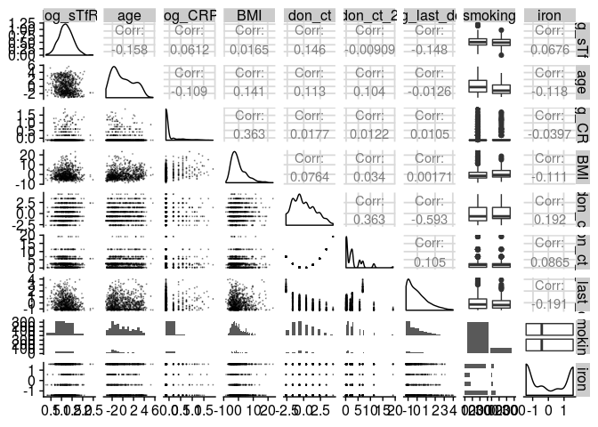

#### OLS

###### Model diagnostics

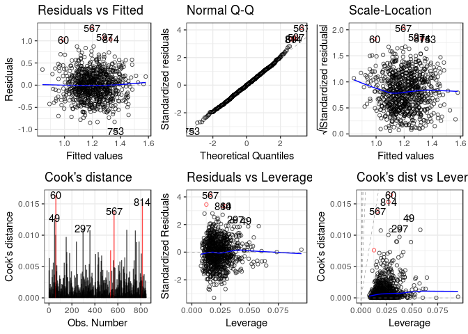

#### Robust regression model amd p-values

#### Model outputs and interpretation

<table style="text-align:center">
<caption>
<strong>Pre-menopausal women</strong>
</caption>
<tr>
<td colspan="3" style="border-bottom: 1px solid black">
</td>
</tr>
<tr>
<td style="text-align:left">
</td>
<td colspan="2">
sTfR
</td>
</tr>
<tr>
<td>
</td>
<td colspan="2" style="border-bottom: 1px solid black">
</td>
</tr>
<tr>
<td style="text-align:left">
</td>
<td>
Robust
</td>
<td>
OLS
</td>
</tr>
<tr>
<td colspan="3" style="border-bottom: 1px solid black">
</td>
</tr>
<tr>
<td style="text-align:left">
Age
</td>
<td>
-0.028
</td>
<td>
-0.027
</td>
</tr>
<tr>
<td style="text-align:left">
</td>
<td>
p = 0.0002
</td>
<td>
p = 0.0004
</td>
</tr>
<tr>
<td style="text-align:left">
BMI
</td>
<td>
0.003
</td>
<td>
0.003
</td>
</tr>
<tr>
<td style="text-align:left">
</td>
<td>
p = 0.167
</td>
<td>
p = 0.207
</td>
</tr>
<tr>
<td style="text-align:left">
CRP
</td>
<td>
0.026
</td>
<td>
0.030
</td>
</tr>
<tr>
<td style="text-align:left">
</td>
<td>
p = 0.462
</td>
<td>
p = 0.389
</td>
</tr>
<tr>
<td style="text-align:left">
Smoking(yes)
</td>
<td>
-0.048
</td>
<td>
-0.048
</td>
</tr>
<tr>
<td style="text-align:left">
</td>
<td>
p = 0.039
</td>
<td>
p = 0.037
</td>
</tr>
<tr>
<td style="text-align:left">
Pregnancy(Yes)
</td>
<td>
0.020
</td>
<td>
0.013
</td>
</tr>
<tr>
<td style="text-align:left">
</td>
<td>
p = 0.388
</td>
<td>
p = 0.559
</td>
</tr>
<tr>
<td style="text-align:left">
Nb donations (2 years)
</td>
<td>
0.025
</td>
<td>
0.025
</td>
</tr>
<tr>
<td style="text-align:left">
</td>
<td>
p = 0.009
</td>
<td>
p = 0.011
</td>
</tr>
<tr>
<td style="text-align:left">
(Nb donations (2 years))²
</td>
<td>
-0.006
</td>
<td>
-0.004
</td>
</tr>
<tr>
<td style="text-align:left">
</td>
<td>
p = 0.139
</td>
<td>
p = 0.241
</td>
</tr>
<tr>
<td style="text-align:left">
Days since last donation
</td>
<td>
-0.019
</td>
<td>
-0.021
</td>
</tr>
<tr>
<td style="text-align:left">
</td>
<td>
p = 0.165
</td>
<td>
p = 0.125
</td>
</tr>
<tr>
<td style="text-align:left">
iron supplementation
</td>
<td>
0.001
</td>
<td>
0.002
</td>
</tr>
<tr>
<td style="text-align:left">
</td>
<td>
p = 0.934
</td>
<td>
p = 0.801
</td>
</tr>
<tr>
<td style="text-align:left">
Red meat
</td>
<td>
-0.075
</td>
<td>
-0.068
</td>
</tr>
<tr>
<td style="text-align:left">
</td>
<td>
p = 0.000
</td>
<td>
p = 0.00000
</td>
</tr>
<tr>
<td style="text-align:left">
Vegetables
</td>
<td>
-0.018
</td>
<td>
-0.020
</td>
</tr>
<tr>
<td style="text-align:left">
</td>
<td>
p = 0.525
</td>
<td>
p = 0.470
</td>
</tr>
<tr>
<td style="text-align:left">
Fruit and Berries
</td>
<td>
0.008
</td>
<td>
0.009
</td>
</tr>
<tr>
<td style="text-align:left">
</td>
<td>
p = 0.734
</td>
<td>
p = 0.694
</td>
</tr>
<tr>
<td style="text-align:left">
Milk
</td>
<td>
0.040
</td>
<td>
0.041
</td>
</tr>
<tr>
<td style="text-align:left">
</td>
<td>
p = 0.005
</td>
<td>
p = 0.004
</td>
</tr>
<tr>
<td style="text-align:left">
Fruit Juices
</td>
<td>
-0.002
</td>
<td>
-0.003
</td>
</tr>
<tr>
<td style="text-align:left">
</td>
<td>
p = 0.909
</td>
<td>
p = 0.838
</td>
</tr>
<tr>
<td style="text-align:left">
Coffee
</td>
<td>
-0.038
</td>
<td>
-0.035
</td>
</tr>
<tr>
<td style="text-align:left">
</td>
<td>
p = 0.0003
</td>
<td>
p = 0.0005
</td>
</tr>
<tr>
<td style="text-align:left">
Tea
</td>
<td>
0.004
</td>
<td>
0.007
</td>
</tr>
<tr>
<td style="text-align:left">
</td>
<td>
p = 0.741
</td>
<td>
p = 0.511
</td>
</tr>
<tr>
<td style="text-align:left">
Beer
</td>
<td>
0.003
</td>
<td>
0.002
</td>
</tr>
<tr>
<td style="text-align:left">
</td>
<td>
p = 0.881
</td>
<td>
p = 0.906
</td>
</tr>
<tr>
<td style="text-align:left">
Wine
</td>
<td>
-0.013
</td>
<td>
-0.009
</td>
</tr>
<tr>
<td style="text-align:left">
</td>
<td>
p = 0.471
</td>
<td>
p = 0.621
</td>
</tr>
<tr>
<td style="text-align:left">
Liquor
</td>
<td>
0.034
</td>
<td>
0.033
</td>
</tr>
<tr>
<td style="text-align:left">
</td>
<td>
p = 0.251
</td>
<td>
p = 0.251
</td>
</tr>
<tr>
<td colspan="3" style="border-bottom: 1px solid black">
</td>
</tr>
<tr>
<td style="text-align:left">
Observations
</td>
<td>
846
</td>
<td>
846
</td>
</tr>
<tr>
<td style="text-align:left">
R2
</td>
<td>
</td>
<td>
0.117
</td>
</tr>
<tr>
<td style="text-align:left">
Adjusted R2
</td>
<td>
</td>
<td>
0.097
</td>
</tr>
<tr>
<td style="text-align:left">
Residual Std. Error (df = 826)
</td>
<td>
0.302
</td>
<td>
0.314
</td>
</tr>
<tr>
<td style="text-align:left">
F Statistic
</td>
<td>
</td>
<td>
5.770\*\*\* (df = 19; 826)
</td>
</tr>
<tr>
<td colspan="3" style="border-bottom: 1px solid black">
</td>
</tr>
<tr>
<td style="text-align:left">
<em>Note:</em>
</td>
<td colspan="2" style="text-align:right">
*p&lt;0.05; **p&lt;0.01; ***p&lt;0.001
</td>
</tr>
</table>
#### Relative importance

The relative importance analyses are run only on regressors that are consistently significant in at least one demographic group.

    ## Warning in rev(variances[[p]]) - variances[[p + 1]]: Recycling array of length 1 in vector-array arithmetic is deprecated.
    ##   Use c() or as.vector() instead.

    ## Warning in rev(variances[[p]]) - variances[[p + 1]]: Recycling array of length 1 in vector-array arithmetic is deprecated.
    ##   Use c() or as.vector() instead.

    ## Warning in rev(variances[[p]]) - variances[[p + 1]]: Recycling array of length 1 in vector-array arithmetic is deprecated.
    ##   Use c() or as.vector() instead.

    ## Warning in rev(variances[[p]]) - variances[[p + 1]]: Recycling array of length 1 in vector-array arithmetic is deprecated.
    ##   Use c() or as.vector() instead.

    ## Warning in rev(variances[[p]]) - variances[[p + 1]]: Recycling array of length 1 in vector-array arithmetic is deprecated.
    ##   Use c() or as.vector() instead.

    ## Warning in rev(variances[[p]]) - variances[[p + 1]]: Recycling array of length 1 in vector-array arithmetic is deprecated.
    ##   Use c() or as.vector() instead.

    ## Warning in rev(variances[[p]]) - variances[[p + 1]]: Recycling array of length 1 in vector-array arithmetic is deprecated.
    ##   Use c() or as.vector() instead.

    ## Warning in rev(variances[[p]]) - variances[[p + 1]]: Recycling array of length 1 in vector-array arithmetic is deprecated.
    ##   Use c() or as.vector() instead.

    ## Warning in rev(variances[[p]]) - variances[[p + 1]]: Recycling array of length 1 in vector-array arithmetic is deprecated.
    ##   Use c() or as.vector() instead.

    ## Warning in rev(variances[[p]]) - variances[[p + 1]]: Recycling array of length 1 in vector-array arithmetic is deprecated.
    ##   Use c() or as.vector() instead.

    ## Warning in rev(variances[[p]]) - variances[[p + 1]]: Recycling array of length 1 in vector-array arithmetic is deprecated.
    ##   Use c() or as.vector() instead.

    ## Warning in rev(variances[[p]]) - variances[[p + 1]]: Recycling array of length 1 in vector-array arithmetic is deprecated.
    ##   Use c() or as.vector() instead.

    ## Warning in rev(variances[[p]]) - variances[[p + 1]]: Recycling array of length 1 in vector-array arithmetic is deprecated.
    ##   Use c() or as.vector() instead.

    ## Warning in rev(variances[[p]]) - variances[[p + 1]]: Recycling array of length 1 in vector-array arithmetic is deprecated.
    ##   Use c() or as.vector() instead.

    ## Warning in rev(variances[[p]]) - variances[[p + 1]]: Recycling array of length 1 in vector-array arithmetic is deprecated.
    ##   Use c() or as.vector() instead.

    ## Warning in rev(variances[[p]]) - variances[[p + 1]]: Recycling array of length 1 in vector-array arithmetic is deprecated.
    ##   Use c() or as.vector() instead.

    ## Warning in rev(variances[[p]]) - variances[[p + 1]]: Recycling array of length 1 in vector-array arithmetic is deprecated.
    ##   Use c() or as.vector() instead.

    ## Warning in rev(variances[[p]]) - variances[[p + 1]]: Recycling array of length 1 in vector-array arithmetic is deprecated.
    ##   Use c() or as.vector() instead.

    ## Warning in rev(variances[[p]]) - variances[[p + 1]]: Recycling array of length 1 in vector-array arithmetic is deprecated.
    ##   Use c() or as.vector() instead.

    ## Warning in rev(variances[[p]]) - variances[[p + 1]]: Recycling array of length 1 in vector-array arithmetic is deprecated.
    ##   Use c() or as.vector() instead.

    ## Warning in rev(variances[[p]]) - variances[[p + 1]]: Recycling array of length 1 in vector-array arithmetic is deprecated.
    ##   Use c() or as.vector() instead.

    ## Warning in rev(variances[[p]]) - variances[[p + 1]]: Recycling array of length 1 in vector-array arithmetic is deprecated.
    ##   Use c() or as.vector() instead.

    ## Warning in rev(variances[[p]]) - variances[[p + 1]]: Recycling array of length 1 in vector-array arithmetic is deprecated.
    ##   Use c() or as.vector() instead.

    ## Warning in rev(variances[[p]]) - variances[[p + 1]]: Recycling array of length 1 in vector-array arithmetic is deprecated.
    ##   Use c() or as.vector() instead.

    ## Warning in rev(variances[[p]]) - variances[[p + 1]]: Recycling array of length 1 in vector-array arithmetic is deprecated.
    ##   Use c() or as.vector() instead.

    ## Warning in rev(variances[[p]]) - variances[[p + 1]]: Recycling array of length 1 in vector-array arithmetic is deprecated.
    ##   Use c() or as.vector() instead.

    ## Warning in rev(variances[[p]]) - variances[[p + 1]]: Recycling array of length 1 in vector-array arithmetic is deprecated.
    ##   Use c() or as.vector() instead.

    ## Warning in rev(variances[[p]]) - variances[[p + 1]]: Recycling array of length 1 in vector-array arithmetic is deprecated.
    ##   Use c() or as.vector() instead.

    ## Warning in rev(variances[[p]]) - variances[[p + 1]]: Recycling array of length 1 in vector-array arithmetic is deprecated.
    ##   Use c() or as.vector() instead.

    ## Warning in rev(variances[[p]]) - variances[[p + 1]]: Recycling array of length 1 in vector-array arithmetic is deprecated.
    ##   Use c() or as.vector() instead.

    ## Warning in rev(variances[[p]]) - variances[[p + 1]]: Recycling array of length 1 in vector-array arithmetic is deprecated.
    ##   Use c() or as.vector() instead.

    ## Warning in rev(variances[[p]]) - variances[[p + 1]]: Recycling array of length 1 in vector-array arithmetic is deprecated.
    ##   Use c() or as.vector() instead.

    ## Warning in rev(variances[[p]]) - variances[[p + 1]]: Recycling array of length 1 in vector-array arithmetic is deprecated.
    ##   Use c() or as.vector() instead.

    ## Warning in rev(variances[[p]]) - variances[[p + 1]]: Recycling array of length 1 in vector-array arithmetic is deprecated.
    ##   Use c() or as.vector() instead.

    ## Warning in rev(variances[[p]]) - variances[[p + 1]]: Recycling array of length 1 in vector-array arithmetic is deprecated.
    ##   Use c() or as.vector() instead.

    ## Warning in rev(variances[[p]]) - variances[[p + 1]]: Recycling array of length 1 in vector-array arithmetic is deprecated.
    ##   Use c() or as.vector() instead.

    ## Warning in rev(variances[[p]]) - variances[[p + 1]]: Recycling array of length 1 in vector-array arithmetic is deprecated.
    ##   Use c() or as.vector() instead.

    ## Warning in rev(variances[[p]]) - variances[[p + 1]]: Recycling array of length 1 in vector-array arithmetic is deprecated.
    ##   Use c() or as.vector() instead.

    ## Warning in rev(variances[[p]]) - variances[[p + 1]]: Recycling array of length 1 in vector-array arithmetic is deprecated.
    ##   Use c() or as.vector() instead.

    ## Warning in rev(variances[[p]]) - variances[[p + 1]]: Recycling array of length 1 in vector-array arithmetic is deprecated.
    ##   Use c() or as.vector() instead.

    ## Warning in rev(variances[[p]]) - variances[[p + 1]]: Recycling array of length 1 in vector-array arithmetic is deprecated.
    ##   Use c() or as.vector() instead.

    ## Warning in rev(variances[[p]]) - variances[[p + 1]]: Recycling array of length 1 in vector-array arithmetic is deprecated.
    ##   Use c() or as.vector() instead.

    ## Warning in rev(variances[[p]]) - variances[[p + 1]]: Recycling array of length 1 in vector-array arithmetic is deprecated.
    ##   Use c() or as.vector() instead.

    ## Warning in rev(variances[[p]]) - variances[[p + 1]]: Recycling array of length 1 in vector-array arithmetic is deprecated.
    ##   Use c() or as.vector() instead.

    ## Warning in rev(variances[[p]]) - variances[[p + 1]]: Recycling array of length 1 in vector-array arithmetic is deprecated.
    ##   Use c() or as.vector() instead.

    ## Warning in rev(variances[[p]]) - variances[[p + 1]]: Recycling array of length 1 in vector-array arithmetic is deprecated.
    ##   Use c() or as.vector() instead.

    ## Warning in rev(variances[[p]]) - variances[[p + 1]]: Recycling array of length 1 in vector-array arithmetic is deprecated.
    ##   Use c() or as.vector() instead.

    ## Warning in rev(variances[[p]]) - variances[[p + 1]]: Recycling array of length 1 in vector-array arithmetic is deprecated.
    ##   Use c() or as.vector() instead.

    ## Warning in rev(variances[[p]]) - variances[[p + 1]]: Recycling array of length 1 in vector-array arithmetic is deprecated.
    ##   Use c() or as.vector() instead.

    ## Warning in rev(variances[[p]]) - variances[[p + 1]]: Recycling array of length 1 in vector-array arithmetic is deprecated.
    ##   Use c() or as.vector() instead.

    ## Warning in rev(variances[[p]]) - variances[[p + 1]]: Recycling array of length 1 in vector-array arithmetic is deprecated.
    ##   Use c() or as.vector() instead.

    ## Warning in rev(variances[[p]]) - variances[[p + 1]]: Recycling array of length 1 in vector-array arithmetic is deprecated.
    ##   Use c() or as.vector() instead.

    ## Warning in rev(variances[[p]]) - variances[[p + 1]]: Recycling array of length 1 in vector-array arithmetic is deprecated.
    ##   Use c() or as.vector() instead.

    ## Warning in rev(variances[[p]]) - variances[[p + 1]]: Recycling array of length 1 in vector-array arithmetic is deprecated.
    ##   Use c() or as.vector() instead.

    ## Warning in rev(variances[[p]]) - variances[[p + 1]]: Recycling array of length 1 in vector-array arithmetic is deprecated.
    ##   Use c() or as.vector() instead.

    ## Warning in rev(variances[[p]]) - variances[[p + 1]]: Recycling array of length 1 in vector-array arithmetic is deprecated.
    ##   Use c() or as.vector() instead.

    ## Warning in rev(variances[[p]]) - variances[[p + 1]]: Recycling array of length 1 in vector-array arithmetic is deprecated.
    ##   Use c() or as.vector() instead.

    ## Warning in rev(variances[[p]]) - variances[[p + 1]]: Recycling array of length 1 in vector-array arithmetic is deprecated.
    ##   Use c() or as.vector() instead.

    ## Warning in rev(variances[[p]]) - variances[[p + 1]]: Recycling array of length 1 in vector-array arithmetic is deprecated.
    ##   Use c() or as.vector() instead.

    ## Warning in rev(variances[[p]]) - variances[[p + 1]]: Recycling array of length 1 in vector-array arithmetic is deprecated.
    ##   Use c() or as.vector() instead.

    ## Warning in rev(variances[[p]]) - variances[[p + 1]]: Recycling array of length 1 in vector-array arithmetic is deprecated.
    ##   Use c() or as.vector() instead.

    ## Warning in rev(variances[[p]]) - variances[[p + 1]]: Recycling array of length 1 in vector-array arithmetic is deprecated.
    ##   Use c() or as.vector() instead.

    ## Warning in rev(variances[[p]]) - variances[[p + 1]]: Recycling array of length 1 in vector-array arithmetic is deprecated.
    ##   Use c() or as.vector() instead.

    ## Warning in rev(variances[[p]]) - variances[[p + 1]]: Recycling array of length 1 in vector-array arithmetic is deprecated.
    ##   Use c() or as.vector() instead.

    ## Warning in rev(variances[[p]]) - variances[[p + 1]]: Recycling array of length 1 in vector-array arithmetic is deprecated.
    ##   Use c() or as.vector() instead.

    ## Warning in rev(variances[[p]]) - variances[[p + 1]]: Recycling array of length 1 in vector-array arithmetic is deprecated.
    ##   Use c() or as.vector() instead.

    ## Warning in rev(variances[[p]]) - variances[[p + 1]]: Recycling array of length 1 in vector-array arithmetic is deprecated.
    ##   Use c() or as.vector() instead.

    ## Warning in rev(variances[[p]]) - variances[[p + 1]]: Recycling array of length 1 in vector-array arithmetic is deprecated.
    ##   Use c() or as.vector() instead.

    ## Warning in rev(variances[[p]]) - variances[[p + 1]]: Recycling array of length 1 in vector-array arithmetic is deprecated.
    ##   Use c() or as.vector() instead.

    ## Warning in rev(variances[[p]]) - variances[[p + 1]]: Recycling array of length 1 in vector-array arithmetic is deprecated.
    ##   Use c() or as.vector() instead.

    ## Warning in rev(variances[[p]]) - variances[[p + 1]]: Recycling array of length 1 in vector-array arithmetic is deprecated.
    ##   Use c() or as.vector() instead.

    ## Warning in rev(variances[[p]]) - variances[[p + 1]]: Recycling array of length 1 in vector-array arithmetic is deprecated.
    ##   Use c() or as.vector() instead.

    ## Warning in rev(variances[[p]]) - variances[[p + 1]]: Recycling array of length 1 in vector-array arithmetic is deprecated.
    ##   Use c() or as.vector() instead.

    ## Warning in rev(variances[[p]]) - variances[[p + 1]]: Recycling array of length 1 in vector-array arithmetic is deprecated.
    ##   Use c() or as.vector() instead.

    ## Warning in rev(variances[[p]]) - variances[[p + 1]]: Recycling array of length 1 in vector-array arithmetic is deprecated.
    ##   Use c() or as.vector() instead.

    ## Warning in rev(variances[[p]]) - variances[[p + 1]]: Recycling array of length 1 in vector-array arithmetic is deprecated.
    ##   Use c() or as.vector() instead.

    ## Warning in rev(variances[[p]]) - variances[[p + 1]]: Recycling array of length 1 in vector-array arithmetic is deprecated.
    ##   Use c() or as.vector() instead.

    ## Warning in rev(variances[[p]]) - variances[[p + 1]]: Recycling array of length 1 in vector-array arithmetic is deprecated.
    ##   Use c() or as.vector() instead.

    ## Warning in rev(variances[[p]]) - variances[[p + 1]]: Recycling array of length 1 in vector-array arithmetic is deprecated.
    ##   Use c() or as.vector() instead.

    ## Warning in rev(variances[[p]]) - variances[[p + 1]]: Recycling array of length 1 in vector-array arithmetic is deprecated.
    ##   Use c() or as.vector() instead.

    ## Warning in rev(variances[[p]]) - variances[[p + 1]]: Recycling array of length 1 in vector-array arithmetic is deprecated.
    ##   Use c() or as.vector() instead.

    ## Warning in rev(variances[[p]]) - variances[[p + 1]]: Recycling array of length 1 in vector-array arithmetic is deprecated.
    ##   Use c() or as.vector() instead.

    ## Warning in rev(variances[[p]]) - variances[[p + 1]]: Recycling array of length 1 in vector-array arithmetic is deprecated.
    ##   Use c() or as.vector() instead.

    ## Warning in rev(variances[[p]]) - variances[[p + 1]]: Recycling array of length 1 in vector-array arithmetic is deprecated.
    ##   Use c() or as.vector() instead.

    ## Warning in rev(variances[[p]]) - variances[[p + 1]]: Recycling array of length 1 in vector-array arithmetic is deprecated.
    ##   Use c() or as.vector() instead.

    ## Warning in rev(variances[[p]]) - variances[[p + 1]]: Recycling array of length 1 in vector-array arithmetic is deprecated.
    ##   Use c() or as.vector() instead.

    ## Warning in rev(variances[[p]]) - variances[[p + 1]]: Recycling array of length 1 in vector-array arithmetic is deprecated.
    ##   Use c() or as.vector() instead.

    ## Warning in rev(variances[[p]]) - variances[[p + 1]]: Recycling array of length 1 in vector-array arithmetic is deprecated.
    ##   Use c() or as.vector() instead.

    ## Warning in rev(variances[[p]]) - variances[[p + 1]]: Recycling array of length 1 in vector-array arithmetic is deprecated.
    ##   Use c() or as.vector() instead.

    ## Warning in rev(variances[[p]]) - variances[[p + 1]]: Recycling array of length 1 in vector-array arithmetic is deprecated.
    ##   Use c() or as.vector() instead.

    ## Warning in rev(variances[[p]]) - variances[[p + 1]]: Recycling array of length 1 in vector-array arithmetic is deprecated.
    ##   Use c() or as.vector() instead.

    ## Warning in rev(variances[[p]]) - variances[[p + 1]]: Recycling array of length 1 in vector-array arithmetic is deprecated.
    ##   Use c() or as.vector() instead.

    ## Warning in rev(variances[[p]]) - variances[[p + 1]]: Recycling array of length 1 in vector-array arithmetic is deprecated.
    ##   Use c() or as.vector() instead.

    ## Warning in rev(variances[[p]]) - variances[[p + 1]]: Recycling array of length 1 in vector-array arithmetic is deprecated.
    ##   Use c() or as.vector() instead.

    ## Warning in rev(variances[[p]]) - variances[[p + 1]]: Recycling array of length 1 in vector-array arithmetic is deprecated.
    ##   Use c() or as.vector() instead.

    ## Warning in rev(variances[[p]]) - variances[[p + 1]]: Recycling array of length 1 in vector-array arithmetic is deprecated.
    ##   Use c() or as.vector() instead.

    ## Warning in rev(variances[[p]]) - variances[[p + 1]]: Recycling array of length 1 in vector-array arithmetic is deprecated.
    ##   Use c() or as.vector() instead.

    ## Warning in rev(variances[[p]]) - variances[[p + 1]]: Recycling array of length 1 in vector-array arithmetic is deprecated.
    ##   Use c() or as.vector() instead.

    ## Warning in rev(variances[[p]]) - variances[[p + 1]]: Recycling array of length 1 in vector-array arithmetic is deprecated.
    ##   Use c() or as.vector() instead.

    ## Warning in rev(variances[[p]]) - variances[[p + 1]]: Recycling array of length 1 in vector-array arithmetic is deprecated.
    ##   Use c() or as.vector() instead.

    ## Warning in rev(variances[[p]]) - variances[[p + 1]]: Recycling array of length 1 in vector-array arithmetic is deprecated.
    ##   Use c() or as.vector() instead.

    ## Warning in rev(variances[[p]]) - variances[[p + 1]]: Recycling array of length 1 in vector-array arithmetic is deprecated.
    ##   Use c() or as.vector() instead.

    ## Warning in rev(variances[[p]]) - variances[[p + 1]]: Recycling array of length 1 in vector-array arithmetic is deprecated.
    ##   Use c() or as.vector() instead.

    ## Warning in rev(variances[[p]]) - variances[[p + 1]]: Recycling array of length 1 in vector-array arithmetic is deprecated.
    ##   Use c() or as.vector() instead.

    ## Warning in rev(variances[[p]]) - variances[[p + 1]]: Recycling array of length 1 in vector-array arithmetic is deprecated.
    ##   Use c() or as.vector() instead.

    ## Warning in rev(variances[[p]]) - variances[[p + 1]]: Recycling array of length 1 in vector-array arithmetic is deprecated.
    ##   Use c() or as.vector() instead.

    ## Warning in rev(variances[[p]]) - variances[[p + 1]]: Recycling array of length 1 in vector-array arithmetic is deprecated.
    ##   Use c() or as.vector() instead.

    ## Warning in rev(variances[[p]]) - variances[[p + 1]]: Recycling array of length 1 in vector-array arithmetic is deprecated.
    ##   Use c() or as.vector() instead.

    ## Warning in rev(variances[[p]]) - variances[[p + 1]]: Recycling array of length 1 in vector-array arithmetic is deprecated.
    ##   Use c() or as.vector() instead.

    ## Warning in rev(variances[[p]]) - variances[[p + 1]]: Recycling array of length 1 in vector-array arithmetic is deprecated.
    ##   Use c() or as.vector() instead.

    ## Warning in rev(variances[[p]]) - variances[[p + 1]]: Recycling array of length 1 in vector-array arithmetic is deprecated.
    ##   Use c() or as.vector() instead.

    ## Warning in rev(variances[[p]]) - variances[[p + 1]]: Recycling array of length 1 in vector-array arithmetic is deprecated.
    ##   Use c() or as.vector() instead.

    ## Warning in rev(variances[[p]]) - variances[[p + 1]]: Recycling array of length 1 in vector-array arithmetic is deprecated.
    ##   Use c() or as.vector() instead.

    ## Warning in rev(variances[[p]]) - variances[[p + 1]]: Recycling array of length 1 in vector-array arithmetic is deprecated.
    ##   Use c() or as.vector() instead.

    ## Warning in rev(variances[[p]]) - variances[[p + 1]]: Recycling array of length 1 in vector-array arithmetic is deprecated.
    ##   Use c() or as.vector() instead.

    ## Warning in rev(variances[[p]]) - variances[[p + 1]]: Recycling array of length 1 in vector-array arithmetic is deprecated.
    ##   Use c() or as.vector() instead.

    ## Warning in rev(variances[[p]]) - variances[[p + 1]]: Recycling array of length 1 in vector-array arithmetic is deprecated.
    ##   Use c() or as.vector() instead.

    ## Warning in rev(variances[[p]]) - variances[[p + 1]]: Recycling array of length 1 in vector-array arithmetic is deprecated.
    ##   Use c() or as.vector() instead.

    ## Warning in rev(variances[[p]]) - variances[[p + 1]]: Recycling array of length 1 in vector-array arithmetic is deprecated.
    ##   Use c() or as.vector() instead.

    ## Warning in rev(variances[[p]]) - variances[[p + 1]]: Recycling array of length 1 in vector-array arithmetic is deprecated.
    ##   Use c() or as.vector() instead.

    ## Warning in rev(variances[[p]]) - variances[[p + 1]]: Recycling array of length 1 in vector-array arithmetic is deprecated.
    ##   Use c() or as.vector() instead.

    ## Warning in rev(variances[[p]]) - variances[[p + 1]]: Recycling array of length 1 in vector-array arithmetic is deprecated.
    ##   Use c() or as.vector() instead.

    ## Warning in rev(variances[[p]]) - variances[[p + 1]]: Recycling array of length 1 in vector-array arithmetic is deprecated.
    ##   Use c() or as.vector() instead.

    ## Warning in rev(variances[[p]]) - variances[[p + 1]]: Recycling array of length 1 in vector-array arithmetic is deprecated.
    ##   Use c() or as.vector() instead.

    ## Warning in rev(variances[[p]]) - variances[[p + 1]]: Recycling array of length 1 in vector-array arithmetic is deprecated.
    ##   Use c() or as.vector() instead.

    ## Warning in rev(variances[[p]]) - variances[[p + 1]]: Recycling array of length 1 in vector-array arithmetic is deprecated.
    ##   Use c() or as.vector() instead.

    ## Warning in rev(variances[[p]]) - variances[[p + 1]]: Recycling array of length 1 in vector-array arithmetic is deprecated.
    ##   Use c() or as.vector() instead.

    ## Warning in rev(variances[[p]]) - variances[[p + 1]]: Recycling array of length 1 in vector-array arithmetic is deprecated.
    ##   Use c() or as.vector() instead.

    ## Warning in rev(variances[[p]]) - variances[[p + 1]]: Recycling array of length 1 in vector-array arithmetic is deprecated.
    ##   Use c() or as.vector() instead.

    ## Warning in rev(variances[[p]]) - variances[[p + 1]]: Recycling array of length 1 in vector-array arithmetic is deprecated.
    ##   Use c() or as.vector() instead.

    ## Warning in rev(variances[[p]]) - variances[[p + 1]]: Recycling array of length 1 in vector-array arithmetic is deprecated.
    ##   Use c() or as.vector() instead.

    ## Warning in rev(variances[[p]]) - variances[[p + 1]]: Recycling array of length 1 in vector-array arithmetic is deprecated.
    ##   Use c() or as.vector() instead.

    ## Warning in rev(variances[[p]]) - variances[[p + 1]]: Recycling array of length 1 in vector-array arithmetic is deprecated.
    ##   Use c() or as.vector() instead.

    ## Warning in rev(variances[[p]]) - variances[[p + 1]]: Recycling array of length 1 in vector-array arithmetic is deprecated.
    ##   Use c() or as.vector() instead.

    ## Warning in rev(variances[[p]]) - variances[[p + 1]]: Recycling array of length 1 in vector-array arithmetic is deprecated.
    ##   Use c() or as.vector() instead.

    ## Warning in rev(variances[[p]]) - variances[[p + 1]]: Recycling array of length 1 in vector-array arithmetic is deprecated.
    ##   Use c() or as.vector() instead.

    ## Warning in rev(variances[[p]]) - variances[[p + 1]]: Recycling array of length 1 in vector-array arithmetic is deprecated.
    ##   Use c() or as.vector() instead.

    ## Warning in rev(variances[[p]]) - variances[[p + 1]]: Recycling array of length 1 in vector-array arithmetic is deprecated.
    ##   Use c() or as.vector() instead.

    ## Warning in rev(variances[[p]]) - variances[[p + 1]]: Recycling array of length 1 in vector-array arithmetic is deprecated.
    ##   Use c() or as.vector() instead.

    ## Warning in rev(variances[[p]]) - variances[[p + 1]]: Recycling array of length 1 in vector-array arithmetic is deprecated.
    ##   Use c() or as.vector() instead.

    ## Warning in rev(variances[[p]]) - variances[[p + 1]]: Recycling array of length 1 in vector-array arithmetic is deprecated.
    ##   Use c() or as.vector() instead.

    ## Warning in rev(variances[[p]]) - variances[[p + 1]]: Recycling array of length 1 in vector-array arithmetic is deprecated.
    ##   Use c() or as.vector() instead.

    ## Warning in rev(variances[[p]]) - variances[[p + 1]]: Recycling array of length 1 in vector-array arithmetic is deprecated.
    ##   Use c() or as.vector() instead.

    ## Warning in rev(variances[[p]]) - variances[[p + 1]]: Recycling array of length 1 in vector-array arithmetic is deprecated.
    ##   Use c() or as.vector() instead.

    ## Warning in rev(variances[[p]]) - variances[[p + 1]]: Recycling array of length 1 in vector-array arithmetic is deprecated.
    ##   Use c() or as.vector() instead.

    ## Warning in rev(variances[[p]]) - variances[[p + 1]]: Recycling array of length 1 in vector-array arithmetic is deprecated.
    ##   Use c() or as.vector() instead.

    ## Warning in rev(variances[[p]]) - variances[[p + 1]]: Recycling array of length 1 in vector-array arithmetic is deprecated.
    ##   Use c() or as.vector() instead.

    ## Warning in rev(variances[[p]]) - variances[[p + 1]]: Recycling array of length 1 in vector-array arithmetic is deprecated.
    ##   Use c() or as.vector() instead.

    ## Warning in rev(variances[[p]]) - variances[[p + 1]]: Recycling array of length 1 in vector-array arithmetic is deprecated.
    ##   Use c() or as.vector() instead.

    ## Warning in rev(variances[[p]]) - variances[[p + 1]]: Recycling array of length 1 in vector-array arithmetic is deprecated.
    ##   Use c() or as.vector() instead.

    ## Warning in rev(variances[[p]]) - variances[[p + 1]]: Recycling array of length 1 in vector-array arithmetic is deprecated.
    ##   Use c() or as.vector() instead.

    ## Warning in rev(variances[[p]]) - variances[[p + 1]]: Recycling array of length 1 in vector-array arithmetic is deprecated.
    ##   Use c() or as.vector() instead.

    ## Warning in rev(variances[[p]]) - variances[[p + 1]]: Recycling array of length 1 in vector-array arithmetic is deprecated.
    ##   Use c() or as.vector() instead.

    ## Warning in rev(variances[[p]]) - variances[[p + 1]]: Recycling array of length 1 in vector-array arithmetic is deprecated.
    ##   Use c() or as.vector() instead.

    ## Warning in rev(variances[[p]]) - variances[[p + 1]]: Recycling array of length 1 in vector-array arithmetic is deprecated.
    ##   Use c() or as.vector() instead.

    ## Warning in rev(variances[[p]]) - variances[[p + 1]]: Recycling array of length 1 in vector-array arithmetic is deprecated.
    ##   Use c() or as.vector() instead.

    ## Warning in rev(variances[[p]]) - variances[[p + 1]]: Recycling array of length 1 in vector-array arithmetic is deprecated.
    ##   Use c() or as.vector() instead.

    ## Warning in rev(variances[[p]]) - variances[[p + 1]]: Recycling array of length 1 in vector-array arithmetic is deprecated.
    ##   Use c() or as.vector() instead.

    ## Warning in rev(variances[[p]]) - variances[[p + 1]]: Recycling array of length 1 in vector-array arithmetic is deprecated.
    ##   Use c() or as.vector() instead.

    ## Warning in rev(variances[[p]]) - variances[[p + 1]]: Recycling array of length 1 in vector-array arithmetic is deprecated.
    ##   Use c() or as.vector() instead.

    ## Warning in rev(variances[[p]]) - variances[[p + 1]]: Recycling array of length 1 in vector-array arithmetic is deprecated.
    ##   Use c() or as.vector() instead.

    ## Warning in rev(variances[[p]]) - variances[[p + 1]]: Recycling array of length 1 in vector-array arithmetic is deprecated.
    ##   Use c() or as.vector() instead.

    ## Warning in rev(variances[[p]]) - variances[[p + 1]]: Recycling array of length 1 in vector-array arithmetic is deprecated.
    ##   Use c() or as.vector() instead.

    ## Warning in rev(variances[[p]]) - variances[[p + 1]]: Recycling array of length 1 in vector-array arithmetic is deprecated.
    ##   Use c() or as.vector() instead.

    ## Warning in rev(variances[[p]]) - variances[[p + 1]]: Recycling array of length 1 in vector-array arithmetic is deprecated.
    ##   Use c() or as.vector() instead.

    ## Warning in rev(variances[[p]]) - variances[[p + 1]]: Recycling array of length 1 in vector-array arithmetic is deprecated.
    ##   Use c() or as.vector() instead.

    ## Warning in rev(variances[[p]]) - variances[[p + 1]]: Recycling array of length 1 in vector-array arithmetic is deprecated.
    ##   Use c() or as.vector() instead.

    ## Warning in rev(variances[[p]]) - variances[[p + 1]]: Recycling array of length 1 in vector-array arithmetic is deprecated.
    ##   Use c() or as.vector() instead.

    ## Warning in rev(variances[[p]]) - variances[[p + 1]]: Recycling array of length 1 in vector-array arithmetic is deprecated.
    ##   Use c() or as.vector() instead.

    ## Warning in rev(variances[[p]]) - variances[[p + 1]]: Recycling array of length 1 in vector-array arithmetic is deprecated.
    ##   Use c() or as.vector() instead.

    ## Warning in rev(variances[[p]]) - variances[[p + 1]]: Recycling array of length 1 in vector-array arithmetic is deprecated.
    ##   Use c() or as.vector() instead.

    ## Warning in rev(variances[[p]]) - variances[[p + 1]]: Recycling array of length 1 in vector-array arithmetic is deprecated.
    ##   Use c() or as.vector() instead.

    ## Warning in rev(variances[[p]]) - variances[[p + 1]]: Recycling array of length 1 in vector-array arithmetic is deprecated.
    ##   Use c() or as.vector() instead.

    ## Warning in rev(variances[[p]]) - variances[[p + 1]]: Recycling array of length 1 in vector-array arithmetic is deprecated.
    ##   Use c() or as.vector() instead.

    ## Warning in rev(variances[[p]]) - variances[[p + 1]]: Recycling array of length 1 in vector-array arithmetic is deprecated.
    ##   Use c() or as.vector() instead.

    ## Warning in rev(variances[[p]]) - variances[[p + 1]]: Recycling array of length 1 in vector-array arithmetic is deprecated.
    ##   Use c() or as.vector() instead.

    ## Warning in rev(variances[[p]]) - variances[[p + 1]]: Recycling array of length 1 in vector-array arithmetic is deprecated.
    ##   Use c() or as.vector() instead.

    ## Warning in rev(variances[[p]]) - variances[[p + 1]]: Recycling array of length 1 in vector-array arithmetic is deprecated.
    ##   Use c() or as.vector() instead.

    ## Warning in rev(variances[[p]]) - variances[[p + 1]]: Recycling array of length 1 in vector-array arithmetic is deprecated.
    ##   Use c() or as.vector() instead.

    ## Warning in rev(variances[[p]]) - variances[[p + 1]]: Recycling array of length 1 in vector-array arithmetic is deprecated.
    ##   Use c() or as.vector() instead.

    ## Warning in rev(variances[[p]]) - variances[[p + 1]]: Recycling array of length 1 in vector-array arithmetic is deprecated.
    ##   Use c() or as.vector() instead.

    ## Warning in rev(variances[[p]]) - variances[[p + 1]]: Recycling array of length 1 in vector-array arithmetic is deprecated.
    ##   Use c() or as.vector() instead.

    ## Warning in rev(variances[[p]]) - variances[[p + 1]]: Recycling array of length 1 in vector-array arithmetic is deprecated.
    ##   Use c() or as.vector() instead.

    ## Warning in rev(variances[[p]]) - variances[[p + 1]]: Recycling array of length 1 in vector-array arithmetic is deprecated.
    ##   Use c() or as.vector() instead.

    ## Warning in rev(variances[[p]]) - variances[[p + 1]]: Recycling array of length 1 in vector-array arithmetic is deprecated.
    ##   Use c() or as.vector() instead.

    ## Warning in rev(variances[[p]]) - variances[[p + 1]]: Recycling array of length 1 in vector-array arithmetic is deprecated.
    ##   Use c() or as.vector() instead.

    ## Warning in rev(variances[[p]]) - variances[[p + 1]]: Recycling array of length 1 in vector-array arithmetic is deprecated.
    ##   Use c() or as.vector() instead.

    ## Warning in rev(variances[[p]]) - variances[[p + 1]]: Recycling array of length 1 in vector-array arithmetic is deprecated.
    ##   Use c() or as.vector() instead.

    ## Warning in rev(variances[[p]]) - variances[[p + 1]]: Recycling array of length 1 in vector-array arithmetic is deprecated.
    ##   Use c() or as.vector() instead.

    ## Warning in rev(variances[[p]]) - variances[[p + 1]]: Recycling array of length 1 in vector-array arithmetic is deprecated.
    ##   Use c() or as.vector() instead.

    ## Warning in rev(variances[[p]]) - variances[[p + 1]]: Recycling array of length 1 in vector-array arithmetic is deprecated.
    ##   Use c() or as.vector() instead.

    ## Warning in rev(variances[[p]]) - variances[[p + 1]]: Recycling array of length 1 in vector-array arithmetic is deprecated.
    ##   Use c() or as.vector() instead.

    ## Warning in rev(variances[[p]]) - variances[[p + 1]]: Recycling array of length 1 in vector-array arithmetic is deprecated.
    ##   Use c() or as.vector() instead.

    ## Warning in rev(variances[[p]]) - variances[[p + 1]]: Recycling array of length 1 in vector-array arithmetic is deprecated.
    ##   Use c() or as.vector() instead.

    ## Warning in rev(variances[[p]]) - variances[[p + 1]]: Recycling array of length 1 in vector-array arithmetic is deprecated.
    ##   Use c() or as.vector() instead.

    ## Warning in rev(variances[[p]]) - variances[[p + 1]]: Recycling array of length 1 in vector-array arithmetic is deprecated.
    ##   Use c() or as.vector() instead.

    ## Warning in rev(variances[[p]]) - variances[[p + 1]]: Recycling array of length 1 in vector-array arithmetic is deprecated.
    ##   Use c() or as.vector() instead.

    ## Warning in rev(variances[[p]]) - variances[[p + 1]]: Recycling array of length 1 in vector-array arithmetic is deprecated.
    ##   Use c() or as.vector() instead.

    ## Warning in rev(variances[[p]]) - variances[[p + 1]]: Recycling array of length 1 in vector-array arithmetic is deprecated.
    ##   Use c() or as.vector() instead.

    ## Warning in rev(variances[[p]]) - variances[[p + 1]]: Recycling array of length 1 in vector-array arithmetic is deprecated.
    ##   Use c() or as.vector() instead.

    ## Warning in rev(variances[[p]]) - variances[[p + 1]]: Recycling array of length 1 in vector-array arithmetic is deprecated.
    ##   Use c() or as.vector() instead.

    ## Warning in rev(variances[[p]]) - variances[[p + 1]]: Recycling array of length 1 in vector-array arithmetic is deprecated.
    ##   Use c() or as.vector() instead.

    ## Warning in rev(variances[[p]]) - variances[[p + 1]]: Recycling array of length 1 in vector-array arithmetic is deprecated.
    ##   Use c() or as.vector() instead.

    ## Warning in rev(variances[[p]]) - variances[[p + 1]]: Recycling array of length 1 in vector-array arithmetic is deprecated.
    ##   Use c() or as.vector() instead.

    ## Warning in rev(variances[[p]]) - variances[[p + 1]]: Recycling array of length 1 in vector-array arithmetic is deprecated.
    ##   Use c() or as.vector() instead.

    ## Warning in rev(variances[[p]]) - variances[[p + 1]]: Recycling array of length 1 in vector-array arithmetic is deprecated.
    ##   Use c() or as.vector() instead.

    ## Warning in rev(variances[[p]]) - variances[[p + 1]]: Recycling array of length 1 in vector-array arithmetic is deprecated.
    ##   Use c() or as.vector() instead.

    ## Warning in rev(variances[[p]]) - variances[[p + 1]]: Recycling array of length 1 in vector-array arithmetic is deprecated.
    ##   Use c() or as.vector() instead.

    ## Warning in rev(variances[[p]]) - variances[[p + 1]]: Recycling array of length 1 in vector-array arithmetic is deprecated.
    ##   Use c() or as.vector() instead.

    ## Warning in rev(variances[[p]]) - variances[[p + 1]]: Recycling array of length 1 in vector-array arithmetic is deprecated.
    ##   Use c() or as.vector() instead.

    ## Warning in rev(variances[[p]]) - variances[[p + 1]]: Recycling array of length 1 in vector-array arithmetic is deprecated.
    ##   Use c() or as.vector() instead.

    ## Warning in rev(variances[[p]]) - variances[[p + 1]]: Recycling array of length 1 in vector-array arithmetic is deprecated.
    ##   Use c() or as.vector() instead.

    ## Warning in rev(variances[[p]]) - variances[[p + 1]]: Recycling array of length 1 in vector-array arithmetic is deprecated.
    ##   Use c() or as.vector() instead.

    ## Warning in rev(variances[[p]]) - variances[[p + 1]]: Recycling array of length 1 in vector-array arithmetic is deprecated.
    ##   Use c() or as.vector() instead.

    ## Warning in rev(variances[[p]]) - variances[[p + 1]]: Recycling array of length 1 in vector-array arithmetic is deprecated.
    ##   Use c() or as.vector() instead.

    ## Warning in rev(variances[[p]]) - variances[[p + 1]]: Recycling array of length 1 in vector-array arithmetic is deprecated.
    ##   Use c() or as.vector() instead.

    ## Warning in rev(variances[[p]]) - variances[[p + 1]]: Recycling array of length 1 in vector-array arithmetic is deprecated.
    ##   Use c() or as.vector() instead.

    ## Warning in rev(variances[[p]]) - variances[[p + 1]]: Recycling array of length 1 in vector-array arithmetic is deprecated.
    ##   Use c() or as.vector() instead.

    ## Warning in rev(variances[[p]]) - variances[[p + 1]]: Recycling array of length 1 in vector-array arithmetic is deprecated.
    ##   Use c() or as.vector() instead.

    ## Warning in rev(variances[[p]]) - variances[[p + 1]]: Recycling array of length 1 in vector-array arithmetic is deprecated.
    ##   Use c() or as.vector() instead.

    ## Warning in rev(variances[[p]]) - variances[[p + 1]]: Recycling array of length 1 in vector-array arithmetic is deprecated.
    ##   Use c() or as.vector() instead.

    ## Warning in rev(variances[[p]]) - variances[[p + 1]]: Recycling array of length 1 in vector-array arithmetic is deprecated.
    ##   Use c() or as.vector() instead.

    ## Warning in rev(variances[[p]]) - variances[[p + 1]]: Recycling array of length 1 in vector-array arithmetic is deprecated.
    ##   Use c() or as.vector() instead.

    ## Warning in rev(variances[[p]]) - variances[[p + 1]]: Recycling array of length 1 in vector-array arithmetic is deprecated.
    ##   Use c() or as.vector() instead.

    ## Warning in rev(variances[[p]]) - variances[[p + 1]]: Recycling array of length 1 in vector-array arithmetic is deprecated.
    ##   Use c() or as.vector() instead.

    ## Warning in rev(variances[[p]]) - variances[[p + 1]]: Recycling array of length 1 in vector-array arithmetic is deprecated.
    ##   Use c() or as.vector() instead.

    ## Warning in rev(variances[[p]]) - variances[[p + 1]]: Recycling array of length 1 in vector-array arithmetic is deprecated.
    ##   Use c() or as.vector() instead.

    ## Warning in rev(variances[[p]]) - variances[[p + 1]]: Recycling array of length 1 in vector-array arithmetic is deprecated.
    ##   Use c() or as.vector() instead.

    ## Warning in rev(variances[[p]]) - variances[[p + 1]]: Recycling array of length 1 in vector-array arithmetic is deprecated.
    ##   Use c() or as.vector() instead.

    ## Warning in rev(variances[[p]]) - variances[[p + 1]]: Recycling array of length 1 in vector-array arithmetic is deprecated.
    ##   Use c() or as.vector() instead.

    ## Warning in rev(variances[[p]]) - variances[[p + 1]]: Recycling array of length 1 in vector-array arithmetic is deprecated.
    ##   Use c() or as.vector() instead.

    ## Warning in rev(variances[[p]]) - variances[[p + 1]]: Recycling array of length 1 in vector-array arithmetic is deprecated.
    ##   Use c() or as.vector() instead.

    ## Warning in rev(variances[[p]]) - variances[[p + 1]]: Recycling array of length 1 in vector-array arithmetic is deprecated.
    ##   Use c() or as.vector() instead.

    ## Warning in rev(variances[[p]]) - variances[[p + 1]]: Recycling array of length 1 in vector-array arithmetic is deprecated.
    ##   Use c() or as.vector() instead.

    ## Warning in rev(variances[[p]]) - variances[[p + 1]]: Recycling array of length 1 in vector-array arithmetic is deprecated.
    ##   Use c() or as.vector() instead.

    ## Warning in rev(variances[[p]]) - variances[[p + 1]]: Recycling array of length 1 in vector-array arithmetic is deprecated.
    ##   Use c() or as.vector() instead.

    ## Warning in rev(variances[[p]]) - variances[[p + 1]]: Recycling array of length 1 in vector-array arithmetic is deprecated.
    ##   Use c() or as.vector() instead.

    ## Warning in rev(variances[[p]]) - variances[[p + 1]]: Recycling array of length 1 in vector-array arithmetic is deprecated.
    ##   Use c() or as.vector() instead.

    ## Warning in rev(variances[[p]]) - variances[[p + 1]]: Recycling array of length 1 in vector-array arithmetic is deprecated.
    ##   Use c() or as.vector() instead.

    ## Warning in rev(variances[[p]]) - variances[[p + 1]]: Recycling array of length 1 in vector-array arithmetic is deprecated.
    ##   Use c() or as.vector() instead.

    ## Warning in rev(variances[[p]]) - variances[[p + 1]]: Recycling array of length 1 in vector-array arithmetic is deprecated.
    ##   Use c() or as.vector() instead.

    ## Warning in rev(variances[[p]]) - variances[[p + 1]]: Recycling array of length 1 in vector-array arithmetic is deprecated.
    ##   Use c() or as.vector() instead.

    ## Warning in rev(variances[[p]]) - variances[[p + 1]]: Recycling array of length 1 in vector-array arithmetic is deprecated.
    ##   Use c() or as.vector() instead.

    ## Warning in rev(variances[[p]]) - variances[[p + 1]]: Recycling array of length 1 in vector-array arithmetic is deprecated.
    ##   Use c() or as.vector() instead.

    ## Warning in rev(variances[[p]]) - variances[[p + 1]]: Recycling array of length 1 in vector-array arithmetic is deprecated.
    ##   Use c() or as.vector() instead.

    ## Warning in rev(variances[[p]]) - variances[[p + 1]]: Recycling array of length 1 in vector-array arithmetic is deprecated.
    ##   Use c() or as.vector() instead.

    ## Warning in rev(variances[[p]]) - variances[[p + 1]]: Recycling array of length 1 in vector-array arithmetic is deprecated.
    ##   Use c() or as.vector() instead.

    ## Warning in rev(variances[[p]]) - variances[[p + 1]]: Recycling array of length 1 in vector-array arithmetic is deprecated.
    ##   Use c() or as.vector() instead.

    ## Warning in rev(variances[[p]]) - variances[[p + 1]]: Recycling array of length 1 in vector-array arithmetic is deprecated.
    ##   Use c() or as.vector() instead.

    ## Warning in rev(variances[[p]]) - variances[[p + 1]]: Recycling array of length 1 in vector-array arithmetic is deprecated.
    ##   Use c() or as.vector() instead.

    ## Warning in rev(variances[[p]]) - variances[[p + 1]]: Recycling array of length 1 in vector-array arithmetic is deprecated.
    ##   Use c() or as.vector() instead.

    ## Warning in rev(variances[[p]]) - variances[[p + 1]]: Recycling array of length 1 in vector-array arithmetic is deprecated.
    ##   Use c() or as.vector() instead.

    ## Warning in rev(variances[[p]]) - variances[[p + 1]]: Recycling array of length 1 in vector-array arithmetic is deprecated.
    ##   Use c() or as.vector() instead.

    ## Warning in rev(variances[[p]]) - variances[[p + 1]]: Recycling array of length 1 in vector-array arithmetic is deprecated.
    ##   Use c() or as.vector() instead.

    ## Warning in rev(variances[[p]]) - variances[[p + 1]]: Recycling array of length 1 in vector-array arithmetic is deprecated.
    ##   Use c() or as.vector() instead.

    ## Warning in rev(variances[[p]]) - variances[[p + 1]]: Recycling array of length 1 in vector-array arithmetic is deprecated.
    ##   Use c() or as.vector() instead.

    ## Warning in rev(variances[[p]]) - variances[[p + 1]]: Recycling array of length 1 in vector-array arithmetic is deprecated.
    ##   Use c() or as.vector() instead.

    ## Warning in rev(variances[[p]]) - variances[[p + 1]]: Recycling array of length 1 in vector-array arithmetic is deprecated.
    ##   Use c() or as.vector() instead.

    ## Warning in rev(variances[[p]]) - variances[[p + 1]]: Recycling array of length 1 in vector-array arithmetic is deprecated.
    ##   Use c() or as.vector() instead.

    ## Warning in rev(variances[[p]]) - variances[[p + 1]]: Recycling array of length 1 in vector-array arithmetic is deprecated.
    ##   Use c() or as.vector() instead.

    ## Warning in rev(variances[[p]]) - variances[[p + 1]]: Recycling array of length 1 in vector-array arithmetic is deprecated.
    ##   Use c() or as.vector() instead.

    ## Warning in rev(variances[[p]]) - variances[[p + 1]]: Recycling array of length 1 in vector-array arithmetic is deprecated.
    ##   Use c() or as.vector() instead.

    ## Warning in rev(variances[[p]]) - variances[[p + 1]]: Recycling array of length 1 in vector-array arithmetic is deprecated.
    ##   Use c() or as.vector() instead.

    ## Warning in rev(variances[[p]]) - variances[[p + 1]]: Recycling array of length 1 in vector-array arithmetic is deprecated.
    ##   Use c() or as.vector() instead.

    ## Warning in rev(variances[[p]]) - variances[[p + 1]]: Recycling array of length 1 in vector-array arithmetic is deprecated.
    ##   Use c() or as.vector() instead.

    ## Warning in rev(variances[[p]]) - variances[[p + 1]]: Recycling array of length 1 in vector-array arithmetic is deprecated.
    ##   Use c() or as.vector() instead.

    ## Warning in rev(variances[[p]]) - variances[[p + 1]]: Recycling array of length 1 in vector-array arithmetic is deprecated.
    ##   Use c() or as.vector() instead.

    ## Warning in rev(variances[[p]]) - variances[[p + 1]]: Recycling array of length 1 in vector-array arithmetic is deprecated.
    ##   Use c() or as.vector() instead.

    ## Warning in rev(variances[[p]]) - variances[[p + 1]]: Recycling array of length 1 in vector-array arithmetic is deprecated.
    ##   Use c() or as.vector() instead.

    ## Warning in rev(variances[[p]]) - variances[[p + 1]]: Recycling array of length 1 in vector-array arithmetic is deprecated.
    ##   Use c() or as.vector() instead.

    ## Warning in rev(variances[[p]]) - variances[[p + 1]]: Recycling array of length 1 in vector-array arithmetic is deprecated.
    ##   Use c() or as.vector() instead.

    ## Warning in rev(variances[[p]]) - variances[[p + 1]]: Recycling array of length 1 in vector-array arithmetic is deprecated.
    ##   Use c() or as.vector() instead.

    ## Warning in rev(variances[[p]]) - variances[[p + 1]]: Recycling array of length 1 in vector-array arithmetic is deprecated.
    ##   Use c() or as.vector() instead.

    ## Warning in rev(variances[[p]]) - variances[[p + 1]]: Recycling array of length 1 in vector-array arithmetic is deprecated.
    ##   Use c() or as.vector() instead.

    ## Warning in rev(variances[[p]]) - variances[[p + 1]]: Recycling array of length 1 in vector-array arithmetic is deprecated.
    ##   Use c() or as.vector() instead.

    ## Warning in rev(variances[[p]]) - variances[[p + 1]]: Recycling array of length 1 in vector-array arithmetic is deprecated.
    ##   Use c() or as.vector() instead.

    ## Warning in rev(variances[[p]]) - variances[[p + 1]]: Recycling array of length 1 in vector-array arithmetic is deprecated.
    ##   Use c() or as.vector() instead.

    ## Warning in rev(variances[[p]]) - variances[[p + 1]]: Recycling array of length 1 in vector-array arithmetic is deprecated.
    ##   Use c() or as.vector() instead.

    ## Warning in rev(variances[[p]]) - variances[[p + 1]]: Recycling array of length 1 in vector-array arithmetic is deprecated.
    ##   Use c() or as.vector() instead.

    ## Warning in rev(variances[[p]]) - variances[[p + 1]]: Recycling array of length 1 in vector-array arithmetic is deprecated.
    ##   Use c() or as.vector() instead.

    ## Warning in rev(variances[[p]]) - variances[[p + 1]]: Recycling array of length 1 in vector-array arithmetic is deprecated.
    ##   Use c() or as.vector() instead.

    ## Warning in rev(variances[[p]]) - variances[[p + 1]]: Recycling array of length 1 in vector-array arithmetic is deprecated.
    ##   Use c() or as.vector() instead.

    ## Warning in rev(variances[[p]]) - variances[[p + 1]]: Recycling array of length 1 in vector-array arithmetic is deprecated.
    ##   Use c() or as.vector() instead.

    ## Warning in rev(variances[[p]]) - variances[[p + 1]]: Recycling array of length 1 in vector-array arithmetic is deprecated.
    ##   Use c() or as.vector() instead.

    ## Warning in rev(variances[[p]]) - variances[[p + 1]]: Recycling array of length 1 in vector-array arithmetic is deprecated.
    ##   Use c() or as.vector() instead.

    ## Warning in rev(variances[[p]]) - variances[[p + 1]]: Recycling array of length 1 in vector-array arithmetic is deprecated.
    ##   Use c() or as.vector() instead.

    ## Warning in rev(variances[[p]]) - variances[[p + 1]]: Recycling array of length 1 in vector-array arithmetic is deprecated.
    ##   Use c() or as.vector() instead.

    ## Warning in rev(variances[[p]]) - variances[[p + 1]]: Recycling array of length 1 in vector-array arithmetic is deprecated.
    ##   Use c() or as.vector() instead.

    ## Warning in rev(variances[[p]]) - variances[[p + 1]]: Recycling array of length 1 in vector-array arithmetic is deprecated.
    ##   Use c() or as.vector() instead.

    ## Warning in rev(variances[[p]]) - variances[[p + 1]]: Recycling array of length 1 in vector-array arithmetic is deprecated.
    ##   Use c() or as.vector() instead.

    ## Warning in rev(variances[[p]]) - variances[[p + 1]]: Recycling array of length 1 in vector-array arithmetic is deprecated.
    ##   Use c() or as.vector() instead.

    ## Warning in rev(variances[[p]]) - variances[[p + 1]]: Recycling array of length 1 in vector-array arithmetic is deprecated.
    ##   Use c() or as.vector() instead.

    ## Warning in rev(variances[[p]]) - variances[[p + 1]]: Recycling array of length 1 in vector-array arithmetic is deprecated.
    ##   Use c() or as.vector() instead.

    ## Warning in rev(variances[[p]]) - variances[[p + 1]]: Recycling array of length 1 in vector-array arithmetic is deprecated.
    ##   Use c() or as.vector() instead.

    ## Warning in rev(variances[[p]]) - variances[[p + 1]]: Recycling array of length 1 in vector-array arithmetic is deprecated.
    ##   Use c() or as.vector() instead.

    ## Warning in rev(variances[[p]]) - variances[[p + 1]]: Recycling array of length 1 in vector-array arithmetic is deprecated.
    ##   Use c() or as.vector() instead.

    ## Warning in rev(variances[[p]]) - variances[[p + 1]]: Recycling array of length 1 in vector-array arithmetic is deprecated.
    ##   Use c() or as.vector() instead.

    ## Warning in rev(variances[[p]]) - variances[[p + 1]]: Recycling array of length 1 in vector-array arithmetic is deprecated.
    ##   Use c() or as.vector() instead.

    ## Warning in rev(variances[[p]]) - variances[[p + 1]]: Recycling array of length 1 in vector-array arithmetic is deprecated.
    ##   Use c() or as.vector() instead.

    ## Warning in rev(variances[[p]]) - variances[[p + 1]]: Recycling array of length 1 in vector-array arithmetic is deprecated.
    ##   Use c() or as.vector() instead.

    ## Warning in rev(variances[[p]]) - variances[[p + 1]]: Recycling array of length 1 in vector-array arithmetic is deprecated.
    ##   Use c() or as.vector() instead.

    ## Warning in rev(variances[[p]]) - variances[[p + 1]]: Recycling array of length 1 in vector-array arithmetic is deprecated.
    ##   Use c() or as.vector() instead.

    ## Warning in rev(variances[[p]]) - variances[[p + 1]]: Recycling array of length 1 in vector-array arithmetic is deprecated.
    ##   Use c() or as.vector() instead.

    ## Warning in rev(variances[[p]]) - variances[[p + 1]]: Recycling array of length 1 in vector-array arithmetic is deprecated.
    ##   Use c() or as.vector() instead.

    ## Warning in rev(variances[[p]]) - variances[[p + 1]]: Recycling array of length 1 in vector-array arithmetic is deprecated.
    ##   Use c() or as.vector() instead.

    ## Warning in rev(variances[[p]]) - variances[[p + 1]]: Recycling array of length 1 in vector-array arithmetic is deprecated.
    ##   Use c() or as.vector() instead.

    ## Warning in rev(variances[[p]]) - variances[[p + 1]]: Recycling array of length 1 in vector-array arithmetic is deprecated.
    ##   Use c() or as.vector() instead.

    ## Warning in rev(variances[[p]]) - variances[[p + 1]]: Recycling array of length 1 in vector-array arithmetic is deprecated.
    ##   Use c() or as.vector() instead.

    ## Warning in rev(variances[[p]]) - variances[[p + 1]]: Recycling array of length 1 in vector-array arithmetic is deprecated.
    ##   Use c() or as.vector() instead.

    ## Warning in rev(variances[[p]]) - variances[[p + 1]]: Recycling array of length 1 in vector-array arithmetic is deprecated.
    ##   Use c() or as.vector() instead.

    ## Warning in rev(variances[[p]]) - variances[[p + 1]]: Recycling array of length 1 in vector-array arithmetic is deprecated.
    ##   Use c() or as.vector() instead.

    ## Warning in rev(variances[[p]]) - variances[[p + 1]]: Recycling array of length 1 in vector-array arithmetic is deprecated.
    ##   Use c() or as.vector() instead.

    ## Warning in rev(variances[[p]]) - variances[[p + 1]]: Recycling array of length 1 in vector-array arithmetic is deprecated.
    ##   Use c() or as.vector() instead.

    ## Warning in rev(variances[[p]]) - variances[[p + 1]]: Recycling array of length 1 in vector-array arithmetic is deprecated.
    ##   Use c() or as.vector() instead.

    ## Warning in rev(variances[[p]]) - variances[[p + 1]]: Recycling array of length 1 in vector-array arithmetic is deprecated.
    ##   Use c() or as.vector() instead.

    ## Warning in rev(variances[[p]]) - variances[[p + 1]]: Recycling array of length 1 in vector-array arithmetic is deprecated.
    ##   Use c() or as.vector() instead.

    ## Warning in rev(variances[[p]]) - variances[[p + 1]]: Recycling array of length 1 in vector-array arithmetic is deprecated.
    ##   Use c() or as.vector() instead.

    ## Warning in rev(variances[[p]]) - variances[[p + 1]]: Recycling array of length 1 in vector-array arithmetic is deprecated.
    ##   Use c() or as.vector() instead.

    ## Warning in rev(variances[[p]]) - variances[[p + 1]]: Recycling array of length 1 in vector-array arithmetic is deprecated.
    ##   Use c() or as.vector() instead.

    ## Warning in rev(variances[[p]]) - variances[[p + 1]]: Recycling array of length 1 in vector-array arithmetic is deprecated.
    ##   Use c() or as.vector() instead.

    ## Warning in rev(variances[[p]]) - variances[[p + 1]]: Recycling array of length 1 in vector-array arithmetic is deprecated.
    ##   Use c() or as.vector() instead.

    ## Warning in rev(variances[[p]]) - variances[[p + 1]]: Recycling array of length 1 in vector-array arithmetic is deprecated.
    ##   Use c() or as.vector() instead.

    ## Warning in rev(variances[[p]]) - variances[[p + 1]]: Recycling array of length 1 in vector-array arithmetic is deprecated.
    ##   Use c() or as.vector() instead.

    ## Warning in rev(variances[[p]]) - variances[[p + 1]]: Recycling array of length 1 in vector-array arithmetic is deprecated.
    ##   Use c() or as.vector() instead.

    ## Warning in rev(variances[[p]]) - variances[[p + 1]]: Recycling array of length 1 in vector-array arithmetic is deprecated.
    ##   Use c() or as.vector() instead.

    ## Warning in rev(variances[[p]]) - variances[[p + 1]]: Recycling array of length 1 in vector-array arithmetic is deprecated.
    ##   Use c() or as.vector() instead.

    ## Warning in rev(variances[[p]]) - variances[[p + 1]]: Recycling array of length 1 in vector-array arithmetic is deprecated.
    ##   Use c() or as.vector() instead.

    ## Warning in rev(variances[[p]]) - variances[[p + 1]]: Recycling array of length 1 in vector-array arithmetic is deprecated.
    ##   Use c() or as.vector() instead.

    ## Warning in rev(variances[[p]]) - variances[[p + 1]]: Recycling array of length 1 in vector-array arithmetic is deprecated.
    ##   Use c() or as.vector() instead.

    ## Warning in rev(variances[[p]]) - variances[[p + 1]]: Recycling array of length 1 in vector-array arithmetic is deprecated.
    ##   Use c() or as.vector() instead.

    ## Warning in rev(variances[[p]]) - variances[[p + 1]]: Recycling array of length 1 in vector-array arithmetic is deprecated.
    ##   Use c() or as.vector() instead.

    ## Warning in rev(variances[[p]]) - variances[[p + 1]]: Recycling array of length 1 in vector-array arithmetic is deprecated.
    ##   Use c() or as.vector() instead.

    ## Warning in rev(variances[[p]]) - variances[[p + 1]]: Recycling array of length 1 in vector-array arithmetic is deprecated.
    ##   Use c() or as.vector() instead.

    ## Warning in rev(variances[[p]]) - variances[[p + 1]]: Recycling array of length 1 in vector-array arithmetic is deprecated.
    ##   Use c() or as.vector() instead.

    ## Warning in rev(variances[[p]]) - variances[[p + 1]]: Recycling array of length 1 in vector-array arithmetic is deprecated.
    ##   Use c() or as.vector() instead.

    ## Warning in rev(variances[[p]]) - variances[[p + 1]]: Recycling array of length 1 in vector-array arithmetic is deprecated.
    ##   Use c() or as.vector() instead.

    ## Warning in rev(variances[[p]]) - variances[[p + 1]]: Recycling array of length 1 in vector-array arithmetic is deprecated.
    ##   Use c() or as.vector() instead.

    ## Warning in rev(variances[[p]]) - variances[[p + 1]]: Recycling array of length 1 in vector-array arithmetic is deprecated.
    ##   Use c() or as.vector() instead.

    ## Warning in rev(variances[[p]]) - variances[[p + 1]]: Recycling array of length 1 in vector-array arithmetic is deprecated.
    ##   Use c() or as.vector() instead.

    ## Warning in rev(variances[[p]]) - variances[[p + 1]]: Recycling array of length 1 in vector-array arithmetic is deprecated.
    ##   Use c() or as.vector() instead.

    ## Warning in rev(variances[[p]]) - variances[[p + 1]]: Recycling array of length 1 in vector-array arithmetic is deprecated.
    ##   Use c() or as.vector() instead.

    ## Warning in rev(variances[[p]]) - variances[[p + 1]]: Recycling array of length 1 in vector-array arithmetic is deprecated.
    ##   Use c() or as.vector() instead.

    ## Warning in rev(variances[[p]]) - variances[[p + 1]]: Recycling array of length 1 in vector-array arithmetic is deprecated.
    ##   Use c() or as.vector() instead.

    ## Warning in rev(variances[[p]]) - variances[[p + 1]]: Recycling array of length 1 in vector-array arithmetic is deprecated.
    ##   Use c() or as.vector() instead.

    ## Warning in rev(variances[[p]]) - variances[[p + 1]]: Recycling array of length 1 in vector-array arithmetic is deprecated.
    ##   Use c() or as.vector() instead.

    ## Warning in rev(variances[[p]]) - variances[[p + 1]]: Recycling array of length 1 in vector-array arithmetic is deprecated.
    ##   Use c() or as.vector() instead.

    ## Warning in rev(variances[[p]]) - variances[[p + 1]]: Recycling array of length 1 in vector-array arithmetic is deprecated.
    ##   Use c() or as.vector() instead.

    ## Warning in rev(variances[[p]]) - variances[[p + 1]]: Recycling array of length 1 in vector-array arithmetic is deprecated.
    ##   Use c() or as.vector() instead.

    ## Warning in rev(variances[[p]]) - variances[[p + 1]]: Recycling array of length 1 in vector-array arithmetic is deprecated.
    ##   Use c() or as.vector() instead.

    ## Warning in rev(variances[[p]]) - variances[[p + 1]]: Recycling array of length 1 in vector-array arithmetic is deprecated.
    ##   Use c() or as.vector() instead.

    ## Warning in rev(variances[[p]]) - variances[[p + 1]]: Recycling array of length 1 in vector-array arithmetic is deprecated.
    ##   Use c() or as.vector() instead.

    ## Warning in rev(variances[[p]]) - variances[[p + 1]]: Recycling array of length 1 in vector-array arithmetic is deprecated.
    ##   Use c() or as.vector() instead.

    ## Warning in rev(variances[[p]]) - variances[[p + 1]]: Recycling array of length 1 in vector-array arithmetic is deprecated.
    ##   Use c() or as.vector() instead.

    ## Warning in rev(variances[[p]]) - variances[[p + 1]]: Recycling array of length 1 in vector-array arithmetic is deprecated.
    ##   Use c() or as.vector() instead.

    ## Warning in rev(variances[[p]]) - variances[[p + 1]]: Recycling array of length 1 in vector-array arithmetic is deprecated.
    ##   Use c() or as.vector() instead.

    ## Warning in rev(variances[[p]]) - variances[[p + 1]]: Recycling array of length 1 in vector-array arithmetic is deprecated.
    ##   Use c() or as.vector() instead.

    ## Warning in rev(variances[[p]]) - variances[[p + 1]]: Recycling array of length 1 in vector-array arithmetic is deprecated.
    ##   Use c() or as.vector() instead.

    ## Warning in rev(variances[[p]]) - variances[[p + 1]]: Recycling array of length 1 in vector-array arithmetic is deprecated.
    ##   Use c() or as.vector() instead.

    ## Warning in rev(variances[[p]]) - variances[[p + 1]]: Recycling array of length 1 in vector-array arithmetic is deprecated.
    ##   Use c() or as.vector() instead.

    ## Warning in rev(variances[[p]]) - variances[[p + 1]]: Recycling array of length 1 in vector-array arithmetic is deprecated.
    ##   Use c() or as.vector() instead.

    ## Warning in rev(variances[[p]]) - variances[[p + 1]]: Recycling array of length 1 in vector-array arithmetic is deprecated.
    ##   Use c() or as.vector() instead.

    ## Warning in rev(variances[[p]]) - variances[[p + 1]]: Recycling array of length 1 in vector-array arithmetic is deprecated.
    ##   Use c() or as.vector() instead.

    ## Warning in rev(variances[[p]]) - variances[[p + 1]]: Recycling array of length 1 in vector-array arithmetic is deprecated.
    ##   Use c() or as.vector() instead.

    ## Warning in rev(variances[[p]]) - variances[[p + 1]]: Recycling array of length 1 in vector-array arithmetic is deprecated.
    ##   Use c() or as.vector() instead.

    ## Warning in rev(variances[[p]]) - variances[[p + 1]]: Recycling array of length 1 in vector-array arithmetic is deprecated.
    ##   Use c() or as.vector() instead.

    ## Warning in rev(variances[[p]]) - variances[[p + 1]]: Recycling array of length 1 in vector-array arithmetic is deprecated.
    ##   Use c() or as.vector() instead.

    ## Warning in rev(variances[[p]]) - variances[[p + 1]]: Recycling array of length 1 in vector-array arithmetic is deprecated.
    ##   Use c() or as.vector() instead.

    ## Warning in rev(variances[[p]]) - variances[[p + 1]]: Recycling array of length 1 in vector-array arithmetic is deprecated.
    ##   Use c() or as.vector() instead.

    ## Warning in rev(variances[[p]]) - variances[[p + 1]]: Recycling array of length 1 in vector-array arithmetic is deprecated.
    ##   Use c() or as.vector() instead.

    ## Warning in rev(variances[[p]]) - variances[[p + 1]]: Recycling array of length 1 in vector-array arithmetic is deprecated.
    ##   Use c() or as.vector() instead.

    ## Warning in rev(variances[[p]]) - variances[[p + 1]]: Recycling array of length 1 in vector-array arithmetic is deprecated.
    ##   Use c() or as.vector() instead.

    ## Warning in rev(variances[[p]]) - variances[[p + 1]]: Recycling array of length 1 in vector-array arithmetic is deprecated.
    ##   Use c() or as.vector() instead.

    ## Warning in rev(variances[[p]]) - variances[[p + 1]]: Recycling array of length 1 in vector-array arithmetic is deprecated.
    ##   Use c() or as.vector() instead.

    ## Warning in rev(variances[[p]]) - variances[[p + 1]]: Recycling array of length 1 in vector-array arithmetic is deprecated.
    ##   Use c() or as.vector() instead.

    ## Warning in rev(variances[[p]]) - variances[[p + 1]]: Recycling array of length 1 in vector-array arithmetic is deprecated.
    ##   Use c() or as.vector() instead.

    ## Warning in rev(variances[[p]]) - variances[[p + 1]]: Recycling array of length 1 in vector-array arithmetic is deprecated.
    ##   Use c() or as.vector() instead.

    ## Warning in rev(variances[[p]]) - variances[[p + 1]]: Recycling array of length 1 in vector-array arithmetic is deprecated.
    ##   Use c() or as.vector() instead.

    ## Warning in rev(variances[[p]]) - variances[[p + 1]]: Recycling array of length 1 in vector-array arithmetic is deprecated.
    ##   Use c() or as.vector() instead.

    ## Warning in rev(variances[[p]]) - variances[[p + 1]]: Recycling array of length 1 in vector-array arithmetic is deprecated.
    ##   Use c() or as.vector() instead.

    ## Warning in rev(variances[[p]]) - variances[[p + 1]]: Recycling array of length 1 in vector-array arithmetic is deprecated.
    ##   Use c() or as.vector() instead.

    ## Warning in rev(variances[[p]]) - variances[[p + 1]]: Recycling array of length 1 in vector-array arithmetic is deprecated.
    ##   Use c() or as.vector() instead.

    ## Warning in rev(variances[[p]]) - variances[[p + 1]]: Recycling array of length 1 in vector-array arithmetic is deprecated.
    ##   Use c() or as.vector() instead.

    ## Warning in rev(variances[[p]]) - variances[[p + 1]]: Recycling array of length 1 in vector-array arithmetic is deprecated.
    ##   Use c() or as.vector() instead.

    ## Warning in rev(variances[[p]]) - variances[[p + 1]]: Recycling array of length 1 in vector-array arithmetic is deprecated.
    ##   Use c() or as.vector() instead.

    ## Warning in rev(variances[[p]]) - variances[[p + 1]]: Recycling array of length 1 in vector-array arithmetic is deprecated.
    ##   Use c() or as.vector() instead.

    ## Warning in rev(variances[[p]]) - variances[[p + 1]]: Recycling array of length 1 in vector-array arithmetic is deprecated.
    ##   Use c() or as.vector() instead.

    ## Warning in rev(variances[[p]]) - variances[[p + 1]]: Recycling array of length 1 in vector-array arithmetic is deprecated.
    ##   Use c() or as.vector() instead.

    ## Warning in rev(variances[[p]]) - variances[[p + 1]]: Recycling array of length 1 in vector-array arithmetic is deprecated.
    ##   Use c() or as.vector() instead.

    ## Warning in rev(variances[[p]]) - variances[[p + 1]]: Recycling array of length 1 in vector-array arithmetic is deprecated.
    ##   Use c() or as.vector() instead.

    ## Warning in rev(variances[[p]]) - variances[[p + 1]]: Recycling array of length 1 in vector-array arithmetic is deprecated.
    ##   Use c() or as.vector() instead.

    ## Warning in rev(variances[[p]]) - variances[[p + 1]]: Recycling array of length 1 in vector-array arithmetic is deprecated.
    ##   Use c() or as.vector() instead.

    ## Warning in rev(variances[[p]]) - variances[[p + 1]]: Recycling array of length 1 in vector-array arithmetic is deprecated.
    ##   Use c() or as.vector() instead.

    ## Warning in rev(variances[[p]]) - variances[[p + 1]]: Recycling array of length 1 in vector-array arithmetic is deprecated.
    ##   Use c() or as.vector() instead.

    ## Warning in rev(variances[[p]]) - variances[[p + 1]]: Recycling array of length 1 in vector-array arithmetic is deprecated.
    ##   Use c() or as.vector() instead.

    ## Warning in rev(variances[[p]]) - variances[[p + 1]]: Recycling array of length 1 in vector-array arithmetic is deprecated.
    ##   Use c() or as.vector() instead.

    ## Warning in rev(variances[[p]]) - variances[[p + 1]]: Recycling array of length 1 in vector-array arithmetic is deprecated.
    ##   Use c() or as.vector() instead.

    ## Warning in rev(variances[[p]]) - variances[[p + 1]]: Recycling array of length 1 in vector-array arithmetic is deprecated.
    ##   Use c() or as.vector() instead.

    ## Warning in rev(variances[[p]]) - variances[[p + 1]]: Recycling array of length 1 in vector-array arithmetic is deprecated.
    ##   Use c() or as.vector() instead.

    ## Warning in rev(variances[[p]]) - variances[[p + 1]]: Recycling array of length 1 in vector-array arithmetic is deprecated.
    ##   Use c() or as.vector() instead.

    ## Warning in rev(variances[[p]]) - variances[[p + 1]]: Recycling array of length 1 in vector-array arithmetic is deprecated.
    ##   Use c() or as.vector() instead.

    ## Warning in rev(variances[[p]]) - variances[[p + 1]]: Recycling array of length 1 in vector-array arithmetic is deprecated.
    ##   Use c() or as.vector() instead.

    ## Warning in rev(variances[[p]]) - variances[[p + 1]]: Recycling array of length 1 in vector-array arithmetic is deprecated.
    ##   Use c() or as.vector() instead.

    ## Warning in rev(variances[[p]]) - variances[[p + 1]]: Recycling array of length 1 in vector-array arithmetic is deprecated.
    ##   Use c() or as.vector() instead.

    ## Warning in rev(variances[[p]]) - variances[[p + 1]]: Recycling array of length 1 in vector-array arithmetic is deprecated.
    ##   Use c() or as.vector() instead.

    ## Warning in rev(variances[[p]]) - variances[[p + 1]]: Recycling array of length 1 in vector-array arithmetic is deprecated.
    ##   Use c() or as.vector() instead.

    ## Warning in rev(variances[[p]]) - variances[[p + 1]]: Recycling array of length 1 in vector-array arithmetic is deprecated.
    ##   Use c() or as.vector() instead.

    ## Warning in rev(variances[[p]]) - variances[[p + 1]]: Recycling array of length 1 in vector-array arithmetic is deprecated.
    ##   Use c() or as.vector() instead.

    ## Warning in rev(variances[[p]]) - variances[[p + 1]]: Recycling array of length 1 in vector-array arithmetic is deprecated.
    ##   Use c() or as.vector() instead.

    ## Warning in rev(variances[[p]]) - variances[[p + 1]]: Recycling array of length 1 in vector-array arithmetic is deprecated.
    ##   Use c() or as.vector() instead.

    ## Warning in rev(variances[[p]]) - variances[[p + 1]]: Recycling array of length 1 in vector-array arithmetic is deprecated.
    ##   Use c() or as.vector() instead.

    ## Warning in rev(variances[[p]]) - variances[[p + 1]]: Recycling array of length 1 in vector-array arithmetic is deprecated.
    ##   Use c() or as.vector() instead.

    ## Warning in rev(variances[[p]]) - variances[[p + 1]]: Recycling array of length 1 in vector-array arithmetic is deprecated.
    ##   Use c() or as.vector() instead.

    ## Warning in rev(variances[[p]]) - variances[[p + 1]]: Recycling array of length 1 in vector-array arithmetic is deprecated.
    ##   Use c() or as.vector() instead.

    ## Warning in rev(variances[[p]]) - variances[[p + 1]]: Recycling array of length 1 in vector-array arithmetic is deprecated.
    ##   Use c() or as.vector() instead.

    ## Warning in rev(variances[[p]]) - variances[[p + 1]]: Recycling array of length 1 in vector-array arithmetic is deprecated.
    ##   Use c() or as.vector() instead.

    ## Warning in rev(variances[[p]]) - variances[[p + 1]]: Recycling array of length 1 in vector-array arithmetic is deprecated.
    ##   Use c() or as.vector() instead.

    ## Warning in rev(variances[[p]]) - variances[[p + 1]]: Recycling array of length 1 in vector-array arithmetic is deprecated.
    ##   Use c() or as.vector() instead.

    ## Warning in rev(variances[[p]]) - variances[[p + 1]]: Recycling array of length 1 in vector-array arithmetic is deprecated.
    ##   Use c() or as.vector() instead.

    ## Warning in rev(variances[[p]]) - variances[[p + 1]]: Recycling array of length 1 in vector-array arithmetic is deprecated.
    ##   Use c() or as.vector() instead.

    ## Warning in rev(variances[[p]]) - variances[[p + 1]]: Recycling array of length 1 in vector-array arithmetic is deprecated.
    ##   Use c() or as.vector() instead.

    ## Warning in rev(variances[[p]]) - variances[[p + 1]]: Recycling array of length 1 in vector-array arithmetic is deprecated.
    ##   Use c() or as.vector() instead.

    ## Warning in rev(variances[[p]]) - variances[[p + 1]]: Recycling array of length 1 in vector-array arithmetic is deprecated.
    ##   Use c() or as.vector() instead.

    ## Warning in rev(variances[[p]]) - variances[[p + 1]]: Recycling array of length 1 in vector-array arithmetic is deprecated.
    ##   Use c() or as.vector() instead.

    ## Warning in rev(variances[[p]]) - variances[[p + 1]]: Recycling array of length 1 in vector-array arithmetic is deprecated.
    ##   Use c() or as.vector() instead.

    ## Warning in rev(variances[[p]]) - variances[[p + 1]]: Recycling array of length 1 in vector-array arithmetic is deprecated.
    ##   Use c() or as.vector() instead.

    ## Warning in rev(variances[[p]]) - variances[[p + 1]]: Recycling array of length 1 in vector-array arithmetic is deprecated.
    ##   Use c() or as.vector() instead.

    ## Warning in rev(variances[[p]]) - variances[[p + 1]]: Recycling array of length 1 in vector-array arithmetic is deprecated.
    ##   Use c() or as.vector() instead.

    ## Warning in rev(variances[[p]]) - variances[[p + 1]]: Recycling array of length 1 in vector-array arithmetic is deprecated.
    ##   Use c() or as.vector() instead.

    ## Warning in rev(variances[[p]]) - variances[[p + 1]]: Recycling array of length 1 in vector-array arithmetic is deprecated.
    ##   Use c() or as.vector() instead.

    ## Warning in rev(variances[[p]]) - variances[[p + 1]]: Recycling array of length 1 in vector-array arithmetic is deprecated.
    ##   Use c() or as.vector() instead.

    ## Warning in rev(variances[[p]]) - variances[[p + 1]]: Recycling array of length 1 in vector-array arithmetic is deprecated.
    ##   Use c() or as.vector() instead.

    ## Warning in rev(variances[[p]]) - variances[[p + 1]]: Recycling array of length 1 in vector-array arithmetic is deprecated.
    ##   Use c() or as.vector() instead.

    ## Warning in rev(variances[[p]]) - variances[[p + 1]]: Recycling array of length 1 in vector-array arithmetic is deprecated.
    ##   Use c() or as.vector() instead.

    ## Warning in rev(variances[[p]]) - variances[[p + 1]]: Recycling array of length 1 in vector-array arithmetic is deprecated.
    ##   Use c() or as.vector() instead.

    ## Warning in rev(variances[[p]]) - variances[[p + 1]]: Recycling array of length 1 in vector-array arithmetic is deprecated.
    ##   Use c() or as.vector() instead.

    ## Warning in rev(variances[[p]]) - variances[[p + 1]]: Recycling array of length 1 in vector-array arithmetic is deprecated.
    ##   Use c() or as.vector() instead.

    ## Warning in rev(variances[[p]]) - variances[[p + 1]]: Recycling array of length 1 in vector-array arithmetic is deprecated.
    ##   Use c() or as.vector() instead.

    ## Warning in rev(variances[[p]]) - variances[[p + 1]]: Recycling array of length 1 in vector-array arithmetic is deprecated.
    ##   Use c() or as.vector() instead.

    ## Warning in rev(variances[[p]]) - variances[[p + 1]]: Recycling array of length 1 in vector-array arithmetic is deprecated.
    ##   Use c() or as.vector() instead.

    ## Warning in rev(variances[[p]]) - variances[[p + 1]]: Recycling array of length 1 in vector-array arithmetic is deprecated.
    ##   Use c() or as.vector() instead.

    ## Warning in rev(variances[[p]]) - variances[[p + 1]]: Recycling array of length 1 in vector-array arithmetic is deprecated.
    ##   Use c() or as.vector() instead.

    ## Warning in rev(variances[[p]]) - variances[[p + 1]]: Recycling array of length 1 in vector-array arithmetic is deprecated.
    ##   Use c() or as.vector() instead.

    ## Warning in rev(variances[[p]]) - variances[[p + 1]]: Recycling array of length 1 in vector-array arithmetic is deprecated.
    ##   Use c() or as.vector() instead.

    ## Warning in rev(variances[[p]]) - variances[[p + 1]]: Recycling array of length 1 in vector-array arithmetic is deprecated.
    ##   Use c() or as.vector() instead.

    ## Warning in rev(variances[[p]]) - variances[[p + 1]]: Recycling array of length 1 in vector-array arithmetic is deprecated.
    ##   Use c() or as.vector() instead.

    ## Warning in rev(variances[[p]]) - variances[[p + 1]]: Recycling array of length 1 in vector-array arithmetic is deprecated.
    ##   Use c() or as.vector() instead.

    ## Warning in rev(variances[[p]]) - variances[[p + 1]]: Recycling array of length 1 in vector-array arithmetic is deprecated.
    ##   Use c() or as.vector() instead.

    ## Warning in rev(variances[[p]]) - variances[[p + 1]]: Recycling array of length 1 in vector-array arithmetic is deprecated.
    ##   Use c() or as.vector() instead.

    ## Warning in rev(variances[[p]]) - variances[[p + 1]]: Recycling array of length 1 in vector-array arithmetic is deprecated.
    ##   Use c() or as.vector() instead.

    ## Warning in rev(variances[[p]]) - variances[[p + 1]]: Recycling array of length 1 in vector-array arithmetic is deprecated.
    ##   Use c() or as.vector() instead.

    ## Warning in rev(variances[[p]]) - variances[[p + 1]]: Recycling array of length 1 in vector-array arithmetic is deprecated.
    ##   Use c() or as.vector() instead.

    ## Warning in rev(variances[[p]]) - variances[[p + 1]]: Recycling array of length 1 in vector-array arithmetic is deprecated.
    ##   Use c() or as.vector() instead.

    ## Warning in rev(variances[[p]]) - variances[[p + 1]]: Recycling array of length 1 in vector-array arithmetic is deprecated.
    ##   Use c() or as.vector() instead.

    ## Warning in rev(variances[[p]]) - variances[[p + 1]]: Recycling array of length 1 in vector-array arithmetic is deprecated.
    ##   Use c() or as.vector() instead.

    ## Warning in rev(variances[[p]]) - variances[[p + 1]]: Recycling array of length 1 in vector-array arithmetic is deprecated.
    ##   Use c() or as.vector() instead.

    ## Warning in rev(variances[[p]]) - variances[[p + 1]]: Recycling array of length 1 in vector-array arithmetic is deprecated.
    ##   Use c() or as.vector() instead.

    ## Warning in rev(variances[[p]]) - variances[[p + 1]]: Recycling array of length 1 in vector-array arithmetic is deprecated.
    ##   Use c() or as.vector() instead.

    ## Warning in rev(variances[[p]]) - variances[[p + 1]]: Recycling array of length 1 in vector-array arithmetic is deprecated.
    ##   Use c() or as.vector() instead.

    ## Warning in rev(variances[[p]]) - variances[[p + 1]]: Recycling array of length 1 in vector-array arithmetic is deprecated.
    ##   Use c() or as.vector() instead.

    ## Warning in rev(variances[[p]]) - variances[[p + 1]]: Recycling array of length 1 in vector-array arithmetic is deprecated.
    ##   Use c() or as.vector() instead.

    ## Warning in rev(variances[[p]]) - variances[[p + 1]]: Recycling array of length 1 in vector-array arithmetic is deprecated.
    ##   Use c() or as.vector() instead.

    ## Warning in rev(variances[[p]]) - variances[[p + 1]]: Recycling array of length 1 in vector-array arithmetic is deprecated.
    ##   Use c() or as.vector() instead.

    ## Warning in rev(variances[[p]]) - variances[[p + 1]]: Recycling array of length 1 in vector-array arithmetic is deprecated.
    ##   Use c() or as.vector() instead.

    ## Warning in rev(variances[[p]]) - variances[[p + 1]]: Recycling array of length 1 in vector-array arithmetic is deprecated.
    ##   Use c() or as.vector() instead.

    ## Warning in rev(variances[[p]]) - variances[[p + 1]]: Recycling array of length 1 in vector-array arithmetic is deprecated.
    ##   Use c() or as.vector() instead.

    ## Warning in rev(variances[[p]]) - variances[[p + 1]]: Recycling array of length 1 in vector-array arithmetic is deprecated.
    ##   Use c() or as.vector() instead.

    ## Warning in rev(variances[[p]]) - variances[[p + 1]]: Recycling array of length 1 in vector-array arithmetic is deprecated.
    ##   Use c() or as.vector() instead.

    ## Warning in rev(variances[[p]]) - variances[[p + 1]]: Recycling array of length 1 in vector-array arithmetic is deprecated.
    ##   Use c() or as.vector() instead.

    ## Warning in rev(variances[[p]]) - variances[[p + 1]]: Recycling array of length 1 in vector-array arithmetic is deprecated.
    ##   Use c() or as.vector() instead.

    ## Warning in rev(variances[[p]]) - variances[[p + 1]]: Recycling array of length 1 in vector-array arithmetic is deprecated.
    ##   Use c() or as.vector() instead.

    ## Warning in rev(variances[[p]]) - variances[[p + 1]]: Recycling array of length 1 in vector-array arithmetic is deprecated.
    ##   Use c() or as.vector() instead.

    ## Warning in rev(variances[[p]]) - variances[[p + 1]]: Recycling array of length 1 in vector-array arithmetic is deprecated.
    ##   Use c() or as.vector() instead.

    ## Warning in rev(variances[[p]]) - variances[[p + 1]]: Recycling array of length 1 in vector-array arithmetic is deprecated.
    ##   Use c() or as.vector() instead.

    ## Warning in rev(variances[[p]]) - variances[[p + 1]]: Recycling array of length 1 in vector-array arithmetic is deprecated.
    ##   Use c() or as.vector() instead.

    ## Warning in rev(variances[[p]]) - variances[[p + 1]]: Recycling array of length 1 in vector-array arithmetic is deprecated.
    ##   Use c() or as.vector() instead.

    ## Warning in rev(variances[[p]]) - variances[[p + 1]]: Recycling array of length 1 in vector-array arithmetic is deprecated.
    ##   Use c() or as.vector() instead.

    ## Warning in rev(variances[[p]]) - variances[[p + 1]]: Recycling array of length 1 in vector-array arithmetic is deprecated.
    ##   Use c() or as.vector() instead.

    ## Warning in rev(variances[[p]]) - variances[[p + 1]]: Recycling array of length 1 in vector-array arithmetic is deprecated.
    ##   Use c() or as.vector() instead.

    ## Warning in rev(variances[[p]]) - variances[[p + 1]]: Recycling array of length 1 in vector-array arithmetic is deprecated.
    ##   Use c() or as.vector() instead.

    ## Warning in rev(variances[[p]]) - variances[[p + 1]]: Recycling array of length 1 in vector-array arithmetic is deprecated.
    ##   Use c() or as.vector() instead.

    ## Warning in rev(variances[[p]]) - variances[[p + 1]]: Recycling array of length 1 in vector-array arithmetic is deprecated.
    ##   Use c() or as.vector() instead.

    ## Warning in rev(variances[[p]]) - variances[[p + 1]]: Recycling array of length 1 in vector-array arithmetic is deprecated.
    ##   Use c() or as.vector() instead.

    ## Warning in rev(variances[[p]]) - variances[[p + 1]]: Recycling array of length 1 in vector-array arithmetic is deprecated.
    ##   Use c() or as.vector() instead.

    ## Warning in rev(variances[[p]]) - variances[[p + 1]]: Recycling array of length 1 in vector-array arithmetic is deprecated.
    ##   Use c() or as.vector() instead.

    ## Warning in rev(variances[[p]]) - variances[[p + 1]]: Recycling array of length 1 in vector-array arithmetic is deprecated.
    ##   Use c() or as.vector() instead.

    ## Warning in rev(variances[[p]]) - variances[[p + 1]]: Recycling array of length 1 in vector-array arithmetic is deprecated.
    ##   Use c() or as.vector() instead.

    ## Warning in rev(variances[[p]]) - variances[[p + 1]]: Recycling array of length 1 in vector-array arithmetic is deprecated.
    ##   Use c() or as.vector() instead.

    ## Warning in rev(variances[[p]]) - variances[[p + 1]]: Recycling array of length 1 in vector-array arithmetic is deprecated.
    ##   Use c() or as.vector() instead.

    ## Warning in rev(variances[[p]]) - variances[[p + 1]]: Recycling array of length 1 in vector-array arithmetic is deprecated.
    ##   Use c() or as.vector() instead.

    ## Warning in rev(variances[[p]]) - variances[[p + 1]]: Recycling array of length 1 in vector-array arithmetic is deprecated.
    ##   Use c() or as.vector() instead.

    ## Warning in rev(variances[[p]]) - variances[[p + 1]]: Recycling array of length 1 in vector-array arithmetic is deprecated.
    ##   Use c() or as.vector() instead.

    ## Warning in rev(variances[[p]]) - variances[[p + 1]]: Recycling array of length 1 in vector-array arithmetic is deprecated.
    ##   Use c() or as.vector() instead.

    ## Warning in rev(variances[[p]]) - variances[[p + 1]]: Recycling array of length 1 in vector-array arithmetic is deprecated.
    ##   Use c() or as.vector() instead.

    ## Warning in rev(variances[[p]]) - variances[[p + 1]]: Recycling array of length 1 in vector-array arithmetic is deprecated.
    ##   Use c() or as.vector() instead.

    ## Warning in rev(variances[[p]]) - variances[[p + 1]]: Recycling array of length 1 in vector-array arithmetic is deprecated.
    ##   Use c() or as.vector() instead.

    ## Warning in rev(variances[[p]]) - variances[[p + 1]]: Recycling array of length 1 in vector-array arithmetic is deprecated.
    ##   Use c() or as.vector() instead.

    ## Warning in rev(variances[[p]]) - variances[[p + 1]]: Recycling array of length 1 in vector-array arithmetic is deprecated.
    ##   Use c() or as.vector() instead.

    ## Warning in rev(variances[[p]]) - variances[[p + 1]]: Recycling array of length 1 in vector-array arithmetic is deprecated.
    ##   Use c() or as.vector() instead.

    ## Warning in rev(variances[[p]]) - variances[[p + 1]]: Recycling array of length 1 in vector-array arithmetic is deprecated.
    ##   Use c() or as.vector() instead.

    ## Warning in rev(variances[[p]]) - variances[[p + 1]]: Recycling array of length 1 in vector-array arithmetic is deprecated.
    ##   Use c() or as.vector() instead.

    ## Warning in rev(variances[[p]]) - variances[[p + 1]]: Recycling array of length 1 in vector-array arithmetic is deprecated.
    ##   Use c() or as.vector() instead.

    ## Warning in rev(variances[[p]]) - variances[[p + 1]]: Recycling array of length 1 in vector-array arithmetic is deprecated.
    ##   Use c() or as.vector() instead.

    ## Warning in rev(variances[[p]]) - variances[[p + 1]]: Recycling array of length 1 in vector-array arithmetic is deprecated.
    ##   Use c() or as.vector() instead.

    ## Warning in rev(variances[[p]]) - variances[[p + 1]]: Recycling array of length 1 in vector-array arithmetic is deprecated.
    ##   Use c() or as.vector() instead.

    ## Warning in rev(variances[[p]]) - variances[[p + 1]]: Recycling array of length 1 in vector-array arithmetic is deprecated.
    ##   Use c() or as.vector() instead.

    ## Warning in rev(variances[[p]]) - variances[[p + 1]]: Recycling array of length 1 in vector-array arithmetic is deprecated.
    ##   Use c() or as.vector() instead.

    ## Warning in rev(variances[[p]]) - variances[[p + 1]]: Recycling array of length 1 in vector-array arithmetic is deprecated.
    ##   Use c() or as.vector() instead.

    ## Warning in rev(variances[[p]]) - variances[[p + 1]]: Recycling array of length 1 in vector-array arithmetic is deprecated.
    ##   Use c() or as.vector() instead.

    ## Warning in rev(variances[[p]]) - variances[[p + 1]]: Recycling array of length 1 in vector-array arithmetic is deprecated.
    ##   Use c() or as.vector() instead.

    ## Warning in rev(variances[[p]]) - variances[[p + 1]]: Recycling array of length 1 in vector-array arithmetic is deprecated.
    ##   Use c() or as.vector() instead.

    ## Warning in rev(variances[[p]]) - variances[[p + 1]]: Recycling array of length 1 in vector-array arithmetic is deprecated.
    ##   Use c() or as.vector() instead.

    ## Warning in rev(variances[[p]]) - variances[[p + 1]]: Recycling array of length 1 in vector-array arithmetic is deprecated.
    ##   Use c() or as.vector() instead.

    ## Warning in rev(variances[[p]]) - variances[[p + 1]]: Recycling array of length 1 in vector-array arithmetic is deprecated.
    ##   Use c() or as.vector() instead.

    ## Warning in rev(variances[[p]]) - variances[[p + 1]]: Recycling array of length 1 in vector-array arithmetic is deprecated.
    ##   Use c() or as.vector() instead.

    ## Warning in rev(variances[[p]]) - variances[[p + 1]]: Recycling array of length 1 in vector-array arithmetic is deprecated.
    ##   Use c() or as.vector() instead.

    ## Warning in rev(variances[[p]]) - variances[[p + 1]]: Recycling array of length 1 in vector-array arithmetic is deprecated.
    ##   Use c() or as.vector() instead.

    ## Warning in rev(variances[[p]]) - variances[[p + 1]]: Recycling array of length 1 in vector-array arithmetic is deprecated.
    ##   Use c() or as.vector() instead.

    ## Warning in rev(variances[[p]]) - variances[[p + 1]]: Recycling array of length 1 in vector-array arithmetic is deprecated.
    ##   Use c() or as.vector() instead.

    ## Warning in rev(variances[[p]]) - variances[[p + 1]]: Recycling array of length 1 in vector-array arithmetic is deprecated.
    ##   Use c() or as.vector() instead.

    ## Warning in rev(variances[[p]]) - variances[[p + 1]]: Recycling array of length 1 in vector-array arithmetic is deprecated.
    ##   Use c() or as.vector() instead.

    ## Warning in rev(variances[[p]]) - variances[[p + 1]]: Recycling array of length 1 in vector-array arithmetic is deprecated.
    ##   Use c() or as.vector() instead.

    ## Warning in rev(variances[[p]]) - variances[[p + 1]]: Recycling array of length 1 in vector-array arithmetic is deprecated.
    ##   Use c() or as.vector() instead.

    ## Warning in rev(variances[[p]]) - variances[[p + 1]]: Recycling array of length 1 in vector-array arithmetic is deprecated.
    ##   Use c() or as.vector() instead.

    ## Warning in rev(variances[[p]]) - variances[[p + 1]]: Recycling array of length 1 in vector-array arithmetic is deprecated.
    ##   Use c() or as.vector() instead.

    ## Warning in rev(variances[[p]]) - variances[[p + 1]]: Recycling array of length 1 in vector-array arithmetic is deprecated.
    ##   Use c() or as.vector() instead.

    ## Warning in rev(variances[[p]]) - variances[[p + 1]]: Recycling array of length 1 in vector-array arithmetic is deprecated.
    ##   Use c() or as.vector() instead.

    ## Warning in rev(variances[[p]]) - variances[[p + 1]]: Recycling array of length 1 in vector-array arithmetic is deprecated.
    ##   Use c() or as.vector() instead.

    ## Warning in rev(variances[[p]]) - variances[[p + 1]]: Recycling array of length 1 in vector-array arithmetic is deprecated.
    ##   Use c() or as.vector() instead.

    ## Warning in rev(variances[[p]]) - variances[[p + 1]]: Recycling array of length 1 in vector-array arithmetic is deprecated.
    ##   Use c() or as.vector() instead.

    ## Warning in rev(variances[[p]]) - variances[[p + 1]]: Recycling array of length 1 in vector-array arithmetic is deprecated.
    ##   Use c() or as.vector() instead.

    ## Warning in rev(variances[[p]]) - variances[[p + 1]]: Recycling array of length 1 in vector-array arithmetic is deprecated.
    ##   Use c() or as.vector() instead.

    ## Warning in rev(variances[[p]]) - variances[[p + 1]]: Recycling array of length 1 in vector-array arithmetic is deprecated.
    ##   Use c() or as.vector() instead.

    ## Warning in rev(variances[[p]]) - variances[[p + 1]]: Recycling array of length 1 in vector-array arithmetic is deprecated.
    ##   Use c() or as.vector() instead.

    ## Warning in rev(variances[[p]]) - variances[[p + 1]]: Recycling array of length 1 in vector-array arithmetic is deprecated.
    ##   Use c() or as.vector() instead.

    ## Warning in rev(variances[[p]]) - variances[[p + 1]]: Recycling array of length 1 in vector-array arithmetic is deprecated.
    ##   Use c() or as.vector() instead.

    ## Warning in rev(variances[[p]]) - variances[[p + 1]]: Recycling array of length 1 in vector-array arithmetic is deprecated.
    ##   Use c() or as.vector() instead.

    ## Warning in rev(variances[[p]]) - variances[[p + 1]]: Recycling array of length 1 in vector-array arithmetic is deprecated.
    ##   Use c() or as.vector() instead.

    ## Warning in rev(variances[[p]]) - variances[[p + 1]]: Recycling array of length 1 in vector-array arithmetic is deprecated.
    ##   Use c() or as.vector() instead.

    ## Warning in rev(variances[[p]]) - variances[[p + 1]]: Recycling array of length 1 in vector-array arithmetic is deprecated.
    ##   Use c() or as.vector() instead.

    ## Warning in rev(variances[[p]]) - variances[[p + 1]]: Recycling array of length 1 in vector-array arithmetic is deprecated.
    ##   Use c() or as.vector() instead.

    ## Warning in rev(variances[[p]]) - variances[[p + 1]]: Recycling array of length 1 in vector-array arithmetic is deprecated.
    ##   Use c() or as.vector() instead.

    ## Warning in rev(variances[[p]]) - variances[[p + 1]]: Recycling array of length 1 in vector-array arithmetic is deprecated.
    ##   Use c() or as.vector() instead.

    ## Warning in rev(variances[[p]]) - variances[[p + 1]]: Recycling array of length 1 in vector-array arithmetic is deprecated.
    ##   Use c() or as.vector() instead.

    ## Warning in rev(variances[[p]]) - variances[[p + 1]]: Recycling array of length 1 in vector-array arithmetic is deprecated.
    ##   Use c() or as.vector() instead.

    ## Warning in rev(variances[[p]]) - variances[[p + 1]]: Recycling array of length 1 in vector-array arithmetic is deprecated.
    ##   Use c() or as.vector() instead.

    ## Warning in rev(variances[[p]]) - variances[[p + 1]]: Recycling array of length 1 in vector-array arithmetic is deprecated.
    ##   Use c() or as.vector() instead.

    ## Warning in rev(variances[[p]]) - variances[[p + 1]]: Recycling array of length 1 in vector-array arithmetic is deprecated.
    ##   Use c() or as.vector() instead.

    ## Warning in rev(variances[[p]]) - variances[[p + 1]]: Recycling array of length 1 in vector-array arithmetic is deprecated.
    ##   Use c() or as.vector() instead.

    ## Warning in rev(variances[[p]]) - variances[[p + 1]]: Recycling array of length 1 in vector-array arithmetic is deprecated.
    ##   Use c() or as.vector() instead.

    ## Warning in rev(variances[[p]]) - variances[[p + 1]]: Recycling array of length 1 in vector-array arithmetic is deprecated.
    ##   Use c() or as.vector() instead.

    ## Warning in rev(variances[[p]]) - variances[[p + 1]]: Recycling array of length 1 in vector-array arithmetic is deprecated.
    ##   Use c() or as.vector() instead.

    ## Warning in rev(variances[[p]]) - variances[[p + 1]]: Recycling array of length 1 in vector-array arithmetic is deprecated.
    ##   Use c() or as.vector() instead.

    ## Warning in rev(variances[[p]]) - variances[[p + 1]]: Recycling array of length 1 in vector-array arithmetic is deprecated.
    ##   Use c() or as.vector() instead.

    ## Warning in rev(variances[[p]]) - variances[[p + 1]]: Recycling array of length 1 in vector-array arithmetic is deprecated.
    ##   Use c() or as.vector() instead.

    ## Warning in rev(variances[[p]]) - variances[[p + 1]]: Recycling array of length 1 in vector-array arithmetic is deprecated.
    ##   Use c() or as.vector() instead.

    ## Warning in rev(variances[[p]]) - variances[[p + 1]]: Recycling array of length 1 in vector-array arithmetic is deprecated.
    ##   Use c() or as.vector() instead.

    ## Warning in rev(variances[[p]]) - variances[[p + 1]]: Recycling array of length 1 in vector-array arithmetic is deprecated.
    ##   Use c() or as.vector() instead.

    ## Warning in rev(variances[[p]]) - variances[[p + 1]]: Recycling array of length 1 in vector-array arithmetic is deprecated.
    ##   Use c() or as.vector() instead.

    ## Warning in rev(variances[[p]]) - variances[[p + 1]]: Recycling array of length 1 in vector-array arithmetic is deprecated.
    ##   Use c() or as.vector() instead.

    ## Warning in rev(variances[[p]]) - variances[[p + 1]]: Recycling array of length 1 in vector-array arithmetic is deprecated.
    ##   Use c() or as.vector() instead.

    ## Warning in rev(variances[[p]]) - variances[[p + 1]]: Recycling array of length 1 in vector-array arithmetic is deprecated.
    ##   Use c() or as.vector() instead.

    ## Warning in rev(variances[[p]]) - variances[[p + 1]]: Recycling array of length 1 in vector-array arithmetic is deprecated.
    ##   Use c() or as.vector() instead.

    ## Warning in rev(variances[[p]]) - variances[[p + 1]]: Recycling array of length 1 in vector-array arithmetic is deprecated.
    ##   Use c() or as.vector() instead.

    ## Warning in rev(variances[[p]]) - variances[[p + 1]]: Recycling array of length 1 in vector-array arithmetic is deprecated.
    ##   Use c() or as.vector() instead.

    ## Warning in rev(variances[[p]]) - variances[[p + 1]]: Recycling array of length 1 in vector-array arithmetic is deprecated.
    ##   Use c() or as.vector() instead.

    ## Warning in rev(variances[[p]]) - variances[[p + 1]]: Recycling array of length 1 in vector-array arithmetic is deprecated.
    ##   Use c() or as.vector() instead.

    ## Warning in rev(variances[[p]]) - variances[[p + 1]]: Recycling array of length 1 in vector-array arithmetic is deprecated.
    ##   Use c() or as.vector() instead.

    ## Warning in rev(variances[[p]]) - variances[[p + 1]]: Recycling array of length 1 in vector-array arithmetic is deprecated.
    ##   Use c() or as.vector() instead.

    ## Warning in rev(variances[[p]]) - variances[[p + 1]]: Recycling array of length 1 in vector-array arithmetic is deprecated.
    ##   Use c() or as.vector() instead.

    ## Warning in rev(variances[[p]]) - variances[[p + 1]]: Recycling array of length 1 in vector-array arithmetic is deprecated.
    ##   Use c() or as.vector() instead.

    ## Warning in rev(variances[[p]]) - variances[[p + 1]]: Recycling array of length 1 in vector-array arithmetic is deprecated.
    ##   Use c() or as.vector() instead.

    ## Warning in rev(variances[[p]]) - variances[[p + 1]]: Recycling array of length 1 in vector-array arithmetic is deprecated.
    ##   Use c() or as.vector() instead.

    ## Warning in rev(variances[[p]]) - variances[[p + 1]]: Recycling array of length 1 in vector-array arithmetic is deprecated.
    ##   Use c() or as.vector() instead.

    ## Warning in rev(variances[[p]]) - variances[[p + 1]]: Recycling array of length 1 in vector-array arithmetic is deprecated.
    ##   Use c() or as.vector() instead.

    ## Warning in rev(variances[[p]]) - variances[[p + 1]]: Recycling array of length 1 in vector-array arithmetic is deprecated.
    ##   Use c() or as.vector() instead.

    ## Warning in rev(variances[[p]]) - variances[[p + 1]]: Recycling array of length 1 in vector-array arithmetic is deprecated.
    ##   Use c() or as.vector() instead.

    ## Warning in rev(variances[[p]]) - variances[[p + 1]]: Recycling array of length 1 in vector-array arithmetic is deprecated.
    ##   Use c() or as.vector() instead.

    ## Warning in rev(variances[[p]]) - variances[[p + 1]]: Recycling array of length 1 in vector-array arithmetic is deprecated.
    ##   Use c() or as.vector() instead.

    ## Warning in rev(variances[[p]]) - variances[[p + 1]]: Recycling array of length 1 in vector-array arithmetic is deprecated.
    ##   Use c() or as.vector() instead.

    ## Warning in rev(variances[[p]]) - variances[[p + 1]]: Recycling array of length 1 in vector-array arithmetic is deprecated.
    ##   Use c() or as.vector() instead.

    ## Warning in rev(variances[[p]]) - variances[[p + 1]]: Recycling array of length 1 in vector-array arithmetic is deprecated.
    ##   Use c() or as.vector() instead.

    ## Warning in rev(variances[[p]]) - variances[[p + 1]]: Recycling array of length 1 in vector-array arithmetic is deprecated.
    ##   Use c() or as.vector() instead.

    ## Warning in rev(variances[[p]]) - variances[[p + 1]]: Recycling array of length 1 in vector-array arithmetic is deprecated.
    ##   Use c() or as.vector() instead.

    ## Warning in rev(variances[[p]]) - variances[[p + 1]]: Recycling array of length 1 in vector-array arithmetic is deprecated.
    ##   Use c() or as.vector() instead.

    ## Warning in rev(variances[[p]]) - variances[[p + 1]]: Recycling array of length 1 in vector-array arithmetic is deprecated.
    ##   Use c() or as.vector() instead.

    ## Warning in rev(variances[[p]]) - variances[[p + 1]]: Recycling array of length 1 in vector-array arithmetic is deprecated.
    ##   Use c() or as.vector() instead.

    ## Warning in rev(variances[[p]]) - variances[[p + 1]]: Recycling array of length 1 in vector-array arithmetic is deprecated.
    ##   Use c() or as.vector() instead.

    ## Warning in rev(variances[[p]]) - variances[[p + 1]]: Recycling array of length 1 in vector-array arithmetic is deprecated.
    ##   Use c() or as.vector() instead.

    ## Warning in rev(variances[[p]]) - variances[[p + 1]]: Recycling array of length 1 in vector-array arithmetic is deprecated.
    ##   Use c() or as.vector() instead.

    ## Warning in rev(variances[[p]]) - variances[[p + 1]]: Recycling array of length 1 in vector-array arithmetic is deprecated.
    ##   Use c() or as.vector() instead.

    ## Warning in rev(variances[[p]]) - variances[[p + 1]]: Recycling array of length 1 in vector-array arithmetic is deprecated.
    ##   Use c() or as.vector() instead.

    ## Warning in rev(variances[[p]]) - variances[[p + 1]]: Recycling array of length 1 in vector-array arithmetic is deprecated.
    ##   Use c() or as.vector() instead.

    ## Warning in rev(variances[[p]]) - variances[[p + 1]]: Recycling array of length 1 in vector-array arithmetic is deprecated.
    ##   Use c() or as.vector() instead.

    ## Warning in rev(variances[[p]]) - variances[[p + 1]]: Recycling array of length 1 in vector-array arithmetic is deprecated.
    ##   Use c() or as.vector() instead.

    ## Warning in rev(variances[[p]]) - variances[[p + 1]]: Recycling array of length 1 in vector-array arithmetic is deprecated.
    ##   Use c() or as.vector() instead.

    ## Warning in rev(variances[[p]]) - variances[[p + 1]]: Recycling array of length 1 in vector-array arithmetic is deprecated.
    ##   Use c() or as.vector() instead.

    ## Warning in rev(variances[[p]]) - variances[[p + 1]]: Recycling array of length 1 in vector-array arithmetic is deprecated.
    ##   Use c() or as.vector() instead.

    ## Warning in rev(variances[[p]]) - variances[[p + 1]]: Recycling array of length 1 in vector-array arithmetic is deprecated.
    ##   Use c() or as.vector() instead.

    ## Warning in rev(variances[[p]]) - variances[[p + 1]]: Recycling array of length 1 in vector-array arithmetic is deprecated.
    ##   Use c() or as.vector() instead.

    ## Warning in rev(variances[[p]]) - variances[[p + 1]]: Recycling array of length 1 in vector-array arithmetic is deprecated.
    ##   Use c() or as.vector() instead.

    ## Warning in rev(variances[[p]]) - variances[[p + 1]]: Recycling array of length 1 in vector-array arithmetic is deprecated.
    ##   Use c() or as.vector() instead.

    ## Warning in rev(variances[[p]]) - variances[[p + 1]]: Recycling array of length 1 in vector-array arithmetic is deprecated.
    ##   Use c() or as.vector() instead.

    ## Warning in rev(variances[[p]]) - variances[[p + 1]]: Recycling array of length 1 in vector-array arithmetic is deprecated.
    ##   Use c() or as.vector() instead.

    ## Warning in rev(variances[[p]]) - variances[[p + 1]]: Recycling array of length 1 in vector-array arithmetic is deprecated.
    ##   Use c() or as.vector() instead.

    ## Warning in rev(variances[[p]]) - variances[[p + 1]]: Recycling array of length 1 in vector-array arithmetic is deprecated.
    ##   Use c() or as.vector() instead.

    ## Warning in rev(variances[[p]]) - variances[[p + 1]]: Recycling array of length 1 in vector-array arithmetic is deprecated.
    ##   Use c() or as.vector() instead.

    ## Warning in rev(variances[[p]]) - variances[[p + 1]]: Recycling array of length 1 in vector-array arithmetic is deprecated.
    ##   Use c() or as.vector() instead.

    ## Warning in rev(variances[[p]]) - variances[[p + 1]]: Recycling array of length 1 in vector-array arithmetic is deprecated.
    ##   Use c() or as.vector() instead.

    ## Warning in rev(variances[[p]]) - variances[[p + 1]]: Recycling array of length 1 in vector-array arithmetic is deprecated.
    ##   Use c() or as.vector() instead.

    ## Warning in rev(variances[[p]]) - variances[[p + 1]]: Recycling array of length 1 in vector-array arithmetic is deprecated.
    ##   Use c() or as.vector() instead.

    ## Warning in rev(variances[[p]]) - variances[[p + 1]]: Recycling array of length 1 in vector-array arithmetic is deprecated.
    ##   Use c() or as.vector() instead.

    ## Warning in rev(variances[[p]]) - variances[[p + 1]]: Recycling array of length 1 in vector-array arithmetic is deprecated.
    ##   Use c() or as.vector() instead.

    ## Warning in rev(variances[[p]]) - variances[[p + 1]]: Recycling array of length 1 in vector-array arithmetic is deprecated.
    ##   Use c() or as.vector() instead.

    ## Warning in rev(variances[[p]]) - variances[[p + 1]]: Recycling array of length 1 in vector-array arithmetic is deprecated.
    ##   Use c() or as.vector() instead.

    ## Warning in rev(variances[[p]]) - variances[[p + 1]]: Recycling array of length 1 in vector-array arithmetic is deprecated.
    ##   Use c() or as.vector() instead.

    ## Warning in rev(variances[[p]]) - variances[[p + 1]]: Recycling array of length 1 in vector-array arithmetic is deprecated.
    ##   Use c() or as.vector() instead.

    ## Warning in rev(variances[[p]]) - variances[[p + 1]]: Recycling array of length 1 in vector-array arithmetic is deprecated.
    ##   Use c() or as.vector() instead.

    ## Warning in rev(variances[[p]]) - variances[[p + 1]]: Recycling array of length 1 in vector-array arithmetic is deprecated.
    ##   Use c() or as.vector() instead.

    ## Warning in rev(variances[[p]]) - variances[[p + 1]]: Recycling array of length 1 in vector-array arithmetic is deprecated.
    ##   Use c() or as.vector() instead.

    ## Warning in rev(variances[[p]]) - variances[[p + 1]]: Recycling array of length 1 in vector-array arithmetic is deprecated.
    ##   Use c() or as.vector() instead.

    ## Warning in rev(variances[[p]]) - variances[[p + 1]]: Recycling array of length 1 in vector-array arithmetic is deprecated.
    ##   Use c() or as.vector() instead.

    ## Warning in rev(variances[[p]]) - variances[[p + 1]]: Recycling array of length 1 in vector-array arithmetic is deprecated.
    ##   Use c() or as.vector() instead.

    ## Warning in rev(variances[[p]]) - variances[[p + 1]]: Recycling array of length 1 in vector-array arithmetic is deprecated.
    ##   Use c() or as.vector() instead.

    ## Warning in rev(variances[[p]]) - variances[[p + 1]]: Recycling array of length 1 in vector-array arithmetic is deprecated.
    ##   Use c() or as.vector() instead.

    ## Warning in rev(variances[[p]]) - variances[[p + 1]]: Recycling array of length 1 in vector-array arithmetic is deprecated.
    ##   Use c() or as.vector() instead.

    ## Warning in rev(variances[[p]]) - variances[[p + 1]]: Recycling array of length 1 in vector-array arithmetic is deprecated.
    ##   Use c() or as.vector() instead.

    ## Warning in rev(variances[[p]]) - variances[[p + 1]]: Recycling array of length 1 in vector-array arithmetic is deprecated.
    ##   Use c() or as.vector() instead.

    ## Warning in rev(variances[[p]]) - variances[[p + 1]]: Recycling array of length 1 in vector-array arithmetic is deprecated.
    ##   Use c() or as.vector() instead.

    ## Warning in rev(variances[[p]]) - variances[[p + 1]]: Recycling array of length 1 in vector-array arithmetic is deprecated.
    ##   Use c() or as.vector() instead.

    ## Warning in rev(variances[[p]]) - variances[[p + 1]]: Recycling array of length 1 in vector-array arithmetic is deprecated.
    ##   Use c() or as.vector() instead.

    ## Warning in rev(variances[[p]]) - variances[[p + 1]]: Recycling array of length 1 in vector-array arithmetic is deprecated.
    ##   Use c() or as.vector() instead.

    ## Warning in rev(variances[[p]]) - variances[[p + 1]]: Recycling array of length 1 in vector-array arithmetic is deprecated.
    ##   Use c() or as.vector() instead.

    ## Warning in rev(variances[[p]]) - variances[[p + 1]]: Recycling array of length 1 in vector-array arithmetic is deprecated.
    ##   Use c() or as.vector() instead.

    ## Warning in rev(variances[[p]]) - variances[[p + 1]]: Recycling array of length 1 in vector-array arithmetic is deprecated.
    ##   Use c() or as.vector() instead.

    ## Warning in rev(variances[[p]]) - variances[[p + 1]]: Recycling array of length 1 in vector-array arithmetic is deprecated.
    ##   Use c() or as.vector() instead.

    ## Warning in rev(variances[[p]]) - variances[[p + 1]]: Recycling array of length 1 in vector-array arithmetic is deprecated.
    ##   Use c() or as.vector() instead.

    ## Warning in rev(variances[[p]]) - variances[[p + 1]]: Recycling array of length 1 in vector-array arithmetic is deprecated.
    ##   Use c() or as.vector() instead.

    ## Warning in rev(variances[[p]]) - variances[[p + 1]]: Recycling array of length 1 in vector-array arithmetic is deprecated.
    ##   Use c() or as.vector() instead.

    ## Warning in rev(variances[[p]]) - variances[[p + 1]]: Recycling array of length 1 in vector-array arithmetic is deprecated.
    ##   Use c() or as.vector() instead.

    ## Warning in rev(variances[[p]]) - variances[[p + 1]]: Recycling array of length 1 in vector-array arithmetic is deprecated.
    ##   Use c() or as.vector() instead.

    ## Warning in rev(variances[[p]]) - variances[[p + 1]]: Recycling array of length 1 in vector-array arithmetic is deprecated.
    ##   Use c() or as.vector() instead.

    ## Warning in rev(variances[[p]]) - variances[[p + 1]]: Recycling array of length 1 in vector-array arithmetic is deprecated.
    ##   Use c() or as.vector() instead.

    ## Warning in rev(variances[[p]]) - variances[[p + 1]]: Recycling array of length 1 in vector-array arithmetic is deprecated.
    ##   Use c() or as.vector() instead.

    ## Warning in rev(variances[[p]]) - variances[[p + 1]]: Recycling array of length 1 in vector-array arithmetic is deprecated.
    ##   Use c() or as.vector() instead.

    ## Warning in rev(variances[[p]]) - variances[[p + 1]]: Recycling array of length 1 in vector-array arithmetic is deprecated.
    ##   Use c() or as.vector() instead.

    ## Warning in rev(variances[[p]]) - variances[[p + 1]]: Recycling array of length 1 in vector-array arithmetic is deprecated.
    ##   Use c() or as.vector() instead.

    ## Warning in rev(variances[[p]]) - variances[[p + 1]]: Recycling array of length 1 in vector-array arithmetic is deprecated.
    ##   Use c() or as.vector() instead.

    ## Warning in rev(variances[[p]]) - variances[[p + 1]]: Recycling array of length 1 in vector-array arithmetic is deprecated.
    ##   Use c() or as.vector() instead.

    ## Warning in rev(variances[[p]]) - variances[[p + 1]]: Recycling array of length 1 in vector-array arithmetic is deprecated.
    ##   Use c() or as.vector() instead.

    ## Warning in rev(variances[[p]]) - variances[[p + 1]]: Recycling array of length 1 in vector-array arithmetic is deprecated.
    ##   Use c() or as.vector() instead.

    ## Warning in rev(variances[[p]]) - variances[[p + 1]]: Recycling array of length 1 in vector-array arithmetic is deprecated.
    ##   Use c() or as.vector() instead.

    ## Warning in rev(variances[[p]]) - variances[[p + 1]]: Recycling array of length 1 in vector-array arithmetic is deprecated.
    ##   Use c() or as.vector() instead.

    ## Warning in rev(variances[[p]]) - variances[[p + 1]]: Recycling array of length 1 in vector-array arithmetic is deprecated.
    ##   Use c() or as.vector() instead.

    ## Warning in rev(variances[[p]]) - variances[[p + 1]]: Recycling array of length 1 in vector-array arithmetic is deprecated.
    ##   Use c() or as.vector() instead.

    ## Warning in rev(variances[[p]]) - variances[[p + 1]]: Recycling array of length 1 in vector-array arithmetic is deprecated.
    ##   Use c() or as.vector() instead.

    ## Warning in rev(variances[[p]]) - variances[[p + 1]]: Recycling array of length 1 in vector-array arithmetic is deprecated.
    ##   Use c() or as.vector() instead.

    ## Warning in rev(variances[[p]]) - variances[[p + 1]]: Recycling array of length 1 in vector-array arithmetic is deprecated.
    ##   Use c() or as.vector() instead.

    ## Warning in rev(variances[[p]]) - variances[[p + 1]]: Recycling array of length 1 in vector-array arithmetic is deprecated.
    ##   Use c() or as.vector() instead.

    ## Warning in rev(variances[[p]]) - variances[[p + 1]]: Recycling array of length 1 in vector-array arithmetic is deprecated.
    ##   Use c() or as.vector() instead.

    ## Warning in rev(variances[[p]]) - variances[[p + 1]]: Recycling array of length 1 in vector-array arithmetic is deprecated.
    ##   Use c() or as.vector() instead.

    ## Warning in rev(variances[[p]]) - variances[[p + 1]]: Recycling array of length 1 in vector-array arithmetic is deprecated.
    ##   Use c() or as.vector() instead.

    ## Warning in rev(variances[[p]]) - variances[[p + 1]]: Recycling array of length 1 in vector-array arithmetic is deprecated.
    ##   Use c() or as.vector() instead.

    ## Warning in rev(variances[[p]]) - variances[[p + 1]]: Recycling array of length 1 in vector-array arithmetic is deprecated.
    ##   Use c() or as.vector() instead.

    ## Warning in rev(variances[[p]]) - variances[[p + 1]]: Recycling array of length 1 in vector-array arithmetic is deprecated.
    ##   Use c() or as.vector() instead.

    ## Warning in rev(variances[[p]]) - variances[[p + 1]]: Recycling array of length 1 in vector-array arithmetic is deprecated.
    ##   Use c() or as.vector() instead.

    ## Warning in rev(variances[[p]]) - variances[[p + 1]]: Recycling array of length 1 in vector-array arithmetic is deprecated.
    ##   Use c() or as.vector() instead.

    ## Warning in rev(variances[[p]]) - variances[[p + 1]]: Recycling array of length 1 in vector-array arithmetic is deprecated.
    ##   Use c() or as.vector() instead.

    ## Warning in rev(variances[[p]]) - variances[[p + 1]]: Recycling array of length 1 in vector-array arithmetic is deprecated.
    ##   Use c() or as.vector() instead.

    ## Warning in rev(variances[[p]]) - variances[[p + 1]]: Recycling array of length 1 in vector-array arithmetic is deprecated.
    ##   Use c() or as.vector() instead.

    ## Warning in rev(variances[[p]]) - variances[[p + 1]]: Recycling array of length 1 in vector-array arithmetic is deprecated.
    ##   Use c() or as.vector() instead.

    ## Warning in rev(variances[[p]]) - variances[[p + 1]]: Recycling array of length 1 in vector-array arithmetic is deprecated.
    ##   Use c() or as.vector() instead.

    ## Warning in rev(variances[[p]]) - variances[[p + 1]]: Recycling array of length 1 in vector-array arithmetic is deprecated.
    ##   Use c() or as.vector() instead.

    ## Warning in rev(variances[[p]]) - variances[[p + 1]]: Recycling array of length 1 in vector-array arithmetic is deprecated.
    ##   Use c() or as.vector() instead.

    ## Warning in rev(variances[[p]]) - variances[[p + 1]]: Recycling array of length 1 in vector-array arithmetic is deprecated.
    ##   Use c() or as.vector() instead.

    ## Warning in rev(variances[[p]]) - variances[[p + 1]]: Recycling array of length 1 in vector-array arithmetic is deprecated.
    ##   Use c() or as.vector() instead.

    ## Warning in rev(variances[[p]]) - variances[[p + 1]]: Recycling array of length 1 in vector-array arithmetic is deprecated.
    ##   Use c() or as.vector() instead.

    ## Warning in rev(variances[[p]]) - variances[[p + 1]]: Recycling array of length 1 in vector-array arithmetic is deprecated.
    ##   Use c() or as.vector() instead.

    ## Warning in rev(variances[[p]]) - variances[[p + 1]]: Recycling array of length 1 in vector-array arithmetic is deprecated.
    ##   Use c() or as.vector() instead.

    ## Warning in rev(variances[[p]]) - variances[[p + 1]]: Recycling array of length 1 in vector-array arithmetic is deprecated.
    ##   Use c() or as.vector() instead.

    ## Warning in rev(variances[[p]]) - variances[[p + 1]]: Recycling array of length 1 in vector-array arithmetic is deprecated.
    ##   Use c() or as.vector() instead.

    ## Warning in rev(variances[[p]]) - variances[[p + 1]]: Recycling array of length 1 in vector-array arithmetic is deprecated.
    ##   Use c() or as.vector() instead.

    ## Warning in rev(variances[[p]]) - variances[[p + 1]]: Recycling array of length 1 in vector-array arithmetic is deprecated.
    ##   Use c() or as.vector() instead.

    ## Warning in rev(variances[[p]]) - variances[[p + 1]]: Recycling array of length 1 in vector-array arithmetic is deprecated.
    ##   Use c() or as.vector() instead.

    ## Warning in rev(variances[[p]]) - variances[[p + 1]]: Recycling array of length 1 in vector-array arithmetic is deprecated.
    ##   Use c() or as.vector() instead.

    ## Warning in rev(variances[[p]]) - variances[[p + 1]]: Recycling array of length 1 in vector-array arithmetic is deprecated.
    ##   Use c() or as.vector() instead.

    ## Warning in rev(variances[[p]]) - variances[[p + 1]]: Recycling array of length 1 in vector-array arithmetic is deprecated.
    ##   Use c() or as.vector() instead.

    ## Warning in rev(variances[[p]]) - variances[[p + 1]]: Recycling array of length 1 in vector-array arithmetic is deprecated.
    ##   Use c() or as.vector() instead.

    ## Warning in rev(variances[[p]]) - variances[[p + 1]]: Recycling array of length 1 in vector-array arithmetic is deprecated.
    ##   Use c() or as.vector() instead.

    ## Warning in rev(variances[[p]]) - variances[[p + 1]]: Recycling array of length 1 in vector-array arithmetic is deprecated.
    ##   Use c() or as.vector() instead.

    ## Warning in rev(variances[[p]]) - variances[[p + 1]]: Recycling array of length 1 in vector-array arithmetic is deprecated.
    ##   Use c() or as.vector() instead.

    ## Warning in rev(variances[[p]]) - variances[[p + 1]]: Recycling array of length 1 in vector-array arithmetic is deprecated.
    ##   Use c() or as.vector() instead.

    ## Warning in rev(variances[[p]]) - variances[[p + 1]]: Recycling array of length 1 in vector-array arithmetic is deprecated.
    ##   Use c() or as.vector() instead.

    ## Warning in rev(variances[[p]]) - variances[[p + 1]]: Recycling array of length 1 in vector-array arithmetic is deprecated.
    ##   Use c() or as.vector() instead.

    ## Warning in rev(variances[[p]]) - variances[[p + 1]]: Recycling array of length 1 in vector-array arithmetic is deprecated.
    ##   Use c() or as.vector() instead.

    ## Warning in rev(variances[[p]]) - variances[[p + 1]]: Recycling array of length 1 in vector-array arithmetic is deprecated.
    ##   Use c() or as.vector() instead.

    ## Warning in rev(variances[[p]]) - variances[[p + 1]]: Recycling array of length 1 in vector-array arithmetic is deprecated.
    ##   Use c() or as.vector() instead.

    ## Warning in rev(variances[[p]]) - variances[[p + 1]]: Recycling array of length 1 in vector-array arithmetic is deprecated.
    ##   Use c() or as.vector() instead.

    ## Warning in rev(variances[[p]]) - variances[[p + 1]]: Recycling array of length 1 in vector-array arithmetic is deprecated.
    ##   Use c() or as.vector() instead.

    ## Warning in rev(variances[[p]]) - variances[[p + 1]]: Recycling array of length 1 in vector-array arithmetic is deprecated.
    ##   Use c() or as.vector() instead.

    ## Warning in rev(variances[[p]]) - variances[[p + 1]]: Recycling array of length 1 in vector-array arithmetic is deprecated.
    ##   Use c() or as.vector() instead.

    ## Warning in rev(variances[[p]]) - variances[[p + 1]]: Recycling array of length 1 in vector-array arithmetic is deprecated.
    ##   Use c() or as.vector() instead.

    ## Warning in rev(variances[[p]]) - variances[[p + 1]]: Recycling array of length 1 in vector-array arithmetic is deprecated.
    ##   Use c() or as.vector() instead.

    ## Warning in rev(variances[[p]]) - variances[[p + 1]]: Recycling array of length 1 in vector-array arithmetic is deprecated.
    ##   Use c() or as.vector() instead.

    ## Warning in rev(variances[[p]]) - variances[[p + 1]]: Recycling array of length 1 in vector-array arithmetic is deprecated.
    ##   Use c() or as.vector() instead.

    ## Warning in rev(variances[[p]]) - variances[[p + 1]]: Recycling array of length 1 in vector-array arithmetic is deprecated.
    ##   Use c() or as.vector() instead.

    ## Warning in rev(variances[[p]]) - variances[[p + 1]]: Recycling array of length 1 in vector-array arithmetic is deprecated.
    ##   Use c() or as.vector() instead.

    ## Warning in rev(variances[[p]]) - variances[[p + 1]]: Recycling array of length 1 in vector-array arithmetic is deprecated.
    ##   Use c() or as.vector() instead.

    ## Warning in rev(variances[[p]]) - variances[[p + 1]]: Recycling array of length 1 in vector-array arithmetic is deprecated.
    ##   Use c() or as.vector() instead.

    ## Warning in rev(variances[[p]]) - variances[[p + 1]]: Recycling array of length 1 in vector-array arithmetic is deprecated.
    ##   Use c() or as.vector() instead.

    ## Warning in rev(variances[[p]]) - variances[[p + 1]]: Recycling array of length 1 in vector-array arithmetic is deprecated.
    ##   Use c() or as.vector() instead.

    ## Warning in rev(variances[[p]]) - variances[[p + 1]]: Recycling array of length 1 in vector-array arithmetic is deprecated.
    ##   Use c() or as.vector() instead.

    ## Warning in rev(variances[[p]]) - variances[[p + 1]]: Recycling array of length 1 in vector-array arithmetic is deprecated.
    ##   Use c() or as.vector() instead.

    ## Warning in rev(variances[[p]]) - variances[[p + 1]]: Recycling array of length 1 in vector-array arithmetic is deprecated.
    ##   Use c() or as.vector() instead.

    ## Warning in rev(variances[[p]]) - variances[[p + 1]]: Recycling array of length 1 in vector-array arithmetic is deprecated.
    ##   Use c() or as.vector() instead.

    ## Warning in rev(variances[[p]]) - variances[[p + 1]]: Recycling array of length 1 in vector-array arithmetic is deprecated.
    ##   Use c() or as.vector() instead.

    ## Warning in rev(variances[[p]]) - variances[[p + 1]]: Recycling array of length 1 in vector-array arithmetic is deprecated.
    ##   Use c() or as.vector() instead.

    ## Warning in rev(variances[[p]]) - variances[[p + 1]]: Recycling array of length 1 in vector-array arithmetic is deprecated.
    ##   Use c() or as.vector() instead.

    ## Warning in rev(variances[[p]]) - variances[[p + 1]]: Recycling array of length 1 in vector-array arithmetic is deprecated.
    ##   Use c() or as.vector() instead.

    ## Warning in rev(variances[[p]]) - variances[[p + 1]]: Recycling array of length 1 in vector-array arithmetic is deprecated.
    ##   Use c() or as.vector() instead.

    ## Warning in rev(variances[[p]]) - variances[[p + 1]]: Recycling array of length 1 in vector-array arithmetic is deprecated.
    ##   Use c() or as.vector() instead.

    ## Warning in rev(variances[[p]]) - variances[[p + 1]]: Recycling array of length 1 in vector-array arithmetic is deprecated.
    ##   Use c() or as.vector() instead.

    ## Warning in rev(variances[[p]]) - variances[[p + 1]]: Recycling array of length 1 in vector-array arithmetic is deprecated.
    ##   Use c() or as.vector() instead.

    ## Warning in rev(variances[[p]]) - variances[[p + 1]]: Recycling array of length 1 in vector-array arithmetic is deprecated.
    ##   Use c() or as.vector() instead.

    ## Warning in rev(variances[[p]]) - variances[[p + 1]]: Recycling array of length 1 in vector-array arithmetic is deprecated.
    ##   Use c() or as.vector() instead.

    ## Warning in rev(variances[[p]]) - variances[[p + 1]]: Recycling array of length 1 in vector-array arithmetic is deprecated.
    ##   Use c() or as.vector() instead.

    ## Warning in rev(variances[[p]]) - variances[[p + 1]]: Recycling array of length 1 in vector-array arithmetic is deprecated.
    ##   Use c() or as.vector() instead.

    ## Warning in rev(variances[[p]]) - variances[[p + 1]]: Recycling array of length 1 in vector-array arithmetic is deprecated.
    ##   Use c() or as.vector() instead.

    ## Warning in rev(variances[[p]]) - variances[[p + 1]]: Recycling array of length 1 in vector-array arithmetic is deprecated.
    ##   Use c() or as.vector() instead.

    ## Warning in rev(variances[[p]]) - variances[[p + 1]]: Recycling array of length 1 in vector-array arithmetic is deprecated.
    ##   Use c() or as.vector() instead.

    ## Warning in rev(variances[[p]]) - variances[[p + 1]]: Recycling array of length 1 in vector-array arithmetic is deprecated.
    ##   Use c() or as.vector() instead.

    ## Warning in rev(variances[[p]]) - variances[[p + 1]]: Recycling array of length 1 in vector-array arithmetic is deprecated.
    ##   Use c() or as.vector() instead.

    ## Warning in rev(variances[[p]]) - variances[[p + 1]]: Recycling array of length 1 in vector-array arithmetic is deprecated.
    ##   Use c() or as.vector() instead.

    ## Warning in rev(variances[[p]]) - variances[[p + 1]]: Recycling array of length 1 in vector-array arithmetic is deprecated.
    ##   Use c() or as.vector() instead.

    ## Warning in rev(variances[[p]]) - variances[[p + 1]]: Recycling array of length 1 in vector-array arithmetic is deprecated.
    ##   Use c() or as.vector() instead.

    ## Warning in rev(variances[[p]]) - variances[[p + 1]]: Recycling array of length 1 in vector-array arithmetic is deprecated.
    ##   Use c() or as.vector() instead.

    ## Warning in rev(variances[[p]]) - variances[[p + 1]]: Recycling array of length 1 in vector-array arithmetic is deprecated.
    ##   Use c() or as.vector() instead.

    ## Warning in rev(variances[[p]]) - variances[[p + 1]]: Recycling array of length 1 in vector-array arithmetic is deprecated.
    ##   Use c() or as.vector() instead.

    ## Warning in rev(variances[[p]]) - variances[[p + 1]]: Recycling array of length 1 in vector-array arithmetic is deprecated.
    ##   Use c() or as.vector() instead.

    ## Warning in rev(variances[[p]]) - variances[[p + 1]]: Recycling array of length 1 in vector-array arithmetic is deprecated.
    ##   Use c() or as.vector() instead.

    ## Warning in rev(variances[[p]]) - variances[[p + 1]]: Recycling array of length 1 in vector-array arithmetic is deprecated.
    ##   Use c() or as.vector() instead.

    ## Warning in rev(variances[[p]]) - variances[[p + 1]]: Recycling array of length 1 in vector-array arithmetic is deprecated.
    ##   Use c() or as.vector() instead.

    ## Warning in rev(variances[[p]]) - variances[[p + 1]]: Recycling array of length 1 in vector-array arithmetic is deprecated.
    ##   Use c() or as.vector() instead.

    ## Warning in rev(variances[[p]]) - variances[[p + 1]]: Recycling array of length 1 in vector-array arithmetic is deprecated.
    ##   Use c() or as.vector() instead.

    ## Warning in rev(variances[[p]]) - variances[[p + 1]]: Recycling array of length 1 in vector-array arithmetic is deprecated.
    ##   Use c() or as.vector() instead.

    ## Warning in rev(variances[[p]]) - variances[[p + 1]]: Recycling array of length 1 in vector-array arithmetic is deprecated.
    ##   Use c() or as.vector() instead.

    ## Warning in rev(variances[[p]]) - variances[[p + 1]]: Recycling array of length 1 in vector-array arithmetic is deprecated.
    ##   Use c() or as.vector() instead.

    ## Warning in rev(variances[[p]]) - variances[[p + 1]]: Recycling array of length 1 in vector-array arithmetic is deprecated.
    ##   Use c() or as.vector() instead.

    ## Warning in rev(variances[[p]]) - variances[[p + 1]]: Recycling array of length 1 in vector-array arithmetic is deprecated.
    ##   Use c() or as.vector() instead.

    ## Warning in rev(variances[[p]]) - variances[[p + 1]]: Recycling array of length 1 in vector-array arithmetic is deprecated.
    ##   Use c() or as.vector() instead.

    ## Warning in rev(variances[[p]]) - variances[[p + 1]]: Recycling array of length 1 in vector-array arithmetic is deprecated.
    ##   Use c() or as.vector() instead.

    ## Warning in rev(variances[[p]]) - variances[[p + 1]]: Recycling array of length 1 in vector-array arithmetic is deprecated.
    ##   Use c() or as.vector() instead.

    ## Warning in rev(variances[[p]]) - variances[[p + 1]]: Recycling array of length 1 in vector-array arithmetic is deprecated.
    ##   Use c() or as.vector() instead.

    ## Warning in rev(variances[[p]]) - variances[[p + 1]]: Recycling array of length 1 in vector-array arithmetic is deprecated.
    ##   Use c() or as.vector() instead.

    ## Warning in rev(variances[[p]]) - variances[[p + 1]]: Recycling array of length 1 in vector-array arithmetic is deprecated.
    ##   Use c() or as.vector() instead.

    ## Warning in rev(variances[[p]]) - variances[[p + 1]]: Recycling array of length 1 in vector-array arithmetic is deprecated.
    ##   Use c() or as.vector() instead.

    ## Warning in rev(variances[[p]]) - variances[[p + 1]]: Recycling array of length 1 in vector-array arithmetic is deprecated.
    ##   Use c() or as.vector() instead.

    ## Warning in rev(variances[[p]]) - variances[[p + 1]]: Recycling array of length 1 in vector-array arithmetic is deprecated.
    ##   Use c() or as.vector() instead.

    ## Warning in rev(variances[[p]]) - variances[[p + 1]]: Recycling array of length 1 in vector-array arithmetic is deprecated.
    ##   Use c() or as.vector() instead.

    ## Warning in rev(variances[[p]]) - variances[[p + 1]]: Recycling array of length 1 in vector-array arithmetic is deprecated.
    ##   Use c() or as.vector() instead.

    ## Warning in rev(variances[[p]]) - variances[[p + 1]]: Recycling array of length 1 in vector-array arithmetic is deprecated.
    ##   Use c() or as.vector() instead.

    ## Warning in rev(variances[[p]]) - variances[[p + 1]]: Recycling array of length 1 in vector-array arithmetic is deprecated.
    ##   Use c() or as.vector() instead.

    ## Warning in rev(variances[[p]]) - variances[[p + 1]]: Recycling array of length 1 in vector-array arithmetic is deprecated.
    ##   Use c() or as.vector() instead.

    ## Warning in rev(variances[[p]]) - variances[[p + 1]]: Recycling array of length 1 in vector-array arithmetic is deprecated.
    ##   Use c() or as.vector() instead.

    ## Warning in rev(variances[[p]]) - variances[[p + 1]]: Recycling array of length 1 in vector-array arithmetic is deprecated.
    ##   Use c() or as.vector() instead.

    ## Warning in rev(variances[[p]]) - variances[[p + 1]]: Recycling array of length 1 in vector-array arithmetic is deprecated.
    ##   Use c() or as.vector() instead.

    ## Warning in rev(variances[[p]]) - variances[[p + 1]]: Recycling array of length 1 in vector-array arithmetic is deprecated.
    ##   Use c() or as.vector() instead.

    ## Warning in rev(variances[[p]]) - variances[[p + 1]]: Recycling array of length 1 in vector-array arithmetic is deprecated.
    ##   Use c() or as.vector() instead.

    ## Warning in rev(variances[[p]]) - variances[[p + 1]]: Recycling array of length 1 in vector-array arithmetic is deprecated.
    ##   Use c() or as.vector() instead.

    ## Warning in rev(variances[[p]]) - variances[[p + 1]]: Recycling array of length 1 in vector-array arithmetic is deprecated.
    ##   Use c() or as.vector() instead.

    ## Warning in rev(variances[[p]]) - variances[[p + 1]]: Recycling array of length 1 in vector-array arithmetic is deprecated.
    ##   Use c() or as.vector() instead.

    ## Warning in rev(variances[[p]]) - variances[[p + 1]]: Recycling array of length 1 in vector-array arithmetic is deprecated.
    ##   Use c() or as.vector() instead.

    ## Warning in rev(variances[[p]]) - variances[[p + 1]]: Recycling array of length 1 in vector-array arithmetic is deprecated.
    ##   Use c() or as.vector() instead.

    ## Warning in rev(variances[[p]]) - variances[[p + 1]]: Recycling array of length 1 in vector-array arithmetic is deprecated.
    ##   Use c() or as.vector() instead.

    ## Warning in rev(variances[[p]]) - variances[[p + 1]]: Recycling array of length 1 in vector-array arithmetic is deprecated.
    ##   Use c() or as.vector() instead.

    ## Warning in rev(variances[[p]]) - variances[[p + 1]]: Recycling array of length 1 in vector-array arithmetic is deprecated.
    ##   Use c() or as.vector() instead.

    ## Warning in rev(variances[[p]]) - variances[[p + 1]]: Recycling array of length 1 in vector-array arithmetic is deprecated.
    ##   Use c() or as.vector() instead.

    ## Warning in rev(variances[[p]]) - variances[[p + 1]]: Recycling array of length 1 in vector-array arithmetic is deprecated.
    ##   Use c() or as.vector() instead.

    ## Warning in rev(variances[[p]]) - variances[[p + 1]]: Recycling array of length 1 in vector-array arithmetic is deprecated.
    ##   Use c() or as.vector() instead.

    ## Warning in rev(variances[[p]]) - variances[[p + 1]]: Recycling array of length 1 in vector-array arithmetic is deprecated.
    ##   Use c() or as.vector() instead.

    ## Warning in rev(variances[[p]]) - variances[[p + 1]]: Recycling array of length 1 in vector-array arithmetic is deprecated.
    ##   Use c() or as.vector() instead.

    ## Warning in rev(variances[[p]]) - variances[[p + 1]]: Recycling array of length 1 in vector-array arithmetic is deprecated.
    ##   Use c() or as.vector() instead.

    ## Warning in rev(variances[[p]]) - variances[[p + 1]]: Recycling array of length 1 in vector-array arithmetic is deprecated.
    ##   Use c() or as.vector() instead.

    ## Warning in rev(variances[[p]]) - variances[[p + 1]]: Recycling array of length 1 in vector-array arithmetic is deprecated.
    ##   Use c() or as.vector() instead.

    ## Warning in rev(variances[[p]]) - variances[[p + 1]]: Recycling array of length 1 in vector-array arithmetic is deprecated.
    ##   Use c() or as.vector() instead.

    ## Warning in rev(variances[[p]]) - variances[[p + 1]]: Recycling array of length 1 in vector-array arithmetic is deprecated.
    ##   Use c() or as.vector() instead.

    ## Warning in rev(variances[[p]]) - variances[[p + 1]]: Recycling array of length 1 in vector-array arithmetic is deprecated.
    ##   Use c() or as.vector() instead.

    ## Warning in rev(variances[[p]]) - variances[[p + 1]]: Recycling array of length 1 in vector-array arithmetic is deprecated.
    ##   Use c() or as.vector() instead.

    ## Warning in rev(variances[[p]]) - variances[[p + 1]]: Recycling array of length 1 in vector-array arithmetic is deprecated.
    ##   Use c() or as.vector() instead.

    ## Warning in rev(variances[[p]]) - variances[[p + 1]]: Recycling array of length 1 in vector-array arithmetic is deprecated.
    ##   Use c() or as.vector() instead.

    ## Warning in rev(variances[[p]]) - variances[[p + 1]]: Recycling array of length 1 in vector-array arithmetic is deprecated.
    ##   Use c() or as.vector() instead.

    ## Warning in rev(variances[[p]]) - variances[[p + 1]]: Recycling array of length 1 in vector-array arithmetic is deprecated.
    ##   Use c() or as.vector() instead.

    ## Warning in rev(variances[[p]]) - variances[[p + 1]]: Recycling array of length 1 in vector-array arithmetic is deprecated.
    ##   Use c() or as.vector() instead.

    ## Warning in rev(variances[[p]]) - variances[[p + 1]]: Recycling array of length 1 in vector-array arithmetic is deprecated.
    ##   Use c() or as.vector() instead.

    ## Warning in rev(variances[[p]]) - variances[[p + 1]]: Recycling array of length 1 in vector-array arithmetic is deprecated.
    ##   Use c() or as.vector() instead.

    ## Warning in rev(variances[[p]]) - variances[[p + 1]]: Recycling array of length 1 in vector-array arithmetic is deprecated.
    ##   Use c() or as.vector() instead.

    ## Warning in rev(variances[[p]]) - variances[[p + 1]]: Recycling array of length 1 in vector-array arithmetic is deprecated.
    ##   Use c() or as.vector() instead.

    ## Warning in rev(variances[[p]]) - variances[[p + 1]]: Recycling array of length 1 in vector-array arithmetic is deprecated.
    ##   Use c() or as.vector() instead.

    ## Warning in rev(variances[[p]]) - variances[[p + 1]]: Recycling array of length 1 in vector-array arithmetic is deprecated.
    ##   Use c() or as.vector() instead.

    ## Warning in rev(variances[[p]]) - variances[[p + 1]]: Recycling array of length 1 in vector-array arithmetic is deprecated.
    ##   Use c() or as.vector() instead.

    ## Warning in rev(variances[[p]]) - variances[[p + 1]]: Recycling array of length 1 in vector-array arithmetic is deprecated.
    ##   Use c() or as.vector() instead.

    ## Warning in rev(variances[[p]]) - variances[[p + 1]]: Recycling array of length 1 in vector-array arithmetic is deprecated.
    ##   Use c() or as.vector() instead.

    ## Warning in rev(variances[[p]]) - variances[[p + 1]]: Recycling array of length 1 in vector-array arithmetic is deprecated.
    ##   Use c() or as.vector() instead.

    ## Warning in rev(variances[[p]]) - variances[[p + 1]]: Recycling array of length 1 in vector-array arithmetic is deprecated.
    ##   Use c() or as.vector() instead.

    ## Warning in rev(variances[[p]]) - variances[[p + 1]]: Recycling array of length 1 in vector-array arithmetic is deprecated.
    ##   Use c() or as.vector() instead.

    ## Warning in rev(variances[[p]]) - variances[[p + 1]]: Recycling array of length 1 in vector-array arithmetic is deprecated.
    ##   Use c() or as.vector() instead.

    ## Warning in rev(variances[[p]]) - variances[[p + 1]]: Recycling array of length 1 in vector-array arithmetic is deprecated.
    ##   Use c() or as.vector() instead.

    ## Warning in rev(variances[[p]]) - variances[[p + 1]]: Recycling array of length 1 in vector-array arithmetic is deprecated.
    ##   Use c() or as.vector() instead.

    ## Warning in rev(variances[[p]]) - variances[[p + 1]]: Recycling array of length 1 in vector-array arithmetic is deprecated.
    ##   Use c() or as.vector() instead.

    ## Warning in rev(variances[[p]]) - variances[[p + 1]]: Recycling array of length 1 in vector-array arithmetic is deprecated.
    ##   Use c() or as.vector() instead.

    ## Warning in rev(variances[[p]]) - variances[[p + 1]]: Recycling array of length 1 in vector-array arithmetic is deprecated.
    ##   Use c() or as.vector() instead.

    ## Warning in rev(variances[[p]]) - variances[[p + 1]]: Recycling array of length 1 in vector-array arithmetic is deprecated.
    ##   Use c() or as.vector() instead.

    ## Warning in rev(variances[[p]]) - variances[[p + 1]]: Recycling array of length 1 in vector-array arithmetic is deprecated.
    ##   Use c() or as.vector() instead.

    ## Warning in rev(variances[[p]]) - variances[[p + 1]]: Recycling array of length 1 in vector-array arithmetic is deprecated.
    ##   Use c() or as.vector() instead.

    ## Warning in rev(variances[[p]]) - variances[[p + 1]]: Recycling array of length 1 in vector-array arithmetic is deprecated.
    ##   Use c() or as.vector() instead.

    ## Warning in rev(variances[[p]]) - variances[[p + 1]]: Recycling array of length 1 in vector-array arithmetic is deprecated.
    ##   Use c() or as.vector() instead.

    ## Warning in rev(variances[[p]]) - variances[[p + 1]]: Recycling array of length 1 in vector-array arithmetic is deprecated.
    ##   Use c() or as.vector() instead.

    ## Warning in rev(variances[[p]]) - variances[[p + 1]]: Recycling array of length 1 in vector-array arithmetic is deprecated.
    ##   Use c() or as.vector() instead.

    ## Warning in rev(variances[[p]]) - variances[[p + 1]]: Recycling array of length 1 in vector-array arithmetic is deprecated.
    ##   Use c() or as.vector() instead.

    ## Warning in rev(variances[[p]]) - variances[[p + 1]]: Recycling array of length 1 in vector-array arithmetic is deprecated.
    ##   Use c() or as.vector() instead.

    ## Warning in rev(variances[[p]]) - variances[[p + 1]]: Recycling array of length 1 in vector-array arithmetic is deprecated.
    ##   Use c() or as.vector() instead.

    ## Warning in rev(variances[[p]]) - variances[[p + 1]]: Recycling array of length 1 in vector-array arithmetic is deprecated.
    ##   Use c() or as.vector() instead.

    ## Warning in rev(variances[[p]]) - variances[[p + 1]]: Recycling array of length 1 in vector-array arithmetic is deprecated.
    ##   Use c() or as.vector() instead.

    ## Warning in rev(variances[[p]]) - variances[[p + 1]]: Recycling array of length 1 in vector-array arithmetic is deprecated.
    ##   Use c() or as.vector() instead.

    ## Warning in rev(variances[[p]]) - variances[[p + 1]]: Recycling array of length 1 in vector-array arithmetic is deprecated.
    ##   Use c() or as.vector() instead.

    ## Warning in rev(variances[[p]]) - variances[[p + 1]]: Recycling array of length 1 in vector-array arithmetic is deprecated.
    ##   Use c() or as.vector() instead.

    ## Warning in rev(variances[[p]]) - variances[[p + 1]]: Recycling array of length 1 in vector-array arithmetic is deprecated.
    ##   Use c() or as.vector() instead.

    ## Warning in rev(variances[[p]]) - variances[[p + 1]]: Recycling array of length 1 in vector-array arithmetic is deprecated.
    ##   Use c() or as.vector() instead.

    ## Warning in rev(variances[[p]]) - variances[[p + 1]]: Recycling array of length 1 in vector-array arithmetic is deprecated.
    ##   Use c() or as.vector() instead.

    ## Warning in rev(variances[[p]]) - variances[[p + 1]]: Recycling array of length 1 in vector-array arithmetic is deprecated.
    ##   Use c() or as.vector() instead.

    ## Warning in rev(variances[[p]]) - variances[[p + 1]]: Recycling array of length 1 in vector-array arithmetic is deprecated.
    ##   Use c() or as.vector() instead.

    ## Warning in rev(variances[[p]]) - variances[[p + 1]]: Recycling array of length 1 in vector-array arithmetic is deprecated.
    ##   Use c() or as.vector() instead.

    ## Warning in rev(variances[[p]]) - variances[[p + 1]]: Recycling array of length 1 in vector-array arithmetic is deprecated.
    ##   Use c() or as.vector() instead.

    ## Warning in rev(variances[[p]]) - variances[[p + 1]]: Recycling array of length 1 in vector-array arithmetic is deprecated.
    ##   Use c() or as.vector() instead.

    ## Warning in rev(variances[[p]]) - variances[[p + 1]]: Recycling array of length 1 in vector-array arithmetic is deprecated.
    ##   Use c() or as.vector() instead.

    ## Warning in rev(variances[[p]]) - variances[[p + 1]]: Recycling array of length 1 in vector-array arithmetic is deprecated.
    ##   Use c() or as.vector() instead.

    ## Warning in rev(variances[[p]]) - variances[[p + 1]]: Recycling array of length 1 in vector-array arithmetic is deprecated.
    ##   Use c() or as.vector() instead.

    ## Warning in rev(variances[[p]]) - variances[[p + 1]]: Recycling array of length 1 in vector-array arithmetic is deprecated.
    ##   Use c() or as.vector() instead.

    ## Warning in rev(variances[[p]]) - variances[[p + 1]]: Recycling array of length 1 in vector-array arithmetic is deprecated.
    ##   Use c() or as.vector() instead.

    ## Warning in rev(variances[[p]]) - variances[[p + 1]]: Recycling array of length 1 in vector-array arithmetic is deprecated.
    ##   Use c() or as.vector() instead.

    ## Warning in rev(variances[[p]]) - variances[[p + 1]]: Recycling array of length 1 in vector-array arithmetic is deprecated.
    ##   Use c() or as.vector() instead.

    ## Warning in rev(variances[[p]]) - variances[[p + 1]]: Recycling array of length 1 in vector-array arithmetic is deprecated.
    ##   Use c() or as.vector() instead.

    ## Warning in rev(variances[[p]]) - variances[[p + 1]]: Recycling array of length 1 in vector-array arithmetic is deprecated.
    ##   Use c() or as.vector() instead.

    ## Warning in rev(variances[[p]]) - variances[[p + 1]]: Recycling array of length 1 in vector-array arithmetic is deprecated.
    ##   Use c() or as.vector() instead.

    ## Warning in rev(variances[[p]]) - variances[[p + 1]]: Recycling array of length 1 in vector-array arithmetic is deprecated.
    ##   Use c() or as.vector() instead.

    ## Warning in rev(variances[[p]]) - variances[[p + 1]]: Recycling array of length 1 in vector-array arithmetic is deprecated.
    ##   Use c() or as.vector() instead.

    ## Warning in rev(variances[[p]]) - variances[[p + 1]]: Recycling array of length 1 in vector-array arithmetic is deprecated.
    ##   Use c() or as.vector() instead.

    ## Warning in rev(variances[[p]]) - variances[[p + 1]]: Recycling array of length 1 in vector-array arithmetic is deprecated.
    ##   Use c() or as.vector() instead.

    ## Warning in rev(variances[[p]]) - variances[[p + 1]]: Recycling array of length 1 in vector-array arithmetic is deprecated.
    ##   Use c() or as.vector() instead.

    ## Warning in rev(variances[[p]]) - variances[[p + 1]]: Recycling array of length 1 in vector-array arithmetic is deprecated.
    ##   Use c() or as.vector() instead.

    ## Warning in rev(variances[[p]]) - variances[[p + 1]]: Recycling array of length 1 in vector-array arithmetic is deprecated.
    ##   Use c() or as.vector() instead.

    ## Warning in rev(variances[[p]]) - variances[[p + 1]]: Recycling array of length 1 in vector-array arithmetic is deprecated.
    ##   Use c() or as.vector() instead.

    ## Warning in rev(variances[[p]]) - variances[[p + 1]]: Recycling array of length 1 in vector-array arithmetic is deprecated.
    ##   Use c() or as.vector() instead.

    ## Warning in rev(variances[[p]]) - variances[[p + 1]]: Recycling array of length 1 in vector-array arithmetic is deprecated.
    ##   Use c() or as.vector() instead.

    ## Warning in rev(variances[[p]]) - variances[[p + 1]]: Recycling array of length 1 in vector-array arithmetic is deprecated.
    ##   Use c() or as.vector() instead.

    ## Warning in rev(variances[[p]]) - variances[[p + 1]]: Recycling array of length 1 in vector-array arithmetic is deprecated.
    ##   Use c() or as.vector() instead.

    ## Warning in rev(variances[[p]]) - variances[[p + 1]]: Recycling array of length 1 in vector-array arithmetic is deprecated.
    ##   Use c() or as.vector() instead.

    ## Warning in rev(variances[[p]]) - variances[[p + 1]]: Recycling array of length 1 in vector-array arithmetic is deprecated.
    ##   Use c() or as.vector() instead.

    ## Warning in rev(variances[[p]]) - variances[[p + 1]]: Recycling array of length 1 in vector-array arithmetic is deprecated.
    ##   Use c() or as.vector() instead.

    ## Warning in rev(variances[[p]]) - variances[[p + 1]]: Recycling array of length 1 in vector-array arithmetic is deprecated.
    ##   Use c() or as.vector() instead.

    ## Warning in rev(variances[[p]]) - variances[[p + 1]]: Recycling array of length 1 in vector-array arithmetic is deprecated.
    ##   Use c() or as.vector() instead.

    ## Warning in rev(variances[[p]]) - variances[[p + 1]]: Recycling array of length 1 in vector-array arithmetic is deprecated.
    ##   Use c() or as.vector() instead.

    ## Warning in rev(variances[[p]]) - variances[[p + 1]]: Recycling array of length 1 in vector-array arithmetic is deprecated.
    ##   Use c() or as.vector() instead.

    ## Warning in rev(variances[[p]]) - variances[[p + 1]]: Recycling array of length 1 in vector-array arithmetic is deprecated.
    ##   Use c() or as.vector() instead.

    ## Warning in rev(variances[[p]]) - variances[[p + 1]]: Recycling array of length 1 in vector-array arithmetic is deprecated.
    ##   Use c() or as.vector() instead.

    ## Warning in rev(variances[[p]]) - variances[[p + 1]]: Recycling array of length 1 in vector-array arithmetic is deprecated.
    ##   Use c() or as.vector() instead.

    ## Warning in rev(variances[[p]]) - variances[[p + 1]]: Recycling array of length 1 in vector-array arithmetic is deprecated.
    ##   Use c() or as.vector() instead.

    ## Warning in rev(variances[[p]]) - variances[[p + 1]]: Recycling array of length 1 in vector-array arithmetic is deprecated.
    ##   Use c() or as.vector() instead.

    ## Warning in rev(variances[[p]]) - variances[[p + 1]]: Recycling array of length 1 in vector-array arithmetic is deprecated.
    ##   Use c() or as.vector() instead.

    ## Warning in rev(variances[[p]]) - variances[[p + 1]]: Recycling array of length 1 in vector-array arithmetic is deprecated.
    ##   Use c() or as.vector() instead.

    ## Warning in rev(variances[[p]]) - variances[[p + 1]]: Recycling array of length 1 in vector-array arithmetic is deprecated.
    ##   Use c() or as.vector() instead.

    ## Warning in rev(variances[[p]]) - variances[[p + 1]]: Recycling array of length 1 in vector-array arithmetic is deprecated.
    ##   Use c() or as.vector() instead.

    ## Warning in rev(variances[[p]]) - variances[[p + 1]]: Recycling array of length 1 in vector-array arithmetic is deprecated.
    ##   Use c() or as.vector() instead.

    ## Warning in rev(variances[[p]]) - variances[[p + 1]]: Recycling array of length 1 in vector-array arithmetic is deprecated.
    ##   Use c() or as.vector() instead.

    ## Warning in rev(variances[[p]]) - variances[[p + 1]]: Recycling array of length 1 in vector-array arithmetic is deprecated.
    ##   Use c() or as.vector() instead.

    ## Warning in rev(variances[[p]]) - variances[[p + 1]]: Recycling array of length 1 in vector-array arithmetic is deprecated.
    ##   Use c() or as.vector() instead.

    ## Warning in rev(variances[[p]]) - variances[[p + 1]]: Recycling array of length 1 in vector-array arithmetic is deprecated.
    ##   Use c() or as.vector() instead.

    ## Warning in rev(variances[[p]]) - variances[[p + 1]]: Recycling array of length 1 in vector-array arithmetic is deprecated.
    ##   Use c() or as.vector() instead.

    ## Warning in rev(variances[[p]]) - variances[[p + 1]]: Recycling array of length 1 in vector-array arithmetic is deprecated.
    ##   Use c() or as.vector() instead.

    ## Warning in rev(variances[[p]]) - variances[[p + 1]]: Recycling array of length 1 in vector-array arithmetic is deprecated.
    ##   Use c() or as.vector() instead.

    ## Warning in rev(variances[[p]]) - variances[[p + 1]]: Recycling array of length 1 in vector-array arithmetic is deprecated.
    ##   Use c() or as.vector() instead.

    ## Warning in rev(variances[[p]]) - variances[[p + 1]]: Recycling array of length 1 in vector-array arithmetic is deprecated.
    ##   Use c() or as.vector() instead.

    ## Warning in rev(variances[[p]]) - variances[[p + 1]]: Recycling array of length 1 in vector-array arithmetic is deprecated.
    ##   Use c() or as.vector() instead.

    ## Warning in rev(variances[[p]]) - variances[[p + 1]]: Recycling array of length 1 in vector-array arithmetic is deprecated.
    ##   Use c() or as.vector() instead.

    ## Warning in rev(variances[[p]]) - variances[[p + 1]]: Recycling array of length 1 in vector-array arithmetic is deprecated.
    ##   Use c() or as.vector() instead.

    ## Warning in rev(variances[[p]]) - variances[[p + 1]]: Recycling array of length 1 in vector-array arithmetic is deprecated.
    ##   Use c() or as.vector() instead.

    ## Warning in rev(variances[[p]]) - variances[[p + 1]]: Recycling array of length 1 in vector-array arithmetic is deprecated.
    ##   Use c() or as.vector() instead.

    ## Warning in rev(variances[[p]]) - variances[[p + 1]]: Recycling array of length 1 in vector-array arithmetic is deprecated.
    ##   Use c() or as.vector() instead.

    ## Warning in rev(variances[[p]]) - variances[[p + 1]]: Recycling array of length 1 in vector-array arithmetic is deprecated.
    ##   Use c() or as.vector() instead.

    ## Warning in rev(variances[[p]]) - variances[[p + 1]]: Recycling array of length 1 in vector-array arithmetic is deprecated.
    ##   Use c() or as.vector() instead.

    ## Warning in rev(variances[[p]]) - variances[[p + 1]]: Recycling array of length 1 in vector-array arithmetic is deprecated.
    ##   Use c() or as.vector() instead.

    ## Warning in rev(variances[[p]]) - variances[[p + 1]]: Recycling array of length 1 in vector-array arithmetic is deprecated.
    ##   Use c() or as.vector() instead.

    ## Warning in rev(variances[[p]]) - variances[[p + 1]]: Recycling array of length 1 in vector-array arithmetic is deprecated.
    ##   Use c() or as.vector() instead.

    ## Warning in rev(variances[[p]]) - variances[[p + 1]]: Recycling array of length 1 in vector-array arithmetic is deprecated.
    ##   Use c() or as.vector() instead.

    ## Warning in rev(variances[[p]]) - variances[[p + 1]]: Recycling array of length 1 in vector-array arithmetic is deprecated.
    ##   Use c() or as.vector() instead.

    ## Warning in rev(variances[[p]]) - variances[[p + 1]]: Recycling array of length 1 in vector-array arithmetic is deprecated.
    ##   Use c() or as.vector() instead.

    ## Warning in rev(variances[[p]]) - variances[[p + 1]]: Recycling array of length 1 in vector-array arithmetic is deprecated.
    ##   Use c() or as.vector() instead.

    ## Warning in rev(variances[[p]]) - variances[[p + 1]]: Recycling array of length 1 in vector-array arithmetic is deprecated.
    ##   Use c() or as.vector() instead.

    ## Warning in rev(variances[[p]]) - variances[[p + 1]]: Recycling array of length 1 in vector-array arithmetic is deprecated.
    ##   Use c() or as.vector() instead.

    ## Warning in rev(variances[[p]]) - variances[[p + 1]]: Recycling array of length 1 in vector-array arithmetic is deprecated.
    ##   Use c() or as.vector() instead.

    ## Warning in rev(variances[[p]]) - variances[[p + 1]]: Recycling array of length 1 in vector-array arithmetic is deprecated.
    ##   Use c() or as.vector() instead.

    ## Warning in rev(variances[[p]]) - variances[[p + 1]]: Recycling array of length 1 in vector-array arithmetic is deprecated.
    ##   Use c() or as.vector() instead.

    ## Warning in rev(variances[[p]]) - variances[[p + 1]]: Recycling array of length 1 in vector-array arithmetic is deprecated.
    ##   Use c() or as.vector() instead.

    ## Warning in rev(variances[[p]]) - variances[[p + 1]]: Recycling array of length 1 in vector-array arithmetic is deprecated.
    ##   Use c() or as.vector() instead.

    ## Warning in rev(variances[[p]]) - variances[[p + 1]]: Recycling array of length 1 in vector-array arithmetic is deprecated.
    ##   Use c() or as.vector() instead.

    ## Warning in rev(variances[[p]]) - variances[[p + 1]]: Recycling array of length 1 in vector-array arithmetic is deprecated.
    ##   Use c() or as.vector() instead.

    ## Warning in rev(variances[[p]]) - variances[[p + 1]]: Recycling array of length 1 in vector-array arithmetic is deprecated.
    ##   Use c() or as.vector() instead.

    ## Warning in rev(variances[[p]]) - variances[[p + 1]]: Recycling array of length 1 in vector-array arithmetic is deprecated.
    ##   Use c() or as.vector() instead.

    ## Warning in rev(variances[[p]]) - variances[[p + 1]]: Recycling array of length 1 in vector-array arithmetic is deprecated.
    ##   Use c() or as.vector() instead.

    ## Warning in rev(variances[[p]]) - variances[[p + 1]]: Recycling array of length 1 in vector-array arithmetic is deprecated.
    ##   Use c() or as.vector() instead.

    ## Warning in rev(variances[[p]]) - variances[[p + 1]]: Recycling array of length 1 in vector-array arithmetic is deprecated.
    ##   Use c() or as.vector() instead.

    ## Warning in rev(variances[[p]]) - variances[[p + 1]]: Recycling array of length 1 in vector-array arithmetic is deprecated.
    ##   Use c() or as.vector() instead.

    ## Warning in rev(variances[[p]]) - variances[[p + 1]]: Recycling array of length 1 in vector-array arithmetic is deprecated.
    ##   Use c() or as.vector() instead.

    ## Warning in rev(variances[[p]]) - variances[[p + 1]]: Recycling array of length 1 in vector-array arithmetic is deprecated.
    ##   Use c() or as.vector() instead.

    ## Warning in rev(variances[[p]]) - variances[[p + 1]]: Recycling array of length 1 in vector-array arithmetic is deprecated.
    ##   Use c() or as.vector() instead.

    ## Warning in rev(variances[[p]]) - variances[[p + 1]]: Recycling array of length 1 in vector-array arithmetic is deprecated.
    ##   Use c() or as.vector() instead.

    ## Warning in rev(variances[[p]]) - variances[[p + 1]]: Recycling array of length 1 in vector-array arithmetic is deprecated.
    ##   Use c() or as.vector() instead.

    ## Warning in rev(variances[[p]]) - variances[[p + 1]]: Recycling array of length 1 in vector-array arithmetic is deprecated.
    ##   Use c() or as.vector() instead.

    ## Warning in rev(variances[[p]]) - variances[[p + 1]]: Recycling array of length 1 in vector-array arithmetic is deprecated.
    ##   Use c() or as.vector() instead.

    ## Warning in rev(variances[[p]]) - variances[[p + 1]]: Recycling array of length 1 in vector-array arithmetic is deprecated.
    ##   Use c() or as.vector() instead.

    ## Warning in rev(variances[[p]]) - variances[[p + 1]]: Recycling array of length 1 in vector-array arithmetic is deprecated.
    ##   Use c() or as.vector() instead.

    ## Warning in rev(variances[[p]]) - variances[[p + 1]]: Recycling array of length 1 in vector-array arithmetic is deprecated.
    ##   Use c() or as.vector() instead.

    ## Warning in rev(variances[[p]]) - variances[[p + 1]]: Recycling array of length 1 in vector-array arithmetic is deprecated.
    ##   Use c() or as.vector() instead.

    ## Warning in rev(variances[[p]]) - variances[[p + 1]]: Recycling array of length 1 in vector-array arithmetic is deprecated.
    ##   Use c() or as.vector() instead.

    ## Warning in rev(variances[[p]]) - variances[[p + 1]]: Recycling array of length 1 in vector-array arithmetic is deprecated.
    ##   Use c() or as.vector() instead.

    ## Warning in rev(variances[[p]]) - variances[[p + 1]]: Recycling array of length 1 in vector-array arithmetic is deprecated.
    ##   Use c() or as.vector() instead.

    ## Warning in rev(variances[[p]]) - variances[[p + 1]]: Recycling array of length 1 in vector-array arithmetic is deprecated.
    ##   Use c() or as.vector() instead.

    ## Warning in rev(variances[[p]]) - variances[[p + 1]]: Recycling array of length 1 in vector-array arithmetic is deprecated.
    ##   Use c() or as.vector() instead.

    ## Warning in rev(variances[[p]]) - variances[[p + 1]]: Recycling array of length 1 in vector-array arithmetic is deprecated.
    ##   Use c() or as.vector() instead.

    ## Warning in rev(variances[[p]]) - variances[[p + 1]]: Recycling array of length 1 in vector-array arithmetic is deprecated.
    ##   Use c() or as.vector() instead.

    ## Warning in rev(variances[[p]]) - variances[[p + 1]]: Recycling array of length 1 in vector-array arithmetic is deprecated.
    ##   Use c() or as.vector() instead.

    ## Warning in rev(variances[[p]]) - variances[[p + 1]]: Recycling array of length 1 in vector-array arithmetic is deprecated.
    ##   Use c() or as.vector() instead.

    ## Warning in rev(variances[[p]]) - variances[[p + 1]]: Recycling array of length 1 in vector-array arithmetic is deprecated.
    ##   Use c() or as.vector() instead.

    ## Warning in rev(variances[[p]]) - variances[[p + 1]]: Recycling array of length 1 in vector-array arithmetic is deprecated.
    ##   Use c() or as.vector() instead.

    ## Warning in rev(variances[[p]]) - variances[[p + 1]]: Recycling array of length 1 in vector-array arithmetic is deprecated.
    ##   Use c() or as.vector() instead.

    ## Warning in rev(variances[[p]]) - variances[[p + 1]]: Recycling array of length 1 in vector-array arithmetic is deprecated.
    ##   Use c() or as.vector() instead.

    ## Warning in rev(variances[[p]]) - variances[[p + 1]]: Recycling array of length 1 in vector-array arithmetic is deprecated.
    ##   Use c() or as.vector() instead.

    ## Warning in rev(variances[[p]]) - variances[[p + 1]]: Recycling array of length 1 in vector-array arithmetic is deprecated.
    ##   Use c() or as.vector() instead.

    ## Warning in rev(variances[[p]]) - variances[[p + 1]]: Recycling array of length 1 in vector-array arithmetic is deprecated.
    ##   Use c() or as.vector() instead.

    ## Warning in rev(variances[[p]]) - variances[[p + 1]]: Recycling array of length 1 in vector-array arithmetic is deprecated.
    ##   Use c() or as.vector() instead.

    ## Warning in rev(variances[[p]]) - variances[[p + 1]]: Recycling array of length 1 in vector-array arithmetic is deprecated.
    ##   Use c() or as.vector() instead.

    ## Warning in rev(variances[[p]]) - variances[[p + 1]]: Recycling array of length 1 in vector-array arithmetic is deprecated.
    ##   Use c() or as.vector() instead.

    ## Warning in rev(variances[[p]]) - variances[[p + 1]]: Recycling array of length 1 in vector-array arithmetic is deprecated.
    ##   Use c() or as.vector() instead.

    ## Warning in rev(variances[[p]]) - variances[[p + 1]]: Recycling array of length 1 in vector-array arithmetic is deprecated.
    ##   Use c() or as.vector() instead.

    ## Warning in rev(variances[[p]]) - variances[[p + 1]]: Recycling array of length 1 in vector-array arithmetic is deprecated.
    ##   Use c() or as.vector() instead.

    ## Warning in rev(variances[[p]]) - variances[[p + 1]]: Recycling array of length 1 in vector-array arithmetic is deprecated.
    ##   Use c() or as.vector() instead.

    ## Warning in rev(variances[[p]]) - variances[[p + 1]]: Recycling array of length 1 in vector-array arithmetic is deprecated.
    ##   Use c() or as.vector() instead.

    ## Warning in rev(variances[[p]]) - variances[[p + 1]]: Recycling array of length 1 in vector-array arithmetic is deprecated.
    ##   Use c() or as.vector() instead.

    ## Warning in rev(variances[[p]]) - variances[[p + 1]]: Recycling array of length 1 in vector-array arithmetic is deprecated.
    ##   Use c() or as.vector() instead.

    ## Warning in rev(variances[[p]]) - variances[[p + 1]]: Recycling array of length 1 in vector-array arithmetic is deprecated.
    ##   Use c() or as.vector() instead.

    ## Warning in rev(variances[[p]]) - variances[[p + 1]]: Recycling array of length 1 in vector-array arithmetic is deprecated.
    ##   Use c() or as.vector() instead.

    ## Warning in rev(variances[[p]]) - variances[[p + 1]]: Recycling array of length 1 in vector-array arithmetic is deprecated.
    ##   Use c() or as.vector() instead.

    ## Warning in rev(variances[[p]]) - variances[[p + 1]]: Recycling array of length 1 in vector-array arithmetic is deprecated.
    ##   Use c() or as.vector() instead.

    ## Warning in rev(variances[[p]]) - variances[[p + 1]]: Recycling array of length 1 in vector-array arithmetic is deprecated.
    ##   Use c() or as.vector() instead.

    ## Warning in rev(variances[[p]]) - variances[[p + 1]]: Recycling array of length 1 in vector-array arithmetic is deprecated.
    ##   Use c() or as.vector() instead.

    ## Warning in rev(variances[[p]]) - variances[[p + 1]]: Recycling array of length 1 in vector-array arithmetic is deprecated.
    ##   Use c() or as.vector() instead.

    ## Warning in rev(variances[[p]]) - variances[[p + 1]]: Recycling array of length 1 in vector-array arithmetic is deprecated.
    ##   Use c() or as.vector() instead.

    ## Warning in rev(variances[[p]]) - variances[[p + 1]]: Recycling array of length 1 in vector-array arithmetic is deprecated.
    ##   Use c() or as.vector() instead.

    ## Warning in rev(variances[[p]]) - variances[[p + 1]]: Recycling array of length 1 in vector-array arithmetic is deprecated.
    ##   Use c() or as.vector() instead.

    ## Warning in rev(variances[[p]]) - variances[[p + 1]]: Recycling array of length 1 in vector-array arithmetic is deprecated.
    ##   Use c() or as.vector() instead.

    ## Warning in rev(variances[[p]]) - variances[[p + 1]]: Recycling array of length 1 in vector-array arithmetic is deprecated.
    ##   Use c() or as.vector() instead.

    ## Warning in rev(variances[[p]]) - variances[[p + 1]]: Recycling array of length 1 in vector-array arithmetic is deprecated.
    ##   Use c() or as.vector() instead.

    ## Warning in rev(variances[[p]]) - variances[[p + 1]]: Recycling array of length 1 in vector-array arithmetic is deprecated.
    ##   Use c() or as.vector() instead.

    ## Warning in rev(variances[[p]]) - variances[[p + 1]]: Recycling array of length 1 in vector-array arithmetic is deprecated.
    ##   Use c() or as.vector() instead.

    ## Warning in rev(variances[[p]]) - variances[[p + 1]]: Recycling array of length 1 in vector-array arithmetic is deprecated.
    ##   Use c() or as.vector() instead.

    ## Warning in rev(variances[[p]]) - variances[[p + 1]]: Recycling array of length 1 in vector-array arithmetic is deprecated.
    ##   Use c() or as.vector() instead.

    ## Warning in rev(variances[[p]]) - variances[[p + 1]]: Recycling array of length 1 in vector-array arithmetic is deprecated.
    ##   Use c() or as.vector() instead.

    ## Warning in rev(variances[[p]]) - variances[[p + 1]]: Recycling array of length 1 in vector-array arithmetic is deprecated.
    ##   Use c() or as.vector() instead.

    ## Warning in rev(variances[[p]]) - variances[[p + 1]]: Recycling array of length 1 in vector-array arithmetic is deprecated.
    ##   Use c() or as.vector() instead.

    ## Warning in rev(variances[[p]]) - variances[[p + 1]]: Recycling array of length 1 in vector-array arithmetic is deprecated.
    ##   Use c() or as.vector() instead.

    ## Warning in rev(variances[[p]]) - variances[[p + 1]]: Recycling array of length 1 in vector-array arithmetic is deprecated.
    ##   Use c() or as.vector() instead.

    ## Warning in rev(variances[[p]]) - variances[[p + 1]]: Recycling array of length 1 in vector-array arithmetic is deprecated.
    ##   Use c() or as.vector() instead.

    ## Warning in rev(variances[[p]]) - variances[[p + 1]]: Recycling array of length 1 in vector-array arithmetic is deprecated.
    ##   Use c() or as.vector() instead.

    ## Warning in rev(variances[[p]]) - variances[[p + 1]]: Recycling array of length 1 in vector-array arithmetic is deprecated.
    ##   Use c() or as.vector() instead.

    ## Warning in rev(variances[[p]]) - variances[[p + 1]]: Recycling array of length 1 in vector-array arithmetic is deprecated.
    ##   Use c() or as.vector() instead.

    ## Warning in rev(variances[[p]]) - variances[[p + 1]]: Recycling array of length 1 in vector-array arithmetic is deprecated.
    ##   Use c() or as.vector() instead.

    ## Warning in rev(variances[[p]]) - variances[[p + 1]]: Recycling array of length 1 in vector-array arithmetic is deprecated.
    ##   Use c() or as.vector() instead.

    ## Warning in rev(variances[[p]]) - variances[[p + 1]]: Recycling array of length 1 in vector-array arithmetic is deprecated.
    ##   Use c() or as.vector() instead.

    ## Warning in rev(variances[[p]]) - variances[[p + 1]]: Recycling array of length 1 in vector-array arithmetic is deprecated.
    ##   Use c() or as.vector() instead.

    ## Warning in rev(variances[[p]]) - variances[[p + 1]]: Recycling array of length 1 in vector-array arithmetic is deprecated.
    ##   Use c() or as.vector() instead.

    ## Warning in rev(variances[[p]]) - variances[[p + 1]]: Recycling array of length 1 in vector-array arithmetic is deprecated.
    ##   Use c() or as.vector() instead.

    ## Warning in rev(variances[[p]]) - variances[[p + 1]]: Recycling array of length 1 in vector-array arithmetic is deprecated.
    ##   Use c() or as.vector() instead.

    ## Warning in rev(variances[[p]]) - variances[[p + 1]]: Recycling array of length 1 in vector-array arithmetic is deprecated.
    ##   Use c() or as.vector() instead.

    ## Warning in rev(variances[[p]]) - variances[[p + 1]]: Recycling array of length 1 in vector-array arithmetic is deprecated.
    ##   Use c() or as.vector() instead.

    ## Warning in rev(variances[[p]]) - variances[[p + 1]]: Recycling array of length 1 in vector-array arithmetic is deprecated.
    ##   Use c() or as.vector() instead.

    ## Warning in rev(variances[[p]]) - variances[[p + 1]]: Recycling array of length 1 in vector-array arithmetic is deprecated.
    ##   Use c() or as.vector() instead.

    ## Warning in rev(variances[[p]]) - variances[[p + 1]]: Recycling array of length 1 in vector-array arithmetic is deprecated.
    ##   Use c() or as.vector() instead.

    ## Warning in rev(variances[[p]]) - variances[[p + 1]]: Recycling array of length 1 in vector-array arithmetic is deprecated.
    ##   Use c() or as.vector() instead.

    ## Warning in rev(variances[[p]]) - variances[[p + 1]]: Recycling array of length 1 in vector-array arithmetic is deprecated.
    ##   Use c() or as.vector() instead.

    ## Warning in rev(variances[[p]]) - variances[[p + 1]]: Recycling array of length 1 in vector-array arithmetic is deprecated.
    ##   Use c() or as.vector() instead.

    ## Warning in rev(variances[[p]]) - variances[[p + 1]]: Recycling array of length 1 in vector-array arithmetic is deprecated.
    ##   Use c() or as.vector() instead.

    ## Warning in rev(variances[[p]]) - variances[[p + 1]]: Recycling array of length 1 in vector-array arithmetic is deprecated.
    ##   Use c() or as.vector() instead.

    ## Warning in rev(variances[[p]]) - variances[[p + 1]]: Recycling array of length 1 in vector-array arithmetic is deprecated.
    ##   Use c() or as.vector() instead.

    ## Warning in rev(variances[[p]]) - variances[[p + 1]]: Recycling array of length 1 in vector-array arithmetic is deprecated.
    ##   Use c() or as.vector() instead.

    ## Warning in rev(variances[[p]]) - variances[[p + 1]]: Recycling array of length 1 in vector-array arithmetic is deprecated.
    ##   Use c() or as.vector() instead.

    ## Warning in rev(variances[[p]]) - variances[[p + 1]]: Recycling array of length 1 in vector-array arithmetic is deprecated.
    ##   Use c() or as.vector() instead.

    ## Warning in rev(variances[[p]]) - variances[[p + 1]]: Recycling array of length 1 in vector-array arithmetic is deprecated.
    ##   Use c() or as.vector() instead.

    ## Warning in rev(variances[[p]]) - variances[[p + 1]]: Recycling array of length 1 in vector-array arithmetic is deprecated.
    ##   Use c() or as.vector() instead.

    ## Warning in rev(variances[[p]]) - variances[[p + 1]]: Recycling array of length 1 in vector-array arithmetic is deprecated.
    ##   Use c() or as.vector() instead.

    ## Warning in rev(variances[[p]]) - variances[[p + 1]]: Recycling array of length 1 in vector-array arithmetic is deprecated.
    ##   Use c() or as.vector() instead.

    ## Warning in rev(variances[[p]]) - variances[[p + 1]]: Recycling array of length 1 in vector-array arithmetic is deprecated.
    ##   Use c() or as.vector() instead.

    ## Warning in rev(variances[[p]]) - variances[[p + 1]]: Recycling array of length 1 in vector-array arithmetic is deprecated.
    ##   Use c() or as.vector() instead.

    ## Warning in rev(variances[[p]]) - variances[[p + 1]]: Recycling array of length 1 in vector-array arithmetic is deprecated.
    ##   Use c() or as.vector() instead.

    ## Warning in rev(variances[[p]]) - variances[[p + 1]]: Recycling array of length 1 in vector-array arithmetic is deprecated.
    ##   Use c() or as.vector() instead.

    ## Warning in rev(variances[[p]]) - variances[[p + 1]]: Recycling array of length 1 in vector-array arithmetic is deprecated.
    ##   Use c() or as.vector() instead.

Post\_menopausal women
----------------------

### Data pre-processing

We center all variables entered as continuous.

### Regression Ferritin

#### Correlograms

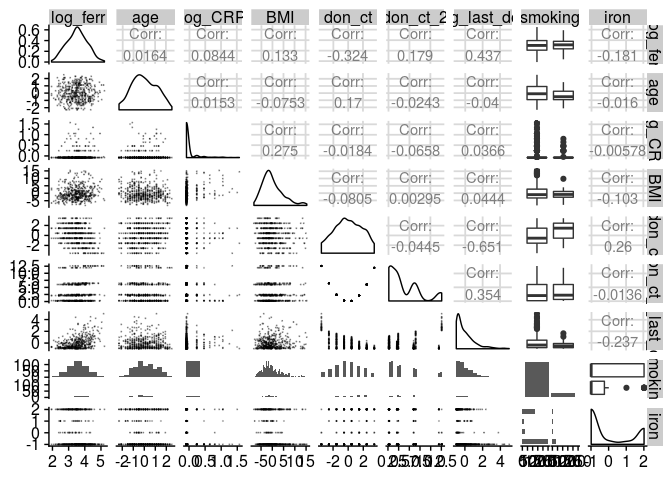

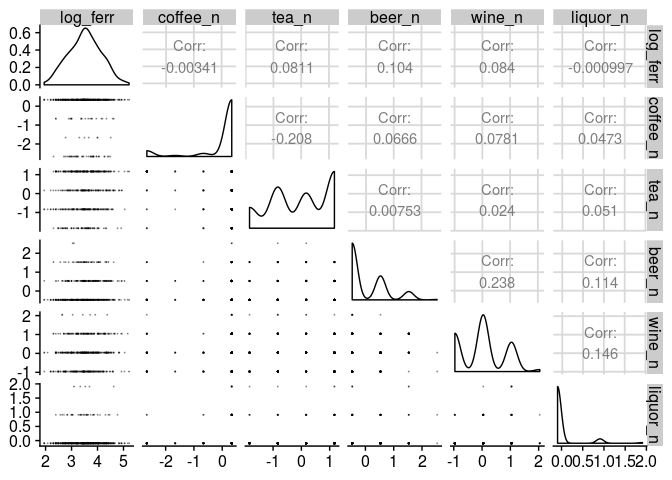

#### OLS

##### Model diagnostics

    ## Warning: Ignoring unknown parameters: shape

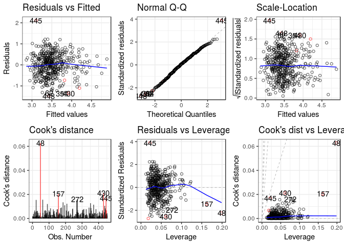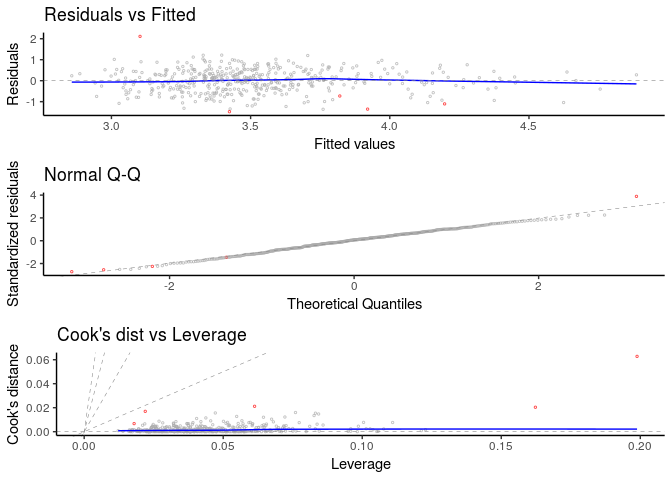

There are 4 observations that are seem to be problematic, so we also run robust regressions.

#### Robust regression model amd p-values

#### Model outputs and interpretation

<table style="text-align:center">
<caption>
<strong>Post-menopausal women</strong>
</caption>
<tr>
<td colspan="3" style="border-bottom: 1px solid black">
</td>
</tr>
<tr>
<td style="text-align:left">
</td>
<td colspan="2">
Ferritin
</td>
</tr>
<tr>
<td>
</td>
<td colspan="2" style="border-bottom: 1px solid black">
</td>
</tr>
<tr>
<td style="text-align:left">
</td>
<td>
Robust
</td>
<td>
OLS
</td>
</tr>
<tr>
<td colspan="3" style="border-bottom: 1px solid black">
</td>
</tr>
<tr>
<td style="text-align:left">
Age
</td>
<td>
0.047
</td>
<td>
0.052
</td>
</tr>
<tr>
<td style="text-align:left">
</td>
<td>
p = 0.071
</td>
<td>
p = 0.038
</td>
</tr>
<tr>
<td style="text-align:left">
BMI
</td>
<td>
0.018
</td>
<td>
0.015
</td>
</tr>
<tr>
<td style="text-align:left">
</td>
<td>
p = 0.005
</td>
<td>
p = 0.015
</td>
</tr>
<tr>
<td style="text-align:left">
CRP
</td>
<td>
0.062
</td>
<td>
0.066
</td>
</tr>
<tr>
<td style="text-align:left">
</td>
<td>
p = 0.600
</td>
<td>
p = 0.558
</td>
</tr>
<tr>
<td style="text-align:left">
Smoking(yes)
</td>
<td>
0.077
</td>
<td>
0.069
</td>
</tr>
<tr>
<td style="text-align:left">
</td>
<td>
p = 0.275
</td>
<td>
p = 0.310
</td>
</tr>
<tr>
<td style="text-align:left">
Pregnancy(Yes)
</td>
<td>
-0.004
</td>
<td>
0.003
</td>
</tr>
<tr>
<td style="text-align:left">
</td>
<td>
p = 0.929
</td>
<td>
p = 0.954
</td>
</tr>
<tr>
<td style="text-align:left">
Nb donations (2 years)
</td>
<td>
-0.034
</td>
<td>
-0.039
</td>
</tr>
<tr>
<td style="text-align:left">
</td>
<td>
p = 0.105
</td>
<td>
p = 0.054
</td>
</tr>
<tr>
<td style="text-align:left">
(Nb donations (2 years))²
</td>
<td>
0.006
</td>
<td>
0.008
</td>
</tr>
<tr>
<td style="text-align:left">
</td>
<td>
p = 0.449
</td>
<td>
p = 0.313
</td>
</tr>
<tr>
<td style="text-align:left">
Days since last donation
</td>
<td>
0.231
</td>
<td>
0.214
</td>
</tr>
<tr>
<td style="text-align:left">
</td>
<td>
p = 0.000
</td>
<td>
p = 0.00000
</td>
</tr>
<tr>
<td style="text-align:left">
iron supplementation
</td>
<td>
-0.017
</td>
<td>
-0.013
</td>
</tr>
<tr>
<td style="text-align:left">
</td>
<td>
p = 0.448
</td>
<td>
p = 0.532
</td>
</tr>
<tr>
<td style="text-align:left">
Red meat
</td>
<td>
0.113
</td>
<td>
0.105
</td>
</tr>
<tr>
<td style="text-align:left">
</td>
<td>
p = 0.006
</td>
<td>
p = 0.008
</td>
</tr>
<tr>
<td style="text-align:left">
Vegetables
</td>
<td>
0.025
</td>
<td>
0.033
</td>
</tr>
<tr>
<td style="text-align:left">
</td>
<td>
p = 0.736
</td>
<td>
p = 0.647
</td>
</tr>
<tr>
<td style="text-align:left">
Fruit and Berries
</td>
<td>
-0.142
</td>
<td>
-0.123
</td>
</tr>
<tr>
<td style="text-align:left">
</td>
<td>
p = 0.033
</td>
<td>
p = 0.054
</td>
</tr>
<tr>
<td style="text-align:left">
Milk
</td>
<td>
-0.039
</td>
<td>
-0.034
</td>
</tr>
<tr>
<td style="text-align:left">
</td>
<td>
p = 0.266
</td>
<td>
p = 0.317
</td>
</tr>
<tr>
<td style="text-align:left">
Fruit Juices
</td>
<td>
-0.001
</td>
<td>
0.004
</td>
</tr>
<tr>
<td style="text-align:left">
</td>
<td>
p = 0.959
</td>
<td>
p = 0.890
</td>
</tr>
<tr>
<td style="text-align:left">
Coffee
</td>
<td>
-0.003
</td>
<td>
-0.006
</td>
</tr>
<tr>
<td style="text-align:left">
</td>
<td>
p = 0.915
</td>
<td>
p = 0.840
</td>
</tr>
<tr>
<td style="text-align:left">
Tea
</td>
<td>
0.043
</td>
<td>
0.041
</td>
</tr>
<tr>
<td style="text-align:left">
</td>
<td>
p = 0.112
</td>
<td>
p = 0.111
</td>
</tr>
<tr>
<td style="text-align:left">
Beer
</td>
<td>
0.084
</td>
<td>
0.079
</td>
</tr>
<tr>
<td style="text-align:left">
</td>
<td>
p = 0.045
</td>
<td>
p = 0.050
</td>
</tr>
<tr>
<td style="text-align:left">
Wine
</td>
<td>
0.080
</td>
<td>
0.079
</td>
</tr>
<tr>
<td style="text-align:left">
</td>
<td>
p = 0.033
</td>
<td>
p = 0.029
</td>
</tr>
<tr>
<td style="text-align:left">
Liquor
</td>
<td>
-0.071
</td>
<td>
-0.090
</td>
</tr>
<tr>
<td style="text-align:left">
</td>
<td>
p = 0.410
</td>
<td>
p = 0.276
</td>
</tr>
<tr>
<td colspan="3" style="border-bottom: 1px solid black">
</td>
</tr>
<tr>
<td style="text-align:left">
Observations
</td>
<td>
452
</td>
<td>
452
</td>
</tr>
<tr>
<td style="text-align:left">
R2
</td>
<td>
</td>
<td>
0.267
</td>
</tr>
<tr>
<td style="text-align:left">
Adjusted R2
</td>
<td>
</td>
<td>
0.235
</td>
</tr>
<tr>
<td style="text-align:left">
Residual Std. Error (df = 432)
</td>
<td>
0.530
</td>
<td>
0.549
</td>
</tr>
<tr>
<td style="text-align:left">
F Statistic
</td>
<td>
</td>
<td>
8.279\*\*\* (df = 19; 432)
</td>
</tr>
<tr>
<td colspan="3" style="border-bottom: 1px solid black">
</td>
</tr>
<tr>
<td style="text-align:left">
<em>Note:</em>
</td>
<td colspan="2" style="text-align:right">
*p&lt;0.05; **p&lt;0.01; ***p&lt;0.001
</td>
</tr>
</table>
Results from robust and OLS regressions differ slightly. In both models, ferritin levels are positively correlated with BMI, nb of days since last donation, and wine consumption (which would not survive multiple correction).

-   A doubling of the number of days since the last donation is associated with a 26 % increase in Ferritin levels.

#### Relative importance

    ## Warning in rev(variances[[p]]) - variances[[p + 1]]: Recycling array of length 1 in vector-array arithmetic is deprecated.
    ##   Use c() or as.vector() instead.

    ## Warning in rev(variances[[p]]) - variances[[p + 1]]: Recycling array of length 1 in vector-array arithmetic is deprecated.
    ##   Use c() or as.vector() instead.

    ## Warning in rev(variances[[p]]) - variances[[p + 1]]: Recycling array of length 1 in vector-array arithmetic is deprecated.
    ##   Use c() or as.vector() instead.

    ## Warning in rev(variances[[p]]) - variances[[p + 1]]: Recycling array of length 1 in vector-array arithmetic is deprecated.
    ##   Use c() or as.vector() instead.

    ## Warning in rev(variances[[p]]) - variances[[p + 1]]: Recycling array of length 1 in vector-array arithmetic is deprecated.
    ##   Use c() or as.vector() instead.

    ## Warning in rev(variances[[p]]) - variances[[p + 1]]: Recycling array of length 1 in vector-array arithmetic is deprecated.
    ##   Use c() or as.vector() instead.

    ## Warning in rev(variances[[p]]) - variances[[p + 1]]: Recycling array of length 1 in vector-array arithmetic is deprecated.
    ##   Use c() or as.vector() instead.

    ## Warning in rev(variances[[p]]) - variances[[p + 1]]: Recycling array of length 1 in vector-array arithmetic is deprecated.
    ##   Use c() or as.vector() instead.

    ## Warning in rev(variances[[p]]) - variances[[p + 1]]: Recycling array of length 1 in vector-array arithmetic is deprecated.
    ##   Use c() or as.vector() instead.

    ## Warning in rev(variances[[p]]) - variances[[p + 1]]: Recycling array of length 1 in vector-array arithmetic is deprecated.
    ##   Use c() or as.vector() instead.

    ## Warning in rev(variances[[p]]) - variances[[p + 1]]: Recycling array of length 1 in vector-array arithmetic is deprecated.
    ##   Use c() or as.vector() instead.

    ## Warning in rev(variances[[p]]) - variances[[p + 1]]: Recycling array of length 1 in vector-array arithmetic is deprecated.
    ##   Use c() or as.vector() instead.

    ## Warning in rev(variances[[p]]) - variances[[p + 1]]: Recycling array of length 1 in vector-array arithmetic is deprecated.
    ##   Use c() or as.vector() instead.

    ## Warning in rev(variances[[p]]) - variances[[p + 1]]: Recycling array of length 1 in vector-array arithmetic is deprecated.
    ##   Use c() or as.vector() instead.

    ## Warning in rev(variances[[p]]) - variances[[p + 1]]: Recycling array of length 1 in vector-array arithmetic is deprecated.
    ##   Use c() or as.vector() instead.

    ## Warning in rev(variances[[p]]) - variances[[p + 1]]: Recycling array of length 1 in vector-array arithmetic is deprecated.
    ##   Use c() or as.vector() instead.

    ## Warning in rev(variances[[p]]) - variances[[p + 1]]: Recycling array of length 1 in vector-array arithmetic is deprecated.
    ##   Use c() or as.vector() instead.

    ## Warning in rev(variances[[p]]) - variances[[p + 1]]: Recycling array of length 1 in vector-array arithmetic is deprecated.
    ##   Use c() or as.vector() instead.

    ## Warning in rev(variances[[p]]) - variances[[p + 1]]: Recycling array of length 1 in vector-array arithmetic is deprecated.
    ##   Use c() or as.vector() instead.

    ## Warning in rev(variances[[p]]) - variances[[p + 1]]: Recycling array of length 1 in vector-array arithmetic is deprecated.
    ##   Use c() or as.vector() instead.

    ## Warning in rev(variances[[p]]) - variances[[p + 1]]: Recycling array of length 1 in vector-array arithmetic is deprecated.
    ##   Use c() or as.vector() instead.

    ## Warning in rev(variances[[p]]) - variances[[p + 1]]: Recycling array of length 1 in vector-array arithmetic is deprecated.
    ##   Use c() or as.vector() instead.

    ## Warning in rev(variances[[p]]) - variances[[p + 1]]: Recycling array of length 1 in vector-array arithmetic is deprecated.
    ##   Use c() or as.vector() instead.

    ## Warning in rev(variances[[p]]) - variances[[p + 1]]: Recycling array of length 1 in vector-array arithmetic is deprecated.
    ##   Use c() or as.vector() instead.

    ## Warning in rev(variances[[p]]) - variances[[p + 1]]: Recycling array of length 1 in vector-array arithmetic is deprecated.
    ##   Use c() or as.vector() instead.

    ## Warning in rev(variances[[p]]) - variances[[p + 1]]: Recycling array of length 1 in vector-array arithmetic is deprecated.
    ##   Use c() or as.vector() instead.

    ## Warning in rev(variances[[p]]) - variances[[p + 1]]: Recycling array of length 1 in vector-array arithmetic is deprecated.
    ##   Use c() or as.vector() instead.

    ## Warning in rev(variances[[p]]) - variances[[p + 1]]: Recycling array of length 1 in vector-array arithmetic is deprecated.
    ##   Use c() or as.vector() instead.

    ## Warning in rev(variances[[p]]) - variances[[p + 1]]: Recycling array of length 1 in vector-array arithmetic is deprecated.
    ##   Use c() or as.vector() instead.

    ## Warning in rev(variances[[p]]) - variances[[p + 1]]: Recycling array of length 1 in vector-array arithmetic is deprecated.
    ##   Use c() or as.vector() instead.

    ## Warning in rev(variances[[p]]) - variances[[p + 1]]: Recycling array of length 1 in vector-array arithmetic is deprecated.
    ##   Use c() or as.vector() instead.

    ## Warning in rev(variances[[p]]) - variances[[p + 1]]: Recycling array of length 1 in vector-array arithmetic is deprecated.
    ##   Use c() or as.vector() instead.

    ## Warning in rev(variances[[p]]) - variances[[p + 1]]: Recycling array of length 1 in vector-array arithmetic is deprecated.
    ##   Use c() or as.vector() instead.

    ## Warning in rev(variances[[p]]) - variances[[p + 1]]: Recycling array of length 1 in vector-array arithmetic is deprecated.
    ##   Use c() or as.vector() instead.

    ## Warning in rev(variances[[p]]) - variances[[p + 1]]: Recycling array of length 1 in vector-array arithmetic is deprecated.
    ##   Use c() or as.vector() instead.

    ## Warning in rev(variances[[p]]) - variances[[p + 1]]: Recycling array of length 1 in vector-array arithmetic is deprecated.
    ##   Use c() or as.vector() instead.

    ## Warning in rev(variances[[p]]) - variances[[p + 1]]: Recycling array of length 1 in vector-array arithmetic is deprecated.
    ##   Use c() or as.vector() instead.

    ## Warning in rev(variances[[p]]) - variances[[p + 1]]: Recycling array of length 1 in vector-array arithmetic is deprecated.
    ##   Use c() or as.vector() instead.

    ## Warning in rev(variances[[p]]) - variances[[p + 1]]: Recycling array of length 1 in vector-array arithmetic is deprecated.
    ##   Use c() or as.vector() instead.

    ## Warning in rev(variances[[p]]) - variances[[p + 1]]: Recycling array of length 1 in vector-array arithmetic is deprecated.
    ##   Use c() or as.vector() instead.

    ## Warning in rev(variances[[p]]) - variances[[p + 1]]: Recycling array of length 1 in vector-array arithmetic is deprecated.
    ##   Use c() or as.vector() instead.

    ## Warning in rev(variances[[p]]) - variances[[p + 1]]: Recycling array of length 1 in vector-array arithmetic is deprecated.
    ##   Use c() or as.vector() instead.

    ## Warning in rev(variances[[p]]) - variances[[p + 1]]: Recycling array of length 1 in vector-array arithmetic is deprecated.
    ##   Use c() or as.vector() instead.

    ## Warning in rev(variances[[p]]) - variances[[p + 1]]: Recycling array of length 1 in vector-array arithmetic is deprecated.
    ##   Use c() or as.vector() instead.

    ## Warning in rev(variances[[p]]) - variances[[p + 1]]: Recycling array of length 1 in vector-array arithmetic is deprecated.
    ##   Use c() or as.vector() instead.

    ## Warning in rev(variances[[p]]) - variances[[p + 1]]: Recycling array of length 1 in vector-array arithmetic is deprecated.
    ##   Use c() or as.vector() instead.

    ## Warning in rev(variances[[p]]) - variances[[p + 1]]: Recycling array of length 1 in vector-array arithmetic is deprecated.
    ##   Use c() or as.vector() instead.

    ## Warning in rev(variances[[p]]) - variances[[p + 1]]: Recycling array of length 1 in vector-array arithmetic is deprecated.
    ##   Use c() or as.vector() instead.

    ## Warning in rev(variances[[p]]) - variances[[p + 1]]: Recycling array of length 1 in vector-array arithmetic is deprecated.
    ##   Use c() or as.vector() instead.

    ## Warning in rev(variances[[p]]) - variances[[p + 1]]: Recycling array of length 1 in vector-array arithmetic is deprecated.
    ##   Use c() or as.vector() instead.

    ## Warning in rev(variances[[p]]) - variances[[p + 1]]: Recycling array of length 1 in vector-array arithmetic is deprecated.
    ##   Use c() or as.vector() instead.

    ## Warning in rev(variances[[p]]) - variances[[p + 1]]: Recycling array of length 1 in vector-array arithmetic is deprecated.
    ##   Use c() or as.vector() instead.

    ## Warning in rev(variances[[p]]) - variances[[p + 1]]: Recycling array of length 1 in vector-array arithmetic is deprecated.
    ##   Use c() or as.vector() instead.

    ## Warning in rev(variances[[p]]) - variances[[p + 1]]: Recycling array of length 1 in vector-array arithmetic is deprecated.
    ##   Use c() or as.vector() instead.

    ## Warning in rev(variances[[p]]) - variances[[p + 1]]: Recycling array of length 1 in vector-array arithmetic is deprecated.
    ##   Use c() or as.vector() instead.

    ## Warning in rev(variances[[p]]) - variances[[p + 1]]: Recycling array of length 1 in vector-array arithmetic is deprecated.
    ##   Use c() or as.vector() instead.

    ## Warning in rev(variances[[p]]) - variances[[p + 1]]: Recycling array of length 1 in vector-array arithmetic is deprecated.
    ##   Use c() or as.vector() instead.

    ## Warning in rev(variances[[p]]) - variances[[p + 1]]: Recycling array of length 1 in vector-array arithmetic is deprecated.
    ##   Use c() or as.vector() instead.

    ## Warning in rev(variances[[p]]) - variances[[p + 1]]: Recycling array of length 1 in vector-array arithmetic is deprecated.
    ##   Use c() or as.vector() instead.

    ## Warning in rev(variances[[p]]) - variances[[p + 1]]: Recycling array of length 1 in vector-array arithmetic is deprecated.
    ##   Use c() or as.vector() instead.

    ## Warning in rev(variances[[p]]) - variances[[p + 1]]: Recycling array of length 1 in vector-array arithmetic is deprecated.
    ##   Use c() or as.vector() instead.

    ## Warning in rev(variances[[p]]) - variances[[p + 1]]: Recycling array of length 1 in vector-array arithmetic is deprecated.
    ##   Use c() or as.vector() instead.

    ## Warning in rev(variances[[p]]) - variances[[p + 1]]: Recycling array of length 1 in vector-array arithmetic is deprecated.
    ##   Use c() or as.vector() instead.

    ## Warning in rev(variances[[p]]) - variances[[p + 1]]: Recycling array of length 1 in vector-array arithmetic is deprecated.
    ##   Use c() or as.vector() instead.

    ## Warning in rev(variances[[p]]) - variances[[p + 1]]: Recycling array of length 1 in vector-array arithmetic is deprecated.
    ##   Use c() or as.vector() instead.

    ## Warning in rev(variances[[p]]) - variances[[p + 1]]: Recycling array of length 1 in vector-array arithmetic is deprecated.
    ##   Use c() or as.vector() instead.

    ## Warning in rev(variances[[p]]) - variances[[p + 1]]: Recycling array of length 1 in vector-array arithmetic is deprecated.
    ##   Use c() or as.vector() instead.

    ## Warning in rev(variances[[p]]) - variances[[p + 1]]: Recycling array of length 1 in vector-array arithmetic is deprecated.
    ##   Use c() or as.vector() instead.

    ## Warning in rev(variances[[p]]) - variances[[p + 1]]: Recycling array of length 1 in vector-array arithmetic is deprecated.
    ##   Use c() or as.vector() instead.

    ## Warning in rev(variances[[p]]) - variances[[p + 1]]: Recycling array of length 1 in vector-array arithmetic is deprecated.
    ##   Use c() or as.vector() instead.

    ## Warning in rev(variances[[p]]) - variances[[p + 1]]: Recycling array of length 1 in vector-array arithmetic is deprecated.
    ##   Use c() or as.vector() instead.

    ## Warning in rev(variances[[p]]) - variances[[p + 1]]: Recycling array of length 1 in vector-array arithmetic is deprecated.
    ##   Use c() or as.vector() instead.

    ## Warning in rev(variances[[p]]) - variances[[p + 1]]: Recycling array of length 1 in vector-array arithmetic is deprecated.
    ##   Use c() or as.vector() instead.

    ## Warning in rev(variances[[p]]) - variances[[p + 1]]: Recycling array of length 1 in vector-array arithmetic is deprecated.
    ##   Use c() or as.vector() instead.

    ## Warning in rev(variances[[p]]) - variances[[p + 1]]: Recycling array of length 1 in vector-array arithmetic is deprecated.
    ##   Use c() or as.vector() instead.

    ## Warning in rev(variances[[p]]) - variances[[p + 1]]: Recycling array of length 1 in vector-array arithmetic is deprecated.
    ##   Use c() or as.vector() instead.

    ## Warning in rev(variances[[p]]) - variances[[p + 1]]: Recycling array of length 1 in vector-array arithmetic is deprecated.
    ##   Use c() or as.vector() instead.

    ## Warning in rev(variances[[p]]) - variances[[p + 1]]: Recycling array of length 1 in vector-array arithmetic is deprecated.
    ##   Use c() or as.vector() instead.

    ## Warning in rev(variances[[p]]) - variances[[p + 1]]: Recycling array of length 1 in vector-array arithmetic is deprecated.
    ##   Use c() or as.vector() instead.

    ## Warning in rev(variances[[p]]) - variances[[p + 1]]: Recycling array of length 1 in vector-array arithmetic is deprecated.
    ##   Use c() or as.vector() instead.

    ## Warning in rev(variances[[p]]) - variances[[p + 1]]: Recycling array of length 1 in vector-array arithmetic is deprecated.
    ##   Use c() or as.vector() instead.

    ## Warning in rev(variances[[p]]) - variances[[p + 1]]: Recycling array of length 1 in vector-array arithmetic is deprecated.
    ##   Use c() or as.vector() instead.

    ## Warning in rev(variances[[p]]) - variances[[p + 1]]: Recycling array of length 1 in vector-array arithmetic is deprecated.
    ##   Use c() or as.vector() instead.

    ## Warning in rev(variances[[p]]) - variances[[p + 1]]: Recycling array of length 1 in vector-array arithmetic is deprecated.
    ##   Use c() or as.vector() instead.

    ## Warning in rev(variances[[p]]) - variances[[p + 1]]: Recycling array of length 1 in vector-array arithmetic is deprecated.
    ##   Use c() or as.vector() instead.

    ## Warning in rev(variances[[p]]) - variances[[p + 1]]: Recycling array of length 1 in vector-array arithmetic is deprecated.
    ##   Use c() or as.vector() instead.

    ## Warning in rev(variances[[p]]) - variances[[p + 1]]: Recycling array of length 1 in vector-array arithmetic is deprecated.
    ##   Use c() or as.vector() instead.

    ## Warning in rev(variances[[p]]) - variances[[p + 1]]: Recycling array of length 1 in vector-array arithmetic is deprecated.
    ##   Use c() or as.vector() instead.

    ## Warning in rev(variances[[p]]) - variances[[p + 1]]: Recycling array of length 1 in vector-array arithmetic is deprecated.
    ##   Use c() or as.vector() instead.

    ## Warning in rev(variances[[p]]) - variances[[p + 1]]: Recycling array of length 1 in vector-array arithmetic is deprecated.
    ##   Use c() or as.vector() instead.

    ## Warning in rev(variances[[p]]) - variances[[p + 1]]: Recycling array of length 1 in vector-array arithmetic is deprecated.
    ##   Use c() or as.vector() instead.

    ## Warning in rev(variances[[p]]) - variances[[p + 1]]: Recycling array of length 1 in vector-array arithmetic is deprecated.
    ##   Use c() or as.vector() instead.

    ## Warning in rev(variances[[p]]) - variances[[p + 1]]: Recycling array of length 1 in vector-array arithmetic is deprecated.
    ##   Use c() or as.vector() instead.

    ## Warning in rev(variances[[p]]) - variances[[p + 1]]: Recycling array of length 1 in vector-array arithmetic is deprecated.
    ##   Use c() or as.vector() instead.

    ## Warning in rev(variances[[p]]) - variances[[p + 1]]: Recycling array of length 1 in vector-array arithmetic is deprecated.
    ##   Use c() or as.vector() instead.

    ## Warning in rev(variances[[p]]) - variances[[p + 1]]: Recycling array of length 1 in vector-array arithmetic is deprecated.
    ##   Use c() or as.vector() instead.

    ## Warning in rev(variances[[p]]) - variances[[p + 1]]: Recycling array of length 1 in vector-array arithmetic is deprecated.
    ##   Use c() or as.vector() instead.

    ## Warning in rev(variances[[p]]) - variances[[p + 1]]: Recycling array of length 1 in vector-array arithmetic is deprecated.
    ##   Use c() or as.vector() instead.

    ## Warning in rev(variances[[p]]) - variances[[p + 1]]: Recycling array of length 1 in vector-array arithmetic is deprecated.
    ##   Use c() or as.vector() instead.

    ## Warning in rev(variances[[p]]) - variances[[p + 1]]: Recycling array of length 1 in vector-array arithmetic is deprecated.
    ##   Use c() or as.vector() instead.

    ## Warning in rev(variances[[p]]) - variances[[p + 1]]: Recycling array of length 1 in vector-array arithmetic is deprecated.
    ##   Use c() or as.vector() instead.

    ## Warning in rev(variances[[p]]) - variances[[p + 1]]: Recycling array of length 1 in vector-array arithmetic is deprecated.
    ##   Use c() or as.vector() instead.

    ## Warning in rev(variances[[p]]) - variances[[p + 1]]: Recycling array of length 1 in vector-array arithmetic is deprecated.
    ##   Use c() or as.vector() instead.

    ## Warning in rev(variances[[p]]) - variances[[p + 1]]: Recycling array of length 1 in vector-array arithmetic is deprecated.
    ##   Use c() or as.vector() instead.

    ## Warning in rev(variances[[p]]) - variances[[p + 1]]: Recycling array of length 1 in vector-array arithmetic is deprecated.
    ##   Use c() or as.vector() instead.

    ## Warning in rev(variances[[p]]) - variances[[p + 1]]: Recycling array of length 1 in vector-array arithmetic is deprecated.
    ##   Use c() or as.vector() instead.

    ## Warning in rev(variances[[p]]) - variances[[p + 1]]: Recycling array of length 1 in vector-array arithmetic is deprecated.
    ##   Use c() or as.vector() instead.

    ## Warning in rev(variances[[p]]) - variances[[p + 1]]: Recycling array of length 1 in vector-array arithmetic is deprecated.
    ##   Use c() or as.vector() instead.

    ## Warning in rev(variances[[p]]) - variances[[p + 1]]: Recycling array of length 1 in vector-array arithmetic is deprecated.
    ##   Use c() or as.vector() instead.

    ## Warning in rev(variances[[p]]) - variances[[p + 1]]: Recycling array of length 1 in vector-array arithmetic is deprecated.
    ##   Use c() or as.vector() instead.

    ## Warning in rev(variances[[p]]) - variances[[p + 1]]: Recycling array of length 1 in vector-array arithmetic is deprecated.
    ##   Use c() or as.vector() instead.

    ## Warning in rev(variances[[p]]) - variances[[p + 1]]: Recycling array of length 1 in vector-array arithmetic is deprecated.
    ##   Use c() or as.vector() instead.

    ## Warning in rev(variances[[p]]) - variances[[p + 1]]: Recycling array of length 1 in vector-array arithmetic is deprecated.
    ##   Use c() or as.vector() instead.

    ## Warning in rev(variances[[p]]) - variances[[p + 1]]: Recycling array of length 1 in vector-array arithmetic is deprecated.
    ##   Use c() or as.vector() instead.

    ## Warning in rev(variances[[p]]) - variances[[p + 1]]: Recycling array of length 1 in vector-array arithmetic is deprecated.
    ##   Use c() or as.vector() instead.

    ## Warning in rev(variances[[p]]) - variances[[p + 1]]: Recycling array of length 1 in vector-array arithmetic is deprecated.
    ##   Use c() or as.vector() instead.

    ## Warning in rev(variances[[p]]) - variances[[p + 1]]: Recycling array of length 1 in vector-array arithmetic is deprecated.
    ##   Use c() or as.vector() instead.

    ## Warning in rev(variances[[p]]) - variances[[p + 1]]: Recycling array of length 1 in vector-array arithmetic is deprecated.
    ##   Use c() or as.vector() instead.

    ## Warning in rev(variances[[p]]) - variances[[p + 1]]: Recycling array of length 1 in vector-array arithmetic is deprecated.
    ##   Use c() or as.vector() instead.

    ## Warning in rev(variances[[p]]) - variances[[p + 1]]: Recycling array of length 1 in vector-array arithmetic is deprecated.
    ##   Use c() or as.vector() instead.

    ## Warning in rev(variances[[p]]) - variances[[p + 1]]: Recycling array of length 1 in vector-array arithmetic is deprecated.
    ##   Use c() or as.vector() instead.

    ## Warning in rev(variances[[p]]) - variances[[p + 1]]: Recycling array of length 1 in vector-array arithmetic is deprecated.
    ##   Use c() or as.vector() instead.

    ## Warning in rev(variances[[p]]) - variances[[p + 1]]: Recycling array of length 1 in vector-array arithmetic is deprecated.
    ##   Use c() or as.vector() instead.

    ## Warning in rev(variances[[p]]) - variances[[p + 1]]: Recycling array of length 1 in vector-array arithmetic is deprecated.
    ##   Use c() or as.vector() instead.

    ## Warning in rev(variances[[p]]) - variances[[p + 1]]: Recycling array of length 1 in vector-array arithmetic is deprecated.
    ##   Use c() or as.vector() instead.

    ## Warning in rev(variances[[p]]) - variances[[p + 1]]: Recycling array of length 1 in vector-array arithmetic is deprecated.
    ##   Use c() or as.vector() instead.

    ## Warning in rev(variances[[p]]) - variances[[p + 1]]: Recycling array of length 1 in vector-array arithmetic is deprecated.
    ##   Use c() or as.vector() instead.

    ## Warning in rev(variances[[p]]) - variances[[p + 1]]: Recycling array of length 1 in vector-array arithmetic is deprecated.
    ##   Use c() or as.vector() instead.

    ## Warning in rev(variances[[p]]) - variances[[p + 1]]: Recycling array of length 1 in vector-array arithmetic is deprecated.
    ##   Use c() or as.vector() instead.

    ## Warning in rev(variances[[p]]) - variances[[p + 1]]: Recycling array of length 1 in vector-array arithmetic is deprecated.
    ##   Use c() or as.vector() instead.

    ## Warning in rev(variances[[p]]) - variances[[p + 1]]: Recycling array of length 1 in vector-array arithmetic is deprecated.
    ##   Use c() or as.vector() instead.

    ## Warning in rev(variances[[p]]) - variances[[p + 1]]: Recycling array of length 1 in vector-array arithmetic is deprecated.
    ##   Use c() or as.vector() instead.

    ## Warning in rev(variances[[p]]) - variances[[p + 1]]: Recycling array of length 1 in vector-array arithmetic is deprecated.
    ##   Use c() or as.vector() instead.

    ## Warning in rev(variances[[p]]) - variances[[p + 1]]: Recycling array of length 1 in vector-array arithmetic is deprecated.
    ##   Use c() or as.vector() instead.

    ## Warning in rev(variances[[p]]) - variances[[p + 1]]: Recycling array of length 1 in vector-array arithmetic is deprecated.
    ##   Use c() or as.vector() instead.

    ## Warning in rev(variances[[p]]) - variances[[p + 1]]: Recycling array of length 1 in vector-array arithmetic is deprecated.
    ##   Use c() or as.vector() instead.

    ## Warning in rev(variances[[p]]) - variances[[p + 1]]: Recycling array of length 1 in vector-array arithmetic is deprecated.
    ##   Use c() or as.vector() instead.

    ## Warning in rev(variances[[p]]) - variances[[p + 1]]: Recycling array of length 1 in vector-array arithmetic is deprecated.
    ##   Use c() or as.vector() instead.

    ## Warning in rev(variances[[p]]) - variances[[p + 1]]: Recycling array of length 1 in vector-array arithmetic is deprecated.
    ##   Use c() or as.vector() instead.

    ## Warning in rev(variances[[p]]) - variances[[p + 1]]: Recycling array of length 1 in vector-array arithmetic is deprecated.
    ##   Use c() or as.vector() instead.

    ## Warning in rev(variances[[p]]) - variances[[p + 1]]: Recycling array of length 1 in vector-array arithmetic is deprecated.
    ##   Use c() or as.vector() instead.

    ## Warning in rev(variances[[p]]) - variances[[p + 1]]: Recycling array of length 1 in vector-array arithmetic is deprecated.
    ##   Use c() or as.vector() instead.

    ## Warning in rev(variances[[p]]) - variances[[p + 1]]: Recycling array of length 1 in vector-array arithmetic is deprecated.
    ##   Use c() or as.vector() instead.

    ## Warning in rev(variances[[p]]) - variances[[p + 1]]: Recycling array of length 1 in vector-array arithmetic is deprecated.
    ##   Use c() or as.vector() instead.

    ## Warning in rev(variances[[p]]) - variances[[p + 1]]: Recycling array of length 1 in vector-array arithmetic is deprecated.
    ##   Use c() or as.vector() instead.

    ## Warning in rev(variances[[p]]) - variances[[p + 1]]: Recycling array of length 1 in vector-array arithmetic is deprecated.
    ##   Use c() or as.vector() instead.

    ## Warning in rev(variances[[p]]) - variances[[p + 1]]: Recycling array of length 1 in vector-array arithmetic is deprecated.
    ##   Use c() or as.vector() instead.

    ## Warning in rev(variances[[p]]) - variances[[p + 1]]: Recycling array of length 1 in vector-array arithmetic is deprecated.
    ##   Use c() or as.vector() instead.

    ## Warning in rev(variances[[p]]) - variances[[p + 1]]: Recycling array of length 1 in vector-array arithmetic is deprecated.
    ##   Use c() or as.vector() instead.

    ## Warning in rev(variances[[p]]) - variances[[p + 1]]: Recycling array of length 1 in vector-array arithmetic is deprecated.
    ##   Use c() or as.vector() instead.

    ## Warning in rev(variances[[p]]) - variances[[p + 1]]: Recycling array of length 1 in vector-array arithmetic is deprecated.
    ##   Use c() or as.vector() instead.

    ## Warning in rev(variances[[p]]) - variances[[p + 1]]: Recycling array of length 1 in vector-array arithmetic is deprecated.
    ##   Use c() or as.vector() instead.

    ## Warning in rev(variances[[p]]) - variances[[p + 1]]: Recycling array of length 1 in vector-array arithmetic is deprecated.
    ##   Use c() or as.vector() instead.

    ## Warning in rev(variances[[p]]) - variances[[p + 1]]: Recycling array of length 1 in vector-array arithmetic is deprecated.
    ##   Use c() or as.vector() instead.

    ## Warning in rev(variances[[p]]) - variances[[p + 1]]: Recycling array of length 1 in vector-array arithmetic is deprecated.
    ##   Use c() or as.vector() instead.

    ## Warning in rev(variances[[p]]) - variances[[p + 1]]: Recycling array of length 1 in vector-array arithmetic is deprecated.
    ##   Use c() or as.vector() instead.

    ## Warning in rev(variances[[p]]) - variances[[p + 1]]: Recycling array of length 1 in vector-array arithmetic is deprecated.
    ##   Use c() or as.vector() instead.

    ## Warning in rev(variances[[p]]) - variances[[p + 1]]: Recycling array of length 1 in vector-array arithmetic is deprecated.
    ##   Use c() or as.vector() instead.

    ## Warning in rev(variances[[p]]) - variances[[p + 1]]: Recycling array of length 1 in vector-array arithmetic is deprecated.
    ##   Use c() or as.vector() instead.

    ## Warning in rev(variances[[p]]) - variances[[p + 1]]: Recycling array of length 1 in vector-array arithmetic is deprecated.
    ##   Use c() or as.vector() instead.

    ## Warning in rev(variances[[p]]) - variances[[p + 1]]: Recycling array of length 1 in vector-array arithmetic is deprecated.
    ##   Use c() or as.vector() instead.

    ## Warning in rev(variances[[p]]) - variances[[p + 1]]: Recycling array of length 1 in vector-array arithmetic is deprecated.
    ##   Use c() or as.vector() instead.

    ## Warning in rev(variances[[p]]) - variances[[p + 1]]: Recycling array of length 1 in vector-array arithmetic is deprecated.
    ##   Use c() or as.vector() instead.

    ## Warning in rev(variances[[p]]) - variances[[p + 1]]: Recycling array of length 1 in vector-array arithmetic is deprecated.
    ##   Use c() or as.vector() instead.

    ## Warning in rev(variances[[p]]) - variances[[p + 1]]: Recycling array of length 1 in vector-array arithmetic is deprecated.
    ##   Use c() or as.vector() instead.

    ## Warning in rev(variances[[p]]) - variances[[p + 1]]: Recycling array of length 1 in vector-array arithmetic is deprecated.
    ##   Use c() or as.vector() instead.

    ## Warning in rev(variances[[p]]) - variances[[p + 1]]: Recycling array of length 1 in vector-array arithmetic is deprecated.
    ##   Use c() or as.vector() instead.

    ## Warning in rev(variances[[p]]) - variances[[p + 1]]: Recycling array of length 1 in vector-array arithmetic is deprecated.
    ##   Use c() or as.vector() instead.

    ## Warning in rev(variances[[p]]) - variances[[p + 1]]: Recycling array of length 1 in vector-array arithmetic is deprecated.
    ##   Use c() or as.vector() instead.

    ## Warning in rev(variances[[p]]) - variances[[p + 1]]: Recycling array of length 1 in vector-array arithmetic is deprecated.
    ##   Use c() or as.vector() instead.

    ## Warning in rev(variances[[p]]) - variances[[p + 1]]: Recycling array of length 1 in vector-array arithmetic is deprecated.
    ##   Use c() or as.vector() instead.

    ## Warning in rev(variances[[p]]) - variances[[p + 1]]: Recycling array of length 1 in vector-array arithmetic is deprecated.
    ##   Use c() or as.vector() instead.

    ## Warning in rev(variances[[p]]) - variances[[p + 1]]: Recycling array of length 1 in vector-array arithmetic is deprecated.
    ##   Use c() or as.vector() instead.

    ## Warning in rev(variances[[p]]) - variances[[p + 1]]: Recycling array of length 1 in vector-array arithmetic is deprecated.
    ##   Use c() or as.vector() instead.

    ## Warning in rev(variances[[p]]) - variances[[p + 1]]: Recycling array of length 1 in vector-array arithmetic is deprecated.
    ##   Use c() or as.vector() instead.

    ## Warning in rev(variances[[p]]) - variances[[p + 1]]: Recycling array of length 1 in vector-array arithmetic is deprecated.
    ##   Use c() or as.vector() instead.

    ## Warning in rev(variances[[p]]) - variances[[p + 1]]: Recycling array of length 1 in vector-array arithmetic is deprecated.
    ##   Use c() or as.vector() instead.

    ## Warning in rev(variances[[p]]) - variances[[p + 1]]: Recycling array of length 1 in vector-array arithmetic is deprecated.
    ##   Use c() or as.vector() instead.

    ## Warning in rev(variances[[p]]) - variances[[p + 1]]: Recycling array of length 1 in vector-array arithmetic is deprecated.
    ##   Use c() or as.vector() instead.

    ## Warning in rev(variances[[p]]) - variances[[p + 1]]: Recycling array of length 1 in vector-array arithmetic is deprecated.
    ##   Use c() or as.vector() instead.

    ## Warning in rev(variances[[p]]) - variances[[p + 1]]: Recycling array of length 1 in vector-array arithmetic is deprecated.
    ##   Use c() or as.vector() instead.

    ## Warning in rev(variances[[p]]) - variances[[p + 1]]: Recycling array of length 1 in vector-array arithmetic is deprecated.
    ##   Use c() or as.vector() instead.

    ## Warning in rev(variances[[p]]) - variances[[p + 1]]: Recycling array of length 1 in vector-array arithmetic is deprecated.
    ##   Use c() or as.vector() instead.

    ## Warning in rev(variances[[p]]) - variances[[p + 1]]: Recycling array of length 1 in vector-array arithmetic is deprecated.
    ##   Use c() or as.vector() instead.

    ## Warning in rev(variances[[p]]) - variances[[p + 1]]: Recycling array of length 1 in vector-array arithmetic is deprecated.
    ##   Use c() or as.vector() instead.

    ## Warning in rev(variances[[p]]) - variances[[p + 1]]: Recycling array of length 1 in vector-array arithmetic is deprecated.
    ##   Use c() or as.vector() instead.

    ## Warning in rev(variances[[p]]) - variances[[p + 1]]: Recycling array of length 1 in vector-array arithmetic is deprecated.
    ##   Use c() or as.vector() instead.

    ## Warning in rev(variances[[p]]) - variances[[p + 1]]: Recycling array of length 1 in vector-array arithmetic is deprecated.
    ##   Use c() or as.vector() instead.

    ## Warning in rev(variances[[p]]) - variances[[p + 1]]: Recycling array of length 1 in vector-array arithmetic is deprecated.
    ##   Use c() or as.vector() instead.

    ## Warning in rev(variances[[p]]) - variances[[p + 1]]: Recycling array of length 1 in vector-array arithmetic is deprecated.
    ##   Use c() or as.vector() instead.

    ## Warning in rev(variances[[p]]) - variances[[p + 1]]: Recycling array of length 1 in vector-array arithmetic is deprecated.
    ##   Use c() or as.vector() instead.

    ## Warning in rev(variances[[p]]) - variances[[p + 1]]: Recycling array of length 1 in vector-array arithmetic is deprecated.
    ##   Use c() or as.vector() instead.

    ## Warning in rev(variances[[p]]) - variances[[p + 1]]: Recycling array of length 1 in vector-array arithmetic is deprecated.
    ##   Use c() or as.vector() instead.

    ## Warning in rev(variances[[p]]) - variances[[p + 1]]: Recycling array of length 1 in vector-array arithmetic is deprecated.
    ##   Use c() or as.vector() instead.

    ## Warning in rev(variances[[p]]) - variances[[p + 1]]: Recycling array of length 1 in vector-array arithmetic is deprecated.
    ##   Use c() or as.vector() instead.

    ## Warning in rev(variances[[p]]) - variances[[p + 1]]: Recycling array of length 1 in vector-array arithmetic is deprecated.
    ##   Use c() or as.vector() instead.

    ## Warning in rev(variances[[p]]) - variances[[p + 1]]: Recycling array of length 1 in vector-array arithmetic is deprecated.
    ##   Use c() or as.vector() instead.

    ## Warning in rev(variances[[p]]) - variances[[p + 1]]: Recycling array of length 1 in vector-array arithmetic is deprecated.
    ##   Use c() or as.vector() instead.

    ## Warning in rev(variances[[p]]) - variances[[p + 1]]: Recycling array of length 1 in vector-array arithmetic is deprecated.
    ##   Use c() or as.vector() instead.

    ## Warning in rev(variances[[p]]) - variances[[p + 1]]: Recycling array of length 1 in vector-array arithmetic is deprecated.
    ##   Use c() or as.vector() instead.

    ## Warning in rev(variances[[p]]) - variances[[p + 1]]: Recycling array of length 1 in vector-array arithmetic is deprecated.
    ##   Use c() or as.vector() instead.

    ## Warning in rev(variances[[p]]) - variances[[p + 1]]: Recycling array of length 1 in vector-array arithmetic is deprecated.
    ##   Use c() or as.vector() instead.

    ## Warning in rev(variances[[p]]) - variances[[p + 1]]: Recycling array of length 1 in vector-array arithmetic is deprecated.
    ##   Use c() or as.vector() instead.

    ## Warning in rev(variances[[p]]) - variances[[p + 1]]: Recycling array of length 1 in vector-array arithmetic is deprecated.
    ##   Use c() or as.vector() instead.

    ## Warning in rev(variances[[p]]) - variances[[p + 1]]: Recycling array of length 1 in vector-array arithmetic is deprecated.
    ##   Use c() or as.vector() instead.

    ## Warning in rev(variances[[p]]) - variances[[p + 1]]: Recycling array of length 1 in vector-array arithmetic is deprecated.
    ##   Use c() or as.vector() instead.

    ## Warning in rev(variances[[p]]) - variances[[p + 1]]: Recycling array of length 1 in vector-array arithmetic is deprecated.
    ##   Use c() or as.vector() instead.

    ## Warning in rev(variances[[p]]) - variances[[p + 1]]: Recycling array of length 1 in vector-array arithmetic is deprecated.
    ##   Use c() or as.vector() instead.

    ## Warning in rev(variances[[p]]) - variances[[p + 1]]: Recycling array of length 1 in vector-array arithmetic is deprecated.
    ##   Use c() or as.vector() instead.

    ## Warning in rev(variances[[p]]) - variances[[p + 1]]: Recycling array of length 1 in vector-array arithmetic is deprecated.
    ##   Use c() or as.vector() instead.

    ## Warning in rev(variances[[p]]) - variances[[p + 1]]: Recycling array of length 1 in vector-array arithmetic is deprecated.
    ##   Use c() or as.vector() instead.

    ## Warning in rev(variances[[p]]) - variances[[p + 1]]: Recycling array of length 1 in vector-array arithmetic is deprecated.
    ##   Use c() or as.vector() instead.

    ## Warning in rev(variances[[p]]) - variances[[p + 1]]: Recycling array of length 1 in vector-array arithmetic is deprecated.
    ##   Use c() or as.vector() instead.

    ## Warning in rev(variances[[p]]) - variances[[p + 1]]: Recycling array of length 1 in vector-array arithmetic is deprecated.
    ##   Use c() or as.vector() instead.

    ## Warning in rev(variances[[p]]) - variances[[p + 1]]: Recycling array of length 1 in vector-array arithmetic is deprecated.
    ##   Use c() or as.vector() instead.

    ## Warning in rev(variances[[p]]) - variances[[p + 1]]: Recycling array of length 1 in vector-array arithmetic is deprecated.
    ##   Use c() or as.vector() instead.

    ## Warning in rev(variances[[p]]) - variances[[p + 1]]: Recycling array of length 1 in vector-array arithmetic is deprecated.
    ##   Use c() or as.vector() instead.

    ## Warning in rev(variances[[p]]) - variances[[p + 1]]: Recycling array of length 1 in vector-array arithmetic is deprecated.
    ##   Use c() or as.vector() instead.

    ## Warning in rev(variances[[p]]) - variances[[p + 1]]: Recycling array of length 1 in vector-array arithmetic is deprecated.
    ##   Use c() or as.vector() instead.

    ## Warning in rev(variances[[p]]) - variances[[p + 1]]: Recycling array of length 1 in vector-array arithmetic is deprecated.
    ##   Use c() or as.vector() instead.

    ## Warning in rev(variances[[p]]) - variances[[p + 1]]: Recycling array of length 1 in vector-array arithmetic is deprecated.
    ##   Use c() or as.vector() instead.

    ## Warning in rev(variances[[p]]) - variances[[p + 1]]: Recycling array of length 1 in vector-array arithmetic is deprecated.
    ##   Use c() or as.vector() instead.

    ## Warning in rev(variances[[p]]) - variances[[p + 1]]: Recycling array of length 1 in vector-array arithmetic is deprecated.
    ##   Use c() or as.vector() instead.

    ## Warning in rev(variances[[p]]) - variances[[p + 1]]: Recycling array of length 1 in vector-array arithmetic is deprecated.
    ##   Use c() or as.vector() instead.

    ## Warning in rev(variances[[p]]) - variances[[p + 1]]: Recycling array of length 1 in vector-array arithmetic is deprecated.
    ##   Use c() or as.vector() instead.

    ## Warning in rev(variances[[p]]) - variances[[p + 1]]: Recycling array of length 1 in vector-array arithmetic is deprecated.
    ##   Use c() or as.vector() instead.

    ## Warning in rev(variances[[p]]) - variances[[p + 1]]: Recycling array of length 1 in vector-array arithmetic is deprecated.
    ##   Use c() or as.vector() instead.

    ## Warning in rev(variances[[p]]) - variances[[p + 1]]: Recycling array of length 1 in vector-array arithmetic is deprecated.
    ##   Use c() or as.vector() instead.

    ## Warning in rev(variances[[p]]) - variances[[p + 1]]: Recycling array of length 1 in vector-array arithmetic is deprecated.
    ##   Use c() or as.vector() instead.

    ## Warning in rev(variances[[p]]) - variances[[p + 1]]: Recycling array of length 1 in vector-array arithmetic is deprecated.
    ##   Use c() or as.vector() instead.

    ## Warning in rev(variances[[p]]) - variances[[p + 1]]: Recycling array of length 1 in vector-array arithmetic is deprecated.
    ##   Use c() or as.vector() instead.

    ## Warning in rev(variances[[p]]) - variances[[p + 1]]: Recycling array of length 1 in vector-array arithmetic is deprecated.
    ##   Use c() or as.vector() instead.

    ## Warning in rev(variances[[p]]) - variances[[p + 1]]: Recycling array of length 1 in vector-array arithmetic is deprecated.
    ##   Use c() or as.vector() instead.

    ## Warning in rev(variances[[p]]) - variances[[p + 1]]: Recycling array of length 1 in vector-array arithmetic is deprecated.
    ##   Use c() or as.vector() instead.

    ## Warning in rev(variances[[p]]) - variances[[p + 1]]: Recycling array of length 1 in vector-array arithmetic is deprecated.
    ##   Use c() or as.vector() instead.

    ## Warning in rev(variances[[p]]) - variances[[p + 1]]: Recycling array of length 1 in vector-array arithmetic is deprecated.
    ##   Use c() or as.vector() instead.

    ## Warning in rev(variances[[p]]) - variances[[p + 1]]: Recycling array of length 1 in vector-array arithmetic is deprecated.
    ##   Use c() or as.vector() instead.

    ## Warning in rev(variances[[p]]) - variances[[p + 1]]: Recycling array of length 1 in vector-array arithmetic is deprecated.
    ##   Use c() or as.vector() instead.

    ## Warning in rev(variances[[p]]) - variances[[p + 1]]: Recycling array of length 1 in vector-array arithmetic is deprecated.
    ##   Use c() or as.vector() instead.

    ## Warning in rev(variances[[p]]) - variances[[p + 1]]: Recycling array of length 1 in vector-array arithmetic is deprecated.
    ##   Use c() or as.vector() instead.

    ## Warning in rev(variances[[p]]) - variances[[p + 1]]: Recycling array of length 1 in vector-array arithmetic is deprecated.
    ##   Use c() or as.vector() instead.

    ## Warning in rev(variances[[p]]) - variances[[p + 1]]: Recycling array of length 1 in vector-array arithmetic is deprecated.
    ##   Use c() or as.vector() instead.

    ## Warning in rev(variances[[p]]) - variances[[p + 1]]: Recycling array of length 1 in vector-array arithmetic is deprecated.
    ##   Use c() or as.vector() instead.

    ## Warning in rev(variances[[p]]) - variances[[p + 1]]: Recycling array of length 1 in vector-array arithmetic is deprecated.
    ##   Use c() or as.vector() instead.

    ## Warning in rev(variances[[p]]) - variances[[p + 1]]: Recycling array of length 1 in vector-array arithmetic is deprecated.
    ##   Use c() or as.vector() instead.

    ## Warning in rev(variances[[p]]) - variances[[p + 1]]: Recycling array of length 1 in vector-array arithmetic is deprecated.
    ##   Use c() or as.vector() instead.

    ## Warning in rev(variances[[p]]) - variances[[p + 1]]: Recycling array of length 1 in vector-array arithmetic is deprecated.
    ##   Use c() or as.vector() instead.

    ## Warning in rev(variances[[p]]) - variances[[p + 1]]: Recycling array of length 1 in vector-array arithmetic is deprecated.
    ##   Use c() or as.vector() instead.

    ## Warning in rev(variances[[p]]) - variances[[p + 1]]: Recycling array of length 1 in vector-array arithmetic is deprecated.
    ##   Use c() or as.vector() instead.

    ## Warning in rev(variances[[p]]) - variances[[p + 1]]: Recycling array of length 1 in vector-array arithmetic is deprecated.
    ##   Use c() or as.vector() instead.

    ## Warning in rev(variances[[p]]) - variances[[p + 1]]: Recycling array of length 1 in vector-array arithmetic is deprecated.
    ##   Use c() or as.vector() instead.

    ## Warning in rev(variances[[p]]) - variances[[p + 1]]: Recycling array of length 1 in vector-array arithmetic is deprecated.
    ##   Use c() or as.vector() instead.

    ## Warning in rev(variances[[p]]) - variances[[p + 1]]: Recycling array of length 1 in vector-array arithmetic is deprecated.
    ##   Use c() or as.vector() instead.

    ## Warning in rev(variances[[p]]) - variances[[p + 1]]: Recycling array of length 1 in vector-array arithmetic is deprecated.
    ##   Use c() or as.vector() instead.

    ## Warning in rev(variances[[p]]) - variances[[p + 1]]: Recycling array of length 1 in vector-array arithmetic is deprecated.
    ##   Use c() or as.vector() instead.

    ## Warning in rev(variances[[p]]) - variances[[p + 1]]: Recycling array of length 1 in vector-array arithmetic is deprecated.
    ##   Use c() or as.vector() instead.

    ## Warning in rev(variances[[p]]) - variances[[p + 1]]: Recycling array of length 1 in vector-array arithmetic is deprecated.
    ##   Use c() or as.vector() instead.

    ## Warning in rev(variances[[p]]) - variances[[p + 1]]: Recycling array of length 1 in vector-array arithmetic is deprecated.
    ##   Use c() or as.vector() instead.

    ## Warning in rev(variances[[p]]) - variances[[p + 1]]: Recycling array of length 1 in vector-array arithmetic is deprecated.
    ##   Use c() or as.vector() instead.

    ## Warning in rev(variances[[p]]) - variances[[p + 1]]: Recycling array of length 1 in vector-array arithmetic is deprecated.
    ##   Use c() or as.vector() instead.

    ## Warning in rev(variances[[p]]) - variances[[p + 1]]: Recycling array of length 1 in vector-array arithmetic is deprecated.
    ##   Use c() or as.vector() instead.

    ## Warning in rev(variances[[p]]) - variances[[p + 1]]: Recycling array of length 1 in vector-array arithmetic is deprecated.
    ##   Use c() or as.vector() instead.

    ## Warning in rev(variances[[p]]) - variances[[p + 1]]: Recycling array of length 1 in vector-array arithmetic is deprecated.
    ##   Use c() or as.vector() instead.

    ## Warning in rev(variances[[p]]) - variances[[p + 1]]: Recycling array of length 1 in vector-array arithmetic is deprecated.
    ##   Use c() or as.vector() instead.

    ## Warning in rev(variances[[p]]) - variances[[p + 1]]: Recycling array of length 1 in vector-array arithmetic is deprecated.
    ##   Use c() or as.vector() instead.

    ## Warning in rev(variances[[p]]) - variances[[p + 1]]: Recycling array of length 1 in vector-array arithmetic is deprecated.
    ##   Use c() or as.vector() instead.

    ## Warning in rev(variances[[p]]) - variances[[p + 1]]: Recycling array of length 1 in vector-array arithmetic is deprecated.
    ##   Use c() or as.vector() instead.

    ## Warning in rev(variances[[p]]) - variances[[p + 1]]: Recycling array of length 1 in vector-array arithmetic is deprecated.
    ##   Use c() or as.vector() instead.

    ## Warning in rev(variances[[p]]) - variances[[p + 1]]: Recycling array of length 1 in vector-array arithmetic is deprecated.
    ##   Use c() or as.vector() instead.

    ## Warning in rev(variances[[p]]) - variances[[p + 1]]: Recycling array of length 1 in vector-array arithmetic is deprecated.
    ##   Use c() or as.vector() instead.

    ## Warning in rev(variances[[p]]) - variances[[p + 1]]: Recycling array of length 1 in vector-array arithmetic is deprecated.
    ##   Use c() or as.vector() instead.

    ## Warning in rev(variances[[p]]) - variances[[p + 1]]: Recycling array of length 1 in vector-array arithmetic is deprecated.
    ##   Use c() or as.vector() instead.

    ## Warning in rev(variances[[p]]) - variances[[p + 1]]: Recycling array of length 1 in vector-array arithmetic is deprecated.
    ##   Use c() or as.vector() instead.

    ## Warning in rev(variances[[p]]) - variances[[p + 1]]: Recycling array of length 1 in vector-array arithmetic is deprecated.
    ##   Use c() or as.vector() instead.

    ## Warning in rev(variances[[p]]) - variances[[p + 1]]: Recycling array of length 1 in vector-array arithmetic is deprecated.
    ##   Use c() or as.vector() instead.

    ## Warning in rev(variances[[p]]) - variances[[p + 1]]: Recycling array of length 1 in vector-array arithmetic is deprecated.
    ##   Use c() or as.vector() instead.

    ## Warning in rev(variances[[p]]) - variances[[p + 1]]: Recycling array of length 1 in vector-array arithmetic is deprecated.
    ##   Use c() or as.vector() instead.

    ## Warning in rev(variances[[p]]) - variances[[p + 1]]: Recycling array of length 1 in vector-array arithmetic is deprecated.
    ##   Use c() or as.vector() instead.

    ## Warning in rev(variances[[p]]) - variances[[p + 1]]: Recycling array of length 1 in vector-array arithmetic is deprecated.
    ##   Use c() or as.vector() instead.

    ## Warning in rev(variances[[p]]) - variances[[p + 1]]: Recycling array of length 1 in vector-array arithmetic is deprecated.
    ##   Use c() or as.vector() instead.

    ## Warning in rev(variances[[p]]) - variances[[p + 1]]: Recycling array of length 1 in vector-array arithmetic is deprecated.
    ##   Use c() or as.vector() instead.

    ## Warning in rev(variances[[p]]) - variances[[p + 1]]: Recycling array of length 1 in vector-array arithmetic is deprecated.
    ##   Use c() or as.vector() instead.

    ## Warning in rev(variances[[p]]) - variances[[p + 1]]: Recycling array of length 1 in vector-array arithmetic is deprecated.
    ##   Use c() or as.vector() instead.

    ## Warning in rev(variances[[p]]) - variances[[p + 1]]: Recycling array of length 1 in vector-array arithmetic is deprecated.
    ##   Use c() or as.vector() instead.

    ## Warning in rev(variances[[p]]) - variances[[p + 1]]: Recycling array of length 1 in vector-array arithmetic is deprecated.
    ##   Use c() or as.vector() instead.

    ## Warning in rev(variances[[p]]) - variances[[p + 1]]: Recycling array of length 1 in vector-array arithmetic is deprecated.
    ##   Use c() or as.vector() instead.

    ## Warning in rev(variances[[p]]) - variances[[p + 1]]: Recycling array of length 1 in vector-array arithmetic is deprecated.
    ##   Use c() or as.vector() instead.

    ## Warning in rev(variances[[p]]) - variances[[p + 1]]: Recycling array of length 1 in vector-array arithmetic is deprecated.
    ##   Use c() or as.vector() instead.

    ## Warning in rev(variances[[p]]) - variances[[p + 1]]: Recycling array of length 1 in vector-array arithmetic is deprecated.
    ##   Use c() or as.vector() instead.

    ## Warning in rev(variances[[p]]) - variances[[p + 1]]: Recycling array of length 1 in vector-array arithmetic is deprecated.
    ##   Use c() or as.vector() instead.

    ## Warning in rev(variances[[p]]) - variances[[p + 1]]: Recycling array of length 1 in vector-array arithmetic is deprecated.
    ##   Use c() or as.vector() instead.

    ## Warning in rev(variances[[p]]) - variances[[p + 1]]: Recycling array of length 1 in vector-array arithmetic is deprecated.
    ##   Use c() or as.vector() instead.

    ## Warning in rev(variances[[p]]) - variances[[p + 1]]: Recycling array of length 1 in vector-array arithmetic is deprecated.
    ##   Use c() or as.vector() instead.

    ## Warning in rev(variances[[p]]) - variances[[p + 1]]: Recycling array of length 1 in vector-array arithmetic is deprecated.
    ##   Use c() or as.vector() instead.

    ## Warning in rev(variances[[p]]) - variances[[p + 1]]: Recycling array of length 1 in vector-array arithmetic is deprecated.
    ##   Use c() or as.vector() instead.

    ## Warning in rev(variances[[p]]) - variances[[p + 1]]: Recycling array of length 1 in vector-array arithmetic is deprecated.
    ##   Use c() or as.vector() instead.

    ## Warning in rev(variances[[p]]) - variances[[p + 1]]: Recycling array of length 1 in vector-array arithmetic is deprecated.
    ##   Use c() or as.vector() instead.

    ## Warning in rev(variances[[p]]) - variances[[p + 1]]: Recycling array of length 1 in vector-array arithmetic is deprecated.
    ##   Use c() or as.vector() instead.

    ## Warning in rev(variances[[p]]) - variances[[p + 1]]: Recycling array of length 1 in vector-array arithmetic is deprecated.
    ##   Use c() or as.vector() instead.

    ## Warning in rev(variances[[p]]) - variances[[p + 1]]: Recycling array of length 1 in vector-array arithmetic is deprecated.
    ##   Use c() or as.vector() instead.

    ## Warning in rev(variances[[p]]) - variances[[p + 1]]: Recycling array of length 1 in vector-array arithmetic is deprecated.
    ##   Use c() or as.vector() instead.

    ## Warning in rev(variances[[p]]) - variances[[p + 1]]: Recycling array of length 1 in vector-array arithmetic is deprecated.
    ##   Use c() or as.vector() instead.

    ## Warning in rev(variances[[p]]) - variances[[p + 1]]: Recycling array of length 1 in vector-array arithmetic is deprecated.
    ##   Use c() or as.vector() instead.

    ## Warning in rev(variances[[p]]) - variances[[p + 1]]: Recycling array of length 1 in vector-array arithmetic is deprecated.
    ##   Use c() or as.vector() instead.

    ## Warning in rev(variances[[p]]) - variances[[p + 1]]: Recycling array of length 1 in vector-array arithmetic is deprecated.
    ##   Use c() or as.vector() instead.

    ## Warning in rev(variances[[p]]) - variances[[p + 1]]: Recycling array of length 1 in vector-array arithmetic is deprecated.
    ##   Use c() or as.vector() instead.

    ## Warning in rev(variances[[p]]) - variances[[p + 1]]: Recycling array of length 1 in vector-array arithmetic is deprecated.
    ##   Use c() or as.vector() instead.

    ## Warning in rev(variances[[p]]) - variances[[p + 1]]: Recycling array of length 1 in vector-array arithmetic is deprecated.
    ##   Use c() or as.vector() instead.

    ## Warning in rev(variances[[p]]) - variances[[p + 1]]: Recycling array of length 1 in vector-array arithmetic is deprecated.
    ##   Use c() or as.vector() instead.

    ## Warning in rev(variances[[p]]) - variances[[p + 1]]: Recycling array of length 1 in vector-array arithmetic is deprecated.
    ##   Use c() or as.vector() instead.

    ## Warning in rev(variances[[p]]) - variances[[p + 1]]: Recycling array of length 1 in vector-array arithmetic is deprecated.
    ##   Use c() or as.vector() instead.

    ## Warning in rev(variances[[p]]) - variances[[p + 1]]: Recycling array of length 1 in vector-array arithmetic is deprecated.
    ##   Use c() or as.vector() instead.

    ## Warning in rev(variances[[p]]) - variances[[p + 1]]: Recycling array of length 1 in vector-array arithmetic is deprecated.
    ##   Use c() or as.vector() instead.

    ## Warning in rev(variances[[p]]) - variances[[p + 1]]: Recycling array of length 1 in vector-array arithmetic is deprecated.
    ##   Use c() or as.vector() instead.

    ## Warning in rev(variances[[p]]) - variances[[p + 1]]: Recycling array of length 1 in vector-array arithmetic is deprecated.
    ##   Use c() or as.vector() instead.

    ## Warning in rev(variances[[p]]) - variances[[p + 1]]: Recycling array of length 1 in vector-array arithmetic is deprecated.
    ##   Use c() or as.vector() instead.

    ## Warning in rev(variances[[p]]) - variances[[p + 1]]: Recycling array of length 1 in vector-array arithmetic is deprecated.
    ##   Use c() or as.vector() instead.

    ## Warning in rev(variances[[p]]) - variances[[p + 1]]: Recycling array of length 1 in vector-array arithmetic is deprecated.
    ##   Use c() or as.vector() instead.

    ## Warning in rev(variances[[p]]) - variances[[p + 1]]: Recycling array of length 1 in vector-array arithmetic is deprecated.
    ##   Use c() or as.vector() instead.

    ## Warning in rev(variances[[p]]) - variances[[p + 1]]: Recycling array of length 1 in vector-array arithmetic is deprecated.
    ##   Use c() or as.vector() instead.

    ## Warning in rev(variances[[p]]) - variances[[p + 1]]: Recycling array of length 1 in vector-array arithmetic is deprecated.
    ##   Use c() or as.vector() instead.

    ## Warning in rev(variances[[p]]) - variances[[p + 1]]: Recycling array of length 1 in vector-array arithmetic is deprecated.
    ##   Use c() or as.vector() instead.

    ## Warning in rev(variances[[p]]) - variances[[p + 1]]: Recycling array of length 1 in vector-array arithmetic is deprecated.
    ##   Use c() or as.vector() instead.

    ## Warning in rev(variances[[p]]) - variances[[p + 1]]: Recycling array of length 1 in vector-array arithmetic is deprecated.
    ##   Use c() or as.vector() instead.

    ## Warning in rev(variances[[p]]) - variances[[p + 1]]: Recycling array of length 1 in vector-array arithmetic is deprecated.
    ##   Use c() or as.vector() instead.

    ## Warning in rev(variances[[p]]) - variances[[p + 1]]: Recycling array of length 1 in vector-array arithmetic is deprecated.
    ##   Use c() or as.vector() instead.

    ## Warning in rev(variances[[p]]) - variances[[p + 1]]: Recycling array of length 1 in vector-array arithmetic is deprecated.
    ##   Use c() or as.vector() instead.

    ## Warning in rev(variances[[p]]) - variances[[p + 1]]: Recycling array of length 1 in vector-array arithmetic is deprecated.
    ##   Use c() or as.vector() instead.

    ## Warning in rev(variances[[p]]) - variances[[p + 1]]: Recycling array of length 1 in vector-array arithmetic is deprecated.
    ##   Use c() or as.vector() instead.

    ## Warning in rev(variances[[p]]) - variances[[p + 1]]: Recycling array of length 1 in vector-array arithmetic is deprecated.
    ##   Use c() or as.vector() instead.

    ## Warning in rev(variances[[p]]) - variances[[p + 1]]: Recycling array of length 1 in vector-array arithmetic is deprecated.
    ##   Use c() or as.vector() instead.

    ## Warning in rev(variances[[p]]) - variances[[p + 1]]: Recycling array of length 1 in vector-array arithmetic is deprecated.
    ##   Use c() or as.vector() instead.

    ## Warning in rev(variances[[p]]) - variances[[p + 1]]: Recycling array of length 1 in vector-array arithmetic is deprecated.
    ##   Use c() or as.vector() instead.

    ## Warning in rev(variances[[p]]) - variances[[p + 1]]: Recycling array of length 1 in vector-array arithmetic is deprecated.
    ##   Use c() or as.vector() instead.

    ## Warning in rev(variances[[p]]) - variances[[p + 1]]: Recycling array of length 1 in vector-array arithmetic is deprecated.
    ##   Use c() or as.vector() instead.

    ## Warning in rev(variances[[p]]) - variances[[p + 1]]: Recycling array of length 1 in vector-array arithmetic is deprecated.
    ##   Use c() or as.vector() instead.

    ## Warning in rev(variances[[p]]) - variances[[p + 1]]: Recycling array of length 1 in vector-array arithmetic is deprecated.
    ##   Use c() or as.vector() instead.

    ## Warning in rev(variances[[p]]) - variances[[p + 1]]: Recycling array of length 1 in vector-array arithmetic is deprecated.
    ##   Use c() or as.vector() instead.

    ## Warning in rev(variances[[p]]) - variances[[p + 1]]: Recycling array of length 1 in vector-array arithmetic is deprecated.
    ##   Use c() or as.vector() instead.

    ## Warning in rev(variances[[p]]) - variances[[p + 1]]: Recycling array of length 1 in vector-array arithmetic is deprecated.
    ##   Use c() or as.vector() instead.

    ## Warning in rev(variances[[p]]) - variances[[p + 1]]: Recycling array of length 1 in vector-array arithmetic is deprecated.
    ##   Use c() or as.vector() instead.

    ## Warning in rev(variances[[p]]) - variances[[p + 1]]: Recycling array of length 1 in vector-array arithmetic is deprecated.
    ##   Use c() or as.vector() instead.

    ## Warning in rev(variances[[p]]) - variances[[p + 1]]: Recycling array of length 1 in vector-array arithmetic is deprecated.
    ##   Use c() or as.vector() instead.

    ## Warning in rev(variances[[p]]) - variances[[p + 1]]: Recycling array of length 1 in vector-array arithmetic is deprecated.
    ##   Use c() or as.vector() instead.

    ## Warning in rev(variances[[p]]) - variances[[p + 1]]: Recycling array of length 1 in vector-array arithmetic is deprecated.
    ##   Use c() or as.vector() instead.

    ## Warning in rev(variances[[p]]) - variances[[p + 1]]: Recycling array of length 1 in vector-array arithmetic is deprecated.
    ##   Use c() or as.vector() instead.

    ## Warning in rev(variances[[p]]) - variances[[p + 1]]: Recycling array of length 1 in vector-array arithmetic is deprecated.
    ##   Use c() or as.vector() instead.

    ## Warning in rev(variances[[p]]) - variances[[p + 1]]: Recycling array of length 1 in vector-array arithmetic is deprecated.
    ##   Use c() or as.vector() instead.

    ## Warning in rev(variances[[p]]) - variances[[p + 1]]: Recycling array of length 1 in vector-array arithmetic is deprecated.
    ##   Use c() or as.vector() instead.

    ## Warning in rev(variances[[p]]) - variances[[p + 1]]: Recycling array of length 1 in vector-array arithmetic is deprecated.
    ##   Use c() or as.vector() instead.

    ## Warning in rev(variances[[p]]) - variances[[p + 1]]: Recycling array of length 1 in vector-array arithmetic is deprecated.
    ##   Use c() or as.vector() instead.

    ## Warning in rev(variances[[p]]) - variances[[p + 1]]: Recycling array of length 1 in vector-array arithmetic is deprecated.
    ##   Use c() or as.vector() instead.

    ## Warning in rev(variances[[p]]) - variances[[p + 1]]: Recycling array of length 1 in vector-array arithmetic is deprecated.
    ##   Use c() or as.vector() instead.

    ## Warning in rev(variances[[p]]) - variances[[p + 1]]: Recycling array of length 1 in vector-array arithmetic is deprecated.
    ##   Use c() or as.vector() instead.

    ## Warning in rev(variances[[p]]) - variances[[p + 1]]: Recycling array of length 1 in vector-array arithmetic is deprecated.
    ##   Use c() or as.vector() instead.

    ## Warning in rev(variances[[p]]) - variances[[p + 1]]: Recycling array of length 1 in vector-array arithmetic is deprecated.
    ##   Use c() or as.vector() instead.

    ## Warning in rev(variances[[p]]) - variances[[p + 1]]: Recycling array of length 1 in vector-array arithmetic is deprecated.
    ##   Use c() or as.vector() instead.

    ## Warning in rev(variances[[p]]) - variances[[p + 1]]: Recycling array of length 1 in vector-array arithmetic is deprecated.
    ##   Use c() or as.vector() instead.

    ## Warning in rev(variances[[p]]) - variances[[p + 1]]: Recycling array of length 1 in vector-array arithmetic is deprecated.
    ##   Use c() or as.vector() instead.

    ## Warning in rev(variances[[p]]) - variances[[p + 1]]: Recycling array of length 1 in vector-array arithmetic is deprecated.
    ##   Use c() or as.vector() instead.

    ## Warning in rev(variances[[p]]) - variances[[p + 1]]: Recycling array of length 1 in vector-array arithmetic is deprecated.
    ##   Use c() or as.vector() instead.

    ## Warning in rev(variances[[p]]) - variances[[p + 1]]: Recycling array of length 1 in vector-array arithmetic is deprecated.
    ##   Use c() or as.vector() instead.

    ## Warning in rev(variances[[p]]) - variances[[p + 1]]: Recycling array of length 1 in vector-array arithmetic is deprecated.
    ##   Use c() or as.vector() instead.

    ## Warning in rev(variances[[p]]) - variances[[p + 1]]: Recycling array of length 1 in vector-array arithmetic is deprecated.
    ##   Use c() or as.vector() instead.

    ## Warning in rev(variances[[p]]) - variances[[p + 1]]: Recycling array of length 1 in vector-array arithmetic is deprecated.
    ##   Use c() or as.vector() instead.

    ## Warning in rev(variances[[p]]) - variances[[p + 1]]: Recycling array of length 1 in vector-array arithmetic is deprecated.
    ##   Use c() or as.vector() instead.

    ## Warning in rev(variances[[p]]) - variances[[p + 1]]: Recycling array of length 1 in vector-array arithmetic is deprecated.
    ##   Use c() or as.vector() instead.

    ## Warning in rev(variances[[p]]) - variances[[p + 1]]: Recycling array of length 1 in vector-array arithmetic is deprecated.
    ##   Use c() or as.vector() instead.

    ## Warning in rev(variances[[p]]) - variances[[p + 1]]: Recycling array of length 1 in vector-array arithmetic is deprecated.
    ##   Use c() or as.vector() instead.

    ## Warning in rev(variances[[p]]) - variances[[p + 1]]: Recycling array of length 1 in vector-array arithmetic is deprecated.
    ##   Use c() or as.vector() instead.

    ## Warning in rev(variances[[p]]) - variances[[p + 1]]: Recycling array of length 1 in vector-array arithmetic is deprecated.
    ##   Use c() or as.vector() instead.

    ## Warning in rev(variances[[p]]) - variances[[p + 1]]: Recycling array of length 1 in vector-array arithmetic is deprecated.
    ##   Use c() or as.vector() instead.

    ## Warning in rev(variances[[p]]) - variances[[p + 1]]: Recycling array of length 1 in vector-array arithmetic is deprecated.
    ##   Use c() or as.vector() instead.

    ## Warning in rev(variances[[p]]) - variances[[p + 1]]: Recycling array of length 1 in vector-array arithmetic is deprecated.
    ##   Use c() or as.vector() instead.

    ## Warning in rev(variances[[p]]) - variances[[p + 1]]: Recycling array of length 1 in vector-array arithmetic is deprecated.
    ##   Use c() or as.vector() instead.

    ## Warning in rev(variances[[p]]) - variances[[p + 1]]: Recycling array of length 1 in vector-array arithmetic is deprecated.
    ##   Use c() or as.vector() instead.

    ## Warning in rev(variances[[p]]) - variances[[p + 1]]: Recycling array of length 1 in vector-array arithmetic is deprecated.
    ##   Use c() or as.vector() instead.

    ## Warning in rev(variances[[p]]) - variances[[p + 1]]: Recycling array of length 1 in vector-array arithmetic is deprecated.
    ##   Use c() or as.vector() instead.

    ## Warning in rev(variances[[p]]) - variances[[p + 1]]: Recycling array of length 1 in vector-array arithmetic is deprecated.
    ##   Use c() or as.vector() instead.

    ## Warning in rev(variances[[p]]) - variances[[p + 1]]: Recycling array of length 1 in vector-array arithmetic is deprecated.
    ##   Use c() or as.vector() instead.

    ## Warning in rev(variances[[p]]) - variances[[p + 1]]: Recycling array of length 1 in vector-array arithmetic is deprecated.
    ##   Use c() or as.vector() instead.

    ## Warning in rev(variances[[p]]) - variances[[p + 1]]: Recycling array of length 1 in vector-array arithmetic is deprecated.
    ##   Use c() or as.vector() instead.

    ## Warning in rev(variances[[p]]) - variances[[p + 1]]: Recycling array of length 1 in vector-array arithmetic is deprecated.
    ##   Use c() or as.vector() instead.

    ## Warning in rev(variances[[p]]) - variances[[p + 1]]: Recycling array of length 1 in vector-array arithmetic is deprecated.
    ##   Use c() or as.vector() instead.

    ## Warning in rev(variances[[p]]) - variances[[p + 1]]: Recycling array of length 1 in vector-array arithmetic is deprecated.
    ##   Use c() or as.vector() instead.

    ## Warning in rev(variances[[p]]) - variances[[p + 1]]: Recycling array of length 1 in vector-array arithmetic is deprecated.
    ##   Use c() or as.vector() instead.

    ## Warning in rev(variances[[p]]) - variances[[p + 1]]: Recycling array of length 1 in vector-array arithmetic is deprecated.
    ##   Use c() or as.vector() instead.

    ## Warning in rev(variances[[p]]) - variances[[p + 1]]: Recycling array of length 1 in vector-array arithmetic is deprecated.
    ##   Use c() or as.vector() instead.

    ## Warning in rev(variances[[p]]) - variances[[p + 1]]: Recycling array of length 1 in vector-array arithmetic is deprecated.
    ##   Use c() or as.vector() instead.

    ## Warning in rev(variances[[p]]) - variances[[p + 1]]: Recycling array of length 1 in vector-array arithmetic is deprecated.
    ##   Use c() or as.vector() instead.

    ## Warning in rev(variances[[p]]) - variances[[p + 1]]: Recycling array of length 1 in vector-array arithmetic is deprecated.
    ##   Use c() or as.vector() instead.

    ## Warning in rev(variances[[p]]) - variances[[p + 1]]: Recycling array of length 1 in vector-array arithmetic is deprecated.
    ##   Use c() or as.vector() instead.

    ## Warning in rev(variances[[p]]) - variances[[p + 1]]: Recycling array of length 1 in vector-array arithmetic is deprecated.
    ##   Use c() or as.vector() instead.

    ## Warning in rev(variances[[p]]) - variances[[p + 1]]: Recycling array of length 1 in vector-array arithmetic is deprecated.
    ##   Use c() or as.vector() instead.

    ## Warning in rev(variances[[p]]) - variances[[p + 1]]: Recycling array of length 1 in vector-array arithmetic is deprecated.
    ##   Use c() or as.vector() instead.

    ## Warning in rev(variances[[p]]) - variances[[p + 1]]: Recycling array of length 1 in vector-array arithmetic is deprecated.
    ##   Use c() or as.vector() instead.

    ## Warning in rev(variances[[p]]) - variances[[p + 1]]: Recycling array of length 1 in vector-array arithmetic is deprecated.
    ##   Use c() or as.vector() instead.

    ## Warning in rev(variances[[p]]) - variances[[p + 1]]: Recycling array of length 1 in vector-array arithmetic is deprecated.
    ##   Use c() or as.vector() instead.

    ## Warning in rev(variances[[p]]) - variances[[p + 1]]: Recycling array of length 1 in vector-array arithmetic is deprecated.
    ##   Use c() or as.vector() instead.

    ## Warning in rev(variances[[p]]) - variances[[p + 1]]: Recycling array of length 1 in vector-array arithmetic is deprecated.
    ##   Use c() or as.vector() instead.

    ## Warning in rev(variances[[p]]) - variances[[p + 1]]: Recycling array of length 1 in vector-array arithmetic is deprecated.
    ##   Use c() or as.vector() instead.

    ## Warning in rev(variances[[p]]) - variances[[p + 1]]: Recycling array of length 1 in vector-array arithmetic is deprecated.
    ##   Use c() or as.vector() instead.

    ## Warning in rev(variances[[p]]) - variances[[p + 1]]: Recycling array of length 1 in vector-array arithmetic is deprecated.
    ##   Use c() or as.vector() instead.

    ## Warning in rev(variances[[p]]) - variances[[p + 1]]: Recycling array of length 1 in vector-array arithmetic is deprecated.
    ##   Use c() or as.vector() instead.

    ## Warning in rev(variances[[p]]) - variances[[p + 1]]: Recycling array of length 1 in vector-array arithmetic is deprecated.
    ##   Use c() or as.vector() instead.

    ## Warning in rev(variances[[p]]) - variances[[p + 1]]: Recycling array of length 1 in vector-array arithmetic is deprecated.
    ##   Use c() or as.vector() instead.

    ## Warning in rev(variances[[p]]) - variances[[p + 1]]: Recycling array of length 1 in vector-array arithmetic is deprecated.
    ##   Use c() or as.vector() instead.

    ## Warning in rev(variances[[p]]) - variances[[p + 1]]: Recycling array of length 1 in vector-array arithmetic is deprecated.
    ##   Use c() or as.vector() instead.

    ## Warning in rev(variances[[p]]) - variances[[p + 1]]: Recycling array of length 1 in vector-array arithmetic is deprecated.
    ##   Use c() or as.vector() instead.

    ## Warning in rev(variances[[p]]) - variances[[p + 1]]: Recycling array of length 1 in vector-array arithmetic is deprecated.
    ##   Use c() or as.vector() instead.

    ## Warning in rev(variances[[p]]) - variances[[p + 1]]: Recycling array of length 1 in vector-array arithmetic is deprecated.
    ##   Use c() or as.vector() instead.

    ## Warning in rev(variances[[p]]) - variances[[p + 1]]: Recycling array of length 1 in vector-array arithmetic is deprecated.
    ##   Use c() or as.vector() instead.

    ## Warning in rev(variances[[p]]) - variances[[p + 1]]: Recycling array of length 1 in vector-array arithmetic is deprecated.
    ##   Use c() or as.vector() instead.

    ## Warning in rev(variances[[p]]) - variances[[p + 1]]: Recycling array of length 1 in vector-array arithmetic is deprecated.
    ##   Use c() or as.vector() instead.

    ## Warning in rev(variances[[p]]) - variances[[p + 1]]: Recycling array of length 1 in vector-array arithmetic is deprecated.
    ##   Use c() or as.vector() instead.

    ## Warning in rev(variances[[p]]) - variances[[p + 1]]: Recycling array of length 1 in vector-array arithmetic is deprecated.
    ##   Use c() or as.vector() instead.

    ## Warning in rev(variances[[p]]) - variances[[p + 1]]: Recycling array of length 1 in vector-array arithmetic is deprecated.
    ##   Use c() or as.vector() instead.

    ## Warning in rev(variances[[p]]) - variances[[p + 1]]: Recycling array of length 1 in vector-array arithmetic is deprecated.
    ##   Use c() or as.vector() instead.

    ## Warning in rev(variances[[p]]) - variances[[p + 1]]: Recycling array of length 1 in vector-array arithmetic is deprecated.
    ##   Use c() or as.vector() instead.

    ## Warning in rev(variances[[p]]) - variances[[p + 1]]: Recycling array of length 1 in vector-array arithmetic is deprecated.
    ##   Use c() or as.vector() instead.

    ## Warning in rev(variances[[p]]) - variances[[p + 1]]: Recycling array of length 1 in vector-array arithmetic is deprecated.
    ##   Use c() or as.vector() instead.

    ## Warning in rev(variances[[p]]) - variances[[p + 1]]: Recycling array of length 1 in vector-array arithmetic is deprecated.
    ##   Use c() or as.vector() instead.

    ## Warning in rev(variances[[p]]) - variances[[p + 1]]: Recycling array of length 1 in vector-array arithmetic is deprecated.
    ##   Use c() or as.vector() instead.

    ## Warning in rev(variances[[p]]) - variances[[p + 1]]: Recycling array of length 1 in vector-array arithmetic is deprecated.
    ##   Use c() or as.vector() instead.

    ## Warning in rev(variances[[p]]) - variances[[p + 1]]: Recycling array of length 1 in vector-array arithmetic is deprecated.
    ##   Use c() or as.vector() instead.

    ## Warning in rev(variances[[p]]) - variances[[p + 1]]: Recycling array of length 1 in vector-array arithmetic is deprecated.
    ##   Use c() or as.vector() instead.

    ## Warning in rev(variances[[p]]) - variances[[p + 1]]: Recycling array of length 1 in vector-array arithmetic is deprecated.
    ##   Use c() or as.vector() instead.

    ## Warning in rev(variances[[p]]) - variances[[p + 1]]: Recycling array of length 1 in vector-array arithmetic is deprecated.
    ##   Use c() or as.vector() instead.

    ## Warning in rev(variances[[p]]) - variances[[p + 1]]: Recycling array of length 1 in vector-array arithmetic is deprecated.
    ##   Use c() or as.vector() instead.

    ## Warning in rev(variances[[p]]) - variances[[p + 1]]: Recycling array of length 1 in vector-array arithmetic is deprecated.
    ##   Use c() or as.vector() instead.

    ## Warning in rev(variances[[p]]) - variances[[p + 1]]: Recycling array of length 1 in vector-array arithmetic is deprecated.
    ##   Use c() or as.vector() instead.

    ## Warning in rev(variances[[p]]) - variances[[p + 1]]: Recycling array of length 1 in vector-array arithmetic is deprecated.
    ##   Use c() or as.vector() instead.

    ## Warning in rev(variances[[p]]) - variances[[p + 1]]: Recycling array of length 1 in vector-array arithmetic is deprecated.
    ##   Use c() or as.vector() instead.

    ## Warning in rev(variances[[p]]) - variances[[p + 1]]: Recycling array of length 1 in vector-array arithmetic is deprecated.
    ##   Use c() or as.vector() instead.

    ## Warning in rev(variances[[p]]) - variances[[p + 1]]: Recycling array of length 1 in vector-array arithmetic is deprecated.
    ##   Use c() or as.vector() instead.

    ## Warning in rev(variances[[p]]) - variances[[p + 1]]: Recycling array of length 1 in vector-array arithmetic is deprecated.
    ##   Use c() or as.vector() instead.

    ## Warning in rev(variances[[p]]) - variances[[p + 1]]: Recycling array of length 1 in vector-array arithmetic is deprecated.
    ##   Use c() or as.vector() instead.

    ## Warning in rev(variances[[p]]) - variances[[p + 1]]: Recycling array of length 1 in vector-array arithmetic is deprecated.
    ##   Use c() or as.vector() instead.

    ## Warning in rev(variances[[p]]) - variances[[p + 1]]: Recycling array of length 1 in vector-array arithmetic is deprecated.
    ##   Use c() or as.vector() instead.

    ## Warning in rev(variances[[p]]) - variances[[p + 1]]: Recycling array of length 1 in vector-array arithmetic is deprecated.
    ##   Use c() or as.vector() instead.

    ## Warning in rev(variances[[p]]) - variances[[p + 1]]: Recycling array of length 1 in vector-array arithmetic is deprecated.
    ##   Use c() or as.vector() instead.

    ## Warning in rev(variances[[p]]) - variances[[p + 1]]: Recycling array of length 1 in vector-array arithmetic is deprecated.
    ##   Use c() or as.vector() instead.

    ## Warning in rev(variances[[p]]) - variances[[p + 1]]: Recycling array of length 1 in vector-array arithmetic is deprecated.
    ##   Use c() or as.vector() instead.

    ## Warning in rev(variances[[p]]) - variances[[p + 1]]: Recycling array of length 1 in vector-array arithmetic is deprecated.
    ##   Use c() or as.vector() instead.

    ## Warning in rev(variances[[p]]) - variances[[p + 1]]: Recycling array of length 1 in vector-array arithmetic is deprecated.
    ##   Use c() or as.vector() instead.

    ## Warning in rev(variances[[p]]) - variances[[p + 1]]: Recycling array of length 1 in vector-array arithmetic is deprecated.
    ##   Use c() or as.vector() instead.

    ## Warning in rev(variances[[p]]) - variances[[p + 1]]: Recycling array of length 1 in vector-array arithmetic is deprecated.
    ##   Use c() or as.vector() instead.

    ## Warning in rev(variances[[p]]) - variances[[p + 1]]: Recycling array of length 1 in vector-array arithmetic is deprecated.
    ##   Use c() or as.vector() instead.

    ## Warning in rev(variances[[p]]) - variances[[p + 1]]: Recycling array of length 1 in vector-array arithmetic is deprecated.
    ##   Use c() or as.vector() instead.

    ## Warning in rev(variances[[p]]) - variances[[p + 1]]: Recycling array of length 1 in vector-array arithmetic is deprecated.
    ##   Use c() or as.vector() instead.

    ## Warning in rev(variances[[p]]) - variances[[p + 1]]: Recycling array of length 1 in vector-array arithmetic is deprecated.
    ##   Use c() or as.vector() instead.

    ## Warning in rev(variances[[p]]) - variances[[p + 1]]: Recycling array of length 1 in vector-array arithmetic is deprecated.
    ##   Use c() or as.vector() instead.

    ## Warning in rev(variances[[p]]) - variances[[p + 1]]: Recycling array of length 1 in vector-array arithmetic is deprecated.
    ##   Use c() or as.vector() instead.

    ## Warning in rev(variances[[p]]) - variances[[p + 1]]: Recycling array of length 1 in vector-array arithmetic is deprecated.
    ##   Use c() or as.vector() instead.

    ## Warning in rev(variances[[p]]) - variances[[p + 1]]: Recycling array of length 1 in vector-array arithmetic is deprecated.
    ##   Use c() or as.vector() instead.

    ## Warning in rev(variances[[p]]) - variances[[p + 1]]: Recycling array of length 1 in vector-array arithmetic is deprecated.
    ##   Use c() or as.vector() instead.

    ## Warning in rev(variances[[p]]) - variances[[p + 1]]: Recycling array of length 1 in vector-array arithmetic is deprecated.
    ##   Use c() or as.vector() instead.

    ## Warning in rev(variances[[p]]) - variances[[p + 1]]: Recycling array of length 1 in vector-array arithmetic is deprecated.
    ##   Use c() or as.vector() instead.

    ## Warning in rev(variances[[p]]) - variances[[p + 1]]: Recycling array of length 1 in vector-array arithmetic is deprecated.
    ##   Use c() or as.vector() instead.

    ## Warning in rev(variances[[p]]) - variances[[p + 1]]: Recycling array of length 1 in vector-array arithmetic is deprecated.
    ##   Use c() or as.vector() instead.

    ## Warning in rev(variances[[p]]) - variances[[p + 1]]: Recycling array of length 1 in vector-array arithmetic is deprecated.
    ##   Use c() or as.vector() instead.

    ## Warning in rev(variances[[p]]) - variances[[p + 1]]: Recycling array of length 1 in vector-array arithmetic is deprecated.
    ##   Use c() or as.vector() instead.

    ## Warning in rev(variances[[p]]) - variances[[p + 1]]: Recycling array of length 1 in vector-array arithmetic is deprecated.
    ##   Use c() or as.vector() instead.

    ## Warning in rev(variances[[p]]) - variances[[p + 1]]: Recycling array of length 1 in vector-array arithmetic is deprecated.
    ##   Use c() or as.vector() instead.

    ## Warning in rev(variances[[p]]) - variances[[p + 1]]: Recycling array of length 1 in vector-array arithmetic is deprecated.
    ##   Use c() or as.vector() instead.

    ## Warning in rev(variances[[p]]) - variances[[p + 1]]: Recycling array of length 1 in vector-array arithmetic is deprecated.
    ##   Use c() or as.vector() instead.

    ## Warning in rev(variances[[p]]) - variances[[p + 1]]: Recycling array of length 1 in vector-array arithmetic is deprecated.
    ##   Use c() or as.vector() instead.

    ## Warning in rev(variances[[p]]) - variances[[p + 1]]: Recycling array of length 1 in vector-array arithmetic is deprecated.
    ##   Use c() or as.vector() instead.

    ## Warning in rev(variances[[p]]) - variances[[p + 1]]: Recycling array of length 1 in vector-array arithmetic is deprecated.
    ##   Use c() or as.vector() instead.

    ## Warning in rev(variances[[p]]) - variances[[p + 1]]: Recycling array of length 1 in vector-array arithmetic is deprecated.
    ##   Use c() or as.vector() instead.

    ## Warning in rev(variances[[p]]) - variances[[p + 1]]: Recycling array of length 1 in vector-array arithmetic is deprecated.
    ##   Use c() or as.vector() instead.

    ## Warning in rev(variances[[p]]) - variances[[p + 1]]: Recycling array of length 1 in vector-array arithmetic is deprecated.
    ##   Use c() or as.vector() instead.

    ## Warning in rev(variances[[p]]) - variances[[p + 1]]: Recycling array of length 1 in vector-array arithmetic is deprecated.
    ##   Use c() or as.vector() instead.

    ## Warning in rev(variances[[p]]) - variances[[p + 1]]: Recycling array of length 1 in vector-array arithmetic is deprecated.
    ##   Use c() or as.vector() instead.

    ## Warning in rev(variances[[p]]) - variances[[p + 1]]: Recycling array of length 1 in vector-array arithmetic is deprecated.
    ##   Use c() or as.vector() instead.

    ## Warning in rev(variances[[p]]) - variances[[p + 1]]: Recycling array of length 1 in vector-array arithmetic is deprecated.
    ##   Use c() or as.vector() instead.

    ## Warning in rev(variances[[p]]) - variances[[p + 1]]: Recycling array of length 1 in vector-array arithmetic is deprecated.
    ##   Use c() or as.vector() instead.

    ## Warning in rev(variances[[p]]) - variances[[p + 1]]: Recycling array of length 1 in vector-array arithmetic is deprecated.
    ##   Use c() or as.vector() instead.

    ## Warning in rev(variances[[p]]) - variances[[p + 1]]: Recycling array of length 1 in vector-array arithmetic is deprecated.
    ##   Use c() or as.vector() instead.

    ## Warning in rev(variances[[p]]) - variances[[p + 1]]: Recycling array of length 1 in vector-array arithmetic is deprecated.
    ##   Use c() or as.vector() instead.

    ## Warning in rev(variances[[p]]) - variances[[p + 1]]: Recycling array of length 1 in vector-array arithmetic is deprecated.
    ##   Use c() or as.vector() instead.

    ## Warning in rev(variances[[p]]) - variances[[p + 1]]: Recycling array of length 1 in vector-array arithmetic is deprecated.
    ##   Use c() or as.vector() instead.

    ## Warning in rev(variances[[p]]) - variances[[p + 1]]: Recycling array of length 1 in vector-array arithmetic is deprecated.
    ##   Use c() or as.vector() instead.

    ## Warning in rev(variances[[p]]) - variances[[p + 1]]: Recycling array of length 1 in vector-array arithmetic is deprecated.
    ##   Use c() or as.vector() instead.

    ## Warning in rev(variances[[p]]) - variances[[p + 1]]: Recycling array of length 1 in vector-array arithmetic is deprecated.
    ##   Use c() or as.vector() instead.

    ## Warning in rev(variances[[p]]) - variances[[p + 1]]: Recycling array of length 1 in vector-array arithmetic is deprecated.
    ##   Use c() or as.vector() instead.

    ## Warning in rev(variances[[p]]) - variances[[p + 1]]: Recycling array of length 1 in vector-array arithmetic is deprecated.
    ##   Use c() or as.vector() instead.

    ## Warning in rev(variances[[p]]) - variances[[p + 1]]: Recycling array of length 1 in vector-array arithmetic is deprecated.
    ##   Use c() or as.vector() instead.

    ## Warning in rev(variances[[p]]) - variances[[p + 1]]: Recycling array of length 1 in vector-array arithmetic is deprecated.
    ##   Use c() or as.vector() instead.

    ## Warning in rev(variances[[p]]) - variances[[p + 1]]: Recycling array of length 1 in vector-array arithmetic is deprecated.
    ##   Use c() or as.vector() instead.

    ## Warning in rev(variances[[p]]) - variances[[p + 1]]: Recycling array of length 1 in vector-array arithmetic is deprecated.
    ##   Use c() or as.vector() instead.

    ## Warning in rev(variances[[p]]) - variances[[p + 1]]: Recycling array of length 1 in vector-array arithmetic is deprecated.
    ##   Use c() or as.vector() instead.

    ## Warning in rev(variances[[p]]) - variances[[p + 1]]: Recycling array of length 1 in vector-array arithmetic is deprecated.
    ##   Use c() or as.vector() instead.

    ## Warning in rev(variances[[p]]) - variances[[p + 1]]: Recycling array of length 1 in vector-array arithmetic is deprecated.
    ##   Use c() or as.vector() instead.

    ## Warning in rev(variances[[p]]) - variances[[p + 1]]: Recycling array of length 1 in vector-array arithmetic is deprecated.
    ##   Use c() or as.vector() instead.

    ## Warning in rev(variances[[p]]) - variances[[p + 1]]: Recycling array of length 1 in vector-array arithmetic is deprecated.
    ##   Use c() or as.vector() instead.

    ## Warning in rev(variances[[p]]) - variances[[p + 1]]: Recycling array of length 1 in vector-array arithmetic is deprecated.
    ##   Use c() or as.vector() instead.

    ## Warning in rev(variances[[p]]) - variances[[p + 1]]: Recycling array of length 1 in vector-array arithmetic is deprecated.
    ##   Use c() or as.vector() instead.

    ## Warning in rev(variances[[p]]) - variances[[p + 1]]: Recycling array of length 1 in vector-array arithmetic is deprecated.
    ##   Use c() or as.vector() instead.

    ## Warning in rev(variances[[p]]) - variances[[p + 1]]: Recycling array of length 1 in vector-array arithmetic is deprecated.
    ##   Use c() or as.vector() instead.

    ## Warning in rev(variances[[p]]) - variances[[p + 1]]: Recycling array of length 1 in vector-array arithmetic is deprecated.
    ##   Use c() or as.vector() instead.

    ## Warning in rev(variances[[p]]) - variances[[p + 1]]: Recycling array of length 1 in vector-array arithmetic is deprecated.
    ##   Use c() or as.vector() instead.

    ## Warning in rev(variances[[p]]) - variances[[p + 1]]: Recycling array of length 1 in vector-array arithmetic is deprecated.
    ##   Use c() or as.vector() instead.

    ## Warning in rev(variances[[p]]) - variances[[p + 1]]: Recycling array of length 1 in vector-array arithmetic is deprecated.
    ##   Use c() or as.vector() instead.

    ## Warning in rev(variances[[p]]) - variances[[p + 1]]: Recycling array of length 1 in vector-array arithmetic is deprecated.
    ##   Use c() or as.vector() instead.

    ## Warning in rev(variances[[p]]) - variances[[p + 1]]: Recycling array of length 1 in vector-array arithmetic is deprecated.
    ##   Use c() or as.vector() instead.

    ## Warning in rev(variances[[p]]) - variances[[p + 1]]: Recycling array of length 1 in vector-array arithmetic is deprecated.
    ##   Use c() or as.vector() instead.

    ## Warning in rev(variances[[p]]) - variances[[p + 1]]: Recycling array of length 1 in vector-array arithmetic is deprecated.
    ##   Use c() or as.vector() instead.

    ## Warning in rev(variances[[p]]) - variances[[p + 1]]: Recycling array of length 1 in vector-array arithmetic is deprecated.
    ##   Use c() or as.vector() instead.

    ## Warning in rev(variances[[p]]) - variances[[p + 1]]: Recycling array of length 1 in vector-array arithmetic is deprecated.
    ##   Use c() or as.vector() instead.

    ## Warning in rev(variances[[p]]) - variances[[p + 1]]: Recycling array of length 1 in vector-array arithmetic is deprecated.
    ##   Use c() or as.vector() instead.

    ## Warning in rev(variances[[p]]) - variances[[p + 1]]: Recycling array of length 1 in vector-array arithmetic is deprecated.
    ##   Use c() or as.vector() instead.

    ## Warning in rev(variances[[p]]) - variances[[p + 1]]: Recycling array of length 1 in vector-array arithmetic is deprecated.
    ##   Use c() or as.vector() instead.

    ## Warning in rev(variances[[p]]) - variances[[p + 1]]: Recycling array of length 1 in vector-array arithmetic is deprecated.
    ##   Use c() or as.vector() instead.

    ## Warning in rev(variances[[p]]) - variances[[p + 1]]: Recycling array of length 1 in vector-array arithmetic is deprecated.
    ##   Use c() or as.vector() instead.

    ## Warning in rev(variances[[p]]) - variances[[p + 1]]: Recycling array of length 1 in vector-array arithmetic is deprecated.
    ##   Use c() or as.vector() instead.

    ## Warning in rev(variances[[p]]) - variances[[p + 1]]: Recycling array of length 1 in vector-array arithmetic is deprecated.
    ##   Use c() or as.vector() instead.

    ## Warning in rev(variances[[p]]) - variances[[p + 1]]: Recycling array of length 1 in vector-array arithmetic is deprecated.
    ##   Use c() or as.vector() instead.

    ## Warning in rev(variances[[p]]) - variances[[p + 1]]: Recycling array of length 1 in vector-array arithmetic is deprecated.
    ##   Use c() or as.vector() instead.

    ## Warning in rev(variances[[p]]) - variances[[p + 1]]: Recycling array of length 1 in vector-array arithmetic is deprecated.
    ##   Use c() or as.vector() instead.

    ## Warning in rev(variances[[p]]) - variances[[p + 1]]: Recycling array of length 1 in vector-array arithmetic is deprecated.
    ##   Use c() or as.vector() instead.

    ## Warning in rev(variances[[p]]) - variances[[p + 1]]: Recycling array of length 1 in vector-array arithmetic is deprecated.
    ##   Use c() or as.vector() instead.

    ## Warning in rev(variances[[p]]) - variances[[p + 1]]: Recycling array of length 1 in vector-array arithmetic is deprecated.
    ##   Use c() or as.vector() instead.

    ## Warning in rev(variances[[p]]) - variances[[p + 1]]: Recycling array of length 1 in vector-array arithmetic is deprecated.
    ##   Use c() or as.vector() instead.

    ## Warning in rev(variances[[p]]) - variances[[p + 1]]: Recycling array of length 1 in vector-array arithmetic is deprecated.
    ##   Use c() or as.vector() instead.

    ## Warning in rev(variances[[p]]) - variances[[p + 1]]: Recycling array of length 1 in vector-array arithmetic is deprecated.
    ##   Use c() or as.vector() instead.

    ## Warning in rev(variances[[p]]) - variances[[p + 1]]: Recycling array of length 1 in vector-array arithmetic is deprecated.
    ##   Use c() or as.vector() instead.

    ## Warning in rev(variances[[p]]) - variances[[p + 1]]: Recycling array of length 1 in vector-array arithmetic is deprecated.
    ##   Use c() or as.vector() instead.

    ## Warning in rev(variances[[p]]) - variances[[p + 1]]: Recycling array of length 1 in vector-array arithmetic is deprecated.
    ##   Use c() or as.vector() instead.

    ## Warning in rev(variances[[p]]) - variances[[p + 1]]: Recycling array of length 1 in vector-array arithmetic is deprecated.
    ##   Use c() or as.vector() instead.

    ## Warning in rev(variances[[p]]) - variances[[p + 1]]: Recycling array of length 1 in vector-array arithmetic is deprecated.
    ##   Use c() or as.vector() instead.

    ## Warning in rev(variances[[p]]) - variances[[p + 1]]: Recycling array of length 1 in vector-array arithmetic is deprecated.
    ##   Use c() or as.vector() instead.

    ## Warning in rev(variances[[p]]) - variances[[p + 1]]: Recycling array of length 1 in vector-array arithmetic is deprecated.
    ##   Use c() or as.vector() instead.

    ## Warning in rev(variances[[p]]) - variances[[p + 1]]: Recycling array of length 1 in vector-array arithmetic is deprecated.
    ##   Use c() or as.vector() instead.

    ## Warning in rev(variances[[p]]) - variances[[p + 1]]: Recycling array of length 1 in vector-array arithmetic is deprecated.
    ##   Use c() or as.vector() instead.

    ## Warning in rev(variances[[p]]) - variances[[p + 1]]: Recycling array of length 1 in vector-array arithmetic is deprecated.
    ##   Use c() or as.vector() instead.

    ## Warning in rev(variances[[p]]) - variances[[p + 1]]: Recycling array of length 1 in vector-array arithmetic is deprecated.
    ##   Use c() or as.vector() instead.

    ## Warning in rev(variances[[p]]) - variances[[p + 1]]: Recycling array of length 1 in vector-array arithmetic is deprecated.
    ##   Use c() or as.vector() instead.

    ## Warning in rev(variances[[p]]) - variances[[p + 1]]: Recycling array of length 1 in vector-array arithmetic is deprecated.
    ##   Use c() or as.vector() instead.

    ## Warning in rev(variances[[p]]) - variances[[p + 1]]: Recycling array of length 1 in vector-array arithmetic is deprecated.
    ##   Use c() or as.vector() instead.

    ## Warning in rev(variances[[p]]) - variances[[p + 1]]: Recycling array of length 1 in vector-array arithmetic is deprecated.
    ##   Use c() or as.vector() instead.

    ## Warning in rev(variances[[p]]) - variances[[p + 1]]: Recycling array of length 1 in vector-array arithmetic is deprecated.
    ##   Use c() or as.vector() instead.

    ## Warning in rev(variances[[p]]) - variances[[p + 1]]: Recycling array of length 1 in vector-array arithmetic is deprecated.
    ##   Use c() or as.vector() instead.

    ## Warning in rev(variances[[p]]) - variances[[p + 1]]: Recycling array of length 1 in vector-array arithmetic is deprecated.
    ##   Use c() or as.vector() instead.

    ## Warning in rev(variances[[p]]) - variances[[p + 1]]: Recycling array of length 1 in vector-array arithmetic is deprecated.
    ##   Use c() or as.vector() instead.

    ## Warning in rev(variances[[p]]) - variances[[p + 1]]: Recycling array of length 1 in vector-array arithmetic is deprecated.
    ##   Use c() or as.vector() instead.

    ## Warning in rev(variances[[p]]) - variances[[p + 1]]: Recycling array of length 1 in vector-array arithmetic is deprecated.
    ##   Use c() or as.vector() instead.

    ## Warning in rev(variances[[p]]) - variances[[p + 1]]: Recycling array of length 1 in vector-array arithmetic is deprecated.
    ##   Use c() or as.vector() instead.

    ## Warning in rev(variances[[p]]) - variances[[p + 1]]: Recycling array of length 1 in vector-array arithmetic is deprecated.
    ##   Use c() or as.vector() instead.

    ## Warning in rev(variances[[p]]) - variances[[p + 1]]: Recycling array of length 1 in vector-array arithmetic is deprecated.
    ##   Use c() or as.vector() instead.

    ## Warning in rev(variances[[p]]) - variances[[p + 1]]: Recycling array of length 1 in vector-array arithmetic is deprecated.
    ##   Use c() or as.vector() instead.

    ## Warning in rev(variances[[p]]) - variances[[p + 1]]: Recycling array of length 1 in vector-array arithmetic is deprecated.
    ##   Use c() or as.vector() instead.

    ## Warning in rev(variances[[p]]) - variances[[p + 1]]: Recycling array of length 1 in vector-array arithmetic is deprecated.
    ##   Use c() or as.vector() instead.

    ## Warning in rev(variances[[p]]) - variances[[p + 1]]: Recycling array of length 1 in vector-array arithmetic is deprecated.
    ##   Use c() or as.vector() instead.

    ## Warning in rev(variances[[p]]) - variances[[p + 1]]: Recycling array of length 1 in vector-array arithmetic is deprecated.
    ##   Use c() or as.vector() instead.

    ## Warning in rev(variances[[p]]) - variances[[p + 1]]: Recycling array of length 1 in vector-array arithmetic is deprecated.
    ##   Use c() or as.vector() instead.

    ## Warning in rev(variances[[p]]) - variances[[p + 1]]: Recycling array of length 1 in vector-array arithmetic is deprecated.
    ##   Use c() or as.vector() instead.

    ## Warning in rev(variances[[p]]) - variances[[p + 1]]: Recycling array of length 1 in vector-array arithmetic is deprecated.
    ##   Use c() or as.vector() instead.

    ## Warning in rev(variances[[p]]) - variances[[p + 1]]: Recycling array of length 1 in vector-array arithmetic is deprecated.
    ##   Use c() or as.vector() instead.

    ## Warning in rev(variances[[p]]) - variances[[p + 1]]: Recycling array of length 1 in vector-array arithmetic is deprecated.
    ##   Use c() or as.vector() instead.

    ## Warning in rev(variances[[p]]) - variances[[p + 1]]: Recycling array of length 1 in vector-array arithmetic is deprecated.
    ##   Use c() or as.vector() instead.

    ## Warning in rev(variances[[p]]) - variances[[p + 1]]: Recycling array of length 1 in vector-array arithmetic is deprecated.
    ##   Use c() or as.vector() instead.

    ## Warning in rev(variances[[p]]) - variances[[p + 1]]: Recycling array of length 1 in vector-array arithmetic is deprecated.
    ##   Use c() or as.vector() instead.

    ## Warning in rev(variances[[p]]) - variances[[p + 1]]: Recycling array of length 1 in vector-array arithmetic is deprecated.
    ##   Use c() or as.vector() instead.

    ## Warning in rev(variances[[p]]) - variances[[p + 1]]: Recycling array of length 1 in vector-array arithmetic is deprecated.
    ##   Use c() or as.vector() instead.

    ## Warning in rev(variances[[p]]) - variances[[p + 1]]: Recycling array of length 1 in vector-array arithmetic is deprecated.
    ##   Use c() or as.vector() instead.

    ## Warning in rev(variances[[p]]) - variances[[p + 1]]: Recycling array of length 1 in vector-array arithmetic is deprecated.
    ##   Use c() or as.vector() instead.

    ## Warning in rev(variances[[p]]) - variances[[p + 1]]: Recycling array of length 1 in vector-array arithmetic is deprecated.
    ##   Use c() or as.vector() instead.

    ## Warning in rev(variances[[p]]) - variances[[p + 1]]: Recycling array of length 1 in vector-array arithmetic is deprecated.
    ##   Use c() or as.vector() instead.

    ## Warning in rev(variances[[p]]) - variances[[p + 1]]: Recycling array of length 1 in vector-array arithmetic is deprecated.
    ##   Use c() or as.vector() instead.

    ## Warning in rev(variances[[p]]) - variances[[p + 1]]: Recycling array of length 1 in vector-array arithmetic is deprecated.
    ##   Use c() or as.vector() instead.

    ## Warning in rev(variances[[p]]) - variances[[p + 1]]: Recycling array of length 1 in vector-array arithmetic is deprecated.
    ##   Use c() or as.vector() instead.

    ## Warning in rev(variances[[p]]) - variances[[p + 1]]: Recycling array of length 1 in vector-array arithmetic is deprecated.
    ##   Use c() or as.vector() instead.

    ## Warning in rev(variances[[p]]) - variances[[p + 1]]: Recycling array of length 1 in vector-array arithmetic is deprecated.
    ##   Use c() or as.vector() instead.

    ## Warning in rev(variances[[p]]) - variances[[p + 1]]: Recycling array of length 1 in vector-array arithmetic is deprecated.
    ##   Use c() or as.vector() instead.

    ## Warning in rev(variances[[p]]) - variances[[p + 1]]: Recycling array of length 1 in vector-array arithmetic is deprecated.
    ##   Use c() or as.vector() instead.

    ## Warning in rev(variances[[p]]) - variances[[p + 1]]: Recycling array of length 1 in vector-array arithmetic is deprecated.
    ##   Use c() or as.vector() instead.

    ## Warning in rev(variances[[p]]) - variances[[p + 1]]: Recycling array of length 1 in vector-array arithmetic is deprecated.
    ##   Use c() or as.vector() instead.

    ## Warning in rev(variances[[p]]) - variances[[p + 1]]: Recycling array of length 1 in vector-array arithmetic is deprecated.
    ##   Use c() or as.vector() instead.

    ## Warning in rev(variances[[p]]) - variances[[p + 1]]: Recycling array of length 1 in vector-array arithmetic is deprecated.
    ##   Use c() or as.vector() instead.

    ## Warning in rev(variances[[p]]) - variances[[p + 1]]: Recycling array of length 1 in vector-array arithmetic is deprecated.
    ##   Use c() or as.vector() instead.

    ## Warning in rev(variances[[p]]) - variances[[p + 1]]: Recycling array of length 1 in vector-array arithmetic is deprecated.
    ##   Use c() or as.vector() instead.

    ## Warning in rev(variances[[p]]) - variances[[p + 1]]: Recycling array of length 1 in vector-array arithmetic is deprecated.
    ##   Use c() or as.vector() instead.

    ## Warning in rev(variances[[p]]) - variances[[p + 1]]: Recycling array of length 1 in vector-array arithmetic is deprecated.
    ##   Use c() or as.vector() instead.

    ## Warning in rev(variances[[p]]) - variances[[p + 1]]: Recycling array of length 1 in vector-array arithmetic is deprecated.
    ##   Use c() or as.vector() instead.

    ## Warning in rev(variances[[p]]) - variances[[p + 1]]: Recycling array of length 1 in vector-array arithmetic is deprecated.
    ##   Use c() or as.vector() instead.

    ## Warning in rev(variances[[p]]) - variances[[p + 1]]: Recycling array of length 1 in vector-array arithmetic is deprecated.
    ##   Use c() or as.vector() instead.

    ## Warning in rev(variances[[p]]) - variances[[p + 1]]: Recycling array of length 1 in vector-array arithmetic is deprecated.
    ##   Use c() or as.vector() instead.

    ## Warning in rev(variances[[p]]) - variances[[p + 1]]: Recycling array of length 1 in vector-array arithmetic is deprecated.
    ##   Use c() or as.vector() instead.

    ## Warning in rev(variances[[p]]) - variances[[p + 1]]: Recycling array of length 1 in vector-array arithmetic is deprecated.
    ##   Use c() or as.vector() instead.

    ## Warning in rev(variances[[p]]) - variances[[p + 1]]: Recycling array of length 1 in vector-array arithmetic is deprecated.
    ##   Use c() or as.vector() instead.

    ## Warning in rev(variances[[p]]) - variances[[p + 1]]: Recycling array of length 1 in vector-array arithmetic is deprecated.
    ##   Use c() or as.vector() instead.

    ## Warning in rev(variances[[p]]) - variances[[p + 1]]: Recycling array of length 1 in vector-array arithmetic is deprecated.
    ##   Use c() or as.vector() instead.

    ## Warning in rev(variances[[p]]) - variances[[p + 1]]: Recycling array of length 1 in vector-array arithmetic is deprecated.
    ##   Use c() or as.vector() instead.

    ## Warning in rev(variances[[p]]) - variances[[p + 1]]: Recycling array of length 1 in vector-array arithmetic is deprecated.
    ##   Use c() or as.vector() instead.

    ## Warning in rev(variances[[p]]) - variances[[p + 1]]: Recycling array of length 1 in vector-array arithmetic is deprecated.
    ##   Use c() or as.vector() instead.

    ## Warning in rev(variances[[p]]) - variances[[p + 1]]: Recycling array of length 1 in vector-array arithmetic is deprecated.
    ##   Use c() or as.vector() instead.

    ## Warning in rev(variances[[p]]) - variances[[p + 1]]: Recycling array of length 1 in vector-array arithmetic is deprecated.
    ##   Use c() or as.vector() instead.

    ## Warning in rev(variances[[p]]) - variances[[p + 1]]: Recycling array of length 1 in vector-array arithmetic is deprecated.
    ##   Use c() or as.vector() instead.

    ## Warning in rev(variances[[p]]) - variances[[p + 1]]: Recycling array of length 1 in vector-array arithmetic is deprecated.
    ##   Use c() or as.vector() instead.

    ## Warning in rev(variances[[p]]) - variances[[p + 1]]: Recycling array of length 1 in vector-array arithmetic is deprecated.
    ##   Use c() or as.vector() instead.

    ## Warning in rev(variances[[p]]) - variances[[p + 1]]: Recycling array of length 1 in vector-array arithmetic is deprecated.
    ##   Use c() or as.vector() instead.

    ## Warning in rev(variances[[p]]) - variances[[p + 1]]: Recycling array of length 1 in vector-array arithmetic is deprecated.
    ##   Use c() or as.vector() instead.

    ## Warning in rev(variances[[p]]) - variances[[p + 1]]: Recycling array of length 1 in vector-array arithmetic is deprecated.
    ##   Use c() or as.vector() instead.

    ## Warning in rev(variances[[p]]) - variances[[p + 1]]: Recycling array of length 1 in vector-array arithmetic is deprecated.
    ##   Use c() or as.vector() instead.

    ## Warning in rev(variances[[p]]) - variances[[p + 1]]: Recycling array of length 1 in vector-array arithmetic is deprecated.
    ##   Use c() or as.vector() instead.

    ## Warning in rev(variances[[p]]) - variances[[p + 1]]: Recycling array of length 1 in vector-array arithmetic is deprecated.
    ##   Use c() or as.vector() instead.

    ## Warning in rev(variances[[p]]) - variances[[p + 1]]: Recycling array of length 1 in vector-array arithmetic is deprecated.
    ##   Use c() or as.vector() instead.

    ## Warning in rev(variances[[p]]) - variances[[p + 1]]: Recycling array of length 1 in vector-array arithmetic is deprecated.
    ##   Use c() or as.vector() instead.

    ## Warning in rev(variances[[p]]) - variances[[p + 1]]: Recycling array of length 1 in vector-array arithmetic is deprecated.
    ##   Use c() or as.vector() instead.

    ## Warning in rev(variances[[p]]) - variances[[p + 1]]: Recycling array of length 1 in vector-array arithmetic is deprecated.
    ##   Use c() or as.vector() instead.

    ## Warning in rev(variances[[p]]) - variances[[p + 1]]: Recycling array of length 1 in vector-array arithmetic is deprecated.
    ##   Use c() or as.vector() instead.

    ## Warning in rev(variances[[p]]) - variances[[p + 1]]: Recycling array of length 1 in vector-array arithmetic is deprecated.
    ##   Use c() or as.vector() instead.

    ## Warning in rev(variances[[p]]) - variances[[p + 1]]: Recycling array of length 1 in vector-array arithmetic is deprecated.
    ##   Use c() or as.vector() instead.

    ## Warning in rev(variances[[p]]) - variances[[p + 1]]: Recycling array of length 1 in vector-array arithmetic is deprecated.
    ##   Use c() or as.vector() instead.

    ## Warning in rev(variances[[p]]) - variances[[p + 1]]: Recycling array of length 1 in vector-array arithmetic is deprecated.
    ##   Use c() or as.vector() instead.

    ## Warning in rev(variances[[p]]) - variances[[p + 1]]: Recycling array of length 1 in vector-array arithmetic is deprecated.
    ##   Use c() or as.vector() instead.

    ## Warning in rev(variances[[p]]) - variances[[p + 1]]: Recycling array of length 1 in vector-array arithmetic is deprecated.
    ##   Use c() or as.vector() instead.

    ## Warning in rev(variances[[p]]) - variances[[p + 1]]: Recycling array of length 1 in vector-array arithmetic is deprecated.
    ##   Use c() or as.vector() instead.

    ## Warning in rev(variances[[p]]) - variances[[p + 1]]: Recycling array of length 1 in vector-array arithmetic is deprecated.
    ##   Use c() or as.vector() instead.

    ## Warning in rev(variances[[p]]) - variances[[p + 1]]: Recycling array of length 1 in vector-array arithmetic is deprecated.
    ##   Use c() or as.vector() instead.

    ## Warning in rev(variances[[p]]) - variances[[p + 1]]: Recycling array of length 1 in vector-array arithmetic is deprecated.
    ##   Use c() or as.vector() instead.

    ## Warning in rev(variances[[p]]) - variances[[p + 1]]: Recycling array of length 1 in vector-array arithmetic is deprecated.
    ##   Use c() or as.vector() instead.

    ## Warning in rev(variances[[p]]) - variances[[p + 1]]: Recycling array of length 1 in vector-array arithmetic is deprecated.
    ##   Use c() or as.vector() instead.

    ## Warning in rev(variances[[p]]) - variances[[p + 1]]: Recycling array of length 1 in vector-array arithmetic is deprecated.
    ##   Use c() or as.vector() instead.

    ## Warning in rev(variances[[p]]) - variances[[p + 1]]: Recycling array of length 1 in vector-array arithmetic is deprecated.
    ##   Use c() or as.vector() instead.

    ## Warning in rev(variances[[p]]) - variances[[p + 1]]: Recycling array of length 1 in vector-array arithmetic is deprecated.
    ##   Use c() or as.vector() instead.

    ## Warning in rev(variances[[p]]) - variances[[p + 1]]: Recycling array of length 1 in vector-array arithmetic is deprecated.
    ##   Use c() or as.vector() instead.

    ## Warning in rev(variances[[p]]) - variances[[p + 1]]: Recycling array of length 1 in vector-array arithmetic is deprecated.
    ##   Use c() or as.vector() instead.

    ## Warning in rev(variances[[p]]) - variances[[p + 1]]: Recycling array of length 1 in vector-array arithmetic is deprecated.
    ##   Use c() or as.vector() instead.

    ## Warning in rev(variances[[p]]) - variances[[p + 1]]: Recycling array of length 1 in vector-array arithmetic is deprecated.
    ##   Use c() or as.vector() instead.

    ## Warning in rev(variances[[p]]) - variances[[p + 1]]: Recycling array of length 1 in vector-array arithmetic is deprecated.
    ##   Use c() or as.vector() instead.

    ## Warning in rev(variances[[p]]) - variances[[p + 1]]: Recycling array of length 1 in vector-array arithmetic is deprecated.
    ##   Use c() or as.vector() instead.

    ## Warning in rev(variances[[p]]) - variances[[p + 1]]: Recycling array of length 1 in vector-array arithmetic is deprecated.
    ##   Use c() or as.vector() instead.

    ## Warning in rev(variances[[p]]) - variances[[p + 1]]: Recycling array of length 1 in vector-array arithmetic is deprecated.
    ##   Use c() or as.vector() instead.

    ## Warning in rev(variances[[p]]) - variances[[p + 1]]: Recycling array of length 1 in vector-array arithmetic is deprecated.
    ##   Use c() or as.vector() instead.

    ## Warning in rev(variances[[p]]) - variances[[p + 1]]: Recycling array of length 1 in vector-array arithmetic is deprecated.
    ##   Use c() or as.vector() instead.

    ## Warning in rev(variances[[p]]) - variances[[p + 1]]: Recycling array of length 1 in vector-array arithmetic is deprecated.
    ##   Use c() or as.vector() instead.

    ## Warning in rev(variances[[p]]) - variances[[p + 1]]: Recycling array of length 1 in vector-array arithmetic is deprecated.
    ##   Use c() or as.vector() instead.

    ## Warning in rev(variances[[p]]) - variances[[p + 1]]: Recycling array of length 1 in vector-array arithmetic is deprecated.
    ##   Use c() or as.vector() instead.

    ## Warning in rev(variances[[p]]) - variances[[p + 1]]: Recycling array of length 1 in vector-array arithmetic is deprecated.
    ##   Use c() or as.vector() instead.

    ## Warning in rev(variances[[p]]) - variances[[p + 1]]: Recycling array of length 1 in vector-array arithmetic is deprecated.
    ##   Use c() or as.vector() instead.

    ## Warning in rev(variances[[p]]) - variances[[p + 1]]: Recycling array of length 1 in vector-array arithmetic is deprecated.
    ##   Use c() or as.vector() instead.

    ## Warning in rev(variances[[p]]) - variances[[p + 1]]: Recycling array of length 1 in vector-array arithmetic is deprecated.
    ##   Use c() or as.vector() instead.

    ## Warning in rev(variances[[p]]) - variances[[p + 1]]: Recycling array of length 1 in vector-array arithmetic is deprecated.
    ##   Use c() or as.vector() instead.

    ## Warning in rev(variances[[p]]) - variances[[p + 1]]: Recycling array of length 1 in vector-array arithmetic is deprecated.
    ##   Use c() or as.vector() instead.

    ## Warning in rev(variances[[p]]) - variances[[p + 1]]: Recycling array of length 1 in vector-array arithmetic is deprecated.
    ##   Use c() or as.vector() instead.

    ## Warning in rev(variances[[p]]) - variances[[p + 1]]: Recycling array of length 1 in vector-array arithmetic is deprecated.
    ##   Use c() or as.vector() instead.

    ## Warning in rev(variances[[p]]) - variances[[p + 1]]: Recycling array of length 1 in vector-array arithmetic is deprecated.
    ##   Use c() or as.vector() instead.

    ## Warning in rev(variances[[p]]) - variances[[p + 1]]: Recycling array of length 1 in vector-array arithmetic is deprecated.
    ##   Use c() or as.vector() instead.

    ## Warning in rev(variances[[p]]) - variances[[p + 1]]: Recycling array of length 1 in vector-array arithmetic is deprecated.
    ##   Use c() or as.vector() instead.

    ## Warning in rev(variances[[p]]) - variances[[p + 1]]: Recycling array of length 1 in vector-array arithmetic is deprecated.
    ##   Use c() or as.vector() instead.

    ## Warning in rev(variances[[p]]) - variances[[p + 1]]: Recycling array of length 1 in vector-array arithmetic is deprecated.
    ##   Use c() or as.vector() instead.

    ## Warning in rev(variances[[p]]) - variances[[p + 1]]: Recycling array of length 1 in vector-array arithmetic is deprecated.
    ##   Use c() or as.vector() instead.

    ## Warning in rev(variances[[p]]) - variances[[p + 1]]: Recycling array of length 1 in vector-array arithmetic is deprecated.
    ##   Use c() or as.vector() instead.

    ## Warning in rev(variances[[p]]) - variances[[p + 1]]: Recycling array of length 1 in vector-array arithmetic is deprecated.
    ##   Use c() or as.vector() instead.

    ## Warning in rev(variances[[p]]) - variances[[p + 1]]: Recycling array of length 1 in vector-array arithmetic is deprecated.
    ##   Use c() or as.vector() instead.

    ## Warning in rev(variances[[p]]) - variances[[p + 1]]: Recycling array of length 1 in vector-array arithmetic is deprecated.
    ##   Use c() or as.vector() instead.

    ## Warning in rev(variances[[p]]) - variances[[p + 1]]: Recycling array of length 1 in vector-array arithmetic is deprecated.
    ##   Use c() or as.vector() instead.

    ## Warning in rev(variances[[p]]) - variances[[p + 1]]: Recycling array of length 1 in vector-array arithmetic is deprecated.
    ##   Use c() or as.vector() instead.

    ## Warning in rev(variances[[p]]) - variances[[p + 1]]: Recycling array of length 1 in vector-array arithmetic is deprecated.
    ##   Use c() or as.vector() instead.

    ## Warning in rev(variances[[p]]) - variances[[p + 1]]: Recycling array of length 1 in vector-array arithmetic is deprecated.
    ##   Use c() or as.vector() instead.

    ## Warning in rev(variances[[p]]) - variances[[p + 1]]: Recycling array of length 1 in vector-array arithmetic is deprecated.
    ##   Use c() or as.vector() instead.

    ## Warning in rev(variances[[p]]) - variances[[p + 1]]: Recycling array of length 1 in vector-array arithmetic is deprecated.
    ##   Use c() or as.vector() instead.

    ## Warning in rev(variances[[p]]) - variances[[p + 1]]: Recycling array of length 1 in vector-array arithmetic is deprecated.
    ##   Use c() or as.vector() instead.

    ## Warning in rev(variances[[p]]) - variances[[p + 1]]: Recycling array of length 1 in vector-array arithmetic is deprecated.
    ##   Use c() or as.vector() instead.

    ## Warning in rev(variances[[p]]) - variances[[p + 1]]: Recycling array of length 1 in vector-array arithmetic is deprecated.
    ##   Use c() or as.vector() instead.

    ## Warning in rev(variances[[p]]) - variances[[p + 1]]: Recycling array of length 1 in vector-array arithmetic is deprecated.
    ##   Use c() or as.vector() instead.

    ## Warning in rev(variances[[p]]) - variances[[p + 1]]: Recycling array of length 1 in vector-array arithmetic is deprecated.
    ##   Use c() or as.vector() instead.

    ## Warning in rev(variances[[p]]) - variances[[p + 1]]: Recycling array of length 1 in vector-array arithmetic is deprecated.
    ##   Use c() or as.vector() instead.

    ## Warning in rev(variances[[p]]) - variances[[p + 1]]: Recycling array of length 1 in vector-array arithmetic is deprecated.
    ##   Use c() or as.vector() instead.

    ## Warning in rev(variances[[p]]) - variances[[p + 1]]: Recycling array of length 1 in vector-array arithmetic is deprecated.
    ##   Use c() or as.vector() instead.

    ## Warning in rev(variances[[p]]) - variances[[p + 1]]: Recycling array of length 1 in vector-array arithmetic is deprecated.
    ##   Use c() or as.vector() instead.

    ## Warning in rev(variances[[p]]) - variances[[p + 1]]: Recycling array of length 1 in vector-array arithmetic is deprecated.
    ##   Use c() or as.vector() instead.

    ## Warning in rev(variances[[p]]) - variances[[p + 1]]: Recycling array of length 1 in vector-array arithmetic is deprecated.
    ##   Use c() or as.vector() instead.

    ## Warning in rev(variances[[p]]) - variances[[p + 1]]: Recycling array of length 1 in vector-array arithmetic is deprecated.
    ##   Use c() or as.vector() instead.

    ## Warning in rev(variances[[p]]) - variances[[p + 1]]: Recycling array of length 1 in vector-array arithmetic is deprecated.
    ##   Use c() or as.vector() instead.

    ## Warning in rev(variances[[p]]) - variances[[p + 1]]: Recycling array of length 1 in vector-array arithmetic is deprecated.
    ##   Use c() or as.vector() instead.

    ## Warning in rev(variances[[p]]) - variances[[p + 1]]: Recycling array of length 1 in vector-array arithmetic is deprecated.
    ##   Use c() or as.vector() instead.

    ## Warning in rev(variances[[p]]) - variances[[p + 1]]: Recycling array of length 1 in vector-array arithmetic is deprecated.
    ##   Use c() or as.vector() instead.

    ## Warning in rev(variances[[p]]) - variances[[p + 1]]: Recycling array of length 1 in vector-array arithmetic is deprecated.
    ##   Use c() or as.vector() instead.

    ## Warning in rev(variances[[p]]) - variances[[p + 1]]: Recycling array of length 1 in vector-array arithmetic is deprecated.
    ##   Use c() or as.vector() instead.

    ## Warning in rev(variances[[p]]) - variances[[p + 1]]: Recycling array of length 1 in vector-array arithmetic is deprecated.
    ##   Use c() or as.vector() instead.

    ## Warning in rev(variances[[p]]) - variances[[p + 1]]: Recycling array of length 1 in vector-array arithmetic is deprecated.
    ##   Use c() or as.vector() instead.

    ## Warning in rev(variances[[p]]) - variances[[p + 1]]: Recycling array of length 1 in vector-array arithmetic is deprecated.
    ##   Use c() or as.vector() instead.

    ## Warning in rev(variances[[p]]) - variances[[p + 1]]: Recycling array of length 1 in vector-array arithmetic is deprecated.
    ##   Use c() or as.vector() instead.

    ## Warning in rev(variances[[p]]) - variances[[p + 1]]: Recycling array of length 1 in vector-array arithmetic is deprecated.
    ##   Use c() or as.vector() instead.

    ## Warning in rev(variances[[p]]) - variances[[p + 1]]: Recycling array of length 1 in vector-array arithmetic is deprecated.
    ##   Use c() or as.vector() instead.

    ## Warning in rev(variances[[p]]) - variances[[p + 1]]: Recycling array of length 1 in vector-array arithmetic is deprecated.
    ##   Use c() or as.vector() instead.

    ## Warning in rev(variances[[p]]) - variances[[p + 1]]: Recycling array of length 1 in vector-array arithmetic is deprecated.
    ##   Use c() or as.vector() instead.

    ## Warning in rev(variances[[p]]) - variances[[p + 1]]: Recycling array of length 1 in vector-array arithmetic is deprecated.
    ##   Use c() or as.vector() instead.

    ## Warning in rev(variances[[p]]) - variances[[p + 1]]: Recycling array of length 1 in vector-array arithmetic is deprecated.
    ##   Use c() or as.vector() instead.

    ## Warning in rev(variances[[p]]) - variances[[p + 1]]: Recycling array of length 1 in vector-array arithmetic is deprecated.
    ##   Use c() or as.vector() instead.

    ## Warning in rev(variances[[p]]) - variances[[p + 1]]: Recycling array of length 1 in vector-array arithmetic is deprecated.
    ##   Use c() or as.vector() instead.

    ## Warning in rev(variances[[p]]) - variances[[p + 1]]: Recycling array of length 1 in vector-array arithmetic is deprecated.
    ##   Use c() or as.vector() instead.

    ## Warning in rev(variances[[p]]) - variances[[p + 1]]: Recycling array of length 1 in vector-array arithmetic is deprecated.
    ##   Use c() or as.vector() instead.

    ## Warning in rev(variances[[p]]) - variances[[p + 1]]: Recycling array of length 1 in vector-array arithmetic is deprecated.
    ##   Use c() or as.vector() instead.

    ## Warning in rev(variances[[p]]) - variances[[p + 1]]: Recycling array of length 1 in vector-array arithmetic is deprecated.
    ##   Use c() or as.vector() instead.

    ## Warning in rev(variances[[p]]) - variances[[p + 1]]: Recycling array of length 1 in vector-array arithmetic is deprecated.
    ##   Use c() or as.vector() instead.

    ## Warning in rev(variances[[p]]) - variances[[p + 1]]: Recycling array of length 1 in vector-array arithmetic is deprecated.
    ##   Use c() or as.vector() instead.

    ## Warning in rev(variances[[p]]) - variances[[p + 1]]: Recycling array of length 1 in vector-array arithmetic is deprecated.
    ##   Use c() or as.vector() instead.

    ## Warning in rev(variances[[p]]) - variances[[p + 1]]: Recycling array of length 1 in vector-array arithmetic is deprecated.
    ##   Use c() or as.vector() instead.

    ## Warning in rev(variances[[p]]) - variances[[p + 1]]: Recycling array of length 1 in vector-array arithmetic is deprecated.
    ##   Use c() or as.vector() instead.

    ## Warning in rev(variances[[p]]) - variances[[p + 1]]: Recycling array of length 1 in vector-array arithmetic is deprecated.
    ##   Use c() or as.vector() instead.

    ## Warning in rev(variances[[p]]) - variances[[p + 1]]: Recycling array of length 1 in vector-array arithmetic is deprecated.
    ##   Use c() or as.vector() instead.

    ## Warning in rev(variances[[p]]) - variances[[p + 1]]: Recycling array of length 1 in vector-array arithmetic is deprecated.
    ##   Use c() or as.vector() instead.

    ## Warning in rev(variances[[p]]) - variances[[p + 1]]: Recycling array of length 1 in vector-array arithmetic is deprecated.
    ##   Use c() or as.vector() instead.

    ## Warning in rev(variances[[p]]) - variances[[p + 1]]: Recycling array of length 1 in vector-array arithmetic is deprecated.
    ##   Use c() or as.vector() instead.

    ## Warning in rev(variances[[p]]) - variances[[p + 1]]: Recycling array of length 1 in vector-array arithmetic is deprecated.
    ##   Use c() or as.vector() instead.

    ## Warning in rev(variances[[p]]) - variances[[p + 1]]: Recycling array of length 1 in vector-array arithmetic is deprecated.
    ##   Use c() or as.vector() instead.

    ## Warning in rev(variances[[p]]) - variances[[p + 1]]: Recycling array of length 1 in vector-array arithmetic is deprecated.
    ##   Use c() or as.vector() instead.

    ## Warning in rev(variances[[p]]) - variances[[p + 1]]: Recycling array of length 1 in vector-array arithmetic is deprecated.
    ##   Use c() or as.vector() instead.

    ## Warning in rev(variances[[p]]) - variances[[p + 1]]: Recycling array of length 1 in vector-array arithmetic is deprecated.
    ##   Use c() or as.vector() instead.

    ## Warning in rev(variances[[p]]) - variances[[p + 1]]: Recycling array of length 1 in vector-array arithmetic is deprecated.
    ##   Use c() or as.vector() instead.

    ## Warning in rev(variances[[p]]) - variances[[p + 1]]: Recycling array of length 1 in vector-array arithmetic is deprecated.
    ##   Use c() or as.vector() instead.

    ## Warning in rev(variances[[p]]) - variances[[p + 1]]: Recycling array of length 1 in vector-array arithmetic is deprecated.
    ##   Use c() or as.vector() instead.

    ## Warning in rev(variances[[p]]) - variances[[p + 1]]: Recycling array of length 1 in vector-array arithmetic is deprecated.
    ##   Use c() or as.vector() instead.

    ## Warning in rev(variances[[p]]) - variances[[p + 1]]: Recycling array of length 1 in vector-array arithmetic is deprecated.
    ##   Use c() or as.vector() instead.

    ## Warning in rev(variances[[p]]) - variances[[p + 1]]: Recycling array of length 1 in vector-array arithmetic is deprecated.
    ##   Use c() or as.vector() instead.

    ## Warning in rev(variances[[p]]) - variances[[p + 1]]: Recycling array of length 1 in vector-array arithmetic is deprecated.
    ##   Use c() or as.vector() instead.

    ## Warning in rev(variances[[p]]) - variances[[p + 1]]: Recycling array of length 1 in vector-array arithmetic is deprecated.
    ##   Use c() or as.vector() instead.

    ## Warning in rev(variances[[p]]) - variances[[p + 1]]: Recycling array of length 1 in vector-array arithmetic is deprecated.
    ##   Use c() or as.vector() instead.

    ## Warning in rev(variances[[p]]) - variances[[p + 1]]: Recycling array of length 1 in vector-array arithmetic is deprecated.
    ##   Use c() or as.vector() instead.

    ## Warning in rev(variances[[p]]) - variances[[p + 1]]: Recycling array of length 1 in vector-array arithmetic is deprecated.
    ##   Use c() or as.vector() instead.

    ## Warning in rev(variances[[p]]) - variances[[p + 1]]: Recycling array of length 1 in vector-array arithmetic is deprecated.
    ##   Use c() or as.vector() instead.

    ## Warning in rev(variances[[p]]) - variances[[p + 1]]: Recycling array of length 1 in vector-array arithmetic is deprecated.
    ##   Use c() or as.vector() instead.

    ## Warning in rev(variances[[p]]) - variances[[p + 1]]: Recycling array of length 1 in vector-array arithmetic is deprecated.
    ##   Use c() or as.vector() instead.

    ## Warning in rev(variances[[p]]) - variances[[p + 1]]: Recycling array of length 1 in vector-array arithmetic is deprecated.
    ##   Use c() or as.vector() instead.

    ## Warning in rev(variances[[p]]) - variances[[p + 1]]: Recycling array of length 1 in vector-array arithmetic is deprecated.
    ##   Use c() or as.vector() instead.

    ## Warning in rev(variances[[p]]) - variances[[p + 1]]: Recycling array of length 1 in vector-array arithmetic is deprecated.
    ##   Use c() or as.vector() instead.

    ## Warning in rev(variances[[p]]) - variances[[p + 1]]: Recycling array of length 1 in vector-array arithmetic is deprecated.
    ##   Use c() or as.vector() instead.

    ## Warning in rev(variances[[p]]) - variances[[p + 1]]: Recycling array of length 1 in vector-array arithmetic is deprecated.
    ##   Use c() or as.vector() instead.

    ## Warning in rev(variances[[p]]) - variances[[p + 1]]: Recycling array of length 1 in vector-array arithmetic is deprecated.
    ##   Use c() or as.vector() instead.

    ## Warning in rev(variances[[p]]) - variances[[p + 1]]: Recycling array of length 1 in vector-array arithmetic is deprecated.
    ##   Use c() or as.vector() instead.

    ## Warning in rev(variances[[p]]) - variances[[p + 1]]: Recycling array of length 1 in vector-array arithmetic is deprecated.
    ##   Use c() or as.vector() instead.

    ## Warning in rev(variances[[p]]) - variances[[p + 1]]: Recycling array of length 1 in vector-array arithmetic is deprecated.
    ##   Use c() or as.vector() instead.

    ## Warning in rev(variances[[p]]) - variances[[p + 1]]: Recycling array of length 1 in vector-array arithmetic is deprecated.
    ##   Use c() or as.vector() instead.

    ## Warning in rev(variances[[p]]) - variances[[p + 1]]: Recycling array of length 1 in vector-array arithmetic is deprecated.
    ##   Use c() or as.vector() instead.

    ## Warning in rev(variances[[p]]) - variances[[p + 1]]: Recycling array of length 1 in vector-array arithmetic is deprecated.
    ##   Use c() or as.vector() instead.

    ## Warning in rev(variances[[p]]) - variances[[p + 1]]: Recycling array of length 1 in vector-array arithmetic is deprecated.
    ##   Use c() or as.vector() instead.

    ## Warning in rev(variances[[p]]) - variances[[p + 1]]: Recycling array of length 1 in vector-array arithmetic is deprecated.
    ##   Use c() or as.vector() instead.

    ## Warning in rev(variances[[p]]) - variances[[p + 1]]: Recycling array of length 1 in vector-array arithmetic is deprecated.
    ##   Use c() or as.vector() instead.

    ## Warning in rev(variances[[p]]) - variances[[p + 1]]: Recycling array of length 1 in vector-array arithmetic is deprecated.
    ##   Use c() or as.vector() instead.

    ## Warning in rev(variances[[p]]) - variances[[p + 1]]: Recycling array of length 1 in vector-array arithmetic is deprecated.
    ##   Use c() or as.vector() instead.

    ## Warning in rev(variances[[p]]) - variances[[p + 1]]: Recycling array of length 1 in vector-array arithmetic is deprecated.
    ##   Use c() or as.vector() instead.

    ## Warning in rev(variances[[p]]) - variances[[p + 1]]: Recycling array of length 1 in vector-array arithmetic is deprecated.
    ##   Use c() or as.vector() instead.

    ## Warning in rev(variances[[p]]) - variances[[p + 1]]: Recycling array of length 1 in vector-array arithmetic is deprecated.
    ##   Use c() or as.vector() instead.

    ## Warning in rev(variances[[p]]) - variances[[p + 1]]: Recycling array of length 1 in vector-array arithmetic is deprecated.
    ##   Use c() or as.vector() instead.

    ## Warning in rev(variances[[p]]) - variances[[p + 1]]: Recycling array of length 1 in vector-array arithmetic is deprecated.
    ##   Use c() or as.vector() instead.

    ## Warning in rev(variances[[p]]) - variances[[p + 1]]: Recycling array of length 1 in vector-array arithmetic is deprecated.
    ##   Use c() or as.vector() instead.

    ## Warning in rev(variances[[p]]) - variances[[p + 1]]: Recycling array of length 1 in vector-array arithmetic is deprecated.
    ##   Use c() or as.vector() instead.

    ## Warning in rev(variances[[p]]) - variances[[p + 1]]: Recycling array of length 1 in vector-array arithmetic is deprecated.
    ##   Use c() or as.vector() instead.

    ## Warning in rev(variances[[p]]) - variances[[p + 1]]: Recycling array of length 1 in vector-array arithmetic is deprecated.
    ##   Use c() or as.vector() instead.

    ## Warning in rev(variances[[p]]) - variances[[p + 1]]: Recycling array of length 1 in vector-array arithmetic is deprecated.
    ##   Use c() or as.vector() instead.

    ## Warning in rev(variances[[p]]) - variances[[p + 1]]: Recycling array of length 1 in vector-array arithmetic is deprecated.
    ##   Use c() or as.vector() instead.

    ## Warning in rev(variances[[p]]) - variances[[p + 1]]: Recycling array of length 1 in vector-array arithmetic is deprecated.
    ##   Use c() or as.vector() instead.

    ## Warning in rev(variances[[p]]) - variances[[p + 1]]: Recycling array of length 1 in vector-array arithmetic is deprecated.
    ##   Use c() or as.vector() instead.

    ## Warning in rev(variances[[p]]) - variances[[p + 1]]: Recycling array of length 1 in vector-array arithmetic is deprecated.
    ##   Use c() or as.vector() instead.

    ## Warning in rev(variances[[p]]) - variances[[p + 1]]: Recycling array of length 1 in vector-array arithmetic is deprecated.
    ##   Use c() or as.vector() instead.

    ## Warning in rev(variances[[p]]) - variances[[p + 1]]: Recycling array of length 1 in vector-array arithmetic is deprecated.
    ##   Use c() or as.vector() instead.

    ## Warning in rev(variances[[p]]) - variances[[p + 1]]: Recycling array of length 1 in vector-array arithmetic is deprecated.
    ##   Use c() or as.vector() instead.

    ## Warning in rev(variances[[p]]) - variances[[p + 1]]: Recycling array of length 1 in vector-array arithmetic is deprecated.
    ##   Use c() or as.vector() instead.

    ## Warning in rev(variances[[p]]) - variances[[p + 1]]: Recycling array of length 1 in vector-array arithmetic is deprecated.
    ##   Use c() or as.vector() instead.

    ## Warning in rev(variances[[p]]) - variances[[p + 1]]: Recycling array of length 1 in vector-array arithmetic is deprecated.
    ##   Use c() or as.vector() instead.

    ## Warning in rev(variances[[p]]) - variances[[p + 1]]: Recycling array of length 1 in vector-array arithmetic is deprecated.
    ##   Use c() or as.vector() instead.

    ## Warning in rev(variances[[p]]) - variances[[p + 1]]: Recycling array of length 1 in vector-array arithmetic is deprecated.
    ##   Use c() or as.vector() instead.

    ## Warning in rev(variances[[p]]) - variances[[p + 1]]: Recycling array of length 1 in vector-array arithmetic is deprecated.
    ##   Use c() or as.vector() instead.

    ## Warning in rev(variances[[p]]) - variances[[p + 1]]: Recycling array of length 1 in vector-array arithmetic is deprecated.
    ##   Use c() or as.vector() instead.

    ## Warning in rev(variances[[p]]) - variances[[p + 1]]: Recycling array of length 1 in vector-array arithmetic is deprecated.
    ##   Use c() or as.vector() instead.

    ## Warning in rev(variances[[p]]) - variances[[p + 1]]: Recycling array of length 1 in vector-array arithmetic is deprecated.
    ##   Use c() or as.vector() instead.

    ## Warning in rev(variances[[p]]) - variances[[p + 1]]: Recycling array of length 1 in vector-array arithmetic is deprecated.
    ##   Use c() or as.vector() instead.

    ## Warning in rev(variances[[p]]) - variances[[p + 1]]: Recycling array of length 1 in vector-array arithmetic is deprecated.
    ##   Use c() or as.vector() instead.

    ## Warning in rev(variances[[p]]) - variances[[p + 1]]: Recycling array of length 1 in vector-array arithmetic is deprecated.
    ##   Use c() or as.vector() instead.

    ## Warning in rev(variances[[p]]) - variances[[p + 1]]: Recycling array of length 1 in vector-array arithmetic is deprecated.
    ##   Use c() or as.vector() instead.

    ## Warning in rev(variances[[p]]) - variances[[p + 1]]: Recycling array of length 1 in vector-array arithmetic is deprecated.
    ##   Use c() or as.vector() instead.

    ## Warning in rev(variances[[p]]) - variances[[p + 1]]: Recycling array of length 1 in vector-array arithmetic is deprecated.
    ##   Use c() or as.vector() instead.

    ## Warning in rev(variances[[p]]) - variances[[p + 1]]: Recycling array of length 1 in vector-array arithmetic is deprecated.
    ##   Use c() or as.vector() instead.

    ## Warning in rev(variances[[p]]) - variances[[p + 1]]: Recycling array of length 1 in vector-array arithmetic is deprecated.
    ##   Use c() or as.vector() instead.

    ## Warning in rev(variances[[p]]) - variances[[p + 1]]: Recycling array of length 1 in vector-array arithmetic is deprecated.
    ##   Use c() or as.vector() instead.

    ## Warning in rev(variances[[p]]) - variances[[p + 1]]: Recycling array of length 1 in vector-array arithmetic is deprecated.
    ##   Use c() or as.vector() instead.

    ## Warning in rev(variances[[p]]) - variances[[p + 1]]: Recycling array of length 1 in vector-array arithmetic is deprecated.
    ##   Use c() or as.vector() instead.

    ## Warning in rev(variances[[p]]) - variances[[p + 1]]: Recycling array of length 1 in vector-array arithmetic is deprecated.
    ##   Use c() or as.vector() instead.

    ## Warning in rev(variances[[p]]) - variances[[p + 1]]: Recycling array of length 1 in vector-array arithmetic is deprecated.
    ##   Use c() or as.vector() instead.

    ## Warning in rev(variances[[p]]) - variances[[p + 1]]: Recycling array of length 1 in vector-array arithmetic is deprecated.
    ##   Use c() or as.vector() instead.

    ## Warning in rev(variances[[p]]) - variances[[p + 1]]: Recycling array of length 1 in vector-array arithmetic is deprecated.
    ##   Use c() or as.vector() instead.

    ## Warning in rev(variances[[p]]) - variances[[p + 1]]: Recycling array of length 1 in vector-array arithmetic is deprecated.
    ##   Use c() or as.vector() instead.

    ## Warning in rev(variances[[p]]) - variances[[p + 1]]: Recycling array of length 1 in vector-array arithmetic is deprecated.
    ##   Use c() or as.vector() instead.

    ## Warning in rev(variances[[p]]) - variances[[p + 1]]: Recycling array of length 1 in vector-array arithmetic is deprecated.
    ##   Use c() or as.vector() instead.

    ## Warning in rev(variances[[p]]) - variances[[p + 1]]: Recycling array of length 1 in vector-array arithmetic is deprecated.
    ##   Use c() or as.vector() instead.

    ## Warning in rev(variances[[p]]) - variances[[p + 1]]: Recycling array of length 1 in vector-array arithmetic is deprecated.
    ##   Use c() or as.vector() instead.

    ## Warning in rev(variances[[p]]) - variances[[p + 1]]: Recycling array of length 1 in vector-array arithmetic is deprecated.
    ##   Use c() or as.vector() instead.

    ## Warning in rev(variances[[p]]) - variances[[p + 1]]: Recycling array of length 1 in vector-array arithmetic is deprecated.
    ##   Use c() or as.vector() instead.

    ## Warning in rev(variances[[p]]) - variances[[p + 1]]: Recycling array of length 1 in vector-array arithmetic is deprecated.
    ##   Use c() or as.vector() instead.

    ## Warning in rev(variances[[p]]) - variances[[p + 1]]: Recycling array of length 1 in vector-array arithmetic is deprecated.
    ##   Use c() or as.vector() instead.

    ## Warning in rev(variances[[p]]) - variances[[p + 1]]: Recycling array of length 1 in vector-array arithmetic is deprecated.
    ##   Use c() or as.vector() instead.

    ## Warning in rev(variances[[p]]) - variances[[p + 1]]: Recycling array of length 1 in vector-array arithmetic is deprecated.
    ##   Use c() or as.vector() instead.

    ## Warning in rev(variances[[p]]) - variances[[p + 1]]: Recycling array of length 1 in vector-array arithmetic is deprecated.
    ##   Use c() or as.vector() instead.

    ## Warning in rev(variances[[p]]) - variances[[p + 1]]: Recycling array of length 1 in vector-array arithmetic is deprecated.
    ##   Use c() or as.vector() instead.

    ## Warning in rev(variances[[p]]) - variances[[p + 1]]: Recycling array of length 1 in vector-array arithmetic is deprecated.
    ##   Use c() or as.vector() instead.

    ## Warning in rev(variances[[p]]) - variances[[p + 1]]: Recycling array of length 1 in vector-array arithmetic is deprecated.
    ##   Use c() or as.vector() instead.

    ## Warning in rev(variances[[p]]) - variances[[p + 1]]: Recycling array of length 1 in vector-array arithmetic is deprecated.
    ##   Use c() or as.vector() instead.

    ## Warning in rev(variances[[p]]) - variances[[p + 1]]: Recycling array of length 1 in vector-array arithmetic is deprecated.
    ##   Use c() or as.vector() instead.

    ## Warning in rev(variances[[p]]) - variances[[p + 1]]: Recycling array of length 1 in vector-array arithmetic is deprecated.
    ##   Use c() or as.vector() instead.

    ## Warning in rev(variances[[p]]) - variances[[p + 1]]: Recycling array of length 1 in vector-array arithmetic is deprecated.
    ##   Use c() or as.vector() instead.

    ## Warning in rev(variances[[p]]) - variances[[p + 1]]: Recycling array of length 1 in vector-array arithmetic is deprecated.
    ##   Use c() or as.vector() instead.

    ## Warning in rev(variances[[p]]) - variances[[p + 1]]: Recycling array of length 1 in vector-array arithmetic is deprecated.
    ##   Use c() or as.vector() instead.

    ## Warning in rev(variances[[p]]) - variances[[p + 1]]: Recycling array of length 1 in vector-array arithmetic is deprecated.
    ##   Use c() or as.vector() instead.

    ## Warning in rev(variances[[p]]) - variances[[p + 1]]: Recycling array of length 1 in vector-array arithmetic is deprecated.
    ##   Use c() or as.vector() instead.

    ## Warning in rev(variances[[p]]) - variances[[p + 1]]: Recycling array of length 1 in vector-array arithmetic is deprecated.
    ##   Use c() or as.vector() instead.

    ## Warning in rev(variances[[p]]) - variances[[p + 1]]: Recycling array of length 1 in vector-array arithmetic is deprecated.
    ##   Use c() or as.vector() instead.

    ## Warning in rev(variances[[p]]) - variances[[p + 1]]: Recycling array of length 1 in vector-array arithmetic is deprecated.
    ##   Use c() or as.vector() instead.

    ## Warning in rev(variances[[p]]) - variances[[p + 1]]: Recycling array of length 1 in vector-array arithmetic is deprecated.
    ##   Use c() or as.vector() instead.

    ## Warning in rev(variances[[p]]) - variances[[p + 1]]: Recycling array of length 1 in vector-array arithmetic is deprecated.
    ##   Use c() or as.vector() instead.

    ## Warning in rev(variances[[p]]) - variances[[p + 1]]: Recycling array of length 1 in vector-array arithmetic is deprecated.
    ##   Use c() or as.vector() instead.

    ## Warning in rev(variances[[p]]) - variances[[p + 1]]: Recycling array of length 1 in vector-array arithmetic is deprecated.
    ##   Use c() or as.vector() instead.

    ## Warning in rev(variances[[p]]) - variances[[p + 1]]: Recycling array of length 1 in vector-array arithmetic is deprecated.
    ##   Use c() or as.vector() instead.

    ## Warning in rev(variances[[p]]) - variances[[p + 1]]: Recycling array of length 1 in vector-array arithmetic is deprecated.
    ##   Use c() or as.vector() instead.

    ## Warning in rev(variances[[p]]) - variances[[p + 1]]: Recycling array of length 1 in vector-array arithmetic is deprecated.
    ##   Use c() or as.vector() instead.

    ## Warning in rev(variances[[p]]) - variances[[p + 1]]: Recycling array of length 1 in vector-array arithmetic is deprecated.
    ##   Use c() or as.vector() instead.

    ## Warning in rev(variances[[p]]) - variances[[p + 1]]: Recycling array of length 1 in vector-array arithmetic is deprecated.
    ##   Use c() or as.vector() instead.

    ## Warning in rev(variances[[p]]) - variances[[p + 1]]: Recycling array of length 1 in vector-array arithmetic is deprecated.
    ##   Use c() or as.vector() instead.

    ## Warning in rev(variances[[p]]) - variances[[p + 1]]: Recycling array of length 1 in vector-array arithmetic is deprecated.
    ##   Use c() or as.vector() instead.

    ## Warning in rev(variances[[p]]) - variances[[p + 1]]: Recycling array of length 1 in vector-array arithmetic is deprecated.
    ##   Use c() or as.vector() instead.

    ## Warning in rev(variances[[p]]) - variances[[p + 1]]: Recycling array of length 1 in vector-array arithmetic is deprecated.
    ##   Use c() or as.vector() instead.

    ## Warning in rev(variances[[p]]) - variances[[p + 1]]: Recycling array of length 1 in vector-array arithmetic is deprecated.
    ##   Use c() or as.vector() instead.

    ## Warning in rev(variances[[p]]) - variances[[p + 1]]: Recycling array of length 1 in vector-array arithmetic is deprecated.
    ##   Use c() or as.vector() instead.

    ## Warning in rev(variances[[p]]) - variances[[p + 1]]: Recycling array of length 1 in vector-array arithmetic is deprecated.
    ##   Use c() or as.vector() instead.

    ## Warning in rev(variances[[p]]) - variances[[p + 1]]: Recycling array of length 1 in vector-array arithmetic is deprecated.
    ##   Use c() or as.vector() instead.

    ## Warning in rev(variances[[p]]) - variances[[p + 1]]: Recycling array of length 1 in vector-array arithmetic is deprecated.
    ##   Use c() or as.vector() instead.

    ## Warning in rev(variances[[p]]) - variances[[p + 1]]: Recycling array of length 1 in vector-array arithmetic is deprecated.
    ##   Use c() or as.vector() instead.

    ## Warning in rev(variances[[p]]) - variances[[p + 1]]: Recycling array of length 1 in vector-array arithmetic is deprecated.
    ##   Use c() or as.vector() instead.

    ## Warning in rev(variances[[p]]) - variances[[p + 1]]: Recycling array of length 1 in vector-array arithmetic is deprecated.
    ##   Use c() or as.vector() instead.

    ## Warning in rev(variances[[p]]) - variances[[p + 1]]: Recycling array of length 1 in vector-array arithmetic is deprecated.
    ##   Use c() or as.vector() instead.

    ## Warning in rev(variances[[p]]) - variances[[p + 1]]: Recycling array of length 1 in vector-array arithmetic is deprecated.
    ##   Use c() or as.vector() instead.

    ## Warning in rev(variances[[p]]) - variances[[p + 1]]: Recycling array of length 1 in vector-array arithmetic is deprecated.
    ##   Use c() or as.vector() instead.

    ## Warning in rev(variances[[p]]) - variances[[p + 1]]: Recycling array of length 1 in vector-array arithmetic is deprecated.
    ##   Use c() or as.vector() instead.

    ## Warning in rev(variances[[p]]) - variances[[p + 1]]: Recycling array of length 1 in vector-array arithmetic is deprecated.
    ##   Use c() or as.vector() instead.

    ## Warning in rev(variances[[p]]) - variances[[p + 1]]: Recycling array of length 1 in vector-array arithmetic is deprecated.
    ##   Use c() or as.vector() instead.

    ## Warning in rev(variances[[p]]) - variances[[p + 1]]: Recycling array of length 1 in vector-array arithmetic is deprecated.
    ##   Use c() or as.vector() instead.

    ## Warning in rev(variances[[p]]) - variances[[p + 1]]: Recycling array of length 1 in vector-array arithmetic is deprecated.
    ##   Use c() or as.vector() instead.

    ## Warning in rev(variances[[p]]) - variances[[p + 1]]: Recycling array of length 1 in vector-array arithmetic is deprecated.
    ##   Use c() or as.vector() instead.

    ## Warning in rev(variances[[p]]) - variances[[p + 1]]: Recycling array of length 1 in vector-array arithmetic is deprecated.
    ##   Use c() or as.vector() instead.

    ## Warning in rev(variances[[p]]) - variances[[p + 1]]: Recycling array of length 1 in vector-array arithmetic is deprecated.
    ##   Use c() or as.vector() instead.

    ## Warning in rev(variances[[p]]) - variances[[p + 1]]: Recycling array of length 1 in vector-array arithmetic is deprecated.
    ##   Use c() or as.vector() instead.

    ## Warning in rev(variances[[p]]) - variances[[p + 1]]: Recycling array of length 1 in vector-array arithmetic is deprecated.
    ##   Use c() or as.vector() instead.

    ## Warning in rev(variances[[p]]) - variances[[p + 1]]: Recycling array of length 1 in vector-array arithmetic is deprecated.
    ##   Use c() or as.vector() instead.

    ## Warning in rev(variances[[p]]) - variances[[p + 1]]: Recycling array of length 1 in vector-array arithmetic is deprecated.
    ##   Use c() or as.vector() instead.

    ## Warning in rev(variances[[p]]) - variances[[p + 1]]: Recycling array of length 1 in vector-array arithmetic is deprecated.
    ##   Use c() or as.vector() instead.

    ## Warning in rev(variances[[p]]) - variances[[p + 1]]: Recycling array of length 1 in vector-array arithmetic is deprecated.
    ##   Use c() or as.vector() instead.

    ## Warning in rev(variances[[p]]) - variances[[p + 1]]: Recycling array of length 1 in vector-array arithmetic is deprecated.
    ##   Use c() or as.vector() instead.

    ## Warning in rev(variances[[p]]) - variances[[p + 1]]: Recycling array of length 1 in vector-array arithmetic is deprecated.
    ##   Use c() or as.vector() instead.

    ## Warning in rev(variances[[p]]) - variances[[p + 1]]: Recycling array of length 1 in vector-array arithmetic is deprecated.
    ##   Use c() or as.vector() instead.

    ## Warning in rev(variances[[p]]) - variances[[p + 1]]: Recycling array of length 1 in vector-array arithmetic is deprecated.
    ##   Use c() or as.vector() instead.

    ## Warning in rev(variances[[p]]) - variances[[p + 1]]: Recycling array of length 1 in vector-array arithmetic is deprecated.
    ##   Use c() or as.vector() instead.

    ## Warning in rev(variances[[p]]) - variances[[p + 1]]: Recycling array of length 1 in vector-array arithmetic is deprecated.
    ##   Use c() or as.vector() instead.

    ## Warning in rev(variances[[p]]) - variances[[p + 1]]: Recycling array of length 1 in vector-array arithmetic is deprecated.
    ##   Use c() or as.vector() instead.

    ## Warning in rev(variances[[p]]) - variances[[p + 1]]: Recycling array of length 1 in vector-array arithmetic is deprecated.
    ##   Use c() or as.vector() instead.

    ## Warning in rev(variances[[p]]) - variances[[p + 1]]: Recycling array of length 1 in vector-array arithmetic is deprecated.
    ##   Use c() or as.vector() instead.

    ## Warning in rev(variances[[p]]) - variances[[p + 1]]: Recycling array of length 1 in vector-array arithmetic is deprecated.
    ##   Use c() or as.vector() instead.

    ## Warning in rev(variances[[p]]) - variances[[p + 1]]: Recycling array of length 1 in vector-array arithmetic is deprecated.
    ##   Use c() or as.vector() instead.

    ## Warning in rev(variances[[p]]) - variances[[p + 1]]: Recycling array of length 1 in vector-array arithmetic is deprecated.
    ##   Use c() or as.vector() instead.

    ## Warning in rev(variances[[p]]) - variances[[p + 1]]: Recycling array of length 1 in vector-array arithmetic is deprecated.
    ##   Use c() or as.vector() instead.

    ## Warning in rev(variances[[p]]) - variances[[p + 1]]: Recycling array of length 1 in vector-array arithmetic is deprecated.
    ##   Use c() or as.vector() instead.

    ## Warning in rev(variances[[p]]) - variances[[p + 1]]: Recycling array of length 1 in vector-array arithmetic is deprecated.
    ##   Use c() or as.vector() instead.

    ## Warning in rev(variances[[p]]) - variances[[p + 1]]: Recycling array of length 1 in vector-array arithmetic is deprecated.
    ##   Use c() or as.vector() instead.

    ## Warning in rev(variances[[p]]) - variances[[p + 1]]: Recycling array of length 1 in vector-array arithmetic is deprecated.
    ##   Use c() or as.vector() instead.

    ## Warning in rev(variances[[p]]) - variances[[p + 1]]: Recycling array of length 1 in vector-array arithmetic is deprecated.
    ##   Use c() or as.vector() instead.

    ## Warning in rev(variances[[p]]) - variances[[p + 1]]: Recycling array of length 1 in vector-array arithmetic is deprecated.
    ##   Use c() or as.vector() instead.

    ## Warning in rev(variances[[p]]) - variances[[p + 1]]: Recycling array of length 1 in vector-array arithmetic is deprecated.
    ##   Use c() or as.vector() instead.

    ## Warning in rev(variances[[p]]) - variances[[p + 1]]: Recycling array of length 1 in vector-array arithmetic is deprecated.
    ##   Use c() or as.vector() instead.

    ## Warning in rev(variances[[p]]) - variances[[p + 1]]: Recycling array of length 1 in vector-array arithmetic is deprecated.
    ##   Use c() or as.vector() instead.

    ## Warning in rev(variances[[p]]) - variances[[p + 1]]: Recycling array of length 1 in vector-array arithmetic is deprecated.
    ##   Use c() or as.vector() instead.

    ## Warning in rev(variances[[p]]) - variances[[p + 1]]: Recycling array of length 1 in vector-array arithmetic is deprecated.
    ##   Use c() or as.vector() instead.

    ## Warning in rev(variances[[p]]) - variances[[p + 1]]: Recycling array of length 1 in vector-array arithmetic is deprecated.
    ##   Use c() or as.vector() instead.

    ## Warning in rev(variances[[p]]) - variances[[p + 1]]: Recycling array of length 1 in vector-array arithmetic is deprecated.
    ##   Use c() or as.vector() instead.

    ## Warning in rev(variances[[p]]) - variances[[p + 1]]: Recycling array of length 1 in vector-array arithmetic is deprecated.
    ##   Use c() or as.vector() instead.

    ## Warning in rev(variances[[p]]) - variances[[p + 1]]: Recycling array of length 1 in vector-array arithmetic is deprecated.
    ##   Use c() or as.vector() instead.

    ## Warning in rev(variances[[p]]) - variances[[p + 1]]: Recycling array of length 1 in vector-array arithmetic is deprecated.
    ##   Use c() or as.vector() instead.

    ## Warning in rev(variances[[p]]) - variances[[p + 1]]: Recycling array of length 1 in vector-array arithmetic is deprecated.
    ##   Use c() or as.vector() instead.

    ## Warning in rev(variances[[p]]) - variances[[p + 1]]: Recycling array of length 1 in vector-array arithmetic is deprecated.
    ##   Use c() or as.vector() instead.

    ## Warning in rev(variances[[p]]) - variances[[p + 1]]: Recycling array of length 1 in vector-array arithmetic is deprecated.
    ##   Use c() or as.vector() instead.

    ## Warning in rev(variances[[p]]) - variances[[p + 1]]: Recycling array of length 1 in vector-array arithmetic is deprecated.
    ##   Use c() or as.vector() instead.

    ## Warning in rev(variances[[p]]) - variances[[p + 1]]: Recycling array of length 1 in vector-array arithmetic is deprecated.
    ##   Use c() or as.vector() instead.

    ## Warning in rev(variances[[p]]) - variances[[p + 1]]: Recycling array of length 1 in vector-array arithmetic is deprecated.
    ##   Use c() or as.vector() instead.

    ## Warning in rev(variances[[p]]) - variances[[p + 1]]: Recycling array of length 1 in vector-array arithmetic is deprecated.
    ##   Use c() or as.vector() instead.

    ## Warning in rev(variances[[p]]) - variances[[p + 1]]: Recycling array of length 1 in vector-array arithmetic is deprecated.
    ##   Use c() or as.vector() instead.

    ## Warning in rev(variances[[p]]) - variances[[p + 1]]: Recycling array of length 1 in vector-array arithmetic is deprecated.
    ##   Use c() or as.vector() instead.

    ## Warning in rev(variances[[p]]) - variances[[p + 1]]: Recycling array of length 1 in vector-array arithmetic is deprecated.
    ##   Use c() or as.vector() instead.

    ## Warning in rev(variances[[p]]) - variances[[p + 1]]: Recycling array of length 1 in vector-array arithmetic is deprecated.
    ##   Use c() or as.vector() instead.

    ## Warning in rev(variances[[p]]) - variances[[p + 1]]: Recycling array of length 1 in vector-array arithmetic is deprecated.
    ##   Use c() or as.vector() instead.

    ## Warning in rev(variances[[p]]) - variances[[p + 1]]: Recycling array of length 1 in vector-array arithmetic is deprecated.
    ##   Use c() or as.vector() instead.

    ## Warning in rev(variances[[p]]) - variances[[p + 1]]: Recycling array of length 1 in vector-array arithmetic is deprecated.
    ##   Use c() or as.vector() instead.

    ## Warning in rev(variances[[p]]) - variances[[p + 1]]: Recycling array of length 1 in vector-array arithmetic is deprecated.
    ##   Use c() or as.vector() instead.

    ## Warning in rev(variances[[p]]) - variances[[p + 1]]: Recycling array of length 1 in vector-array arithmetic is deprecated.
    ##   Use c() or as.vector() instead.

    ## Warning in rev(variances[[p]]) - variances[[p + 1]]: Recycling array of length 1 in vector-array arithmetic is deprecated.
    ##   Use c() or as.vector() instead.

    ## Warning in rev(variances[[p]]) - variances[[p + 1]]: Recycling array of length 1 in vector-array arithmetic is deprecated.
    ##   Use c() or as.vector() instead.

    ## Warning in rev(variances[[p]]) - variances[[p + 1]]: Recycling array of length 1 in vector-array arithmetic is deprecated.
    ##   Use c() or as.vector() instead.

    ## Warning in rev(variances[[p]]) - variances[[p + 1]]: Recycling array of length 1 in vector-array arithmetic is deprecated.
    ##   Use c() or as.vector() instead.

    ## Warning in rev(variances[[p]]) - variances[[p + 1]]: Recycling array of length 1 in vector-array arithmetic is deprecated.
    ##   Use c() or as.vector() instead.

    ## Warning in rev(variances[[p]]) - variances[[p + 1]]: Recycling array of length 1 in vector-array arithmetic is deprecated.
    ##   Use c() or as.vector() instead.

    ## Warning in rev(variances[[p]]) - variances[[p + 1]]: Recycling array of length 1 in vector-array arithmetic is deprecated.
    ##   Use c() or as.vector() instead.

    ## Warning in rev(variances[[p]]) - variances[[p + 1]]: Recycling array of length 1 in vector-array arithmetic is deprecated.
    ##   Use c() or as.vector() instead.

    ## Warning in rev(variances[[p]]) - variances[[p + 1]]: Recycling array of length 1 in vector-array arithmetic is deprecated.
    ##   Use c() or as.vector() instead.

    ## Warning in rev(variances[[p]]) - variances[[p + 1]]: Recycling array of length 1 in vector-array arithmetic is deprecated.
    ##   Use c() or as.vector() instead.

    ## Warning in rev(variances[[p]]) - variances[[p + 1]]: Recycling array of length 1 in vector-array arithmetic is deprecated.
    ##   Use c() or as.vector() instead.

    ## Warning in rev(variances[[p]]) - variances[[p + 1]]: Recycling array of length 1 in vector-array arithmetic is deprecated.
    ##   Use c() or as.vector() instead.

    ## Warning in rev(variances[[p]]) - variances[[p + 1]]: Recycling array of length 1 in vector-array arithmetic is deprecated.
    ##   Use c() or as.vector() instead.

    ## Warning in rev(variances[[p]]) - variances[[p + 1]]: Recycling array of length 1 in vector-array arithmetic is deprecated.
    ##   Use c() or as.vector() instead.

    ## Warning in rev(variances[[p]]) - variances[[p + 1]]: Recycling array of length 1 in vector-array arithmetic is deprecated.
    ##   Use c() or as.vector() instead.

    ## Warning in rev(variances[[p]]) - variances[[p + 1]]: Recycling array of length 1 in vector-array arithmetic is deprecated.
    ##   Use c() or as.vector() instead.

    ## Warning in rev(variances[[p]]) - variances[[p + 1]]: Recycling array of length 1 in vector-array arithmetic is deprecated.
    ##   Use c() or as.vector() instead.

    ## Warning in rev(variances[[p]]) - variances[[p + 1]]: Recycling array of length 1 in vector-array arithmetic is deprecated.
    ##   Use c() or as.vector() instead.

    ## Warning in rev(variances[[p]]) - variances[[p + 1]]: Recycling array of length 1 in vector-array arithmetic is deprecated.
    ##   Use c() or as.vector() instead.

    ## Warning in rev(variances[[p]]) - variances[[p + 1]]: Recycling array of length 1 in vector-array arithmetic is deprecated.
    ##   Use c() or as.vector() instead.

    ## Warning in rev(variances[[p]]) - variances[[p + 1]]: Recycling array of length 1 in vector-array arithmetic is deprecated.
    ##   Use c() or as.vector() instead.

    ## Warning in rev(variances[[p]]) - variances[[p + 1]]: Recycling array of length 1 in vector-array arithmetic is deprecated.
    ##   Use c() or as.vector() instead.

    ## Warning in rev(variances[[p]]) - variances[[p + 1]]: Recycling array of length 1 in vector-array arithmetic is deprecated.
    ##   Use c() or as.vector() instead.

    ## Warning in rev(variances[[p]]) - variances[[p + 1]]: Recycling array of length 1 in vector-array arithmetic is deprecated.
    ##   Use c() or as.vector() instead.

    ## Warning in rev(variances[[p]]) - variances[[p + 1]]: Recycling array of length 1 in vector-array arithmetic is deprecated.
    ##   Use c() or as.vector() instead.

    ## Warning in rev(variances[[p]]) - variances[[p + 1]]: Recycling array of length 1 in vector-array arithmetic is deprecated.
    ##   Use c() or as.vector() instead.

    ## Warning in rev(variances[[p]]) - variances[[p + 1]]: Recycling array of length 1 in vector-array arithmetic is deprecated.
    ##   Use c() or as.vector() instead.

    ## Warning in rev(variances[[p]]) - variances[[p + 1]]: Recycling array of length 1 in vector-array arithmetic is deprecated.
    ##   Use c() or as.vector() instead.

    ## Warning in rev(variances[[p]]) - variances[[p + 1]]: Recycling array of length 1 in vector-array arithmetic is deprecated.
    ##   Use c() or as.vector() instead.

    ## Warning in rev(variances[[p]]) - variances[[p + 1]]: Recycling array of length 1 in vector-array arithmetic is deprecated.
    ##   Use c() or as.vector() instead.

    ## Warning in rev(variances[[p]]) - variances[[p + 1]]: Recycling array of length 1 in vector-array arithmetic is deprecated.
    ##   Use c() or as.vector() instead.

    ## Warning in rev(variances[[p]]) - variances[[p + 1]]: Recycling array of length 1 in vector-array arithmetic is deprecated.
    ##   Use c() or as.vector() instead.

    ## Warning in rev(variances[[p]]) - variances[[p + 1]]: Recycling array of length 1 in vector-array arithmetic is deprecated.
    ##   Use c() or as.vector() instead.

    ## Warning in rev(variances[[p]]) - variances[[p + 1]]: Recycling array of length 1 in vector-array arithmetic is deprecated.
    ##   Use c() or as.vector() instead.

    ## Warning in rev(variances[[p]]) - variances[[p + 1]]: Recycling array of length 1 in vector-array arithmetic is deprecated.
    ##   Use c() or as.vector() instead.

    ## Warning in rev(variances[[p]]) - variances[[p + 1]]: Recycling array of length 1 in vector-array arithmetic is deprecated.
    ##   Use c() or as.vector() instead.

    ## Warning in rev(variances[[p]]) - variances[[p + 1]]: Recycling array of length 1 in vector-array arithmetic is deprecated.
    ##   Use c() or as.vector() instead.

    ## Warning in rev(variances[[p]]) - variances[[p + 1]]: Recycling array of length 1 in vector-array arithmetic is deprecated.
    ##   Use c() or as.vector() instead.

    ## Warning in rev(variances[[p]]) - variances[[p + 1]]: Recycling array of length 1 in vector-array arithmetic is deprecated.
    ##   Use c() or as.vector() instead.

    ## Warning in rev(variances[[p]]) - variances[[p + 1]]: Recycling array of length 1 in vector-array arithmetic is deprecated.
    ##   Use c() or as.vector() instead.

    ## Warning in rev(variances[[p]]) - variances[[p + 1]]: Recycling array of length 1 in vector-array arithmetic is deprecated.
    ##   Use c() or as.vector() instead.

    ## Warning in rev(variances[[p]]) - variances[[p + 1]]: Recycling array of length 1 in vector-array arithmetic is deprecated.
    ##   Use c() or as.vector() instead.

    ## Warning in rev(variances[[p]]) - variances[[p + 1]]: Recycling array of length 1 in vector-array arithmetic is deprecated.
    ##   Use c() or as.vector() instead.

    ## Warning in rev(variances[[p]]) - variances[[p + 1]]: Recycling array of length 1 in vector-array arithmetic is deprecated.
    ##   Use c() or as.vector() instead.

    ## Warning in rev(variances[[p]]) - variances[[p + 1]]: Recycling array of length 1 in vector-array arithmetic is deprecated.
    ##   Use c() or as.vector() instead.

    ## Warning in rev(variances[[p]]) - variances[[p + 1]]: Recycling array of length 1 in vector-array arithmetic is deprecated.
    ##   Use c() or as.vector() instead.

    ## Warning in rev(variances[[p]]) - variances[[p + 1]]: Recycling array of length 1 in vector-array arithmetic is deprecated.
    ##   Use c() or as.vector() instead.

    ## Warning in rev(variances[[p]]) - variances[[p + 1]]: Recycling array of length 1 in vector-array arithmetic is deprecated.
    ##   Use c() or as.vector() instead.

    ## Warning in rev(variances[[p]]) - variances[[p + 1]]: Recycling array of length 1 in vector-array arithmetic is deprecated.
    ##   Use c() or as.vector() instead.

    ## Warning in rev(variances[[p]]) - variances[[p + 1]]: Recycling array of length 1 in vector-array arithmetic is deprecated.
    ##   Use c() or as.vector() instead.

    ## Warning in rev(variances[[p]]) - variances[[p + 1]]: Recycling array of length 1 in vector-array arithmetic is deprecated.
    ##   Use c() or as.vector() instead.

    ## Warning in rev(variances[[p]]) - variances[[p + 1]]: Recycling array of length 1 in vector-array arithmetic is deprecated.
    ##   Use c() or as.vector() instead.

    ## Warning in rev(variances[[p]]) - variances[[p + 1]]: Recycling array of length 1 in vector-array arithmetic is deprecated.
    ##   Use c() or as.vector() instead.

    ## Warning in rev(variances[[p]]) - variances[[p + 1]]: Recycling array of length 1 in vector-array arithmetic is deprecated.
    ##   Use c() or as.vector() instead.

    ## Warning in rev(variances[[p]]) - variances[[p + 1]]: Recycling array of length 1 in vector-array arithmetic is deprecated.
    ##   Use c() or as.vector() instead.

    ## Warning in rev(variances[[p]]) - variances[[p + 1]]: Recycling array of length 1 in vector-array arithmetic is deprecated.
    ##   Use c() or as.vector() instead.

    ## Warning in rev(variances[[p]]) - variances[[p + 1]]: Recycling array of length 1 in vector-array arithmetic is deprecated.
    ##   Use c() or as.vector() instead.

    ## Warning in rev(variances[[p]]) - variances[[p + 1]]: Recycling array of length 1 in vector-array arithmetic is deprecated.
    ##   Use c() or as.vector() instead.

    ## Warning in rev(variances[[p]]) - variances[[p + 1]]: Recycling array of length 1 in vector-array arithmetic is deprecated.
    ##   Use c() or as.vector() instead.

    ## Warning in rev(variances[[p]]) - variances[[p + 1]]: Recycling array of length 1 in vector-array arithmetic is deprecated.
    ##   Use c() or as.vector() instead.

    ## Warning in rev(variances[[p]]) - variances[[p + 1]]: Recycling array of length 1 in vector-array arithmetic is deprecated.
    ##   Use c() or as.vector() instead.

    ## Warning in rev(variances[[p]]) - variances[[p + 1]]: Recycling array of length 1 in vector-array arithmetic is deprecated.
    ##   Use c() or as.vector() instead.

    ## Warning in rev(variances[[p]]) - variances[[p + 1]]: Recycling array of length 1 in vector-array arithmetic is deprecated.
    ##   Use c() or as.vector() instead.

    ## Warning in rev(variances[[p]]) - variances[[p + 1]]: Recycling array of length 1 in vector-array arithmetic is deprecated.
    ##   Use c() or as.vector() instead.

    ## Warning in rev(variances[[p]]) - variances[[p + 1]]: Recycling array of length 1 in vector-array arithmetic is deprecated.
    ##   Use c() or as.vector() instead.

    ## Warning in rev(variances[[p]]) - variances[[p + 1]]: Recycling array of length 1 in vector-array arithmetic is deprecated.
    ##   Use c() or as.vector() instead.

    ## Warning in rev(variances[[p]]) - variances[[p + 1]]: Recycling array of length 1 in vector-array arithmetic is deprecated.
    ##   Use c() or as.vector() instead.

    ## Warning in rev(variances[[p]]) - variances[[p + 1]]: Recycling array of length 1 in vector-array arithmetic is deprecated.
    ##   Use c() or as.vector() instead.

    ## Warning in rev(variances[[p]]) - variances[[p + 1]]: Recycling array of length 1 in vector-array arithmetic is deprecated.
    ##   Use c() or as.vector() instead.

    ## Warning in rev(variances[[p]]) - variances[[p + 1]]: Recycling array of length 1 in vector-array arithmetic is deprecated.
    ##   Use c() or as.vector() instead.

    ## Warning in rev(variances[[p]]) - variances[[p + 1]]: Recycling array of length 1 in vector-array arithmetic is deprecated.
    ##   Use c() or as.vector() instead.

    ## Warning in rev(variances[[p]]) - variances[[p + 1]]: Recycling array of length 1 in vector-array arithmetic is deprecated.
    ##   Use c() or as.vector() instead.

    ## Warning in rev(variances[[p]]) - variances[[p + 1]]: Recycling array of length 1 in vector-array arithmetic is deprecated.
    ##   Use c() or as.vector() instead.

    ## Warning in rev(variances[[p]]) - variances[[p + 1]]: Recycling array of length 1 in vector-array arithmetic is deprecated.
    ##   Use c() or as.vector() instead.

    ## Warning in rev(variances[[p]]) - variances[[p + 1]]: Recycling array of length 1 in vector-array arithmetic is deprecated.
    ##   Use c() or as.vector() instead.

    ## Warning in rev(variances[[p]]) - variances[[p + 1]]: Recycling array of length 1 in vector-array arithmetic is deprecated.
    ##   Use c() or as.vector() instead.

    ## Warning in rev(variances[[p]]) - variances[[p + 1]]: Recycling array of length 1 in vector-array arithmetic is deprecated.
    ##   Use c() or as.vector() instead.

    ## Warning in rev(variances[[p]]) - variances[[p + 1]]: Recycling array of length 1 in vector-array arithmetic is deprecated.
    ##   Use c() or as.vector() instead.

    ## Warning in rev(variances[[p]]) - variances[[p + 1]]: Recycling array of length 1 in vector-array arithmetic is deprecated.
    ##   Use c() or as.vector() instead.

    ## Warning in rev(variances[[p]]) - variances[[p + 1]]: Recycling array of length 1 in vector-array arithmetic is deprecated.
    ##   Use c() or as.vector() instead.

    ## Warning in rev(variances[[p]]) - variances[[p + 1]]: Recycling array of length 1 in vector-array arithmetic is deprecated.
    ##   Use c() or as.vector() instead.

    ## Warning in rev(variances[[p]]) - variances[[p + 1]]: Recycling array of length 1 in vector-array arithmetic is deprecated.
    ##   Use c() or as.vector() instead.

    ## Warning in rev(variances[[p]]) - variances[[p + 1]]: Recycling array of length 1 in vector-array arithmetic is deprecated.
    ##   Use c() or as.vector() instead.

    ## Warning in rev(variances[[p]]) - variances[[p + 1]]: Recycling array of length 1 in vector-array arithmetic is deprecated.
    ##   Use c() or as.vector() instead.

    ## Warning in rev(variances[[p]]) - variances[[p + 1]]: Recycling array of length 1 in vector-array arithmetic is deprecated.
    ##   Use c() or as.vector() instead.

    ## Warning in rev(variances[[p]]) - variances[[p + 1]]: Recycling array of length 1 in vector-array arithmetic is deprecated.
    ##   Use c() or as.vector() instead.

    ## Warning in rev(variances[[p]]) - variances[[p + 1]]: Recycling array of length 1 in vector-array arithmetic is deprecated.
    ##   Use c() or as.vector() instead.

    ## Warning in rev(variances[[p]]) - variances[[p + 1]]: Recycling array of length 1 in vector-array arithmetic is deprecated.
    ##   Use c() or as.vector() instead.

    ## Warning in rev(variances[[p]]) - variances[[p + 1]]: Recycling array of length 1 in vector-array arithmetic is deprecated.
    ##   Use c() or as.vector() instead.

    ## Warning in rev(variances[[p]]) - variances[[p + 1]]: Recycling array of length 1 in vector-array arithmetic is deprecated.
    ##   Use c() or as.vector() instead.

    ## Warning in rev(variances[[p]]) - variances[[p + 1]]: Recycling array of length 1 in vector-array arithmetic is deprecated.
    ##   Use c() or as.vector() instead.

    ## Warning in rev(variances[[p]]) - variances[[p + 1]]: Recycling array of length 1 in vector-array arithmetic is deprecated.
    ##   Use c() or as.vector() instead.

    ## Warning in rev(variances[[p]]) - variances[[p + 1]]: Recycling array of length 1 in vector-array arithmetic is deprecated.
    ##   Use c() or as.vector() instead.

    ## Warning in rev(variances[[p]]) - variances[[p + 1]]: Recycling array of length 1 in vector-array arithmetic is deprecated.
    ##   Use c() or as.vector() instead.

    ## Warning in rev(variances[[p]]) - variances[[p + 1]]: Recycling array of length 1 in vector-array arithmetic is deprecated.
    ##   Use c() or as.vector() instead.

    ## Warning in rev(variances[[p]]) - variances[[p + 1]]: Recycling array of length 1 in vector-array arithmetic is deprecated.
    ##   Use c() or as.vector() instead.

    ## Warning in rev(variances[[p]]) - variances[[p + 1]]: Recycling array of length 1 in vector-array arithmetic is deprecated.
    ##   Use c() or as.vector() instead.

    ## Warning in rev(variances[[p]]) - variances[[p + 1]]: Recycling array of length 1 in vector-array arithmetic is deprecated.
    ##   Use c() or as.vector() instead.

    ## Warning in rev(variances[[p]]) - variances[[p + 1]]: Recycling array of length 1 in vector-array arithmetic is deprecated.
    ##   Use c() or as.vector() instead.

    ## Warning in rev(variances[[p]]) - variances[[p + 1]]: Recycling array of length 1 in vector-array arithmetic is deprecated.
    ##   Use c() or as.vector() instead.

    ## Warning in rev(variances[[p]]) - variances[[p + 1]]: Recycling array of length 1 in vector-array arithmetic is deprecated.
    ##   Use c() or as.vector() instead.

    ## Warning in rev(variances[[p]]) - variances[[p + 1]]: Recycling array of length 1 in vector-array arithmetic is deprecated.
    ##   Use c() or as.vector() instead.

    ## Warning in rev(variances[[p]]) - variances[[p + 1]]: Recycling array of length 1 in vector-array arithmetic is deprecated.
    ##   Use c() or as.vector() instead.

    ## Warning in rev(variances[[p]]) - variances[[p + 1]]: Recycling array of length 1 in vector-array arithmetic is deprecated.
    ##   Use c() or as.vector() instead.

    ## Warning in rev(variances[[p]]) - variances[[p + 1]]: Recycling array of length 1 in vector-array arithmetic is deprecated.
    ##   Use c() or as.vector() instead.

    ## Warning in rev(variances[[p]]) - variances[[p + 1]]: Recycling array of length 1 in vector-array arithmetic is deprecated.
    ##   Use c() or as.vector() instead.

    ## Warning in rev(variances[[p]]) - variances[[p + 1]]: Recycling array of length 1 in vector-array arithmetic is deprecated.
    ##   Use c() or as.vector() instead.

    ## Warning in rev(variances[[p]]) - variances[[p + 1]]: Recycling array of length 1 in vector-array arithmetic is deprecated.
    ##   Use c() or as.vector() instead.

    ## Warning in rev(variances[[p]]) - variances[[p + 1]]: Recycling array of length 1 in vector-array arithmetic is deprecated.
    ##   Use c() or as.vector() instead.

    ## Warning in rev(variances[[p]]) - variances[[p + 1]]: Recycling array of length 1 in vector-array arithmetic is deprecated.
    ##   Use c() or as.vector() instead.

### Regressions sTfR

#### Correlograms

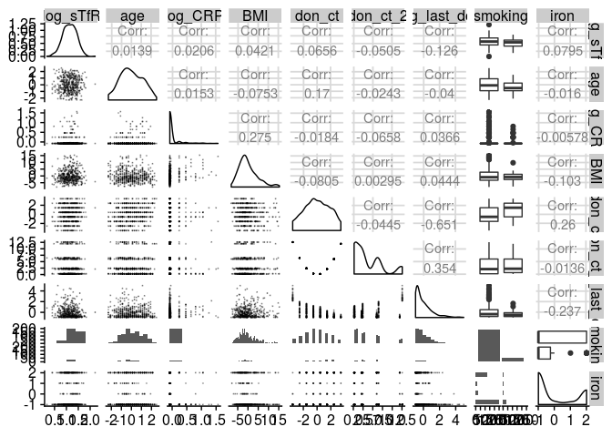

#### OLS

##### Model diagnostics

    ## Warning: Ignoring unknown parameters: shape

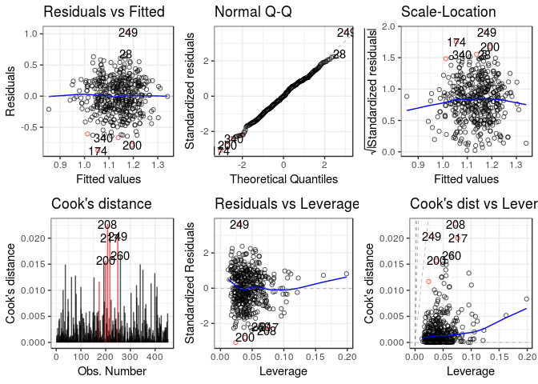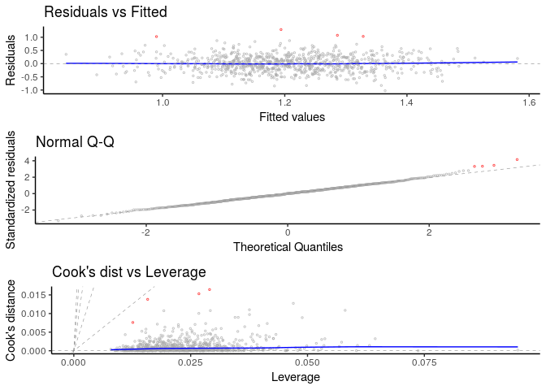

#### Robust regression model amd p-values

#### Model outputs and interpretation

<table style="text-align:center">
<caption>
<strong>Pre-menopausal women</strong>
</caption>
<tr>
<td colspan="3" style="border-bottom: 1px solid black">
</td>
</tr>
<tr>
<td style="text-align:left">
</td>
<td colspan="2">
sTfR
</td>
</tr>
<tr>
<td>
</td>
<td colspan="2" style="border-bottom: 1px solid black">
</td>
</tr>
<tr>
<td style="text-align:left">
</td>
<td>
Robust
</td>
<td>
OLS
</td>
</tr>
<tr>
<td colspan="3" style="border-bottom: 1px solid black">
</td>
</tr>
<tr>
<td style="text-align:left">
Age
</td>
<td>
0.001
</td>
<td>
-0.002
</td>
</tr>
<tr>
<td style="text-align:left">
</td>
<td>
p = 0.958
</td>
<td>
p = 0.892
</td>
</tr>
<tr>
<td style="text-align:left">
BMI
</td>
<td>
0.001
</td>
<td>
0.001
</td>
</tr>
<tr>
<td style="text-align:left">
</td>
<td>
p = 0.853
</td>
<td>
p = 0.728
</td>
</tr>
<tr>
<td style="text-align:left">
CRP
</td>
<td>
0.049
</td>
<td>
0.041
</td>
</tr>
<tr>
<td style="text-align:left">
</td>
<td>
p = 0.416
</td>
<td>
p = 0.488
</td>
</tr>
<tr>
<td style="text-align:left">
Smoking(yes)
</td>
<td>
-0.065
</td>
<td>
-0.071
</td>
</tr>
<tr>
<td style="text-align:left">
</td>
<td>
p = 0.068
</td>
<td>
p = 0.045
</td>
</tr>
<tr>
<td style="text-align:left">
Pregnancy(Yes)
</td>
<td>
-0.036
</td>
<td>
-0.033
</td>
</tr>
<tr>
<td style="text-align:left">
</td>
<td>
p = 0.132
</td>
<td>
p = 0.153
</td>
</tr>
<tr>
<td style="text-align:left">
Nb donations (2 years)
</td>
<td>
-0.007
</td>
<td>
-0.002
</td>
</tr>
<tr>
<td style="text-align:left">
</td>
<td>
p = 0.533
</td>
<td>
p = 0.851
</td>
</tr>
<tr>
<td style="text-align:left">
(Nb donations (2 years))²
</td>
<td>
0.002
</td>
<td>
0.001
</td>
</tr>
<tr>
<td style="text-align:left">
</td>
<td>
p = 0.640
</td>
<td>
p = 0.865
</td>
</tr>
<tr>
<td style="text-align:left">
Days since last donation
</td>
<td>
-0.048
</td>
<td>
-0.043
</td>
</tr>
<tr>
<td style="text-align:left">
</td>
<td>
p = 0.014
</td>
<td>
p = 0.029
</td>
</tr>
<tr>
<td style="text-align:left">
iron supplementation
</td>
<td>
0.001
</td>
<td>
0.005
</td>
</tr>
<tr>
<td style="text-align:left">
</td>
<td>
p = 0.957
</td>
<td>
p = 0.637
</td>
</tr>
<tr>
<td style="text-align:left">
Red meat
</td>
<td>
0.004
</td>
<td>
-0.0003
</td>
</tr>
<tr>
<td style="text-align:left">
</td>
<td>
p = 0.834
</td>
<td>
p = 0.990
</td>
</tr>
<tr>
<td style="text-align:left">
Vegetables
</td>
<td>
-0.005
</td>
<td>
-0.001
</td>
</tr>
<tr>
<td style="text-align:left">
</td>
<td>
p = 0.890
</td>
<td>
p = 0.984
</td>
</tr>
<tr>
<td style="text-align:left">
Fruit and Berries
</td>
<td>
-0.007
</td>
<td>
0.005
</td>
</tr>
<tr>
<td style="text-align:left">
</td>
<td>
p = 0.838
</td>
<td>
p = 0.871
</td>
</tr>
<tr>
<td style="text-align:left">
Milk
</td>
<td>
0.039
</td>
<td>
0.032
</td>
</tr>
<tr>
<td style="text-align:left">
</td>
<td>
p = 0.031
</td>
<td>
p = 0.073
</td>
</tr>
<tr>
<td style="text-align:left">
Fruit Juices
</td>
<td>
0.006
</td>
<td>
0.005
</td>
</tr>
<tr>
<td style="text-align:left">
</td>
<td>
p = 0.664
</td>
<td>
p = 0.702
</td>
</tr>
<tr>
<td style="text-align:left">
Coffee
</td>
<td>
-0.016
</td>
<td>
-0.010
</td>
</tr>
<tr>
<td style="text-align:left">
</td>
<td>
p = 0.340
</td>
<td>
p = 0.527
</td>
</tr>
<tr>
<td style="text-align:left">
Tea
</td>
<td>
-0.003
</td>
<td>
-0.009
</td>
</tr>
<tr>
<td style="text-align:left">
</td>
<td>
p = 0.848
</td>
<td>
p = 0.508
</td>
</tr>
<tr>
<td style="text-align:left">
Beer
</td>
<td>
-0.020
</td>
<td>
-0.022
</td>
</tr>
<tr>
<td style="text-align:left">
</td>
<td>
p = 0.348
</td>
<td>
p = 0.289
</td>
</tr>
<tr>
<td style="text-align:left">
Wine
</td>
<td>
-0.040
</td>
<td>
-0.040
</td>
</tr>
<tr>
<td style="text-align:left">
</td>
<td>
p = 0.037
</td>
<td>
p = 0.036
</td>
</tr>
<tr>
<td style="text-align:left">
Liquor
</td>
<td>
-0.001
</td>
<td>
0.005
</td>
</tr>
<tr>
<td style="text-align:left">
</td>
<td>
p = 0.984
</td>
<td>
p = 0.899
</td>
</tr>
<tr>
<td colspan="3" style="border-bottom: 1px solid black">
</td>
</tr>
<tr>
<td style="text-align:left">
Observations
</td>
<td>
452
</td>
<td>
452
</td>
</tr>
<tr>
<td style="text-align:left">
R2
</td>
<td>
</td>
<td>
0.059
</td>
</tr>
<tr>
<td style="text-align:left">
Adjusted R2
</td>
<td>
</td>
<td>
0.017
</td>
</tr>
<tr>
<td style="text-align:left">
Residual Std. Error (df = 432)
</td>
<td>
0.290
</td>
<td>
0.287
</td>
</tr>
<tr>
<td style="text-align:left">
F Statistic
</td>
<td>
</td>
<td>
1.417 (df = 19; 432)
</td>
</tr>
<tr>
<td colspan="3" style="border-bottom: 1px solid black">
</td>
</tr>
<tr>
<td style="text-align:left">
<em>Note:</em>
</td>
<td colspan="2" style="text-align:right">
*p&lt;0.05; **p&lt;0.01; ***p&lt;0.001
</td>
</tr>
</table>
#### Relative importance of regressors

we run this only on significant regressors ?

Is very computationally intensive if we run on all 20 predictors... So we only run the predictors that were significant in at least one of the donor groups.

Men
---

### Data pre-processing

### Regressions Ferritin

#### Correlograms

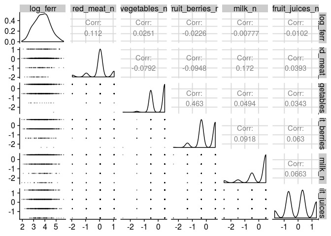

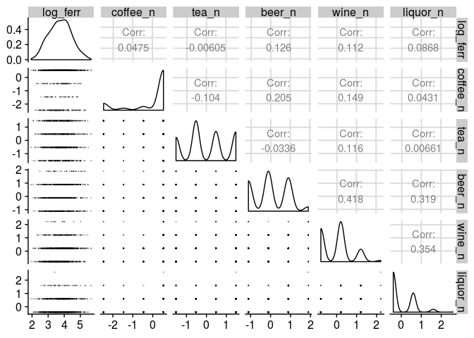

#### OLS

##### Model diagnostics

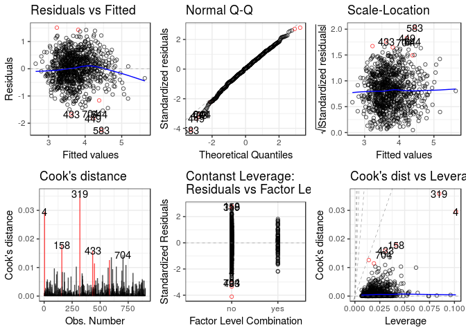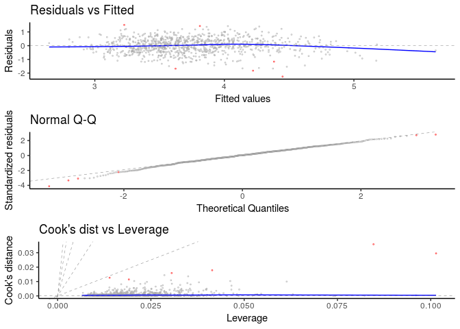

#### Robust regression model amd p-values

#### Model outputs and interpretation

<table style="text-align:center">
<caption>
<strong>Men</strong>
</caption>
<tr>
<td colspan="3" style="border-bottom: 1px solid black">
</td>
</tr>
<tr>
<td style="text-align:left">
</td>
<td colspan="2">
Ferritin
</td>
</tr>
<tr>
<td>
</td>
<td colspan="2" style="border-bottom: 1px solid black">
</td>
</tr>
<tr>
<td style="text-align:left">
</td>
<td>
Robust
</td>
<td>
OLS
</td>
</tr>
<tr>
<td colspan="3" style="border-bottom: 1px solid black">
</td>
</tr>
<tr>
<td style="text-align:left">
Age
</td>
<td>
0.023
</td>
<td>
0.023
</td>
</tr>
<tr>
<td style="text-align:left">
</td>
<td>
p = 0.004
</td>
<td>
p = 0.003
</td>
</tr>
<tr>
<td style="text-align:left">
BMI
</td>
<td>
0.037
</td>
<td>
0.034
</td>
</tr>
<tr>
<td style="text-align:left">
</td>
<td>
p = 0.000
</td>
<td>
p = 0.000
</td>
</tr>
<tr>
<td style="text-align:left">
CRP
</td>
<td>
-0.015
</td>
<td>
-0.008
</td>
</tr>
<tr>
<td style="text-align:left">
</td>
<td>
p = 0.880
</td>
<td>
p = 0.933
</td>
</tr>
<tr>
<td style="text-align:left">
Smoking(yes)
</td>
<td>
0.076
</td>
<td>
0.082
</td>
</tr>
<tr>
<td style="text-align:left">
</td>
<td>
p = 0.080
</td>
<td>
p = 0.061
</td>
</tr>
<tr>
<td style="text-align:left">
Nb donations (2 years)
</td>
<td>
-0.089
</td>
<td>
-0.089
</td>
</tr>
<tr>
<td style="text-align:left">
</td>
<td>
p = 0.000
</td>
<td>
p = 0.000
</td>
</tr>
<tr>
<td style="text-align:left">
(Nb donations (2 years))²
</td>
<td>
0.007
</td>
<td>
0.008
</td>
</tr>
<tr>
<td style="text-align:left">
</td>
<td>
p = 0.004
</td>
<td>
p = 0.002
</td>
</tr>
<tr>
<td style="text-align:left">
Days since last donation
</td>
<td>
0.165
</td>
<td>
0.153
</td>
</tr>
<tr>
<td style="text-align:left">
</td>
<td>
p = 0.000
</td>
<td>
p = 0.000
</td>
</tr>
<tr>
<td style="text-align:left">
iron supplementation
</td>
<td>
-0.045
</td>
<td>
-0.047
</td>
</tr>
<tr>
<td style="text-align:left">
</td>
<td>
p = 0.005
</td>
<td>
p = 0.003
</td>
</tr>
<tr>
<td style="text-align:left">
Red meat
</td>
<td>
0.098
</td>
<td>
0.101
</td>
</tr>
<tr>
<td style="text-align:left">
</td>
<td>
p = 0.001
</td>
<td>
p = 0.0005
</td>
</tr>
<tr>
<td style="text-align:left">
Vegetables
</td>
<td>
0.031
</td>
<td>
0.040
</td>
</tr>
<tr>
<td style="text-align:left">
</td>
<td>
p = 0.434
</td>
<td>
p = 0.306
</td>
</tr>
<tr>
<td style="text-align:left">
Fruit and Berries
</td>
<td>
0.011
</td>
<td>
-0.006
</td>
</tr>
<tr>
<td style="text-align:left">
</td>
<td>
p = 0.737
</td>
<td>
p = 0.867
</td>
</tr>
<tr>
<td style="text-align:left">
Milk
</td>
<td>
-0.036
</td>
<td>
-0.017
</td>
</tr>
<tr>
<td style="text-align:left">
</td>
<td>
p = 0.120
</td>
<td>
p = 0.468
</td>
</tr>
<tr>
<td style="text-align:left">
Fruit Juices
</td>
<td>
-0.018
</td>
<td>
-0.018
</td>
</tr>
<tr>
<td style="text-align:left">
</td>
<td>
p = 0.372
</td>
<td>
p = 0.386
</td>
</tr>
<tr>
<td style="text-align:left">
Coffee
</td>
<td>
0.013
</td>
<td>
0.009
</td>
</tr>
<tr>
<td style="text-align:left">
</td>
<td>
p = 0.482
</td>
<td>
p = 0.630
</td>
</tr>
<tr>
<td style="text-align:left">
Tea
</td>
<td>
0.011
</td>
<td>
0.014
</td>
</tr>
<tr>
<td style="text-align:left">
</td>
<td>
p = 0.562
</td>
<td>
p = 0.454
</td>
</tr>
<tr>
<td style="text-align:left">
Beer
</td>
<td>
0.050
</td>
<td>
0.054
</td>
</tr>
<tr>
<td style="text-align:left">
</td>
<td>
p = 0.043
</td>
<td>
p = 0.031
</td>
</tr>
<tr>
<td style="text-align:left">
Wine
</td>
<td>
0.061
</td>
<td>
0.056
</td>
</tr>
<tr>
<td style="text-align:left">
</td>
<td>
p = 0.039
</td>
<td>
p = 0.061
</td>
</tr>
<tr>
<td style="text-align:left">
Liquor
</td>
<td>
0.056
</td>
<td>
0.049
</td>
</tr>
<tr>
<td style="text-align:left">
</td>
<td>
p = 0.110
</td>
<td>
p = 0.159
</td>
</tr>
<tr>
<td colspan="3" style="border-bottom: 1px solid black">
</td>
</tr>
<tr>
<td style="text-align:left">
Observations
</td>
<td>
902
</td>
<td>
902
</td>
</tr>
<tr>
<td style="text-align:left">
R2
</td>
<td>
</td>
<td>
0.374
</td>
</tr>
<tr>
<td style="text-align:left">
Adjusted R2
</td>
<td>
</td>
<td>
0.361
</td>
</tr>
<tr>
<td style="text-align:left">
Residual Std. Error (df = 883)
</td>
<td>
0.517
</td>
<td>
0.551
</td>
</tr>
<tr>
<td style="text-align:left">
F Statistic
</td>
<td>
</td>
<td>
29.288\*\*\* (df = 18; 883)
</td>
</tr>
<tr>
<td colspan="3" style="border-bottom: 1px solid black">
</td>
</tr>
<tr>
<td style="text-align:left">
<em>Note:</em>
</td>
<td colspan="2" style="text-align:right">
*p&lt;0.05; **p&lt;0.01; ***p&lt;0.001
</td>
</tr>
</table>
Results from robust and OLS rergessions are similar. In both models, ferritin levels are positively correlated with age, BMI, nb of days since last donation, red meat consumption as well as Beer and wine consumption (would not survive multiple comparison correction). and wine consumption (which would not survive multiple correction). Ferritin levels are negatively correlated with the number ofdonations and iron supplementation. A significant neg corelation with nb of donations squared indicates that the effect of nb of donations is larger for small numbers of donations than for large number of donations.

-   An increase in 5 years of age is associated with a 2.3 % increase in Ferritin levels.

-   A doubling of the number of days since the last donation is associated with a 17.9 % increase in Ferritin levels.

-   An increase of meat consumption of one on our grading scale is associated with a 10.3 % increase in Ferritin levels.

-   An increase of iron supplementation of one on our grading scale is associated with a -4.4 % decrease in Ferritin levels.

-   An additional donation in the previous 2 years is associated with a -8.5 % decrease in Ferritin levels.

#### Relative importance

### Regressions sTfR

#### Correlograms

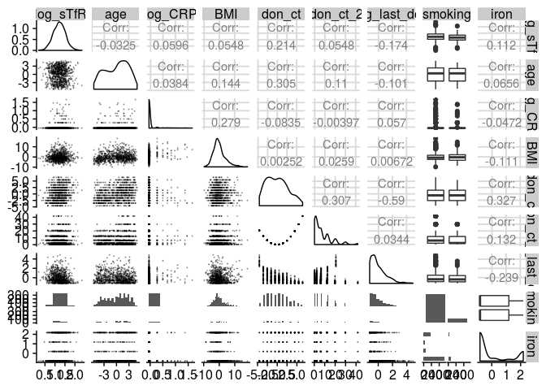

#### OLS

##### Model diagnostics

    ## Warning: Ignoring unknown parameters: shape

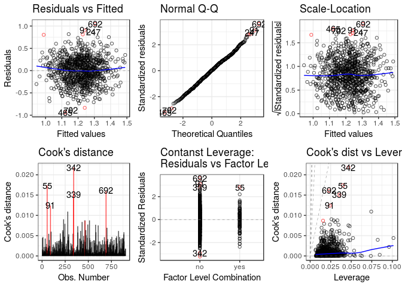

#### Robust regression model amd p-values

#### Model outputs and interpretation

<table style="text-align:center">
<caption>
<strong>Men</strong>
</caption>
<tr>
<td colspan="3" style="border-bottom: 1px solid black">
</td>
</tr>
<tr>
<td style="text-align:left">
</td>
<td colspan="2">
sTfR
</td>
</tr>
<tr>
<td>
</td>
<td colspan="2" style="border-bottom: 1px solid black">
</td>
</tr>
<tr>
<td style="text-align:left">
</td>
<td>
Robust
</td>
<td>
OLS
</td>
</tr>
<tr>
<td colspan="3" style="border-bottom: 1px solid black">
</td>
</tr>
<tr>
<td style="text-align:left">
Age
</td>
<td>
-0.009
</td>
<td>
-0.010
</td>
</tr>
<tr>
<td style="text-align:left">
</td>
<td>
p = 0.042
</td>
<td>
p = 0.016
</td>
</tr>
<tr>
<td style="text-align:left">
BMI
</td>
<td>
0.003
</td>
<td>
0.004
</td>
</tr>
<tr>
<td style="text-align:left">
</td>
<td>
p = 0.207
</td>
<td>
p = 0.128
</td>
</tr>
<tr>
<td style="text-align:left">
CRP
</td>
<td>
0.110
</td>
<td>
0.119
</td>
</tr>
<tr>
<td style="text-align:left">
</td>
<td>
p = 0.043
</td>
<td>
p = 0.026
</td>
</tr>
<tr>
<td style="text-align:left">
Smoking(yes)
</td>
<td>
-0.054
</td>
<td>
-0.055
</td>
</tr>
<tr>
<td style="text-align:left">
</td>
<td>
p = 0.023
</td>
<td>
p = 0.018
</td>
</tr>
<tr>
<td style="text-align:left">
Nb donations (2 years)
</td>
<td>
0.020
</td>
<td>
0.022
</td>
</tr>
<tr>
<td style="text-align:left">
</td>
<td>
p = 0.0003
</td>
<td>
p = 0.00003
</td>
</tr>
<tr>
<td style="text-align:left">
(Nb donations (2 years))²
</td>
<td>
0.0001
</td>
<td>
-0.0002
</td>
</tr>
<tr>
<td style="text-align:left">
</td>
<td>
p = 0.939
</td>
<td>
p = 0.888
</td>
</tr>
<tr>
<td style="text-align:left">
Days since last donation
</td>
<td>
-0.019
</td>
<td>
-0.015
</td>
</tr>
<tr>
<td style="text-align:left">
</td>
<td>
p = 0.104
</td>
<td>
p = 0.204
</td>
</tr>
<tr>
<td style="text-align:left">
iron supplementation
</td>
<td>
0.012
</td>
<td>
0.014
</td>
</tr>
<tr>
<td style="text-align:left">
</td>
<td>
p = 0.172
</td>
<td>
p = 0.094
</td>
</tr>
<tr>
<td style="text-align:left">
Red meat
</td>
<td>
-0.027
</td>
<td>
-0.031
</td>
</tr>
<tr>
<td style="text-align:left">
</td>
<td>
p = 0.091
</td>
<td>
p = 0.048
</td>
</tr>
<tr>
<td style="text-align:left">
Vegetables
</td>
<td>
-0.022
</td>
<td>
-0.015
</td>
</tr>
<tr>
<td style="text-align:left">
</td>
<td>
p = 0.297
</td>
<td>
p = 0.466
</td>
</tr>
<tr>
<td style="text-align:left">
Fruit and Berries
</td>
<td>
-0.002
</td>
<td>
-0.004
</td>
</tr>
<tr>
<td style="text-align:left">
</td>
<td>
p = 0.926
</td>
<td>
p = 0.826
</td>
</tr>
<tr>
<td style="text-align:left">
Milk
</td>
<td>
0.019
</td>
<td>
0.015
</td>
</tr>
<tr>
<td style="text-align:left">
</td>
<td>
p = 0.129
</td>
<td>
p = 0.218
</td>
</tr>
<tr>
<td style="text-align:left">
Fruit Juices
</td>
<td>
0.005
</td>
<td>
0.006
</td>
</tr>
<tr>
<td style="text-align:left">
</td>
<td>
p = 0.641
</td>
<td>
p = 0.605
</td>
</tr>
<tr>
<td style="text-align:left">
Coffee
</td>
<td>
-0.009
</td>
<td>
-0.010
</td>
</tr>
<tr>
<td style="text-align:left">
</td>
<td>
p = 0.370
</td>
<td>
p = 0.317
</td>
</tr>
<tr>
<td style="text-align:left">
Tea
</td>
<td>
0.001
</td>
<td>
0.001
</td>
</tr>
<tr>
<td style="text-align:left">
</td>
<td>
p = 0.934
</td>
<td>
p = 0.893
</td>
</tr>
<tr>
<td style="text-align:left">
Beer
</td>
<td>
-0.019
</td>
<td>
-0.014
</td>
</tr>
<tr>
<td style="text-align:left">
</td>
<td>
p = 0.158
</td>
<td>
p = 0.296
</td>
</tr>
<tr>
<td style="text-align:left">
Wine
</td>
<td>
-0.029
</td>
<td>
-0.030
</td>
</tr>
<tr>
<td style="text-align:left">
</td>
<td>
p = 0.072
</td>
<td>
p = 0.056
</td>
</tr>
<tr>
<td style="text-align:left">
Liquor
</td>
<td>
0.012
</td>
<td>
0.003
</td>
</tr>
<tr>
<td style="text-align:left">
</td>
<td>
p = 0.539
</td>
<td>
p = 0.881
</td>
</tr>
<tr>
<td colspan="3" style="border-bottom: 1px solid black">
</td>
</tr>
<tr>
<td style="text-align:left">
Observations
</td>
<td>
902
</td>
<td>
902
</td>
</tr>
<tr>
<td style="text-align:left">
R2
</td>
<td>
</td>
<td>
0.094
</td>
</tr>
<tr>
<td style="text-align:left">
Adjusted R2
</td>
<td>
</td>
<td>
0.075
</td>
</tr>
<tr>
<td style="text-align:left">
Residual Std. Error (df = 883)
</td>
<td>
0.281
</td>
<td>
0.294
</td>
</tr>
<tr>
<td style="text-align:left">
F Statistic
</td>
<td>
</td>
<td>
5.061\*\*\* (df = 18; 883)
</td>
</tr>
<tr>
<td colspan="3" style="border-bottom: 1px solid black">
</td>
</tr>
<tr>
<td style="text-align:left">
<em>Note:</em>
</td>
<td colspan="2" style="text-align:right">
*p&lt;0.05; **p&lt;0.01; ***p&lt;0.001
</td>
</tr>
</table>
#### Relative importance

Regression Coefficient bootstrapped CIs
---------------------------------------

We compute bootstrapped distributions for regression coefficients for OLS and robust regressions as well as standardized regression coefficients for robust regressions. From these bootstrapped distributions we furthermore compute the 95% BCa confidence intervals.

### OLS regression - coefficients

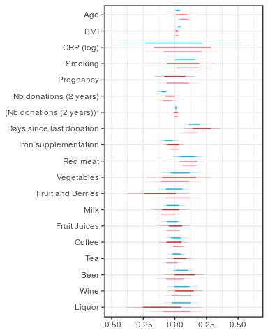

### Robust regression - coeffs

### Robust regression - betas

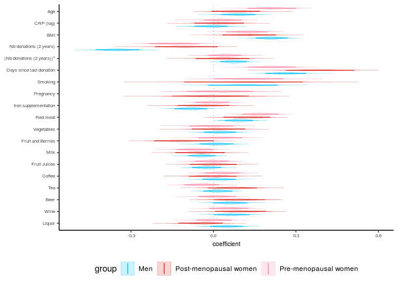

Results outputs
---------------

### Main results

#### Table 2 - Outcome = Ferritin

<table style="text-align:center">
<caption>
<strong>Table 2 - Multivariate robust regression analyses - Ferritin</strong>
</caption>
<tr>
<td colspan="4" style="border-bottom: 1px solid black">
</td>
</tr>
<tr>
<td style="text-align:left">
</td>
<td colspan="3">
Ferritin (log)
</td>
</tr>
<tr>
<td>
</td>
<td colspan="3" style="border-bottom: 1px solid black">
</td>
</tr>
<tr>
<td style="text-align:left">
</td>
<td>
Pre-menopausal women
</td>
<td>
Post-menopausal women
</td>
<td>
Men
</td>
</tr>
<tr>
<td colspan="4" style="border-bottom: 1px solid black">
</td>
</tr>
<tr>
<td style="text-align:left">
Age
</td>
<td>
0.073 (0.042, 0.103)
</td>
<td>
0.047 (-0.003, 0.097)
</td>
<td>
0.023 (0.006, 0.038)
</td>
</tr>
<tr>
<td style="text-align:left">
</td>
<td>
p = 0.00000
</td>
<td>
p = 0.072
</td>
<td>
p = 0.004
</td>
</tr>
<tr>
<td style="text-align:left">
BMI
</td>
<td>
0.017 (0.007, 0.027)
</td>
<td>
0.018 (0.005, 0.031)
</td>
<td>
0.037 (0.026, 0.047)
</td>
</tr>
<tr>
<td style="text-align:left">
</td>
<td>
p = 0.0005
</td>
<td>
p = 0.006
</td>
<td>
p = 0.000
</td>
</tr>
<tr>
<td style="text-align:left">
ln(CRP)
</td>
<td>
0.063 (-0.078, 0.208)
</td>
<td>
0.062 (-0.181, 0.290)
</td>
<td>
-0.015 (-0.256, 0.187)
</td>
</tr>
<tr>
<td style="text-align:left">
</td>
<td>
p = 0.367
</td>
<td>
p = 0.601
</td>
<td>
p = 0.883
</td>
</tr>
<tr>
<td style="text-align:left">
Smoking(yes)
</td>
<td>
0.091 (0.001, 0.176)
</td>
<td>
0.077 (-0.064, 0.202)
</td>
<td>
0.076 (-0.012, 0.163)
</td>
</tr>
<tr>
<td style="text-align:left">
</td>
<td>
p = 0.047
</td>
<td>
p = 0.273
</td>
<td>
p = 0.080
</td>
</tr>
<tr>
<td style="text-align:left">
Pregnancy(Yes)
</td>
<td>
0.020 (-0.064, 0.104)
</td>
<td>
-0.004 (-0.094, 0.081)
</td>
<td>
</td>
</tr>
<tr>
<td style="text-align:left">
</td>
<td>
p = 0.649
</td>
<td>
p = 0.929
</td>
<td>
</td>
</tr>
<tr>
<td style="text-align:left">
Nb donations (2 years)
</td>
<td>
-0.060 (-0.097, -0.022)
</td>
<td>
-0.034 (-0.071, 0.007)
</td>
<td>
-0.089 (-0.110, -0.069)
</td>
</tr>
<tr>
<td style="text-align:left">
</td>
<td>
p = 0.002
</td>
<td>
p = 0.105
</td>
<td>
p = 0.000
</td>
</tr>
<tr>
<td style="text-align:left">
(Nb donations (2 years))²
</td>
<td>
0.010 (-0.005, 0.026)
</td>
<td>
0.006 (-0.012, 0.023)
</td>
<td>
0.007 (0.002, 0.012)
</td>
</tr>
<tr>
<td style="text-align:left">
</td>
<td>
p = 0.165
</td>
<td>
p = 0.450
</td>
<td>
p = 0.004
</td>
</tr>
<tr>
<td style="text-align:left">
ln(Days since last donation)
</td>
<td>
0.134 (0.082, 0.190)
</td>
<td>
0.231 (0.157, 0.308)
</td>
<td>
0.165 (0.121, 0.211)
</td>
</tr>
<tr>
<td style="text-align:left">
</td>
<td>
p = 0.00000
</td>
<td>
p = 0.000
</td>
<td>
p = 0.000
</td>
</tr>
<tr>
<td style="text-align:left">
iron supplementation
</td>
<td>
-0.002 (-0.034, 0.029)
</td>
<td>
-0.017 (-0.062, 0.027)
</td>
<td>
-0.045 (-0.079, -0.013)
</td>
</tr>
<tr>
<td style="text-align:left">
</td>
<td>
p = 0.895
</td>
<td>
p = 0.450
</td>
<td>
p = 0.005
</td>
</tr>
<tr>
<td style="text-align:left">
Red meat
</td>
<td>
0.134 (0.081, 0.188)
</td>
<td>
0.113 (0.035, 0.188)
</td>
<td>
0.098 (0.043, 0.155)
</td>
</tr>
<tr>
<td style="text-align:left">
</td>
<td>
p = 0.00000
</td>
<td>
p = 0.006
</td>
<td>
p = 0.001
</td>
</tr>
<tr>
<td style="text-align:left">
Vegetables
</td>
<td>
-0.013 (-0.128, 0.104)
</td>
<td>
0.025 (-0.113, 0.167)
</td>
<td>
0.031 (-0.049, 0.104)
</td>
</tr>
<tr>
<td style="text-align:left">
</td>
<td>
p = 0.822
</td>
<td>
p = 0.735
</td>
<td>
p = 0.433
</td>
</tr>
<tr>
<td style="text-align:left">
Fruit and Berries
</td>
<td>
0.031 (-0.065, 0.131)
</td>
<td>
-0.142 (-0.271, 0.001)
</td>
<td>
0.011 (-0.055, 0.079)
</td>
</tr>
<tr>
<td style="text-align:left">
</td>
<td>
p = 0.505
</td>
<td>
p = 0.034
</td>
<td>
p = 0.737
</td>
</tr>
<tr>
<td style="text-align:left">
Milk
</td>
<td>
-0.057 (-0.113, -0.004)
</td>
<td>
-0.039 (-0.107, 0.032)
</td>
<td>
-0.036 (-0.078, 0.006)
</td>
</tr>
<tr>
<td style="text-align:left">
</td>
<td>
p = 0.038
</td>
<td>
p = 0.269
</td>
<td>
p = 0.120
</td>
</tr>
<tr>
<td style="text-align:left">
Fruit Juices
</td>
<td>
-0.004 (-0.057, 0.049)
</td>
<td>
-0.001 (-0.057, 0.053)
</td>
<td>
-0.018 (-0.061, 0.023)
</td>
</tr>
<tr>
<td style="text-align:left">
</td>
<td>
p = 0.889
</td>
<td>
p = 0.959
</td>
<td>
p = 0.373
</td>
</tr>
<tr>
<td style="text-align:left">
Coffee
</td>
<td>
0.019 (-0.019, 0.058)
</td>
<td>
-0.003 (-0.066, 0.062)
</td>
<td>
0.013 (-0.027, 0.053)
</td>
</tr>
<tr>
<td style="text-align:left">
</td>
<td>
p = 0.347
</td>
<td>
p = 0.915
</td>
<td>
p = 0.484
</td>
</tr>
<tr>
<td style="text-align:left">
Tea
</td>
<td>
-0.029 (-0.073, 0.013)
</td>
<td>
0.043 (-0.008, 0.095)
</td>
<td>
0.011 (-0.025, 0.045)
</td>
</tr>
<tr>
<td style="text-align:left">
</td>
<td>
p = 0.185
</td>
<td>
p = 0.112
</td>
<td>
p = 0.563
</td>
</tr>
<tr>
<td style="text-align:left">
Beer
</td>
<td>
0.012 (-0.059, 0.084)
</td>
<td>
0.084 (-0.0001, 0.174)
</td>
<td>
0.050 (0.0004, 0.101)
</td>
</tr>
<tr>
<td style="text-align:left">
</td>
<td>
p = 0.740
</td>
<td>
p = 0.046
</td>
<td>
p = 0.044
</td>
</tr>
<tr>
<td style="text-align:left">
Wine
</td>
<td>
0.060 (-0.014, 0.135)
</td>
<td>
0.080 (-0.001, 0.157)
</td>
<td>
0.061 (0.003, 0.122)
</td>
</tr>
<tr>
<td style="text-align:left">
</td>
<td>
p = 0.098
</td>
<td>
p = 0.034
</td>
<td>
p = 0.040
</td>
</tr>
<tr>
<td style="text-align:left">
Liquor
</td>
<td>
0.001 (-0.112, 0.108)
</td>
<td>
-0.071 (-0.243, 0.070)
</td>
<td>
0.056 (-0.015, 0.129)
</td>
</tr>
<tr>
<td style="text-align:left">
</td>
<td>
p = 0.983
</td>
<td>
p = 0.410
</td>
<td>
p = 0.113
</td>
</tr>
<tr>
<td colspan="4" style="border-bottom: 1px solid black">
</td>
</tr>
<tr>
<td style="text-align:left">
Observations
</td>
<td>
846
</td>
<td>
452
</td>
<td>
902
</td>
</tr>
<tr>
<td style="text-align:left">
Residual Std. Error
</td>
<td>
0.612 (df = 826)
</td>
<td>
0.530 (df = 432)
</td>
<td>
0.517 (df = 883)
</td>
</tr>
<tr>
<td colspan="4" style="border-bottom: 1px solid black">
</td>
</tr>
<tr>
<td style="text-align:left">
<em>Note:</em>
</td>
<td colspan="3" style="text-align:right">
*p&lt;0.05; **p&lt;0.01; ***p&lt;0.001
</td>
</tr>
</table>
#### Table 3 - Outcome = sTfR

<table style="text-align:center">
<caption>
<strong>Table 3 - Multivariable robust regression analyses - sTfR</strong>
</caption>
<tr>
<td colspan="4" style="border-bottom: 1px solid black">
</td>
</tr>
<tr>
<td style="text-align:left">
</td>
<td colspan="3">
Ferritin (log)
</td>
</tr>
<tr>
<td>
</td>
<td colspan="3" style="border-bottom: 1px solid black">
</td>
</tr>
<tr>
<td style="text-align:left">
</td>
<td>
Pre-menopausal women
</td>
<td>
Post-menopausal women
</td>
<td>
Men
</td>
</tr>
<tr>
<td colspan="4" style="border-bottom: 1px solid black">
</td>
</tr>
<tr>
<td style="text-align:left">
Age
</td>
<td>
-0.028 (0.042, 0.103)
</td>
<td>
0.001 (-0.003, 0.097)
</td>
<td>
-0.009 (0.006, 0.038)
</td>
</tr>
<tr>
<td style="text-align:left">
</td>
<td>
p = 0.00000
</td>
<td>
p = 0.072
</td>
<td>
p = 0.004
</td>
</tr>
<tr>
<td style="text-align:left">
BMI
</td>
<td>
0.003 (0.007, 0.027)
</td>
<td>
0.001 (0.005, 0.031)
</td>
<td>
0.003 (0.026, 0.047)
</td>
</tr>
<tr>
<td style="text-align:left">
</td>
<td>
p = 0.0005
</td>
<td>
p = 0.006
</td>
<td>
p = 0.000
</td>
</tr>
<tr>
<td style="text-align:left">
ln(CRP)
</td>
<td>
0.026 (-0.078, 0.208)
</td>
<td>
0.049 (-0.181, 0.290)
</td>
<td>
0.110 (-0.256, 0.187)
</td>
</tr>
<tr>
<td style="text-align:left">
</td>
<td>
p = 0.367
</td>
<td>
p = 0.601
</td>
<td>
p = 0.883
</td>
</tr>
<tr>
<td style="text-align:left">
Smoking(yes)
</td>
<td>
-0.048 (0.001, 0.176)
</td>
<td>
-0.065 (-0.064, 0.202)
</td>
<td>
-0.054 (-0.012, 0.163)
</td>
</tr>
<tr>
<td style="text-align:left">
</td>
<td>
p = 0.047
</td>
<td>
p = 0.273
</td>
<td>
p = 0.080
</td>
</tr>
<tr>
<td style="text-align:left">
Pregnancy(Yes)
</td>
<td>
0.020 (-0.064, 0.104)
</td>
<td>
-0.036 (-0.094, 0.081)
</td>
<td>
</td>
</tr>
<tr>
<td style="text-align:left">
</td>
<td>
p = 0.649
</td>
<td>
p = 0.929
</td>
<td>
</td>
</tr>
<tr>
<td style="text-align:left">
Nb donations (2 years)
</td>
<td>
0.025 (-0.097, -0.022)
</td>
<td>
-0.007 (-0.071, 0.007)
</td>
<td>
0.020 (-0.110, -0.069)
</td>
</tr>
<tr>
<td style="text-align:left">
</td>
<td>
p = 0.002
</td>
<td>
p = 0.105
</td>
<td>
p = 0.000
</td>
</tr>
<tr>
<td style="text-align:left">
(Nb donations (2 years))²
</td>
<td>
-0.006 (-0.005, 0.026)
</td>
<td>
0.002 (-0.012, 0.023)
</td>
<td>
0.0001 (0.002, 0.012)
</td>
</tr>
<tr>
<td style="text-align:left">
</td>
<td>
p = 0.165
</td>
<td>
p = 0.450
</td>
<td>
p = 0.004
</td>
</tr>
<tr>
<td style="text-align:left">
ln(Days since last donation)
</td>
<td>
-0.019 (0.082, 0.190)
</td>
<td>
-0.048 (0.157, 0.308)
</td>
<td>
-0.019 (0.121, 0.211)
</td>
</tr>
<tr>
<td style="text-align:left">
</td>
<td>
p = 0.00000
</td>
<td>
p = 0.000
</td>
<td>
p = 0.000
</td>
</tr>
<tr>
<td style="text-align:left">
iron supplementation
</td>
<td>
0.001 (-0.034, 0.029)
</td>
<td>
0.001 (-0.062, 0.027)
</td>
<td>
0.012 (-0.079, -0.013)
</td>
</tr>
<tr>
<td style="text-align:left">
</td>
<td>
p = 0.895
</td>
<td>
p = 0.450
</td>
<td>
p = 0.005
</td>
</tr>
<tr>
<td style="text-align:left">
Red meat
</td>
<td>
-0.075 (0.081, 0.188)
</td>
<td>
0.004 (0.035, 0.188)
</td>
<td>
-0.027 (0.043, 0.155)
</td>
</tr>
<tr>
<td style="text-align:left">
</td>
<td>
p = 0.00000
</td>
<td>
p = 0.006
</td>
<td>
p = 0.001
</td>
</tr>
<tr>
<td style="text-align:left">
Vegetables
</td>
<td>
-0.018 (-0.128, 0.104)
</td>
<td>
-0.005 (-0.113, 0.167)
</td>
<td>
-0.022 (-0.049, 0.104)
</td>
</tr>
<tr>
<td style="text-align:left">
</td>
<td>
p = 0.822
</td>
<td>
p = 0.735
</td>
<td>
p = 0.433
</td>
</tr>
<tr>
<td style="text-align:left">
Fruit and Berries
</td>
<td>
0.008 (-0.065, 0.131)
</td>
<td>
-0.007 (-0.271, 0.001)
</td>
<td>
-0.002 (-0.055, 0.079)
</td>
</tr>
<tr>
<td style="text-align:left">
</td>
<td>
p = 0.505
</td>
<td>
p = 0.034
</td>
<td>
p = 0.737
</td>
</tr>
<tr>
<td style="text-align:left">
Milk
</td>
<td>
0.040 (-0.113, -0.004)
</td>
<td>
0.039 (-0.107, 0.032)
</td>
<td>
0.019 (-0.078, 0.006)
</td>
</tr>
<tr>
<td style="text-align:left">
</td>
<td>
p = 0.038
</td>
<td>
p = 0.269
</td>
<td>
p = 0.120
</td>
</tr>
<tr>
<td style="text-align:left">
Fruit Juices
</td>
<td>
-0.002 (-0.057, 0.049)
</td>
<td>
0.006 (-0.057, 0.053)
</td>
<td>
0.005 (-0.061, 0.023)
</td>
</tr>
<tr>
<td style="text-align:left">
</td>
<td>
p = 0.889
</td>
<td>
p = 0.959
</td>
<td>
p = 0.373
</td>
</tr>
<tr>
<td style="text-align:left">
Coffee
</td>
<td>
-0.038 (-0.019, 0.058)
</td>
<td>
-0.016 (-0.066, 0.062)
</td>
<td>
-0.009 (-0.027, 0.053)
</td>
</tr>
<tr>
<td style="text-align:left">
</td>
<td>
p = 0.347
</td>
<td>
p = 0.915
</td>
<td>
p = 0.484
</td>
</tr>
<tr>
<td style="text-align:left">
Tea
</td>
<td>
0.004 (-0.073, 0.013)
</td>
<td>
-0.003 (-0.008, 0.095)
</td>
<td>
0.001 (-0.025, 0.045)
</td>
</tr>
<tr>
<td style="text-align:left">
</td>
<td>
p = 0.185
</td>
<td>
p = 0.112
</td>
<td>
p = 0.563
</td>
</tr>
<tr>
<td style="text-align:left">
Beer
</td>
<td>
0.003 (-0.059, 0.084)
</td>
<td>
-0.020 (-0.0001, 0.174)
</td>
<td>
-0.019 (0.0004, 0.101)
</td>
</tr>
<tr>
<td style="text-align:left">
</td>
<td>
p = 0.740
</td>
<td>
p = 0.046
</td>
<td>
p = 0.044
</td>
</tr>
<tr>
<td style="text-align:left">
Wine
</td>
<td>
-0.013 (-0.014, 0.135)
</td>
<td>
-0.040 (-0.001, 0.157)
</td>
<td>
-0.029 (0.003, 0.122)
</td>
</tr>
<tr>
<td style="text-align:left">
</td>
<td>
p = 0.098
</td>
<td>
p = 0.034
</td>
<td>
p = 0.040
</td>
</tr>
<tr>
<td style="text-align:left">
Liquor
</td>
<td>
0.034 (-0.112, 0.108)
</td>
<td>
-0.001 (-0.243, 0.070)
</td>
<td>
0.012 (-0.015, 0.129)
</td>
</tr>
<tr>
<td style="text-align:left">
</td>
<td>
p = 0.983
</td>
<td>
p = 0.410
</td>
<td>
p = 0.113
</td>
</tr>
<tr>
<td colspan="4" style="border-bottom: 1px solid black">
</td>
</tr>
<tr>
<td style="text-align:left">
Observations
</td>
<td>
846
</td>
<td>
452
</td>
<td>
902
</td>
</tr>
<tr>
<td style="text-align:left">
Residual Std. Error
</td>
<td>
0.302 (df = 826)
</td>
<td>
0.290 (df = 432)
</td>
<td>
0.281 (df = 883)
</td>
</tr>
<tr>
<td colspan="4" style="border-bottom: 1px solid black">
</td>
</tr>
<tr>
<td style="text-align:left">
<em>Note:</em>
</td>
<td colspan="3" style="text-align:right">
*p&lt;0.05; **p&lt;0.01; ***p&lt;0.001
</td>
</tr>
</table>
#### Figure 2

##### Bootstrapped coeffs

The bootstrapped coefficients that are displayed are the standardized coefficients.

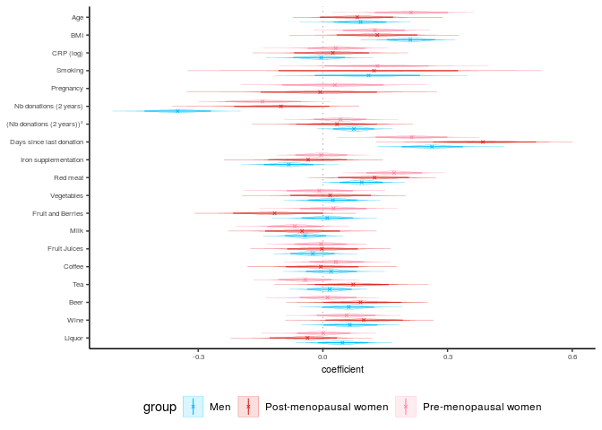

    ##  [1] Age                       CRP (log)                
    ##  [3] BMI                       Nb donations (2 years)   
    ##  [5] Days since last donation  Smoking                  
    ##  [7] Pregnancy                 Iron supplementation     
    ##  [9] (Nb donations (2 years))² Beer                     
    ## [11] Coffee                    Fruit and Berries        
    ## [13] Fruit Juices              Liquor                   
    ## [15] Milk                      Red meat                 
    ## [17] Tea                       Vegetables               
    ## [19] Wine                     
    ## 19 Levels: Liquor < Wine < Beer < Tea < Coffee < Fruit Juices < ... < Age

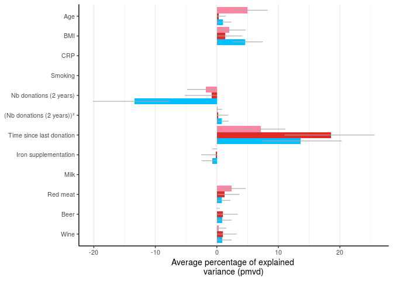

##### Relative importance

###### Ferritin

###### sTfR

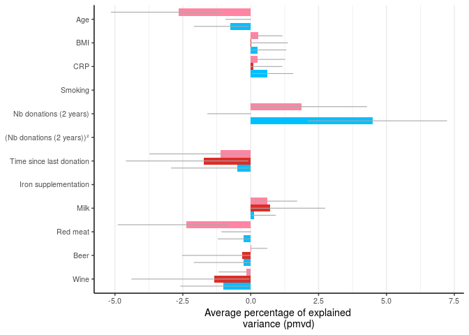

#### Figure 3 : Effects of main predictors of interest

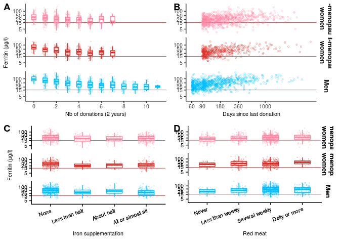

Supplementary results
---------------------

### Supp Table 1: OLS ferritin regression

<table style="text-align:center">
<caption>
<strong>Supplementary table 3 - Multivariate linear regression (OLS) - Ferritin</strong>
</caption>
<tr>
<td colspan="4" style="border-bottom: 1px solid black">
</td>
</tr>
<tr>
<td style="text-align:left">
</td>
<td colspan="3">
Ferritin (log)
</td>
</tr>
<tr>
<td>
</td>
<td colspan="3" style="border-bottom: 1px solid black">
</td>
</tr>
<tr>
<td style="text-align:left">
</td>
<td>
Pre-menopausal women
</td>
<td>
Post-menopausal women
</td>
<td>
Men
</td>
</tr>
<tr>
<td colspan="4" style="border-bottom: 1px solid black">
</td>
</tr>
<tr>
<td style="text-align:left">
Age
</td>
<td>
0.07 (0.04, 0.10)
</td>
<td>
0.05 (0.01, 0.10)
</td>
<td>
0.02 (0.01, 0.04)
</td>
</tr>
<tr>
<td style="text-align:left">
</td>
<td>
p = 0.0000
</td>
<td>
p = 0.04
</td>
<td>
p = 0.003
</td>
</tr>
<tr>
<td style="text-align:left">
BMI
</td>
<td>
0.02 (0.01, 0.03)
</td>
<td>
0.02 (0.002, 0.03)
</td>
<td>
0.03 (0.02, 0.04)
</td>
</tr>
<tr>
<td style="text-align:left">
</td>
<td>
p = 0.002
</td>
<td>
p = 0.02
</td>
<td>
p = 0.00
</td>
</tr>
<tr>
<td style="text-align:left">
ln(CRP)
</td>
<td>
0.06 (-0.09, 0.21)
</td>
<td>
0.07 (-0.17, 0.28)
</td>
<td>
-0.01 (-0.23, 0.22)
</td>
</tr>
<tr>
<td style="text-align:left">
</td>
<td>
p = 0.38
</td>
<td>
p = 0.56
</td>
<td>
p = 0.94
</td>
</tr>
<tr>
<td style="text-align:left">
Smoking(yes)
</td>
<td>
0.10 (0.02, 0.19)
</td>
<td>
0.07 (-0.06, 0.19)
</td>
<td>
0.08 (0.002, 0.16)
</td>
</tr>
<tr>
<td style="text-align:left">
</td>
<td>
p = 0.03
</td>
<td>
p = 0.31
</td>
<td>
p = 0.07
</td>
</tr>
<tr>
<td style="text-align:left">
Pregnancy(Yes)
</td>
<td>
0.02 (-0.07, 0.11)
</td>
<td>
0.003 (-0.08, 0.08)
</td>
<td>
</td>
</tr>
<tr>
<td style="text-align:left">
</td>
<td>
p = 0.60
</td>
<td>
p = 0.96
</td>
<td>
</td>
</tr>
<tr>
<td style="text-align:left">
Nb donations (2 years)
</td>
<td>
-0.06 (-0.09, -0.02)
</td>
<td>
-0.04 (-0.08, 0.0002)
</td>
<td>
-0.09 (-0.11, -0.07)
</td>
</tr>
<tr>
<td style="text-align:left">
</td>
<td>
p = 0.003
</td>
<td>
p = 0.06
</td>
<td>
p = 0.00
</td>
</tr>
<tr>
<td style="text-align:left">
(Nb donations (2 years))²
</td>
<td>
0.01 (-0.005, 0.02)
</td>
<td>
0.01 (-0.01, 0.02)
</td>
<td>
0.01 (0.003, 0.01)
</td>
</tr>
<tr>
<td style="text-align:left">
</td>
<td>
p = 0.19
</td>
<td>
p = 0.32
</td>
<td>
p = 0.002
</td>
</tr>
<tr>
<td style="text-align:left">
ln(Days since last donation)
</td>
<td>
0.12 (0.07, 0.18)
</td>
<td>
0.21 (0.14, 0.29)
</td>
<td>
0.15 (0.11, 0.20)
</td>
</tr>
<tr>
<td style="text-align:left">
</td>
<td>
p = 0.0000
</td>
<td>
p = 0.0000
</td>
<td>
p = 0.00
</td>
</tr>
<tr>
<td style="text-align:left">
iron supplementation
</td>
<td>
-0.003 (-0.03, 0.03)
</td>
<td>
-0.01 (-0.05, 0.03)
</td>
<td>
-0.05 (-0.08, -0.02)
</td>
</tr>
<tr>
<td style="text-align:left">
</td>
<td>
p = 0.87
</td>
<td>
p = 0.54
</td>
<td>
p = 0.003
</td>
</tr>
<tr>
<td style="text-align:left">
Red meat
</td>
<td>
0.12 (0.06, 0.17)
</td>
<td>
0.11 (0.03, 0.18)
</td>
<td>
0.10 (0.04, 0.16)
</td>
</tr>
<tr>
<td style="text-align:left">
</td>
<td>
p = 0.0000
</td>
<td>
p = 0.01
</td>
<td>
p = 0.0005
</td>
</tr>
<tr>
<td style="text-align:left">
Vegetables
</td>
<td>
-0.001 (-0.11, 0.11)
</td>
<td>
0.03 (-0.10, 0.17)
</td>
<td>
0.04 (-0.03, 0.11)
</td>
</tr>
<tr>
<td style="text-align:left">
</td>
<td>
p = 1.00
</td>
<td>
p = 0.65
</td>
<td>
p = 0.31
</td>
</tr>
<tr>
<td style="text-align:left">
Fruit and Berries
</td>
<td>
0.02 (-0.07, 0.12)
</td>
<td>
-0.12 (-0.24, 0.01)
</td>
<td>
-0.01 (-0.07, 0.06)
</td>
</tr>
<tr>
<td style="text-align:left">
</td>
<td>
p = 0.60
</td>
<td>
p = 0.06
</td>
<td>
p = 0.87
</td>
</tr>
<tr>
<td style="text-align:left">
Milk
</td>
<td>
-0.05 (-0.11, -0.002)
</td>
<td>
-0.03 (-0.10, 0.03)
</td>
<td>
-0.02 (-0.06, 0.03)
</td>
</tr>
<tr>
<td style="text-align:left">
</td>
<td>
p = 0.05
</td>
<td>
p = 0.32
</td>
<td>
p = 0.47
</td>
</tr>
<tr>
<td style="text-align:left">
Fruit Juices
</td>
<td>
-0.01 (-0.07, 0.04)
</td>
<td>
0.004 (-0.05, 0.06)
</td>
<td>
-0.02 (-0.06, 0.02)
</td>
</tr>
<tr>
<td style="text-align:left">
</td>
<td>
p = 0.61
</td>
<td>
p = 0.89
</td>
<td>
p = 0.39
</td>
</tr>
<tr>
<td style="text-align:left">
Coffee
</td>
<td>
0.02 (-0.01, 0.06)
</td>
<td>
-0.01 (-0.06, 0.05)
</td>
<td>
0.01 (-0.03, 0.05)
</td>
</tr>
<tr>
<td style="text-align:left">
</td>
<td>
p = 0.24
</td>
<td>
p = 0.84
</td>
<td>
p = 0.63
</td>
</tr>
<tr>
<td style="text-align:left">
Tea
</td>
<td>
-0.02 (-0.06, 0.02)
</td>
<td>
0.04 (-0.01, 0.09)
</td>
<td>
0.01 (-0.02, 0.05)
</td>
</tr>
<tr>
<td style="text-align:left">
</td>
<td>
p = 0.32
</td>
<td>
p = 0.12
</td>
<td>
p = 0.46
</td>
</tr>
<tr>
<td style="text-align:left">
Beer
</td>
<td>
0.002 (-0.07, 0.07)
</td>
<td>
0.08 (-0.0002, 0.16)
</td>
<td>
0.05 (0.01, 0.10)
</td>
</tr>
<tr>
<td style="text-align:left">
</td>
<td>
p = 0.97
</td>
<td>
p = 0.05
</td>
<td>
p = 0.04
</td>
</tr>
<tr>
<td style="text-align:left">
Wine
</td>
<td>
0.05 (-0.02, 0.13)
</td>
<td>
0.08 (0.003, 0.15)
</td>
<td>
0.06 (-0.004, 0.11)
</td>
</tr>
<tr>
<td style="text-align:left">
</td>
<td>
p = 0.15
</td>
<td>
p = 0.03
</td>
<td>
p = 0.07
</td>
</tr>
<tr>
<td style="text-align:left">
Liquor
</td>
<td>
0.01 (-0.09, 0.12)
</td>
<td>
-0.09 (-0.25, 0.05)
</td>
<td>
0.05 (-0.02, 0.12)
</td>
</tr>
<tr>
<td style="text-align:left">
</td>
<td>
p = 0.82
</td>
<td>
p = 0.28
</td>
<td>
p = 0.16
</td>
</tr>
<tr>
<td colspan="4" style="border-bottom: 1px solid black">
</td>
</tr>
<tr>
<td style="text-align:left">
Observations
</td>
<td>
846
</td>
<td>
452
</td>
<td>
902
</td>
</tr>
<tr>
<td style="text-align:left">
R2
</td>
<td>
0.20
</td>
<td>
0.27
</td>
<td>
0.37
</td>
</tr>
<tr>
<td style="text-align:left">
Adjusted R2
</td>
<td>
0.18
</td>
<td>
0.23
</td>
<td>
0.36
</td>
</tr>
<tr>
<td style="text-align:left">
Residual Std. Error
</td>
<td>
0.63 (df = 826)
</td>
<td>
0.55 (df = 432)
</td>
<td>
0.55 (df = 883)
</td>
</tr>
<tr>
<td style="text-align:left">
F Statistic
</td>
<td>
10.90\*\*\* (df = 19; 826) (p = 0.00)
</td>
<td>
8.28\*\*\* (df = 19; 432) (p = 0.00)
</td>
<td>
29.29\*\*\* (df = 18; 883) (p = 0.00)
</td>
</tr>
<tr>
<td colspan="4" style="border-bottom: 1px solid black">
</td>
</tr>
<tr>
<td style="text-align:left">
<em>Note:</em>
</td>
<td colspan="3" style="text-align:right">
*p&lt;0.05; **p&lt;0.01; ***p&lt;0.001
</td>
</tr>
</table>
### Supp Table 2: Regression of sTfR

### Supp Figure 3: Visualizations of the effects of donation history on sTRF

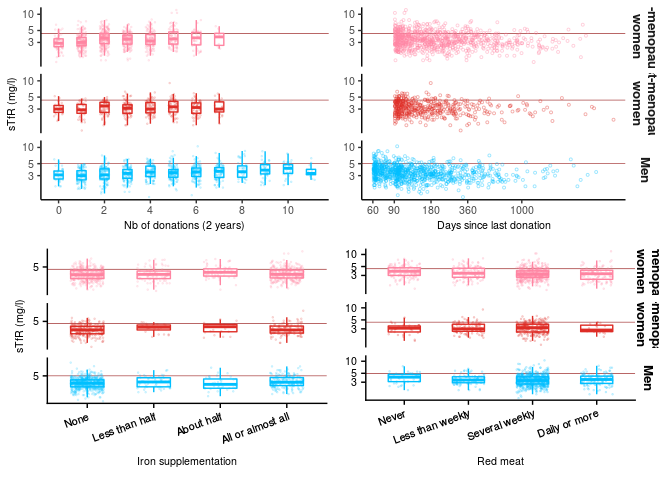

Self-assessed health
====================

Self-assessed health was measured using the following question:

-   How is your health in general?
-   Poor, satisfactory, good, very good, excellent

We use ordinal logistic regression analysis (**???**) to analyze the relationship between self-assessed health and ferritin. We test whether Ferritin level is a significant predictor of self-assessed health when controlling for age, BMI, CRP, number of donations in the last two years, and physical activity. We run both a frequentist analysis and a Bayesian analysis. Results from the frequentist analysis suggest that Ferritin is not a significant predictor of self-perceived health in blood donors. According to the Bayesian analysis, the data dees not provide strong evidence in favor of ferritin co-varying with self-perceived health.

Supplementary Figure 4
----------------------

We first display the distribution of answers to the self-reported health question.

Figure 4 - Relationship between ferritin and self-reported health
-----------------------------------------------------------------

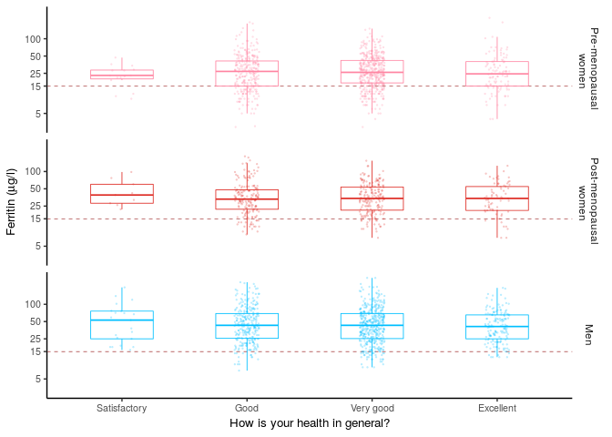

Ordinal regression analysis
---------------------------

To analyze the answers to the self-assessed health question properly, we use an ordinal proportional odds model or ordinal logistic model. This type of model is used to model outome variables that are ordered and represent an unknown latent variable. Here self-reported health is the ordered outcome variable we are trying to predict. Additional information about ordinal models in epidemiology can be found in (Abreu, Siqueira, and Caiaffa 2009). Because there are few donors who reported only satisfactory health, we pool together the data from pre-menopausal and post-menopausal women into a single women's group.

An example of how to interpret the odds-ratio that are computed from the regression coefficients can be found [https://www.google.com/url?sa=t&rct=j&q=&esrc=s&source=web&cd=9&cad=rja&uact=8&ved=2ahUKEwjg1PO9g\_TcAhVhD5oKHSt1BVYQFjAIegQIABAC&url=http%3A%2F%2Fweb.pdx.edu%2F~newsomj%2Fcdaclass%2Fho\_ordinal%2520regression.pdf&usg=AOvVaw2NRuZfLiLnX4bUfqOPVUne](here). The main assumption of the method is a proportional odds assumption which is explained here. Other good summary off main assupmtions of the method. [http://www.karlin.mff.cuni.cz/~pesta/NMFM404/ordinal.html\#Ordered\_logistic\_regression](here).

We transform Ferritin into *l**o**g**F**e**r**r**i**t**i**n* = *l**n*(*F**e**r**r**i**t**i**n*)/*l**n*(2). With this transformation, an increase in one unit in logFerritin is equivalent to a doubling of Ferritin values. We also center and scale all variables. We also divide age by 5, so a unit increase in the age factor is actually an increase in 5 years in age. We center the data but do not scale it in order to make the coeffs easier to interpret.

### Ordinality of predictors

We must first check that a majority of our explanatory variables do in fact have an ordinal relationship to the outcome variable. It seems to be mosty the case.

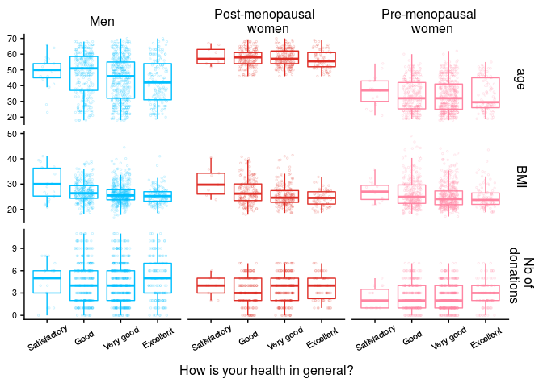

### Women

#### Correlograms

#### Frequentist fit

##### Assumption checks

The following plot is a visual tool to estimate if the proportional odds assumption is met. For each predictor variable, the assumption is met if the distance between the cross marker and the triangle marker is similar for all levels of the predictor variable. This method is detailed in (Harrell 2015) as well as [https://stats.idre.ucla.edu/r/dae/ordinal-logistic-regression/](here).

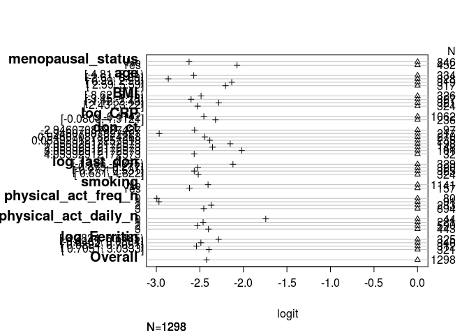

##### Ordinal regression

We fit the data using the rms R package.

<table style="text-align:center">
<caption>
<strong>Women</strong>
</caption>
<tr>
<td colspan="2" style="border-bottom: 1px solid black">
</td>
</tr>
<tr>
<td style="text-align:left">
</td>
<td>
Self-rated health
</td>
</tr>
<tr>
<td>
</td>
<td colspan="1" style="border-bottom: 1px solid black">
</td>
</tr>
<tr>
<td colspan="2" style="border-bottom: 1px solid black">
</td>
</tr>
<tr>
<td style="text-align:left">
Health &gt; Good
</td>
<td>
2.706 (2.097, 3.316)
</td>
</tr>
<tr>
<td style="text-align:left">
</td>
<td>
p = 0.000
</td>
</tr>
<tr>
<td style="text-align:left">
Health &gt; Very good
</td>
<td>
-0.855 (-1.348, -0.362)
</td>
</tr>
<tr>
<td style="text-align:left">
</td>
<td>
p = 0.001
</td>
</tr>
<tr>
<td style="text-align:left">
Health &gt; Excellent
</td>
<td>
-3.385 (-3.911, -2.858)
</td>
</tr>
<tr>
<td style="text-align:left">
</td>
<td>
p = 0.000
</td>
</tr>
<tr>
<td style="text-align:left">
Menopausal status
</td>
<td>
-0.031 (-0.394, 0.332)
</td>
</tr>
<tr>
<td style="text-align:left">
</td>
<td>
p = 0.866
</td>
</tr>
<tr>
<td style="text-align:left">
age
</td>
<td>
-0.050 (-0.113, 0.014)
</td>
</tr>
<tr>
<td style="text-align:left">
</td>
<td>
p = 0.124
</td>
</tr>
<tr>
<td style="text-align:left">
BMI
</td>
<td>
-0.047 (-0.070, -0.023)
</td>
</tr>
<tr>
<td style="text-align:left">
</td>
<td>
p = 0.0002
</td>
</tr>
<tr>
<td style="text-align:left">
CRP (log)
</td>
<td>
-0.270 (-0.637, 0.097)
</td>
</tr>
<tr>
<td style="text-align:left">
</td>
<td>
p = 0.150
</td>
</tr>
<tr>
<td style="text-align:left">
Smoking(yes)
</td>
<td>
-0.171 (-0.502, 0.160)
</td>
</tr>
<tr>
<td style="text-align:left">
</td>
<td>
p = 0.311
</td>
</tr>
<tr>
<td style="text-align:left">
Nb donations (2 years)
</td>
<td>
0.066 (-0.011, 0.142)
</td>
</tr>
<tr>
<td style="text-align:left">
</td>
<td>
p = 0.092
</td>
</tr>
<tr>
<td style="text-align:left">
Nb of days since last donation (log)
</td>
<td>
0.005 (-0.121, 0.131)
</td>
</tr>
<tr>
<td style="text-align:left">
</td>
<td>
p = 0.940
</td>
</tr>
<tr>
<td style="text-align:left">
Daily Physical Activity
</td>
<td>
0.207 (0.066, 0.347)
</td>
</tr>
<tr>
<td style="text-align:left">
</td>
<td>
p = 0.005
</td>
</tr>
<tr>
<td style="text-align:left">
Physical activity frequency
</td>
<td>
0.332 (0.201, 0.463)
</td>
</tr>
<tr>
<td style="text-align:left">
</td>
<td>
p = 0.00000
</td>
</tr>
<tr>
<td style="text-align:left">
ln(Ferritin)/ln(2)
</td>
<td>
0.104 (-0.016, 0.225)
</td>
</tr>
<tr>
<td style="text-align:left">
</td>
<td>
p = 0.091
</td>
</tr>
<tr>
<td colspan="2" style="border-bottom: 1px solid black">
</td>
</tr>
<tr>
<td style="text-align:left">
Observations
</td>
<td>
1,298
</td>
</tr>
<tr>
<td style="text-align:left">
R2
</td>
<td>
0.075
</td>
</tr>
<tr>
<td style="text-align:left">
chi2
</td>
<td>
87.956\*\*\* (df = 10)
</td>
</tr>
<tr>
<td colspan="2" style="border-bottom: 1px solid black">
</td>
</tr>
<tr>
<td style="text-align:left">
<em>Note:</em>
</td>
<td style="text-align:right">
*p&lt;0.05; **p&lt;0.01; ***p&lt;0.001
</td>
</tr>
</table>
Our model significantly predicts self-rated health (Pr(&gt; chi2) &lt;0.0001), but Ferritin is not a significant predictor (p= 0.078 ).

We now transform the regression coefficients into odds-ratios for easier interpretation of results.

<table>
<thead>
<tr>
<th style="text-align:left;">
Regressor
</th>
<th style="text-align:right;">
Coefficient
</th>
<th style="text-align:right;">
Odds.Ratio
</th>
</tr>
</thead>
<tbody>
<tr>
<td style="text-align:left;">
menopausal\_status
</td>
<td style="text-align:right;">
-0.0313159
</td>
<td style="text-align:right;">
0.9691694
</td>
</tr>
<tr>
<td style="text-align:left;">
Age
</td>
<td style="text-align:right;">
-0.0498772
</td>
<td style="text-align:right;">
0.9513462
</td>
</tr>
<tr>
<td style="text-align:left;">
BMI
</td>
<td style="text-align:right;">
-0.0465272
</td>
<td style="text-align:right;">
0.9545386
</td>
</tr>
<tr>
<td style="text-align:left;">
CRP
</td>
<td style="text-align:right;">
-0.2701029
</td>
<td style="text-align:right;">
0.7633009
</td>
</tr>
<tr>
<td style="text-align:left;">
Smoking
</td>
<td style="text-align:right;">
-0.1713505
</td>
<td style="text-align:right;">
0.8425262
</td>
</tr>
<tr>
<td style="text-align:left;">
Nb of donations (2 years)
</td>
<td style="text-align:right;">
0.0655163
</td>
<td style="text-align:right;">
1.0677101
</td>
</tr>
<tr>
<td style="text-align:left;">
Days since last donation
</td>
<td style="text-align:right;">
0.0048810
</td>
<td style="text-align:right;">
1.0048929
</td>
</tr>
<tr>
<td style="text-align:left;">
Daily physical activity
</td>
<td style="text-align:right;">
0.2065648
</td>
<td style="text-align:right;">
1.2294474
</td>
</tr>
<tr>
<td style="text-align:left;">
Exercise frequency
</td>
<td style="text-align:right;">
0.3323141
</td>
<td style="text-align:right;">
1.3941907
</td>
</tr>
<tr>
<td style="text-align:left;">
Ferritin
</td>
<td style="text-align:right;">
0.1040466
</td>
<td style="text-align:right;">
1.1096522
</td>
</tr>
</tbody>
</table>
An increase in 1 point of BMI age results in a 4.9% decreases in your odds by of feeling in very good or excellent compared to satisfactory or good. An increase in one scale point in exercise frequency results in an increase of 39.4% of your odds of felling in excellent health compared to very good, good or satisfactory health.

Once BMI, age, CRP, donation activity, smoking and physical activity are controlled for, there is a 11% increase in the odds of rating your health as good, very good or excellent compared to satisfactory for each 2-fold increase in Ferritin levels. This increase is not statistically significant.

##### Bootstrapped CIs

We use a bootstrap to estimate 95% BCa confidence intervals on the coefficients.

#### Ordinal model Bayesian fit

We use brms to run a bayesian fit of the same regression model. We compute LOO to show that adding ferritin does not improve the regression model.

##### Model fit

##### Model diagnostics

###### Posterior probability check

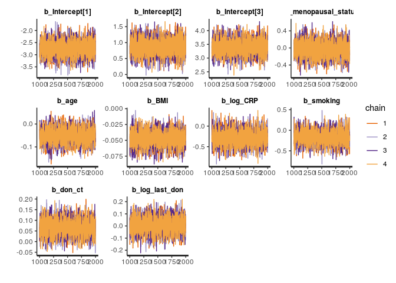

###### Diagnostics of the MCMC sampling

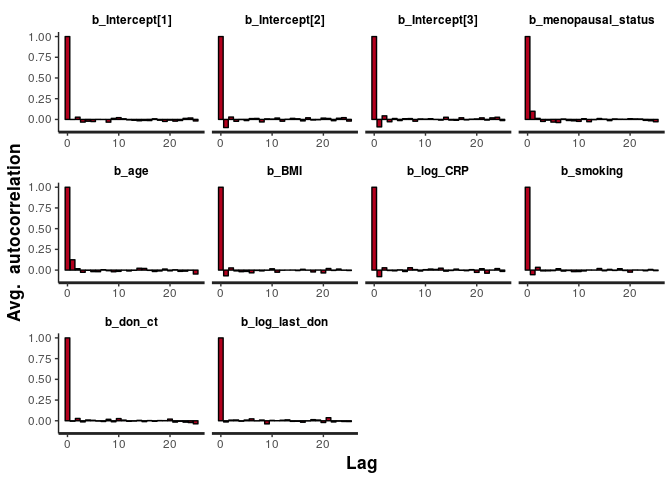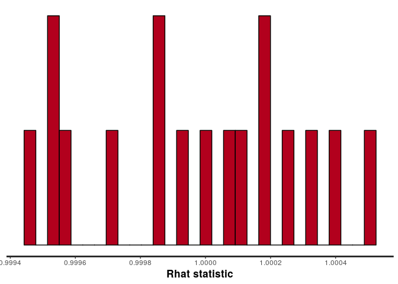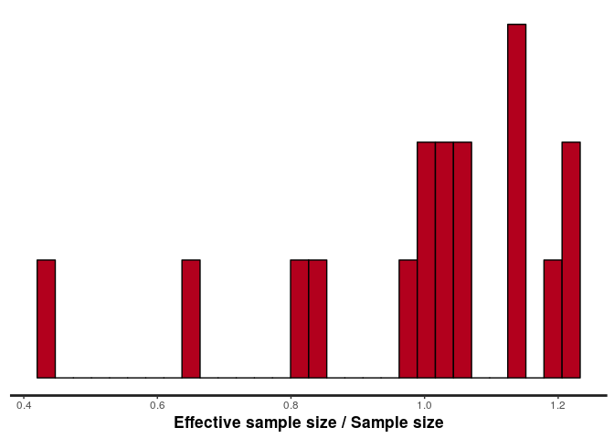

##### Model comparison

Model comparison using Bayes Factors in non trivial when using ordinal models. We use LOO (leave-One-OUt cross validation) as is shown [https://kevinstadler.github.io/blog/bayesian-ordinal-regression-with-random-effects-using-brms/](here). (Vehtari, Gelman, and Gabry 2017) would be the main reference.

We compare a restricted model without Ferritin as a predictor and a full model with Ferritin as a predictor.

    ##                                                LOOIC    SE
    ## ordinal_fit_restricted                       2676.89 43.25
    ## ordinal_fit_B_women                          2676.18 43.30
    ## ordinal_fit_restricted - ordinal_fit_B_women    0.71  3.49

The LOO comparison suggests that the full model does not fit the data any better than the restricted one since the LOO difference is of smaller magnitude than its SE.

### Men

#### Correlograms

The only strong collinearity is, as expected and known from the previous analyses, between log\_Ferritin and don\_ct (Nb of donations in the previous two years).

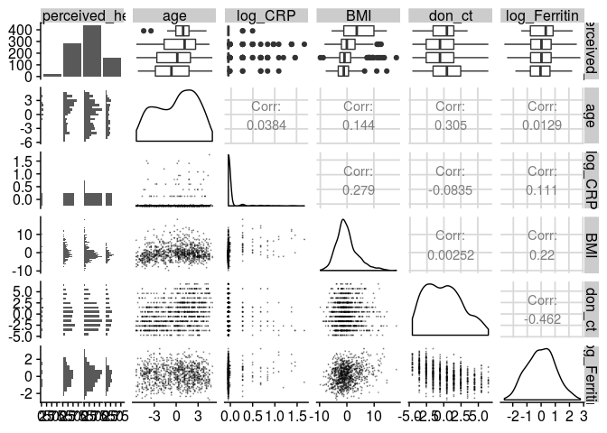

#### Frequentist fit

##### Assumption checks

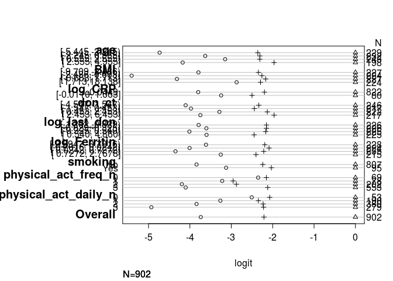

##### Ordinal regression fit (rms package)

We fit the data using the rms R package.

<table style="text-align:center">
<caption>
<strong>Men</strong>
</caption>
<tr>
<td colspan="2" style="border-bottom: 1px solid black">
</td>
</tr>
<tr>
<td style="text-align:left">
</td>
<td>
Self-rated health
</td>
</tr>
<tr>
<td>
</td>
<td colspan="1" style="border-bottom: 1px solid black">
</td>
</tr>
<tr>
<td colspan="2" style="border-bottom: 1px solid black">
</td>
</tr>
<tr>
<td style="text-align:left">
Health &gt; Good
</td>
<td>
2.256 (1.610, 2.902)
</td>
</tr>
<tr>
<td style="text-align:left">
</td>
<td>
p = 0.000
</td>
</tr>
<tr>
<td style="text-align:left">
Health &gt; Very Good
</td>
<td>
-0.962 (-1.497, -0.428)
</td>
</tr>
<tr>
<td style="text-align:left">
</td>
<td>
p = 0.0005
</td>
</tr>
<tr>
<td style="text-align:left">
Health &gt; Excellent
</td>
<td>
-3.352 (-3.929, -2.775)
</td>
</tr>
<tr>
<td style="text-align:left">
</td>
<td>
p = 0.000
</td>
</tr>
<tr>
<td style="text-align:left">
age
</td>
<td>
-0.133 (-0.184, -0.083)
</td>
</tr>
<tr>
<td style="text-align:left">
</td>
<td>
p = 0.00000
</td>
</tr>
<tr>
<td style="text-align:left">
BMI
</td>
<td>
-0.068 (-0.104, -0.033)
</td>
</tr>
<tr>
<td style="text-align:left">
</td>
<td>
p = 0.0002
</td>
</tr>
<tr>
<td style="text-align:left">
CRP (log)
</td>
<td>
0.078 (-0.587, 0.744)
</td>
</tr>
<tr>
<td style="text-align:left">
</td>
<td>
p = 0.818
</td>
</tr>
<tr>
<td style="text-align:left">
Smoking(yes)
</td>
<td>
-0.411 (-0.827, 0.005)
</td>
</tr>
<tr>
<td style="text-align:left">
</td>
<td>
p = 0.053
</td>
</tr>
<tr>
<td style="text-align:left">
Nb donations (2 years)
</td>
<td>
0.074 (0.011, 0.138)
</td>
</tr>
<tr>
<td style="text-align:left">
</td>
<td>
p = 0.022
</td>
</tr>
<tr>
<td style="text-align:left">
Nb of days since last donation (log)
</td>
<td>
0.021 (-0.126, 0.167)
</td>
</tr>
<tr>
<td style="text-align:left">
</td>
<td>
p = 0.782
</td>
</tr>
<tr>
<td style="text-align:left">
Daily Physical Activity
</td>
<td>
0.233 (0.081, 0.384)
</td>
</tr>
<tr>
<td style="text-align:left">
</td>
<td>
p = 0.003
</td>
</tr>
<tr>
<td style="text-align:left">
Physical activity frequency
</td>
<td>
0.365 (0.220, 0.510)
</td>
</tr>
<tr>
<td style="text-align:left">
</td>
<td>
p = 0.00000
</td>
</tr>
<tr>
<td style="text-align:left">
ln(Ferritin)/ln(2)
</td>
<td>
0.057 (-0.097, 0.210)
</td>
</tr>
<tr>
<td style="text-align:left">
</td>
<td>
p = 0.468
</td>
</tr>
<tr>
<td colspan="2" style="border-bottom: 1px solid black">
</td>
</tr>
<tr>
<td style="text-align:left">
Observations
</td>
<td>
902
</td>
</tr>
<tr>
<td style="text-align:left">
R2
</td>
<td>
0.115
</td>
</tr>
<tr>
<td style="text-align:left">
chi2
</td>
<td>
97.297\*\*\* (df = 9)
</td>
</tr>
<tr>
<td colspan="2" style="border-bottom: 1px solid black">
</td>
</tr>
<tr>
<td style="text-align:left">
<em>Note:</em>
</td>
<td style="text-align:right">
*p&lt;0.05; **p&lt;0.01; ***p&lt;0.001
</td>
</tr>
</table>
Our model significantly predicts self-rated health (Pr(&gt; chi2) &lt;0.0001), but Ferritin is not a significant predictor (p= 0.2115 ).

We can now transform the regression coefficients into odds-ratios for easier interpretation of results.

<table>
<thead>
<tr>
<th style="text-align:left;">
Regressor
</th>
<th style="text-align:right;">
Coefficient
</th>
<th style="text-align:right;">
Odds.Ratio
</th>
</tr>
</thead>
<tbody>
<tr>
<td style="text-align:left;">
Age
</td>
<td style="text-align:right;">
-0.1334856
</td>
<td style="text-align:right;">
0.8750401
</td>
</tr>
<tr>
<td style="text-align:left;">
BMI
</td>
<td style="text-align:right;">
-0.0684779
</td>
<td style="text-align:right;">
0.9338141
</td>
</tr>
<tr>
<td style="text-align:left;">
CRP
</td>
<td style="text-align:right;">
0.0784572
</td>
<td style="text-align:right;">
1.0816170
</td>
</tr>
<tr>
<td style="text-align:left;">
Smoking
</td>
<td style="text-align:right;">
-0.4111826
</td>
<td style="text-align:right;">
0.6628659
</td>
</tr>
<tr>
<td style="text-align:left;">
Nb of donations (2 years)
</td>
<td style="text-align:right;">
0.0744748
</td>
<td style="text-align:right;">
1.0773182
</td>
</tr>
<tr>
<td style="text-align:left;">
Days since last donation
</td>
<td style="text-align:right;">
0.0206402
</td>
<td style="text-align:right;">
1.0208547
</td>
</tr>
<tr>
<td style="text-align:left;">
Daily physical activity
</td>
<td style="text-align:right;">
0.2326746
</td>
<td style="text-align:right;">
1.2619708
</td>
</tr>
<tr>
<td style="text-align:left;">
Exercise frequency
</td>
<td style="text-align:right;">
0.3651360
</td>
<td style="text-align:right;">
1.4407100
</td>
</tr>
<tr>
<td style="text-align:left;">
Ferritin
</td>
<td style="text-align:right;">
0.0567654
</td>
<td style="text-align:right;">
1.0584075
</td>
</tr>
</tbody>
</table>
Results show that an increase in 1 point of BMI age results in a 6.7 % decrease in your odds by of feeling in very good pr excellent compared to satisfactory or good. An increase in one scale point in exercise frequency results in an increase of 44% of your odds of felling in excellent health compared to very good, good or satisfactory health.

Once BMI, age, CRP, donation activity, smoking and physical activity are controlled for, there is a 5.8 % increase in the odds of rating your health as good, very good or excellent compared to satisfactory for each 2-fold increase in Ferritin levels. This increase is not statistically significant.

##### Bootstrapped CIs

We use a bootstrap to estimate confidence intervals on the coefficients for proper reporting of results.

#### Ordinal model Bayesian fit

We use brms to run a bayesian fit of the same regression model.

A staning issue here is that the default coefficient priors for ordinal models in brms are improper priors. Such priors are problematic when later computing Bayes Factor. A better option could be to compute LOO to show that adding ferritin does not improve the model.

##### Model fit

##### Model diagnostics

###### Posterior probability check

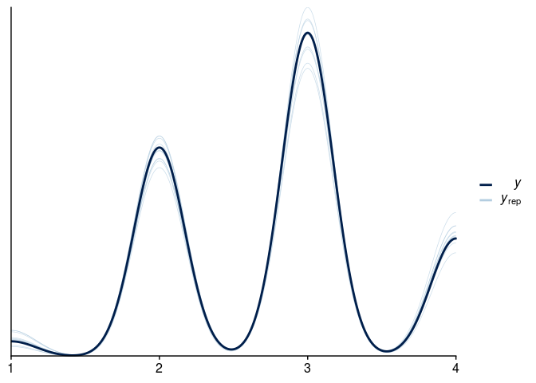

###### Diagnostics of the MCMC sampling

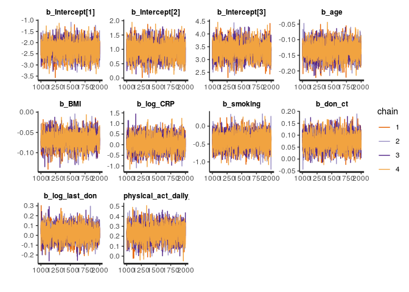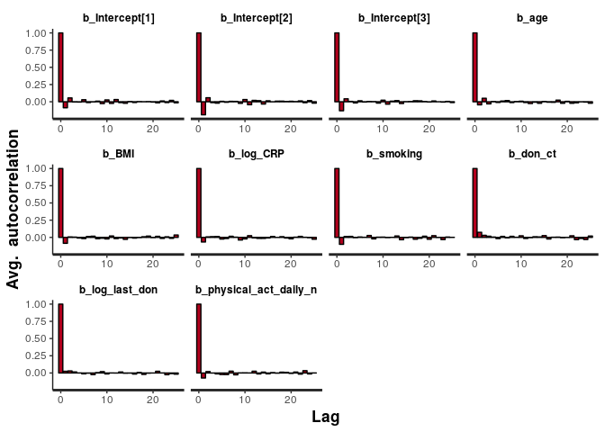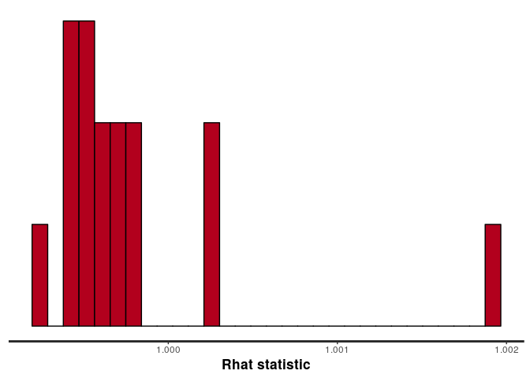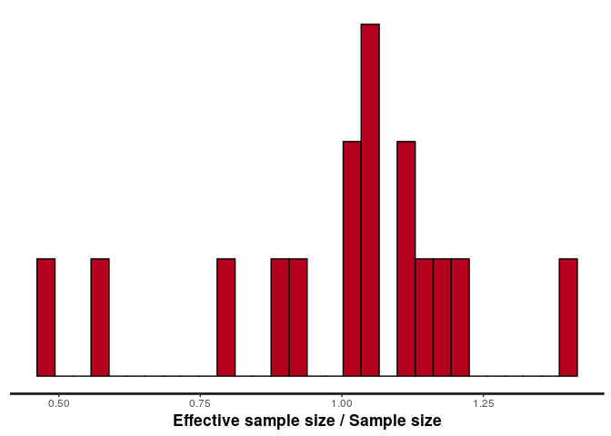

##### Model comparison

We use LOO (leave-One-OUt cross validation). We compare a restricted model without Ferritin as a predictor and a full model with Ferritin as a predictor.

    ## 
    ## SAMPLING FOR MODEL 'a521321bc853dbf937f110911292cc8e' NOW (CHAIN 1).
    ## Chain 1: 
    ## Chain 1: Gradient evaluation took 0.000418 seconds
    ## Chain 1: 1000 transitions using 10 leapfrog steps per transition would take 4.18 seconds.
    ## Chain 1: Adjust your expectations accordingly!
    ## Chain 1: 
    ## Chain 1: 
    ## Chain 1: Iteration:    1 / 2000 [  0%]  (Warmup)
    ## Chain 1: Iteration:  200 / 2000 [ 10%]  (Warmup)
    ## Chain 1: Iteration:  400 / 2000 [ 20%]  (Warmup)
    ## Chain 1: Iteration:  600 / 2000 [ 30%]  (Warmup)
    ## Chain 1: Iteration:  800 / 2000 [ 40%]  (Warmup)
    ## Chain 1: Iteration: 1000 / 2000 [ 50%]  (Warmup)
    ## Chain 1: Iteration: 1001 / 2000 [ 50%]  (Sampling)
    ## Chain 1: Iteration: 1200 / 2000 [ 60%]  (Sampling)
    ## Chain 1: Iteration: 1400 / 2000 [ 70%]  (Sampling)
    ## Chain 1: Iteration: 1600 / 2000 [ 80%]  (Sampling)
    ## Chain 1: Iteration: 1800 / 2000 [ 90%]  (Sampling)
    ## Chain 1: Iteration: 2000 / 2000 [100%]  (Sampling)
    ## Chain 1: 
    ## Chain 1:  Elapsed Time: 7.61553 seconds (Warm-up)
    ## Chain 1:                7.90337 seconds (Sampling)
    ## Chain 1:                15.5189 seconds (Total)
    ## Chain 1: 
    ## 
    ## SAMPLING FOR MODEL 'a521321bc853dbf937f110911292cc8e' NOW (CHAIN 2).
    ## Chain 2: 
    ## Chain 2: Gradient evaluation took 0.000366 seconds
    ## Chain 2: 1000 transitions using 10 leapfrog steps per transition would take 3.66 seconds.
    ## Chain 2: Adjust your expectations accordingly!
    ## Chain 2: 
    ## Chain 2: 
    ## Chain 2: Iteration:    1 / 2000 [  0%]  (Warmup)
    ## Chain 2: Iteration:  200 / 2000 [ 10%]  (Warmup)
    ## Chain 2: Iteration:  400 / 2000 [ 20%]  (Warmup)
    ## Chain 2: Iteration:  600 / 2000 [ 30%]  (Warmup)
    ## Chain 2: Iteration:  800 / 2000 [ 40%]  (Warmup)
    ## Chain 2: Iteration: 1000 / 2000 [ 50%]  (Warmup)
    ## Chain 2: Iteration: 1001 / 2000 [ 50%]  (Sampling)
    ## Chain 2: Iteration: 1200 / 2000 [ 60%]  (Sampling)
    ## Chain 2: Iteration: 1400 / 2000 [ 70%]  (Sampling)
    ## Chain 2: Iteration: 1600 / 2000 [ 80%]  (Sampling)
    ## Chain 2: Iteration: 1800 / 2000 [ 90%]  (Sampling)
    ## Chain 2: Iteration: 2000 / 2000 [100%]  (Sampling)
    ## Chain 2: 
    ## Chain 2:  Elapsed Time: 7.50058 seconds (Warm-up)
    ## Chain 2:                6.48786 seconds (Sampling)
    ## Chain 2:                13.9884 seconds (Total)
    ## Chain 2: 
    ## 
    ## SAMPLING FOR MODEL 'a521321bc853dbf937f110911292cc8e' NOW (CHAIN 3).
    ## Chain 3: 
    ## Chain 3: Gradient evaluation took 0.000346 seconds
    ## Chain 3: 1000 transitions using 10 leapfrog steps per transition would take 3.46 seconds.
    ## Chain 3: Adjust your expectations accordingly!
    ## Chain 3: 
    ## Chain 3: 
    ## Chain 3: Iteration:    1 / 2000 [  0%]  (Warmup)
    ## Chain 3: Iteration:  200 / 2000 [ 10%]  (Warmup)
    ## Chain 3: Iteration:  400 / 2000 [ 20%]  (Warmup)
    ## Chain 3: Iteration:  600 / 2000 [ 30%]  (Warmup)
    ## Chain 3: Iteration:  800 / 2000 [ 40%]  (Warmup)
    ## Chain 3: Iteration: 1000 / 2000 [ 50%]  (Warmup)
    ## Chain 3: Iteration: 1001 / 2000 [ 50%]  (Sampling)
    ## Chain 3: Iteration: 1200 / 2000 [ 60%]  (Sampling)
    ## Chain 3: Iteration: 1400 / 2000 [ 70%]  (Sampling)
    ## Chain 3: Iteration: 1600 / 2000 [ 80%]  (Sampling)
    ## Chain 3: Iteration: 1800 / 2000 [ 90%]  (Sampling)
    ## Chain 3: Iteration: 2000 / 2000 [100%]  (Sampling)
    ## Chain 3: 
    ## Chain 3:  Elapsed Time: 7.38511 seconds (Warm-up)
    ## Chain 3:                7.78504 seconds (Sampling)
    ## Chain 3:                15.1702 seconds (Total)
    ## Chain 3: 
    ## 
    ## SAMPLING FOR MODEL 'a521321bc853dbf937f110911292cc8e' NOW (CHAIN 4).
    ## Chain 4: 
    ## Chain 4: Gradient evaluation took 0.000387 seconds
    ## Chain 4: 1000 transitions using 10 leapfrog steps per transition would take 3.87 seconds.
    ## Chain 4: Adjust your expectations accordingly!
    ## Chain 4: 
    ## Chain 4: 
    ## Chain 4: Iteration:    1 / 2000 [  0%]  (Warmup)
    ## Chain 4: Iteration:  200 / 2000 [ 10%]  (Warmup)
    ## Chain 4: Iteration:  400 / 2000 [ 20%]  (Warmup)
    ## Chain 4: Iteration:  600 / 2000 [ 30%]  (Warmup)
    ## Chain 4: Iteration:  800 / 2000 [ 40%]  (Warmup)
    ## Chain 4: Iteration: 1000 / 2000 [ 50%]  (Warmup)
    ## Chain 4: Iteration: 1001 / 2000 [ 50%]  (Sampling)
    ## Chain 4: Iteration: 1200 / 2000 [ 60%]  (Sampling)
    ## Chain 4: Iteration: 1400 / 2000 [ 70%]  (Sampling)
    ## Chain 4: Iteration: 1600 / 2000 [ 80%]  (Sampling)
    ## Chain 4: Iteration: 1800 / 2000 [ 90%]  (Sampling)
    ## Chain 4: Iteration: 2000 / 2000 [100%]  (Sampling)
    ## Chain 4: 
    ## Chain 4:  Elapsed Time: 7.07169 seconds (Warm-up)
    ## Chain 4:                7.2401 seconds (Sampling)
    ## Chain 4:                14.3118 seconds (Total)
    ## Chain 4:

    ##                                              LOOIC    SE
    ## ordinal_fit_restricted                     1926.06 35.64
    ## ordinal_fit_B_men                          1927.39 35.78
    ## ordinal_fit_restricted - ordinal_fit_B_men   -1.33  1.46

Adding Ferritin does not improve the model.

Table / Figure
--------------

Supplementary Table / Figure
----------------------------

<table style="text-align:center">
<tr>
<td colspan="3" style="border-bottom: 1px solid black">
</td>
</tr>
<tr>
<td style="text-align:left">
regressor
</td>
<td>
coefficient\_OR
</td>
<td>
CI
</td>
</tr>
<tr>
<td colspan="3" style="border-bottom: 1px solid black">
</td>
</tr>
<tr>
<td style="text-align:left">
age
</td>
<td>
.95
</td>
<td>
0.9-1
</td>
</tr>
<tr>
<td style="text-align:left">
BMI
</td>
<td>
.95
</td>
<td>
0.94-0.97
</td>
</tr>
<tr>
<td style="text-align:left">
don\_ct
</td>
<td>
1.07
</td>
<td>
1-1.14
</td>
</tr>
<tr>
<td style="text-align:left">
log\_CRP
</td>
<td>
.76
</td>
<td>
0.56-1.04
</td>
</tr>
<tr>
<td style="text-align:left">
log\_Ferritin
</td>
<td>
1.11
</td>
<td>
1.01-1.23
</td>
</tr>
<tr>
<td style="text-align:left">
log\_last\_don
</td>
<td>
1.00
</td>
<td>
0.9-1.12
</td>
</tr>
<tr>
<td style="text-align:left">
menopausal\_status
</td>
<td>
.97
</td>
<td>
0.72-1.31
</td>
</tr>
<tr>
<td style="text-align:left">
physical\_act\_daily\_n
</td>
<td>
1.23
</td>
<td>
1.09-1.39
</td>
</tr>
<tr>
<td style="text-align:left">
physical\_act\_freq\_n
</td>
<td>
1.40
</td>
<td>
1.25-1.57
</td>
</tr>
<tr>
<td style="text-align:left">
smoking
</td>
<td>
.84
</td>
<td>
0.64-1.11
</td>
</tr>
<tr>
<td style="text-align:left">
age
</td>
<td>
.87
</td>
<td>
0.84-0.91
</td>
</tr>
<tr>
<td style="text-align:left">
BMI
</td>
<td>
.93
</td>
<td>
0.91-0.96
</td>
</tr>
<tr>
<td style="text-align:left">
don\_ct
</td>
<td>
1.08
</td>
<td>
1.02-1.14
</td>
</tr>
<tr>
<td style="text-align:left">
log\_CRP
</td>
<td>
1.08
</td>
<td>
0.61-1.9
</td>
</tr>
<tr>
<td style="text-align:left">
log\_Ferritin
</td>
<td>
1.06
</td>
<td>
0.93-1.2
</td>
</tr>
<tr>
<td style="text-align:left">
log\_last\_don
</td>
<td>
1.02
</td>
<td>
0.9-1.15
</td>
</tr>
<tr>
<td style="text-align:left">
physical\_act\_daily\_n
</td>
<td>
1.26
</td>
<td>
1.1-1.44
</td>
</tr>
<tr>
<td style="text-align:left">
physical\_act\_freq\_n
</td>
<td>
1.45
</td>
<td>
1.28-1.64
</td>
</tr>
<tr>
<td style="text-align:left">
smoking
</td>
<td>
.66
</td>
<td>
0.46-0.93
</td>
</tr>
<tr>
<td colspan="3" style="border-bottom: 1px solid black">
</td>
</tr>
</table>
<table style="text-align:center">
<caption>
<strong>Ordinal logistic regression</strong>
</caption>
<tr>
<td colspan="3" style="border-bottom: 1px solid black">
</td>
</tr>
<tr>
<td style="text-align:left">
</td>
<td colspan="2">
How has your health been in general?
</td>
</tr>
<tr>
<td>
</td>
<td colspan="2" style="border-bottom: 1px solid black">
</td>
</tr>
<tr>
<td style="text-align:left">
</td>
<td>
Women
</td>
<td>
Men
</td>
</tr>
<tr>
<td colspan="3" style="border-bottom: 1px solid black">
</td>
</tr>
<tr>
<td style="text-align:left">
Health &gt; Good
</td>
<td>
14.974 (8.403, 31.014)
</td>
<td>
9.544 (4.997, 20.909)
</td>
</tr>
<tr>
<td style="text-align:left">
</td>
<td>
p = 0.000
</td>
<td>
p = 0.000
</td>
</tr>
<tr>
<td style="text-align:left">
Health &gt; y VeGood
</td>
<td>
0.425 (0.247, 0.693)
</td>
<td>
0.382 (0.200, 0.691)
</td>
</tr>
<tr>
<td style="text-align:left">
</td>
<td>
p = 0.001
</td>
<td>
p = 0.0005
</td>
</tr>
<tr>
<td style="text-align:left">
Health &gt; Excellent
</td>
<td>
0.034 (0.019, 0.056)
</td>
<td>
0.035 (0.017, 0.064)
</td>
</tr>
<tr>
<td style="text-align:left">
</td>
<td>
p = 0.000
</td>
<td>
p = 0.000
</td>
</tr>
<tr>
<td style="text-align:left">
Menopausal status
</td>
<td>
0.969 (0.668, 1.431)
</td>
<td>
</td>
</tr>
<tr>
<td style="text-align:left">
</td>
<td>
p = 0.866
</td>
<td>
</td>
</tr>
<tr>
<td style="text-align:left">
Age
</td>
<td>
0.951 (0.891, 1.016)
</td>
<td>
0.875 (0.830, 0.918)
</td>
</tr>
<tr>
<td style="text-align:left">
</td>
<td>
p = 0.124
</td>
<td>
p = 0.00000
</td>
</tr>
<tr>
<td style="text-align:left">
BMI
</td>
<td>
0.955 (0.931, 0.977)
</td>
<td>
0.934 (0.899, 0.968)
</td>
</tr>
<tr>
<td style="text-align:left">
</td>
<td>
p = 0.0002
</td>
<td>
p = 0.0002
</td>
</tr>
<tr>
<td style="text-align:left">
CRP
</td>
<td>
0.763 (0.521, 1.109)
</td>
<td>
1.082 (0.602, 2.172)
</td>
</tr>
<tr>
<td style="text-align:left">
</td>
<td>
p = 0.150
</td>
<td>
p = 0.818
</td>
</tr>
<tr>
<td style="text-align:left">
Smoking(yes)
</td>
<td>
0.843 (0.594, 1.182)
</td>
<td>
0.663 (0.434, 1.024)
</td>
</tr>
<tr>
<td style="text-align:left">
</td>
<td>
p = 0.311
</td>
<td>
p = 0.053
</td>
</tr>
<tr>
<td style="text-align:left">
Nb donations (2 years)
</td>
<td>
1.068 (0.992, 1.151)
</td>
<td>
1.077 (1.009, 1.152)
</td>
</tr>
<tr>
<td style="text-align:left">
</td>
<td>
p = 0.092
</td>
<td>
p = 0.022
</td>
</tr>
<tr>
<td style="text-align:left">
Nb of days since last donation (log)
</td>
<td>
1.005 (0.888, 1.149)
</td>
<td>
1.021 (0.884, 1.174)
</td>
</tr>
<tr>
<td style="text-align:left">
</td>
<td>
p = 0.940
</td>
<td>
p = 0.782
</td>
</tr>
<tr>
<td style="text-align:left">
Physical activity (daily amount)
</td>
<td>
1.229 (1.067, 1.427)
</td>
<td>
1.262 (1.086, 1.477)
</td>
</tr>
<tr>
<td style="text-align:left">
</td>
<td>
p = 0.005
</td>
<td>
p = 0.003
</td>
</tr>
<tr>
<td style="text-align:left">
Physical activity (frequency)
</td>
<td>
1.394 (1.221, 1.612)
</td>
<td>
1.441 (1.250, 1.693)
</td>
</tr>
<tr>
<td style="text-align:left">
</td>
<td>
p = 0.00000
</td>
<td>
p = 0.00000
</td>
</tr>
<tr>
<td style="text-align:left">
Ferritin (log)
</td>
<td>
1.110 (0.982, 1.255)
</td>
<td>
1.058 (0.906, 1.238)
</td>
</tr>
<tr>
<td style="text-align:left">
</td>
<td>
p = 0.091
</td>
<td>
p = 0.468
</td>
</tr>
<tr>
<td colspan="3" style="border-bottom: 1px solid black">
</td>
</tr>
<tr>
<td style="text-align:left">
Observations
</td>
<td>
1,298
</td>
<td>
902
</td>
</tr>
<tr>
<td style="text-align:left">
R2
</td>
<td>
0.075
</td>
<td>
0.115
</td>
</tr>
<tr>
<td style="text-align:left">
chi2
</td>
<td>
87.956\*\*\* (df = 10)
</td>
<td>
97.297\*\*\* (df = 9)
</td>
</tr>
<tr>
<td colspan="3" style="border-bottom: 1px solid black">
</td>
</tr>
<tr>
<td style="text-align:left">
<em>Note:</em>
</td>
<td colspan="2" style="text-align:right">
*p&lt;0.1; **p&lt;0.05; ***p&lt;0.01
</td>
</tr>
</table>
<table style="text-align:center">
<tr>
<td colspan="9" style="border-bottom: 1px solid black">
</td>
</tr>
<tr>
<td style="text-align:left">
regressor
</td>
<td>
coefficient\_OR
</td>
<td>
Lower\_OR
</td>
<td>
Upper\_OR
</td>
<td>
Lower
</td>
<td>
Upper
</td>
<td>
coefficient
</td>
<td>
sex
</td>
<td>
method
</td>
</tr>
<tr>
<td colspan="9" style="border-bottom: 1px solid black">
</td>
</tr>
<tr>
<td style="text-align:left">
log\_Ferritin
</td>
<td>
1.10965
</td>
<td>
.98240
</td>
<td>
1.25465
</td>
<td>
-.01776
</td>
<td>
.22686
</td>
<td>
.10405
</td>
<td>
Women
</td>
<td>
GLM
</td>
</tr>
<tr>
<td style="text-align:left">
log\_Ferritin
</td>
<td>
1.11094
</td>
<td>
1.00505
</td>
<td>
1.23107
</td>
<td>
.00504
</td>
<td>
.20788
</td>
<td>
.10521
</td>
<td>
Women
</td>
<td>
Bayes
</td>
</tr>
<tr>
<td style="text-align:left">
log\_Ferritin
</td>
<td>
1.05841
</td>
<td>
.90620
</td>
<td>
1.23796
</td>
<td>
-.09850
</td>
<td>
.21347
</td>
<td>
.05677
</td>
<td>
Men
</td>
<td>
GLM
</td>
</tr>
<tr>
<td style="text-align:left">
log\_Ferritin
</td>
<td>
1.05772
</td>
<td>
.92789
</td>
<td>
1.20498
</td>
<td>
-.07484
</td>
<td>
.18646
</td>
<td>
.05612
</td>
<td>
Men
</td>
<td>
Bayes
</td>
</tr>
<tr>
<td colspan="9" style="border-bottom: 1px solid black">
</td>
</tr>
</table>
References
==========

Abreu, Mery Natali Silva, Arminda Lucia Siqueira, and Waleska Teixeira Caiaffa. 2009. “Ordinal Logistic Regression in Epidemiological Studies.” *Revista de Saude Publica* 43 (1). SciELO Brasil: 183–94.

Davison, Glenda M, Bongani B Nkambule, Zibusiso Mkandla, Gloudina M Hon, Andre P Kengne, Rajiv T Erasmus, and Tandi E Matsha. 2017. “Platelet, Monocyte and Neutrophil Activation and Glucose Tolerance in South African Mixed Ancestry Individuals.” *Scientific Reports* 7. Nature Publishing Group: 40329.

Groemping, U. 2006. “Relative importance for linear regression in R: the package relaimpo.” *Journal of Statistical Software* 17 (1): 139–47. doi:[10.18637/jss.v017.i01](https://doi.org/10.18637/jss.v017.i01).

Harrell, Frank E. 2015. “Ordinal Logistic Regression.” In *Regression Modeling Strategies*, 311–25. Springer.

Vehtari, Aki, Andrew Gelman, and Jonah Gabry. 2017. “Practical Bayesian Model Evaluation Using Leave-One-Out Cross-Validation and Waic.” *Statistics and Computing* 27 (5). Springer: 1413–32.

Yu, Chun, and Weixin Yao. 2017. “Robust Linear Regression: A Review and Comparison.” *Communications in Statistics-Simulation and Computation* 46 (8). Taylor & Francis: 6261–82.
